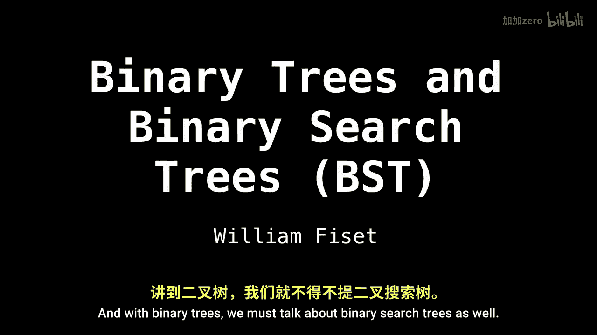
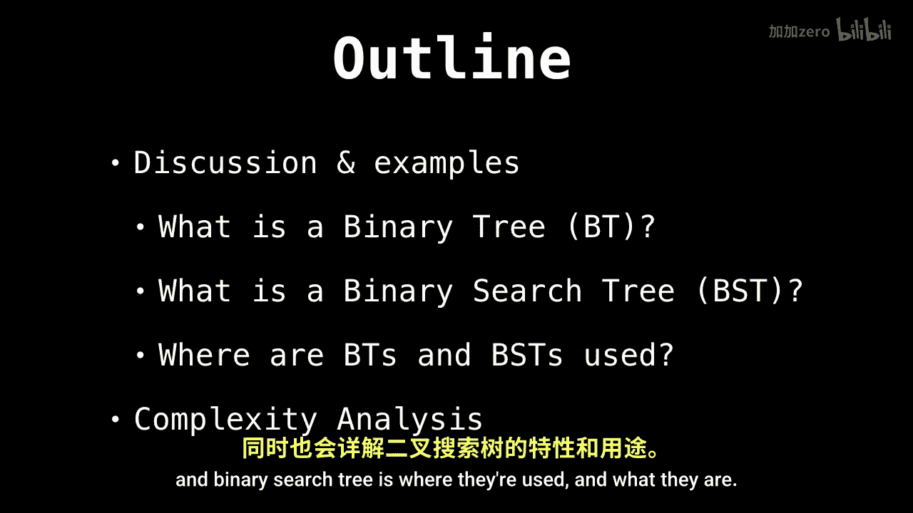
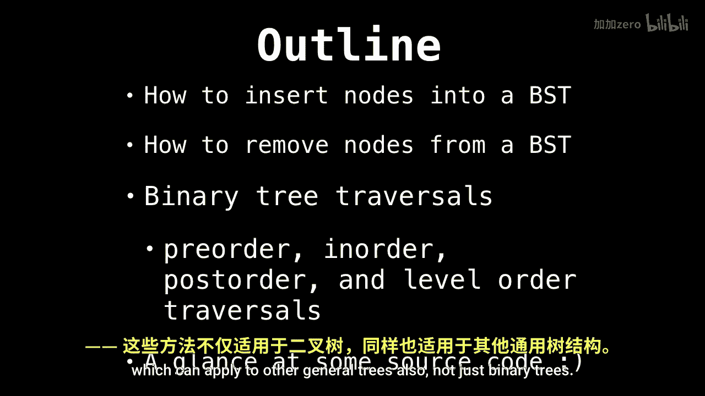
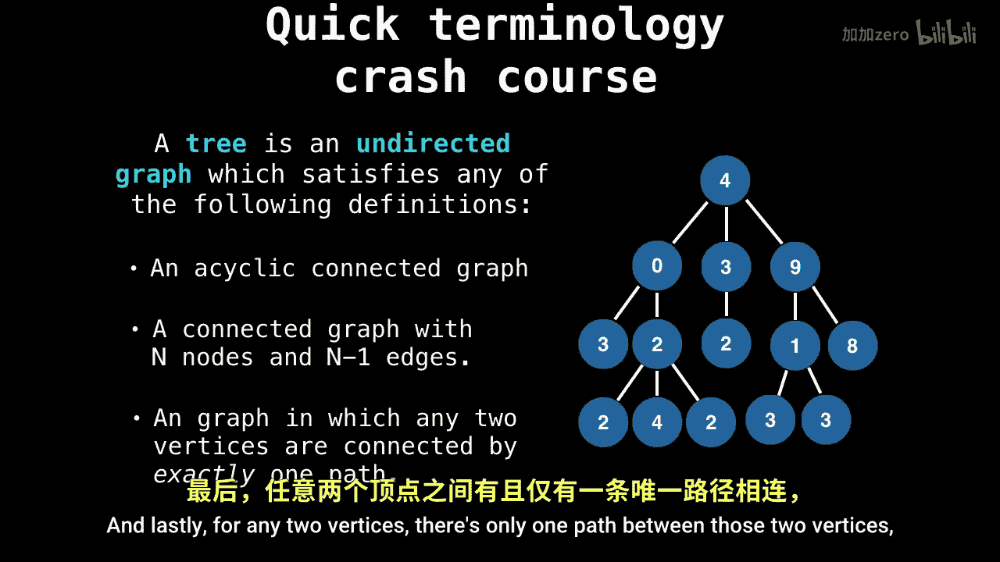

数据结构：P24：二叉树与二叉搜索树入门 🌳

在本节课中，我们将学习一种非常重要的数据结构——树。具体来说，我们将重点介绍二叉树和二叉搜索树，了解它们的定义、用途以及基本概念。通过本教程，你将建立起对树结构的基础理解，为后续学习插入、删除节点以及遍历等操作做好准备。

---

### 什么是树？

在深入讨论二叉树之前，我们首先需要理解“树”在数据结构中的一般定义。树是一种无向图，它必须满足以下任一常见定义：

以下是树的三个等价定义：
1.  树是一个**连通**且**无环**的无向图。无环意味着图中不存在循环路径。
2.  一棵具有 **n** 个节点的树，恰好有 **n - 1** 条边。
3.  对于树中的任意两个顶点，连接它们的**路径有且仅有一条**。



这些定义从不同角度描述了树的本质特性：它是一个没有回路的连通结构。

---



### 二叉树简介 🌲

上一节我们介绍了树的一般概念，本节中我们来看看一种特殊且应用广泛的树——二叉树。

二叉树是每个节点最多拥有两个子节点的树结构。这两个子节点通常被称为**左子节点**和**右子节点**。二叉树为许多高效算法（如搜索、排序）提供了基础框架。

---



### 二叉搜索树简介 🔍


理解了二叉树后，我们进一步探讨其最重要的变体之一——二叉搜索树。

二叉搜索树是一种特殊的二叉树，它对节点中存储的值有严格的排序约束。这个约束使得在树中查找、插入和删除元素的操作非常高效。

二叉搜索树的核心性质是：对于树中的任意一个节点，
*   其**左子树**中所有节点的值都**小于**该节点的值。
*   其**右子树**中所有节点的值都**大于**该节点的值。

这个性质可以用一个简单的条件来描述。设当前节点值为 `node.value`，左子节点值为 `left.value`，右子节点值为 `right.value`，则始终满足：
```
left.value < node.value < right.value
```

正是这个有序的性质，使得我们能够像在有序数组中进行二分查找一样，在BST中快速定位目标值。

---

### 后续内容预告 📚

在本教程中，我们一起学习了树的基本定义、二叉树以及二叉搜索树的核心概念与性质。

在接下来的课程中，我们将深入探讨如何对二叉搜索树进行实际操作，包括：
*   如何向二叉搜索树中**插入**新的节点。
*   如何从二叉搜索树中**删除**指定的节点。
*   学习几种流行的**树遍历方法**（如前序、中序、后序遍历），这些方法不仅适用于二叉搜索树，也适用于其他更一般的树结构。



掌握这些操作是灵活运用二叉搜索树的关键。