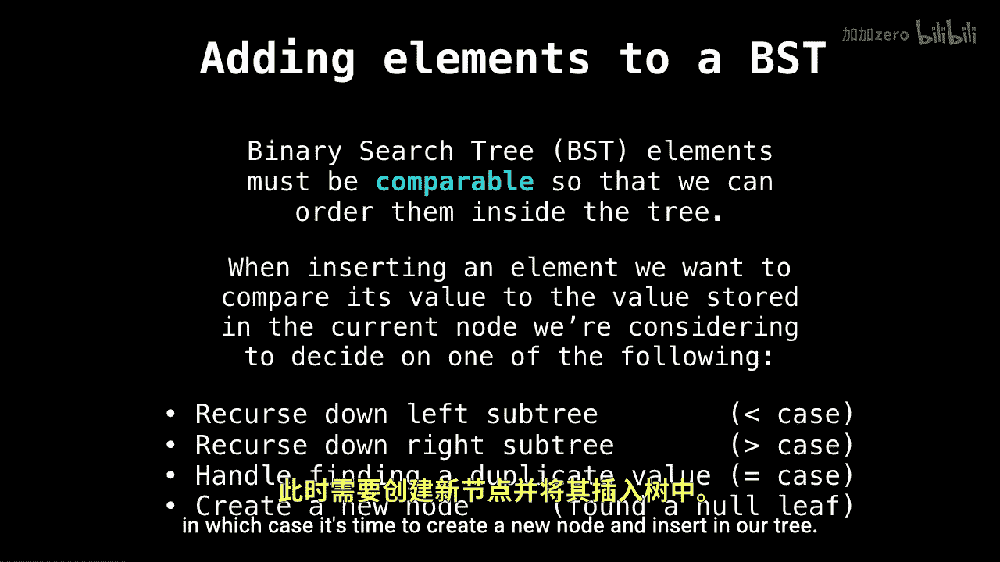

# 025：二叉搜索树插入操作 🧩

在本节课中，我们将学习如何向二叉搜索树中插入新元素。我们将了解插入操作的基本逻辑、需要处理的几种情况，并通过一个动画示例来直观地理解整个过程。


---

## 插入操作的基本逻辑

上一节我们介绍了二叉搜索树的基本概念，本节中我们来看看如何向其中添加新元素。

首先，要往二叉搜索树中添加元素，必须确保这些元素是**可比较的**。这意味着我们能够以某种方式在树中对它们进行排序。这样，在每一步中，我们都能判断出应该将新元素放在当前节点的左子树还是右子树。

在插入一个元素时，我们会将它的值与当前正在考虑的节点值进行比较，并根据比较结果执行以下四种操作之一。

以下是插入过程中可能遇到的四种情况：

1.  如果新元素的值**小于**当前节点的值，则递归进入**左子树**。
2.  如果新元素的值**大于**当前节点的值，则递归进入**右子树**。
3.  如果新元素的值**等于**当前节点的值，则需要处理重复值。这取决于树的设计，可以选择添加重复值或忽略它。
4.  如果当前节点是**空节点**（`null`），则说明到达了插入位置，此时应创建一个新节点并将其插入树中。

核心的递归插入逻辑可以用以下伪代码描述：

```
function insert(node, value):
    if node is null:
        return new Node(value)
    if value < node.value:
        node.left = insert(node.left, value)
    else if value > node.value:
        node.right = insert(node.right, value)
    // 处理值相等的情况（例如忽略或更新）
    return node
```

---

## 动画示例解析

现在，让我们通过一个动画示例来直观地理解插入过程。

动画左侧列出了一系列要插入二叉搜索树的值。最初，这棵二叉搜索树是空的。


随着每个值的插入，算法会从根节点开始，根据比较结果（小于向左，大于向右）递归地找到合适的空位，并创建新节点。这个过程会逐步构建出整个树的结构。




最终，所有元素都按照二叉搜索树的规则被插入到正确的位置。


---

## 总结


本节课中我们一起学习了二叉搜索树的插入操作。我们明确了插入的元素必须是可比较的，并详细分析了插入时可能遇到的四种情况：向左子树递归、向右子树递归、处理重复值以及在空节点处创建新节点。通过动画示例，我们直观地看到了元素是如何被逐个插入并构建出完整的二叉搜索树的。理解插入操作是掌握二叉搜索树其他功能（如查找、删除）的重要基础。