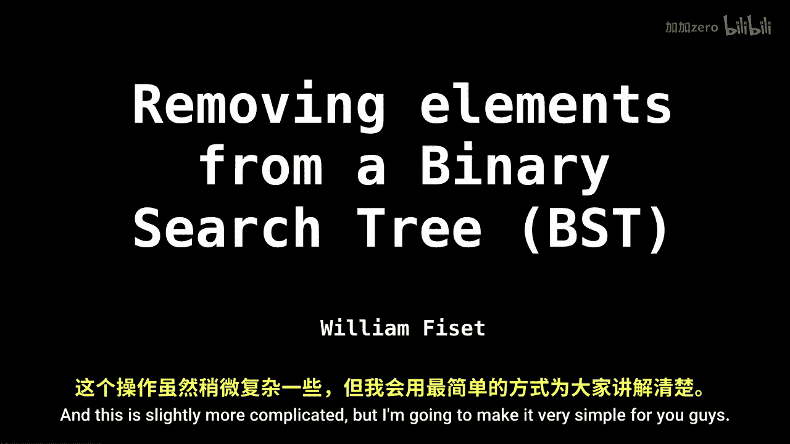
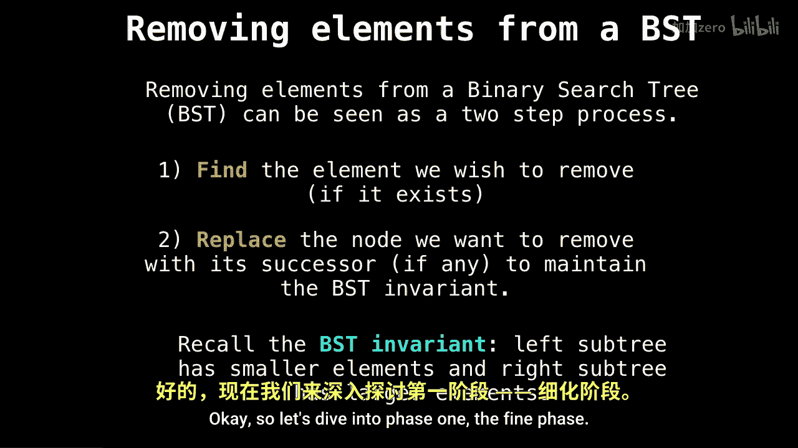

# 026：二叉搜索树节点删除

在本节课中，我们将学习如何从二叉搜索树中删除节点。删除操作比插入操作稍复杂一些，因为它需要维护二叉搜索树的性质。我们将通过一个清晰的两步流程来讲解：首先找到目标节点，然后处理其替换问题，以确保树的结构和性质得以保持。

上一节我们介绍了如何向二叉搜索树中插入元素，本节中我们来看看如何执行删除操作。

## 删除操作的两阶段流程

删除二叉搜索树中的节点可以看作一个两步过程：
1.  **查找阶段**：在树中定位我们希望删除的节点（如果它存在的话）。
2.  **替换阶段**：用其后继节点（如果存在）替换要删除的节点，以维持二叉搜索树的不变性。

让我重申一下二叉搜索树不变性的定义：对于任意节点，其**左子树**中的所有节点值都**小于**该节点值，其**右子树**中的所有节点值都**大于**该节点值。

现在，让我们深入第一阶段：查找阶段。

## 第一阶段：查找目标节点

当我们在二叉搜索树中搜索一个元素时，会发生以下四种情况之一：

以下是可能发生的四种情况：

1.  我们遇到了一个空节点（`null`）。这意味着我们已经遍历到树的底部，但没有找到目标值，因此该值不存在于树中。
2.  比较器返回值为 `0`。这里的“比较器”是一个函数，如果目标值小于当前节点值则返回 `-1`，等于则返回 `0`，大于则返回 `1`。返回 `0` 意味着我们找到了要删除的节点。

3.  比较器返回值小于 `0`。这意味着目标值小于当前节点值，根据二叉搜索树的性质，我们应该继续在**左子树**中搜索。
4.  比较器返回值大于 `0`。这意味着目标值大于当前节点值，根据二叉搜索树的性质，我们应该继续在**右子树**中搜索。

通过这个查找过程，我们可以确定目标节点是否存在及其位置。找到节点后，我们就进入了更具挑战性的第二阶段：如何在不破坏树结构的情况下移除它。

## 第二阶段：替换与维持结构

找到要删除的节点后，我们需要考虑如何移除它。移除节点本身很简单，但关键是要保持二叉搜索树的性质。这通常涉及用另一个合适的节点来“填补”被删除节点留下的空位。

这个填补的节点通常是该节点的“后继者”。后继者是指在中序遍历顺序中，紧接在该节点之后的那个节点。对于二叉搜索树，一个节点的后继者是其右子树中的最小节点。用后继者替换可以确保树的中序遍历序列保持有序，从而维护了二叉搜索树的性质。

处理替换时，我们需要考虑被删除节点的子节点情况（无子节点、有一个子节点、有两个子节点），每种情况的处理逻辑略有不同，但核心思想都是找到并移动合适的后继节点来保持树的正确结构。

## 总结

本节课中我们一起学习了二叉搜索树的节点删除操作。我们将其分解为两个主要阶段：**查找**和**替换**。在查找阶段，我们通过比较器导航树结构以定位目标节点。在替换阶段，核心任务是找到合适的后继节点（通常是右子树中的最小值）来替代被删除的节点，从而确保二叉搜索树的关键性质——左子树的所有值小于节点值，右子树的所有值大于节点值——在删除后依然成立。理解这个两阶段流程是掌握二叉搜索树删除操作的基础。