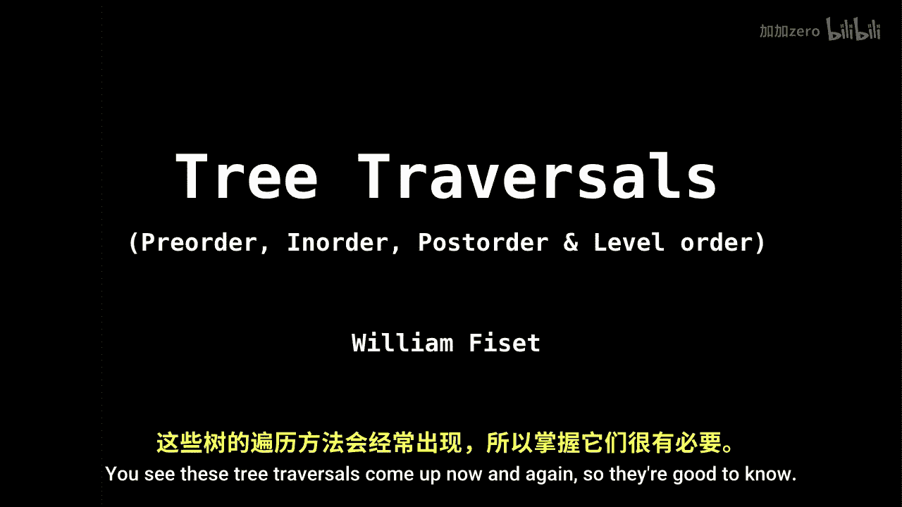
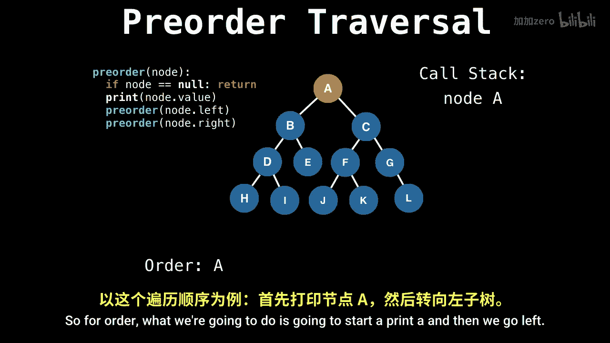

# 027：二叉搜索树遍历 🌳

在本节课中，我们将学习二叉搜索树的四种主要遍历方式：前序遍历、中序遍历、后序遍历和层序遍历。理解这些遍历方法是掌握树结构操作的基础。

## 遍历方法概述

上一节我们介绍了二叉搜索树的基本结构，本节中我们来看看如何系统地访问树中的所有节点。树遍历是指按照特定顺序访问树中每个节点恰好一次的过程。我们将重点介绍前序、中序和后序遍历，因为它们具有相似的递归结构。

### 递归遍历的核心思想



这三种深度优先遍历方法在实现上非常相似，它们都是自然递归定义的。唯一的区别在于处理当前节点（例如打印节点值）的时机不同。

以下是三种遍历的递归函数框架，请注意 `print(node.val)` 语句的位置：

```python
def preorder(node):
    if node is None:
        return
    print(node.val)      # 前序：先处理当前节点
    preorder(node.left)
    preorder(node.right)

def inorder(node):
    if node is None:
        return
    inorder(node.left)
    print(node.val)      # 中序：在左右子树递归之间处理当前节点
    inorder(node.right)

def postorder(node):
    if node is None:
        return
    postorder(node.left)
    postorder(node.right)
    print(node.val)      # 后序：最后处理当前节点
```

*   **前序遍历**：先访问当前节点，然后递归遍历左子树，最后递归遍历右子树。
*   **中序遍历**：先递归遍历左子树，然后访问当前节点，最后递归遍历右子树。
*   **后序遍历**：先递归遍历左子树，然后递归遍历右子树，最后访问当前节点。

## 前序遍历详解

现在，让我们通过一个具体的例子来详细理解前序遍历的执行过程。我们将跟踪递归调用栈，以明确节点的访问顺序。

考虑以下二叉树：
```
        A
       / \
      B   C
     / \
    D   E
```

前序遍历的规则是：**先访问当前节点，然后遍历左子树，最后遍历右子树**。

以下是遍历步骤的分解：


1.  从根节点 **A** 开始。访问（打印）A。
2.  递归遍历 A 的左子树（以 B 为根）。
    *   访问节点 **B**。
    *   递归遍历 B 的左子树（以 D 为根）。
        *   访问节点 **D**。D 是叶子节点，左右子树为空，递归返回到 B。
    *   递归遍历 B 的右子树（以 E 为根）。
        *   访问节点 **E**。E 是叶子节点，递归返回到 B，再返回到 A。
3.  递归遍历 A 的右子树（以 C 为根）。
    *   访问节点 **C**。C 是叶子节点，遍历结束。

因此，这棵树的前序遍历结果为：**A, B, D, E, C**。

## 中序遍历与后序遍历

理解了前序遍历的递归过程后，中序和后序遍历就很容易类推了。它们遵循相同的递归模式，只是处理当前节点的时机不同。

*   **中序遍历** 对于二叉搜索树特别有用，因为它会以**升序**访问所有节点。
*   **后序遍历** 常用于一些需要先处理子节点再处理父节点的场景，例如计算子树的高度或删除整棵树。

## 层序遍历

除了上述深度优先的遍历方法，还有一种广度优先的遍历方法，称为**层序遍历**。它从根节点开始，逐层向下访问节点。

以下是层序遍历通常借助队列实现的伪代码：

```python
def levelorder(root):
    if root is None:
        return
    queue = [root]
    while queue:
        node = queue.pop(0) # 从队列头部取出节点
        print(node.val)
        if node.left:
            queue.append(node.left) # 左子节点入队
        if node.right:
            queue.append(node.right) # 右子节点入队
```

对于之前的例子树，层序遍历的结果为：**A, B, C, D, E**。



---

本节课中我们一起学习了二叉搜索树的四种核心遍历方法：前序、中序、后序和层序。关键在于理解递归在深度优先遍历中的作用，以及处理节点时的不同顺序。掌握这些遍历方式是进行树结构搜索、插入、删除等更复杂操作的重要基础。