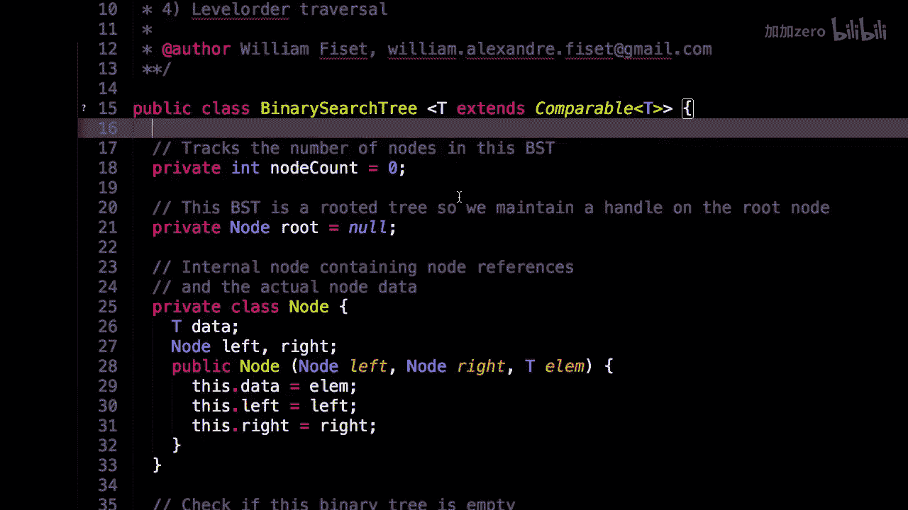
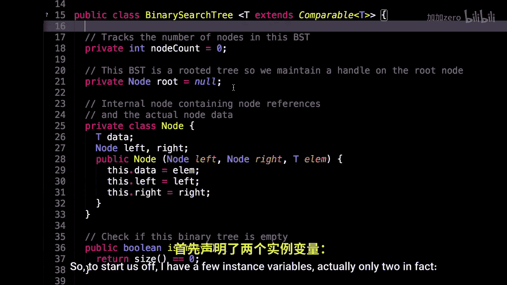
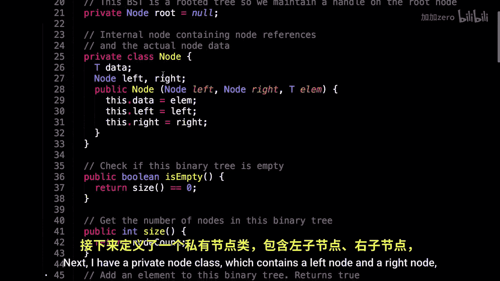
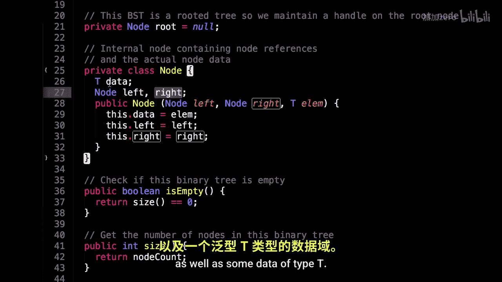
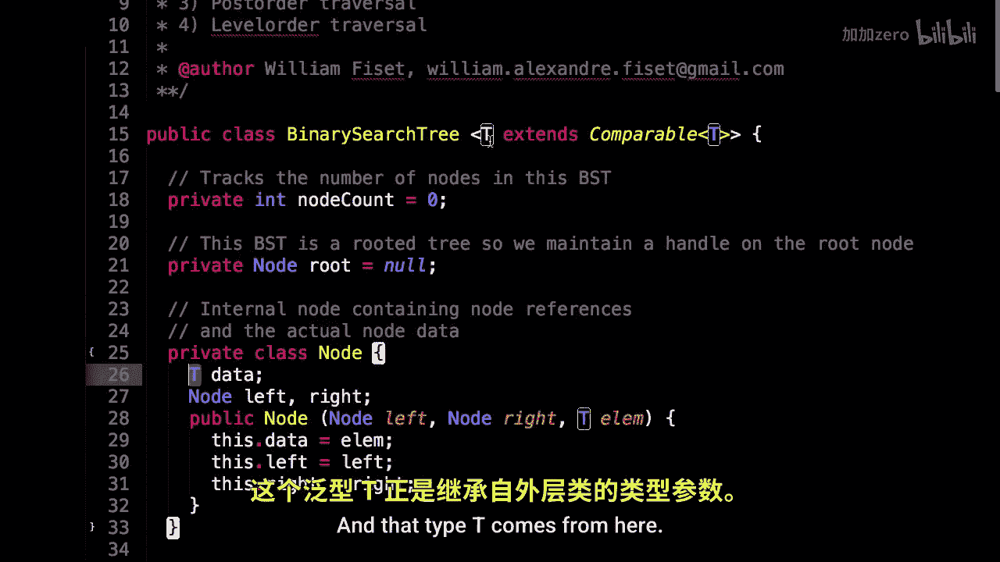

# 028：二叉搜索树代码实现 🧑‍💻

在本节课中，我们将学习如何用Java语言实现一个二叉搜索树。我们将从类的定义开始，逐步了解其内部结构、节点定义以及核心成员变量。

## 概述


我们将要学习一个二叉搜索树的具体代码实现。该实现使用Java编写，核心思想是利用节点的可比较性来维护树的有序结构。


## 类定义与泛型


首先，我们定义了一个代表二叉搜索树的类。这个类使用了泛型，以确保它可以存储任何可比较类型的数据。

```java
public class BinarySearchTree<T extends Comparable<T>> {
    // 类内容
}
```
泛型约束 `<T extends Comparable<T>>` 意味着类型 `T` 必须实现 `Comparable` 接口。这是必要的，因为我们需要比较节点中的数据，以决定新节点应该插入到左子树还是右子树。


## 成员变量

接下来，我们来看看这个类包含哪些成员变量。实际上，它只有两个。



```java
// 节点计数器
private int nodeCount = 0;



// 树的根节点
private Node root = null;
```
`nodeCount` 变量用于追踪树中节点的总数。`root` 变量则是指向这棵二叉搜索树根节点的引用。由于二叉搜索树是一种有根树，因此必须有一个明确的根节点。

## 内部节点类


在二叉搜索树类内部，我们定义了一个私有的 `Node` 类，用于表示树中的每一个节点。




```java
private class Node {
    T data;
    Node left, right;

    public Node(Node left, Node right, T elem) {
        this.data = elem;
        this.left = left;
        this.right = right;
    }
}
```
这个 `Node` 类包含以下三个部分：
*   **`data`**： 存储节点本身的数据，其类型为泛型 `T`。
*   **`left`**： 一个指向左子节点的引用。
*   **`right`**： 一个指向右子节点的引用。


构造函数接收左子节点、右子节点以及节点数据作为参数，并完成初始化工作。这里使用的类型 `T` 与外部二叉搜索树类的泛型类型一致，保证了数据的可比较性。

## 总结





本节课我们一起学习了二叉搜索树代码实现的初始部分。我们了解了如何定义一个支持泛型的二叉搜索树类，认识了用于追踪树大小和根节点的成员变量，并剖析了构成树基本单元的私有 `Node` 类的结构。在接下来的课程中，我们将在此基础上继续探讨如何实现插入、查找和删除等核心操作。