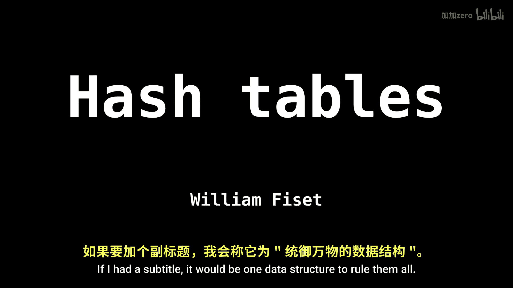
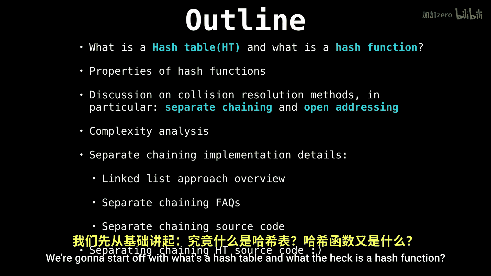
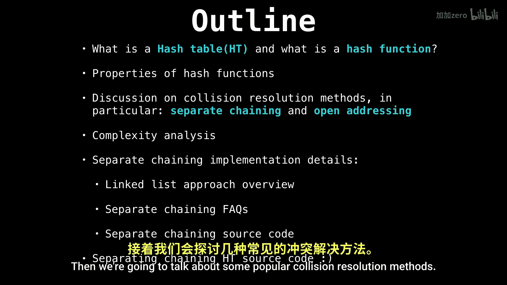
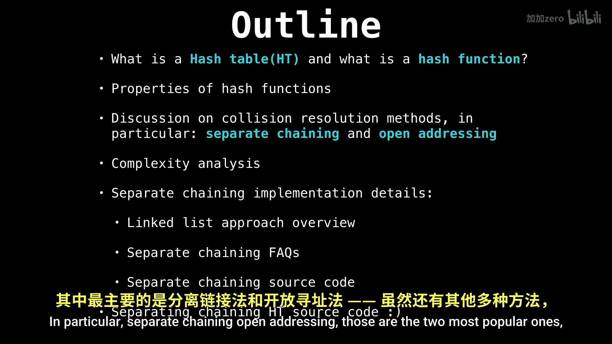
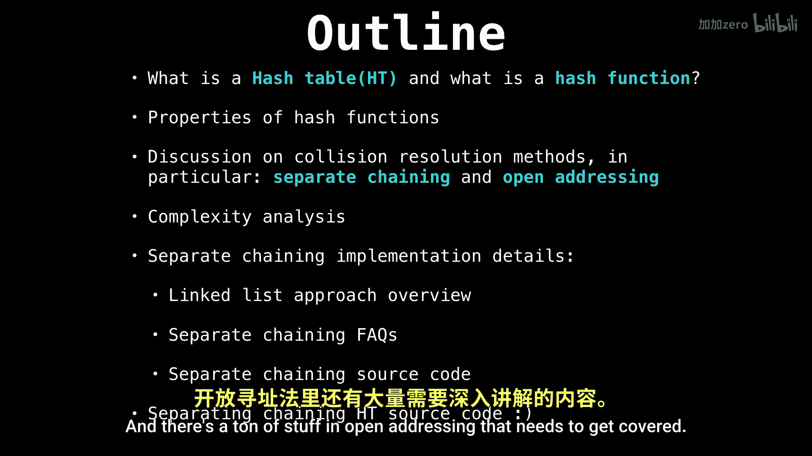
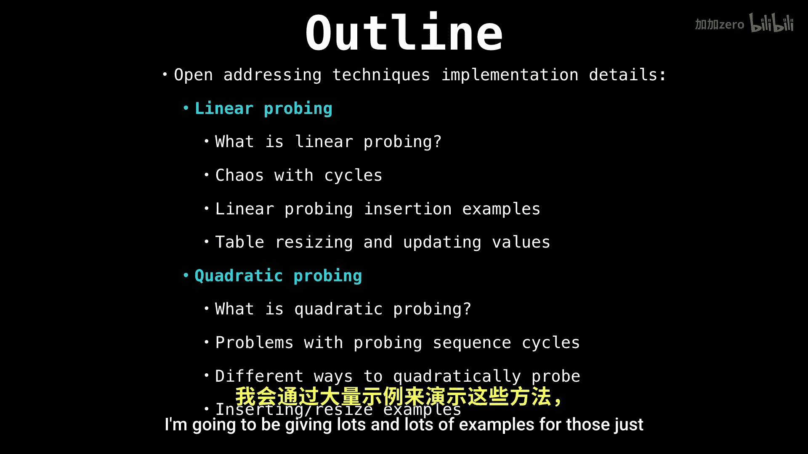

# 029：哈希表与哈希函数

在本节课中，我们将要学习哈希表，这是一种极其重要的数据结构。我们将从哈希表的基本概念开始，并深入探讨其核心组件——哈希函数。

## 什么是哈希表？🤔

哈希表是一种数据结构，它允许我们通过一种称为“哈希”的技术，构建从一组键到一组值的映射。

键可以是任何值，只要它们是唯一的，每个键都映射到一个对应的值。例如，键可以是：

*   人名
*   产品ID
*   车牌号

## 为什么需要哈希函数？🔑

上一节我们介绍了哈希表的基本概念，本节中我们来看看为什么需要哈希函数。哈希函数是哈希表的核心，它负责将任意大小的键转换为一个固定大小的数值（通常是数组索引）。这个转换过程就是“哈希”。

以下是哈希函数的主要作用：
*   **确定存储位置**：计算出的哈希值决定了键值对在哈希表底层数组中的存储位置。
*   **快速访问**：理想情况下，通过哈希函数可以直接定位到数据，实现平均时间复杂度为 O(1) 的查找、插入和删除操作。

## 哈希表系列内容概览 📚

接下来，在这个哈希表系列教程中，我们将涵盖以下核心主题：

1.  **碰撞解决方法**：我们将讨论两种最流行的碰撞解决方法，即**分离链接法**和**开放寻址法**。虽然还有其他方法，但这两种最为常见。
2.  **分离链接法的实现**：我们将详细探讨如何使用链表实现分离链接法，因为这是一种非常流行的实现方式。
3.  **开放寻址法的深入探讨**：开放寻址法中有大量内容需要讲解。我们将通过大量示例来讨论**线性探测**和**二次探测**的工作原理，因为它们的工作方式并非一目了然。
4.  **双重哈希**：我们将讲解双重哈希这种更高级的探测方法。
5.  **开放寻址法中的元素删除**：最后，我们将学习如何在开放寻址方案中删除元素，因为这一操作也并非显而易见。

## 总结

本节课中，我们一起学习了哈希表的基本定义及其核心——哈希函数的作用。哈希表通过哈希函数建立键到值的快速映射。我们了解到，键需要具有唯一性。此外，我们还预览了整个系列将要深入探讨的关键主题，包括碰撞解决的两大主流方法（分离链接法和开放寻址法）及其具体实现技术（如线性探测、二次探测和双重哈希）。理解这些基础概念是掌握高效哈希表设计与使用的第一步。