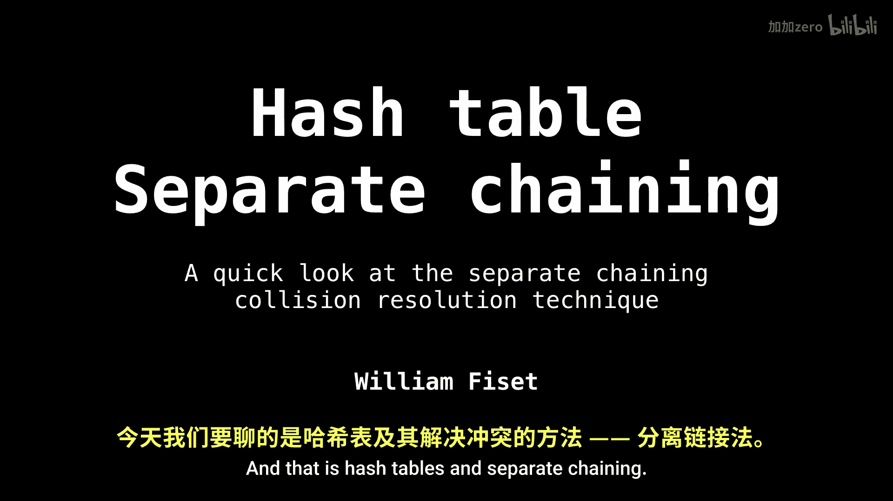
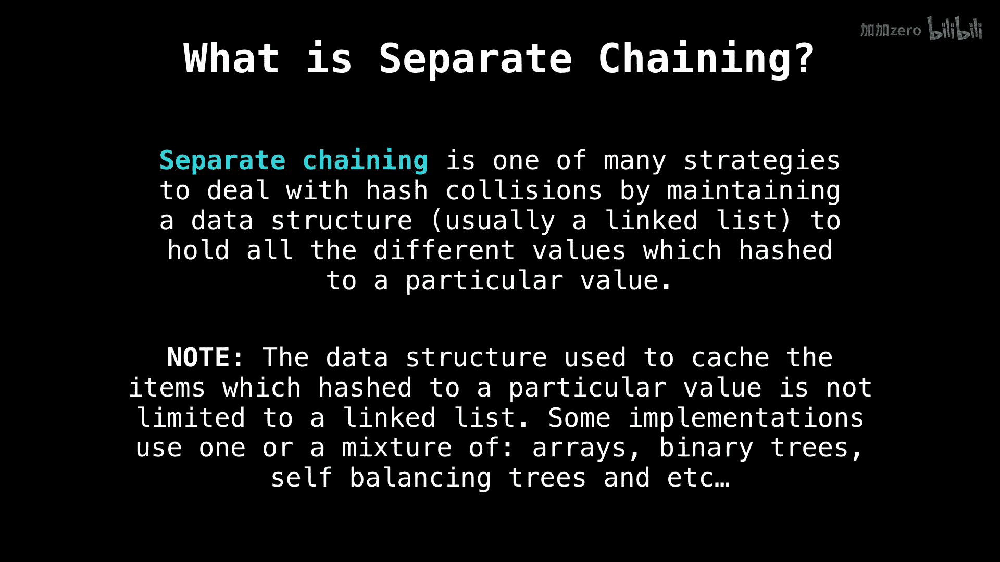
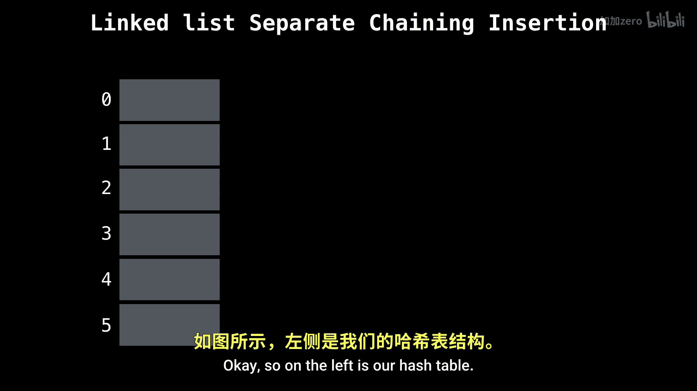

# 030：哈希表之分离链接法 🧩

在本节课中，我们将要学习哈希表的一种核心冲突解决技术——分离链接法。我们将了解其工作原理、实现方式以及优缺点。

---

## 什么是分离链接法？

上一节我们介绍了哈希表的基本概念，本节中我们来看看如何处理哈希冲突。分离链接法是众多哈希冲突解决技术中的一种。当发生哈希冲突时，即两个不同的键通过哈希函数计算得到了相同的哈希值，我们需要一种方法来处理这种情况，以确保哈希表的功能正常。

分离链接法的工作原理是：维护一个辅助数据结构来存储所有映射到同一哈希值的键值对。这样，当我们需要查找某个键时，就可以回到对应的“桶”或数据结构中去寻找目标项。

通常，我们使用链表来实现这个辅助数据结构，但它并不局限于链表。以下是几种可能的实现方式：

*   链表
*   动态数组
*   二叉搜索树
*   自平衡树（如红黑树）
*   混合方法

---

## 分离链接法示例

为了更好地理解，让我们通过一个具体的例子来演示分离链接法是如何工作的。

假设我们有一个哈希表，它本质上是一个存储键值对的数组。键是年龄，值是姓名。每个键值对都关联着一个由哈希函数计算出的哈希值。这些哈希值目前的具体数值并不重要，我们主要关注如何使用分离链接法处理冲突。

下图左侧是我们的哈希表，即数组结构。

现在，我将开始向这个哈希表中插入数据。