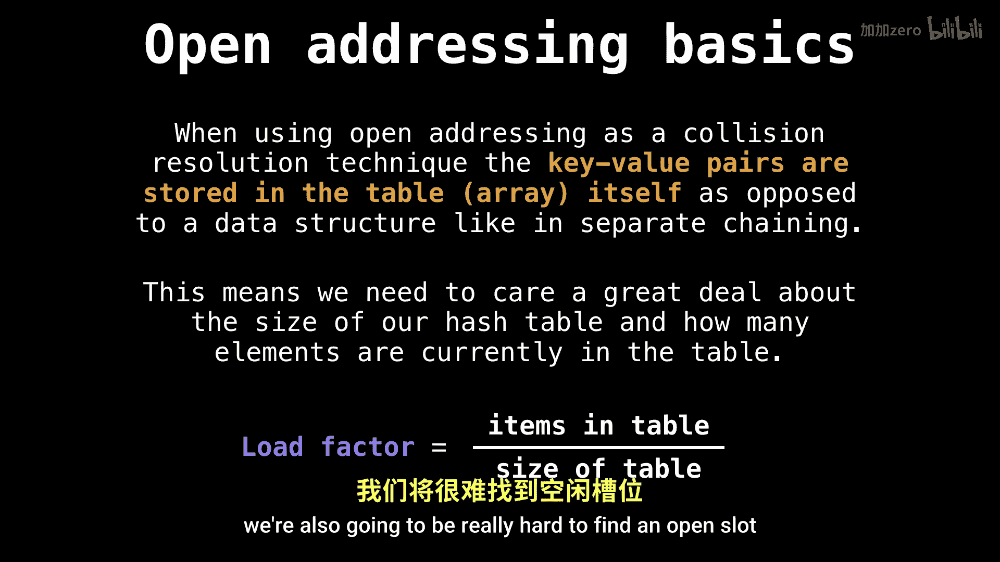

# 032：哈希表开放寻址法

在本节课中，我们将学习哈希表的一种重要冲突解决技术——开放寻址法。我们将了解其核心思想、工作原理、关键参数以及几种常见的探测序列。

## 概述

开放寻址法是一种处理哈希冲突的策略。与之前视频中介绍的分离链接法不同，开放寻址法将所有键值对直接存储在哈希表数组中，而不使用额外的数据结构。这意味着我们需要密切关注哈希表的容量和负载因子，以确保性能。

## 哈希表与冲突回顾

首先，我们快速回顾一下哈希表的基本概念，以确保理解一致。

哈希表的目标是构建一个从一组键到一组值的映射。这些键必须是可哈希的。我们定义一个哈希函数，将键转换为数字。然后，我们使用这个数字作为索引来访问数组（即哈希表）。

然而，这种方法并非万无一失，因为有时会发生哈希冲突，即两个不同的键哈希到相同的值。因此，我们需要一种解决冲突的方法，开放寻址法就是其中一种解决方案。

## 开放寻址法的核心思想

当我们使用开放寻址冲突解决技术时，需要记住一个关键点：实际的键值对将直接存储在哈希表本身中。这与我们上一节视频中看到的分离链接法不同，后者使用链表等辅助数据结构。

这意味着我们非常关心哈希表的大小以及当前表中的元素数量。因为一旦表中的元素过多，我们将很难找到一个空槽位来放置新元素。

## 关键参数：负载因子

因此，在开放寻址法中，我们引入了一个称为**负载因子**的关键概念。负载因子（α）定义为表中已存储元素数量（n）与哈希表总容量（m）的比值。

**公式：α = n / m**

负载因子永远不能超过1，因为元素数量不能超过表容量。为了保持良好的性能，我们通常需要将负载因子维持在一个较低的水平（例如，α < 0.5或α < 0.75）。当负载因子过高时，我们需要对哈希表进行扩容（再哈希）。

## 探测序列

在开放寻址法中，当发生冲突时，我们需要一个系统的方法来在表中寻找下一个可用的空槽。这个方法就是**探测序列**。探测序列是一个函数，它根据初始哈希值和尝试次数，生成一系列候选索引位置。

**通用公式：index = hash(key, attempt)**

其中，`hash` 是探测函数，`attempt` 是从0开始的尝试次数。

以下是几种常见的探测方法：

### 1. 线性探测

这是最简单的方法。如果初始位置被占用，我们就顺序检查下一个位置，直到找到空位。

**公式：hash(key, i) = (hash1(key) + i) % m**

其中 `i` 是尝试次数，`m` 是表大小。

### 2. 二次探测

为了避免线性探测可能产生的“一次聚集”问题，二次探测使用一个二次函数来增加步长。

**公式：hash(key, i) = (hash1(key) + c1*i + c2*i²) % m**

其中 `c1` 和 `c2` 是常数（通常 `c1 = c2 = 1`）。

### 3. 双重哈希

这是最有效的方法之一，它使用两个不同的哈希函数来计算步长。

**公式：hash(key, i) = (hash1(key) + i * hash2(key)) % m**

第二个哈希函数 `hash2(key)` 的结果不能为0，并且应该与表大小 `m` 互质，以确保能探测到所有槽位。

## 操作流程

了解了探测序列后，我们来看看如何在开放寻址哈希表中执行基本操作。

以下是插入一个键值对的基本步骤：

1.  计算键的初始哈希值，得到索引。
2.  如果该索引位置为空，则在此处插入键值对，操作完成。
3.  如果该位置已被占用，则使用探测序列函数计算下一个候选索引。
4.  重复步骤2和3，直到找到空位或遍历完整个表（表满）。
5.  如果表满，通常需要扩容并重新插入所有元素。

查找和删除操作遵循类似的逻辑，但需要注意，删除操作不能简单地将槽位置空，否则会破坏后续的查找链。通常的解决方案是使用一个特殊的“墓碑”标记来标识已删除的位置。

## 总结

本节课中，我们一起学习了哈希表的开放寻址冲突解决技术。我们了解到，开放寻址法将元素直接存储在表数组中，并通过负载因子来监控表的使用情况。当发生冲突时，我们使用探测序列（如线性探测、二次探测或双重哈希）来系统地寻找下一个可用槽位。理解这些核心概念对于设计和实现高效的哈希表至关重要。