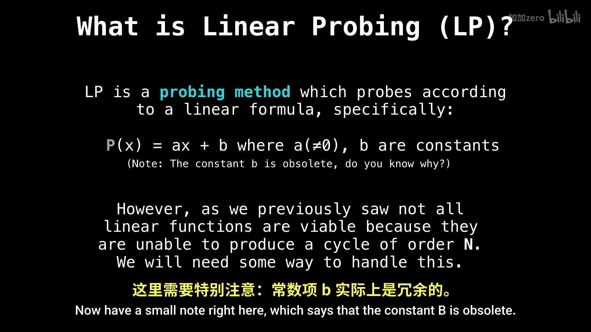

# 033：哈希表线性探测 🧮

在本节课中，我们将学习哈希表的一种冲突解决方法——线性探测。我们将从回顾开放寻址的基本概念开始，然后深入探讨线性探测的具体实现和原理。

## 开放寻址回顾

上一节我们介绍了开放寻址的基本框架。无论使用何种探测函数，其核心流程是通用的。

假设我们有一个大小为 `n` 的哈希表，以下是开放寻址的通用步骤：
1.  初始化变量 `x = 1`。
2.  计算键的原始哈希值 `keyHash`。
3.  第一个要检查的索引位置是 `keyHash`。
4.  如果该索引位置已被占用（即 `table[index] != null`），则根据探测函数计算下一个位置。
    *   新索引的计算公式为：`index = (keyHash + probingFunction(x)) % n`
    *   每次探测后，递增 `x` 的值。
5.  重复步骤4，直到找到一个空位置。
6.  将键值对插入到该空位置。

## 什么是线性探测？ ➡️

在了解了开放寻址的通用流程后，本节我们来看看线性探测这种具体的实现方式。

线性探测是一种探测方法，它按照某个线性公式来确定下一个探测位置。

其探测函数 `p(x)` 定义为：
`p(x) = a * x + b`
其中，`a` 不能等于0，否则函数退化为常数加法，失去了探测的意义。

关于公式中的常数 `b`，有一个重要的注意事项：**常数 `b` 是多余的**。

你明白为什么吗？因为无论 `b` 是多少，在模运算 `(keyHash + p(x)) % n` 中，`keyHash` 本身已经包含了所有可能的常数偏移。添加一个固定的 `b` 只是相当于改变了 `keyHash` 的起点，而 `keyHash` 本身就是一个（伪）随机值，所以 `b` 并不提供新的、有意义的探测步长变化。因此，通常我们设 `b = 0`，将线性探测函数简化为 `p(x) = a * x`。最常用和最简单的情况是 `a = 1`，即 `p(x) = x`，这意味着每次探测的步长是固定的1个位置。

## 总结

本节课中我们一起学习了哈希表的线性探测技术。我们首先回顾了开放寻址法的通用流程，然后重点介绍了线性探测的定义，即通过一个线性函数（通常是 `p(x) = x`）来确定冲突发生后的下一个探测位置。我们还解释了为什么线性探测函数中的常数项 `b` 是多余的。线性探测是实现简单、易于理解的一种冲突解决策略。