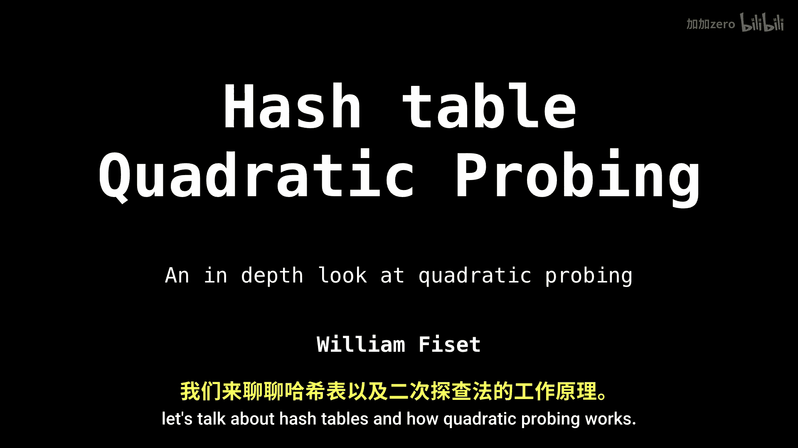
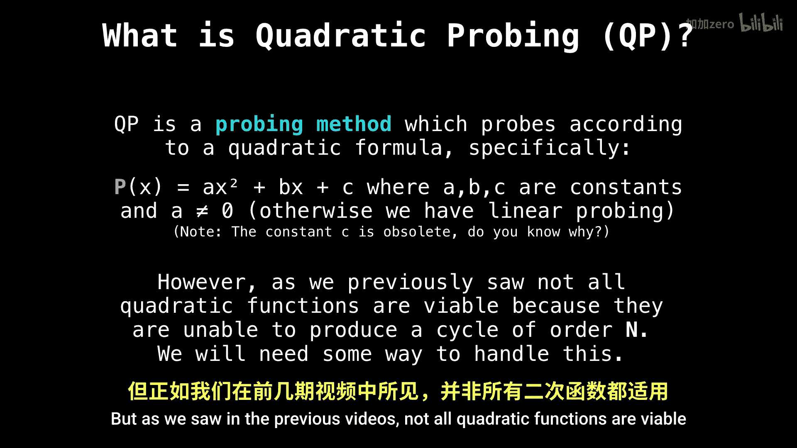

# 034：哈希表之二次探测

在本节课中，我们将学习哈希表中一种重要的冲突解决方法——二次探测。我们将了解其工作原理、实现方式以及需要注意的问题。

## 概述

上一节我们介绍了线性探测，本节中我们来看看另一种开放寻址法：二次探测。二次探测旨在通过二次函数来计算探测偏移量，以减少线性探测可能导致的“聚集”现象。

## 二次探测的工作原理

首先，回忆一下在开放寻址法中如何插入键值对。

我们初始化一个变量 `x = 1`，每次无法找到空闲槽位时，`x` 的值就会递增。
接着，我们计算键的哈希值，这将是我们要检查的第一个索引。
然后，我们进入一个循环，直到找到一个空闲槽位为止。循环条件是：当前索引处的表项不等于 `null`（即已被占用）。
每当槽位被占用时，我们就使用探测函数来偏移原始的哈希值。
在我们的例子中，探测函数将是一个二次函数。
同时，我们递增 `x`。
最终，我们将找到一个空闲槽位来插入我们的键值对。

## 什么是二次探测

二次探测的核心思想是，根据一个二次公式来进行探测。
具体来说，当我们的探测函数 `P(x)` 形如：
`P(x) = A*x² + B*x + C`
其中 `A`、`B`、`C` 都是常数，并且我们要求 `A` 不等于 `0`，否则就会退化为线性探测。

然而，正如我们在之前的视频中所见，并非所有的二次函数都是可行的，因为它们可能无法探测到哈希表中的所有槽位。

## 总结

本节课中，我们一起学习了哈希表的二次探测法。我们了解了其通过二次函数计算探测步长以减少聚集的基本原理，并认识到选择适当的二次函数参数对于确保能够探测到所有槽位至关重要。下一节，我们将探讨如何选择一个合适的二次函数。