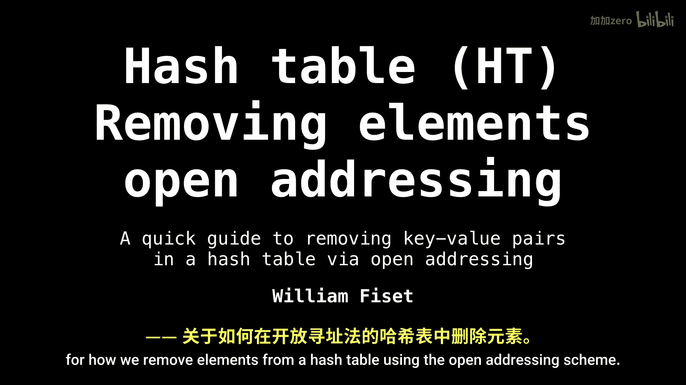
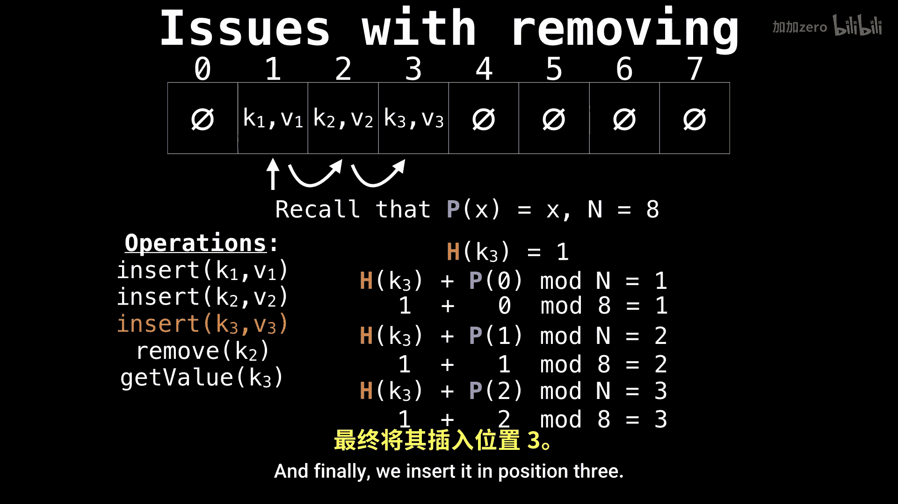

# 036：哈希表开放寻址删除操作 🗑️

在本节课中，我们将学习如何在使用开放寻址方案的哈希表中删除元素。我们将首先探讨一种简单的删除方法可能带来的问题，然后介绍一种更健壮的解决方案。

## 简单删除方法的问题

上一节我们介绍了开放寻址的基本概念，本节中我们来看看删除操作。如果采用一种简单直接的方法来删除元素，可能会遇到严重的问题。



假设我们有一个初始为空的哈希表，并使用线性探测函数。这里，探测函数 `P(x)` 简单地等于 `x`。

我们计划执行以下操作：插入三个键 `K1`、`K2` 和 `K3`，然后删除 `K2`，最后尝试获取 `K3` 的值。为了说明问题，我们假设 `K1`、`K2` 和 `K3` 都发生了哈希冲突，哈希值均为 `1`。

以下是操作步骤：

1.  插入 `K1`：它哈希到位置 `1`，因此被插入到索引 `1`。
2.  插入 `K2`：它也哈希到位置 `1`，与 `K1` 冲突。根据线性探测规则，我们检查下一个位置（索引 `2`）并将其插入。
3.  插入 `K3`：它同样哈希到位置 `1`。我们开始探测：位置 `1` 已被 `K1` 占用，位置 `2` 已被 `K2` 占用，因此继续探测到位置 `3` 并将其插入。

此时哈希表状态如下：


现在，我们尝试使用简单的方法删除 `K2`。简单方法通常意味着直接将 `K2` 对应的槽位标记为空。


## 简单删除导致的问题

删除 `K2` 后，哈希表索引 `2` 的位置变为空。这时，如果我们尝试查找 `K3`，会发生什么？

查找 `K3` 的流程如下：
1.  计算 `K3` 的哈希值，得到 `1`。
2.  检查索引 `1`，发现是 `K1`（不是目标）。
3.  根据线性探测规则，检查下一个位置索引 `2`。
4.  索引 `2` 现在是空的。在开放寻址中，遇到空槽通常意味着“键不存在”。因此，查找算法会错误地认为 `K3` 不在表中，即使它确实存在于索引 `3` 的位置。

**核心问题在于**：删除操作留下的空槽中断了探测序列。对于任何哈希到相同起始位置并需要经过这个空槽才能找到的键，后续的查找操作都会失败。

## 解决方案：使用“墓碑”标记

为了解决这个问题，我们不能简单地将已删除的槽位置空。取而代之的是，我们引入一个特殊的标记，通常称为“墓碑”（Tombstone）或“已删除”标记。

以下是使用“墓碑”标记的删除流程：

1.  当删除一个键值对时，我们并不清空该槽位，而是将其标记为“已删除”（例如，用一个特殊的常量 `DELETED` 表示）。
2.  在插入新元素时，遇到“墓碑”标记的槽位可以将其视为空槽并进行覆盖。
3.  在查找元素时，遇到“墓碑”标记的槽位不能停止，必须继续探测，直到找到目标键或遇到真正的空槽。

伪代码描述查找逻辑：
```python
def get(key):
    index = hash(key) % table_size
    while table[index] is not None: # 包括墓碑和实际条目
        if table[index] is TOMBSTONE:
            index = (index + 1) % table_size # 继续探测
            continue
        if table[index].key == key:
            return table[index].value # 找到目标
        index = (index + 1) % table_size # 线性探测
    return None # 未找到
```



伪代码描述插入逻辑：
```python
def insert(key, value):
    index = hash(key) % table_size
    first_tombstone = -1
    while table[index] is not None:
        if table[index] is TOMBSTONE:
            if first_tombstone == -1:
                first_tombstone = index # 记录第一个可用的墓碑位置
        elif table[index].key == key:
            table[index].value = value # 更新已存在的键
            return
        index = (index + 1) % table_size
    # 循环结束，准备插入
    if first_tombstone != -1:
        index = first_tombstone # 优先插入到墓碑位置
    table[index] = Entry(key, value)
```

## 总结


本节课中我们一起学习了在开放寻址哈希表中进行删除操作的关键点。核心结论是：不能简单地删除元素，因为这会破坏探测路径，导致后续查找失败。正确的做法是使用“墓碑”标记来标识已删除的位置。在查找时，需要跳过“墓碑”继续探测；在插入时，则可以优先复用“墓碑”位置。这种方法保证了哈希表在动态插入和删除操作下的正确性。