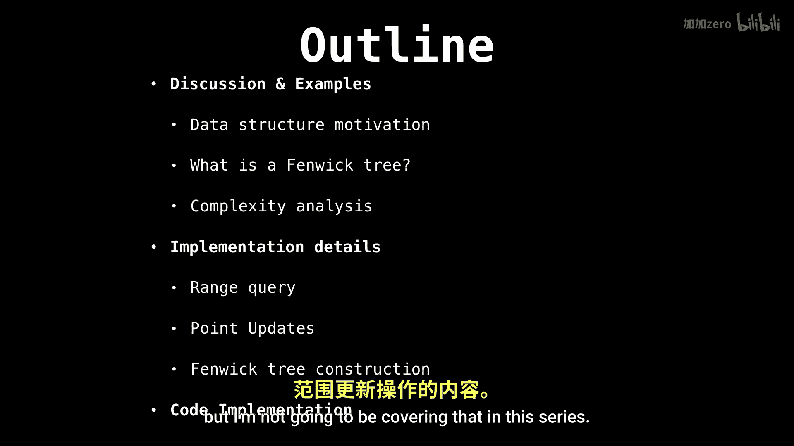
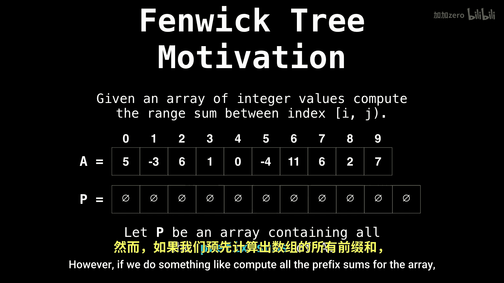

# 038：Fenwick Tree 范围查询 📊

在本节课中，我们将要学习一种名为 **Fenwick Tree**（树状数组）的数据结构。它是一种非常高效且易于实现的数据结构，特别适合处理数组前缀和与范围查询问题。我们将探讨其存在的动机、分析其时间复杂度，并了解其实现细节。

## 动机与问题背景 🔍

上一节我们介绍了 Fenwick Tree 的基本概念，本节中我们来看看它要解决的核心问题。

假设我们有一个整数数组，我们需要频繁地查询某个范围内的元素之和。一种直接的方法是：

以下是朴素的范围查询方法：
*   从范围的起始位置开始。
*   扫描到范围的结束位置。
*   累加该范围内所有单个元素的值。

这种方法虽然可行，但每次查询都需要线性时间，当查询变得频繁时，效率会非常低下。

## 前缀和数组方案 📈

为了解决线性查询效率低下的问题，我们可以预先计算数组的**前缀和**。

前缀和数组 `P` 的定义如下：
`P[i] = A[0] + A[1] + ... + A[i]`

通过前缀和数组，计算范围 `[l, r]` 的和可以优化为：
`sum(l, r) = P[r] - P[l-1]` （当 `l > 0` 时）

这个操作的时间复杂度是 **O(1)**，非常快。然而，前缀和方案有一个显著的缺点：如果原数组 `A` 中的某个值发生了更新（点更新），我们需要更新从该位置开始到数组末尾的所有前缀和，这需要 **O(n)** 的时间。

## Fenwick Tree 的登场 🌲

那么，是否存在一种数据结构，既能支持快速的范围查询，又能支持高效的点更新呢？这就是 **Fenwick Tree** 要解决的问题。

Fenwick Tree（也称为 Binary Indexed Tree）正是为了在 **O(log n)** 时间内同时支持**范围查询**和**点更新**而设计的。它巧妙地利用了二进制索引的特性来管理部分和，从而达到了高效的平衡。

在本系列视频中，我们将首先学习如何进行范围查询。在后续的视频中，我们会讲解如何进行点更新，以及如何在线性时间内构建 Fenwick Tree。虽然它也能处理范围更新，但本系列课程暂时不会涉及。

## 总结 📝

本节课中我们一起学习了 Fenwick Tree 的引入动机。我们了解到，在处理数组范围求和问题时，朴素的线性扫描法效率低下，而前缀和数组法虽然查询快，但更新慢。Fenwick Tree 的目标正是为了在这两种操作（查询和更新）之间取得一个高效的平衡，为后续深入其原理和实现打下基础。