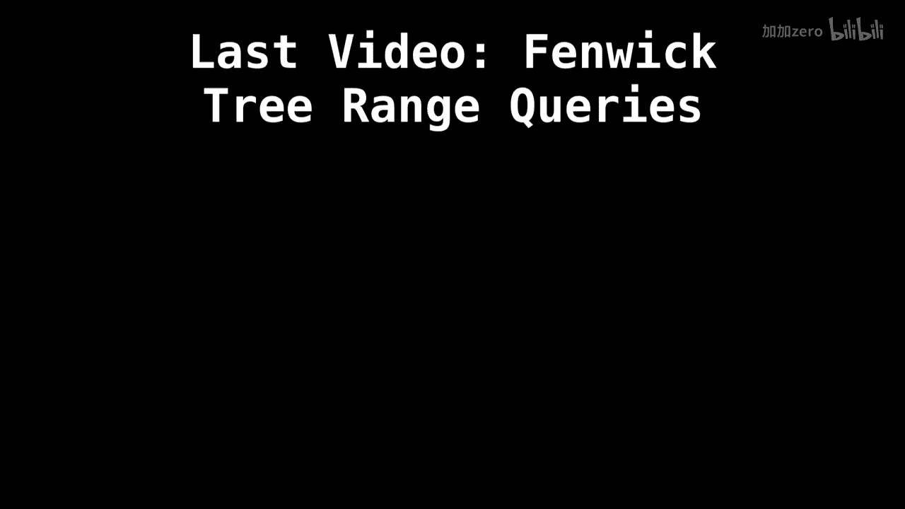
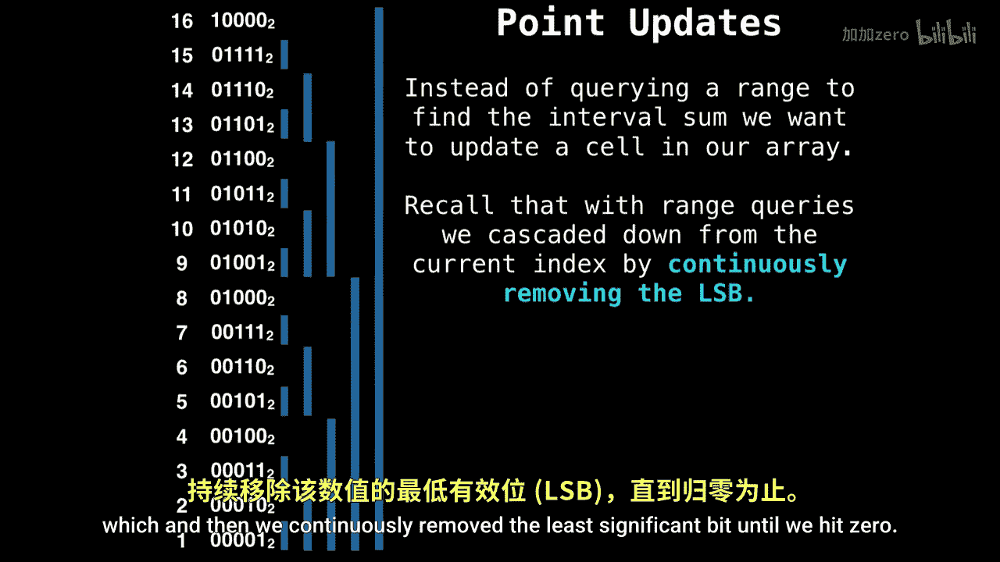
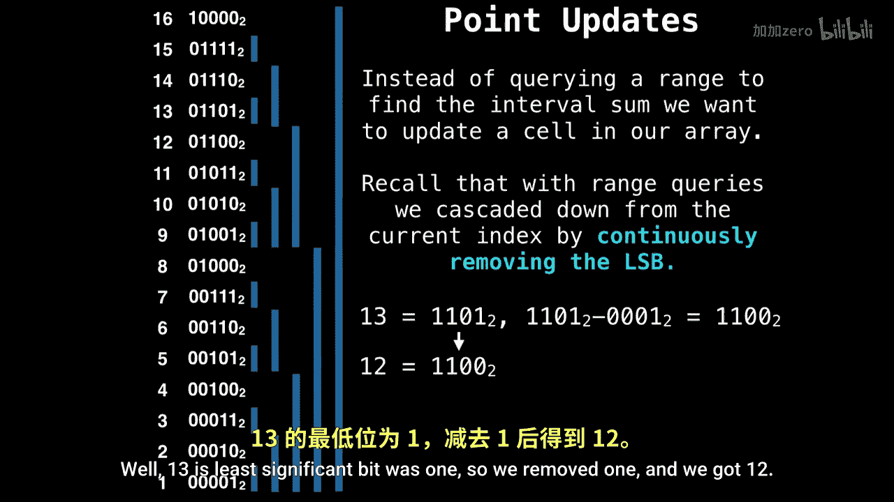
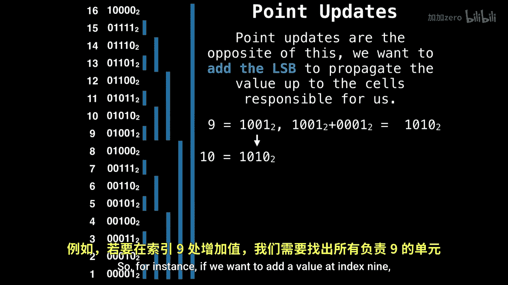

# 039：Fenwick树点更新 📈

在本节课中，我们将学习Fenwick树（又称二叉索引树）的点更新操作。点更新是指在树中某个特定位置增加或减少一个值。理解点更新是掌握Fenwick树的关键一步，它让我们能够动态地修改数组并高效地维护前缀和。


上一节我们介绍了Fenwick树的范围查询操作，了解了如何通过“移除最低有效位”来向下遍历树以计算前缀和。本节中我们来看看如何执行相反的操作——点更新。

## 回顾：范围查询操作

为了理解点更新，首先需要回顾一下范围查询是如何工作的。在Fenwick树中，计算前缀和的过程是一个“向下级联”的过程。



以下是执行前缀和查询的步骤：
1.  从目标索引 `i` 开始。
2.  将当前索引 `i` 对应的树节点值累加到结果中。
3.  计算 `i` 的最低有效位（LSB），并将其从 `i` 中移除：`i = i - LSB(i)`。
4.  重复步骤2和3，直到 `i` 变为0。

这个过程可以用伪代码表示：
```python
def prefix_sum(i):
    sum = 0
    while i > 0:
        sum += tree[i]
        i -= i & -i  # 移除最低有效位
    return sum
```

## 点更新操作原理 🔄

点更新操作与范围查询在逻辑上是互补的。如果说查询是“向下移除最低有效位”，那么更新就是“向上添加最低有效位”。

当我们想要在原始数组的某个位置（例如索引 `i`）增加一个值 `v` 时，我们需要更新Fenwick树中所有负责包含该索引区间和的节点。这些节点恰好是那些索引可以通过不断“添加最低有效位”到达 `i` 的节点。




以下是点更新的核心步骤：
1.  从目标索引 `i` 开始。
2.  将值 `v` 加到当前索引 `i` 对应的树节点上。
3.  计算 `i` 的最低有效位（LSB），并将其加到 `i` 上：`i = i + LSB(i)`。
4.  重复步骤2和3，直到 `i` 超出树的大小 `n`。


这个过程可以用公式描述为：在更新索引 `i` 的值时，我们需要更新所有满足 `j = i + 2^k` 且 `j <= n` 的节点，其中 `2^k` 是 `i` 的最低有效位，并在每次迭代后更新 `i`。

## 点更新示例演示 📊



让我们通过一个具体的例子来理解这个过程。假设我们想在索引 `9` 的位置增加一个值。

初始状态，我们位于索引 `i = 9`。
1.  首先，更新 `tree[9]`。
2.  计算 `9` 的二进制表示 `(1001)`，其最低有效位是 `1`（即 `2^0`）。
3.  将最低有效位加到当前索引：`9 + 1 = 10`。更新 `tree[10]`。
4.  计算 `10` 的二进制表示 `(1010)`，其最低有效位是 `2`（即 `2^1`）。
5.  将最低有效位加到当前索引：`10 + 2 = 12`。更新 `tree[12]`。
6.  计算 `12` 的二进制表示 `(1100)`，其最低有效位是 `4`（即 `2^2`）。
7.  将最低有效位加到当前索引：`12 + 4 = 16`。假设树的大小 `n` 小于16，则操作停止。

通过这个“向上添加最低有效位”的路径（9 -> 10 -> 12 -> 16），我们更新了所有需要反映索引9处值变化的节点。


点更新的伪代码如下：
```python
def point_update(i, delta):
    while i <= n:
        tree[i] += delta
        i += i & -i  # 添加最低有效位
```

## 操作对比与总结 📝

本节课中我们一起学习了Fenwick树的点更新操作。我们来总结一下点更新与范围查询这对核心操作的关系：


*   **范围查询（前缀和）**：通过**移除**最低有效位（`i -= LSB(i)`）**向下**遍历树，**累加**路径上的值。
*   **点更新**：通过**添加**最低有效位（`i += LSB(i)`）**向上**遍历树，**修改**路径上的值。

这两种操作都利用了二进制索引的巧妙性质，确保每次操作的时间复杂度为 **O(log n)**，其中 `n` 是数组的大小。正是这种高效性使得Fenwick树成为处理频繁更新和查询的序列问题的强大工具。



理解这种“向下查询，向上更新”的对称性，是掌握Fenwick树工作原理的关键。