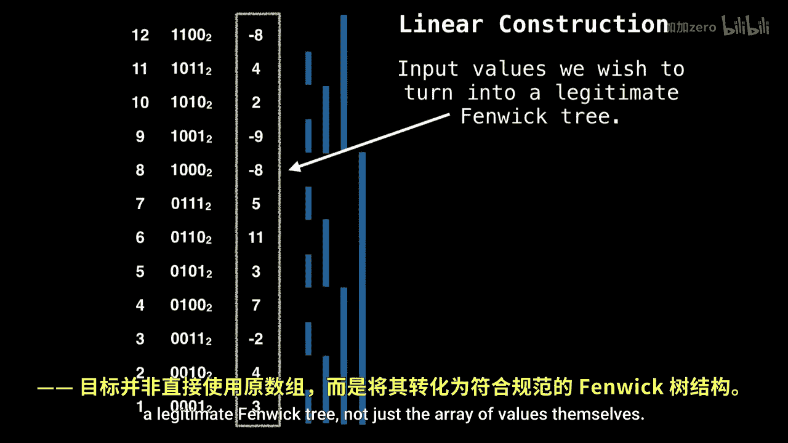

# 040：Fenwick树构建 🧱

在本节课中，我们将学习如何从给定的初始数组，高效地构建一个Fenwick树（又称二叉索引树）。我们将探讨一种时间复杂度为O(n)的线性构建方法，这比逐个元素进行点更新的O(n log n)方法更优。

上一节我们介绍了Fenwick树的点更新操作，本节中我们来看看如何利用其原理进行初始化构建。

## 线性时间构建方法

我们已经在前两个视频中学习了如何进行区间查询和点更新操作，但尚未讨论如何从头开始构建Fenwick树。之所以将这部分内容留到最后，是因为如果不先理解点更新的工作原理，就无法理解Fenwick树的构建过程。


假设我们有一个初始值数组 `a`，我们希望将其转换为一个功能完整的Fenwick树。一种朴素的方法是：首先将Fenwick树初始化为一个全零数组，然后使用点更新操作逐个添加 `a` 中的值。这种方法的总时间复杂度为 **O(n log n)**。

然而，我们可以做得更好。实际上，我们可以在 **线性时间 O(n)** 内完成构建。既然有更优的方案，何必使用O(n log n)的方法呢？

## 构建原理

在线性构建方法中，我们被给予一个希望转换为Fenwick树的值数组。我们的目标是得到一个合法的Fenwick树结构，而不仅仅是原始值数组本身。

其核心思想是：我们将在原地（in place）将值传播到整个Fenwick树中。具体做法是，更新每个节点所负责的“直接后继”单元格。

以下是构建过程的关键步骤：

1.  **初始化**：直接将输入数组 `a` 作为Fenwick树的初始底层数组。此时，树中的每个节点 `i` 已经包含了原始值 `a[i]`，但尚未包含其所有负责的子区间和。
2.  **传播值**：我们从左到右遍历数组（通常从索引1开始，如果使用1-based索引）。对于每个索引 `i`，我们计算其“父节点”或“负责节点”的索引 `j`。这个 `j` 可以通过公式 `j = i + LSB(i)` 找到，其中 `LSB(i)` 是 `i` 的最低有效位（Least Significant Bit）。
3.  **更新父节点**：如果 `j` 没有超出数组范围，我们就将当前节点 `i` 的值加到节点 `j` 上。这相当于将子区间的和向上传播给负责更大区间的父节点。
4.  **完成构建**：当我们遍历完整个数组后，每个节点的值都已经被其所有子节点更新过，此时数组就变成了一个完全构建好的Fenwick树。


最终，当我们遍历完整棵树后，每个节点都将被正确更新。

## 算法步骤与代码

以下是线性构建Fenwick树的具体步骤描述和伪代码实现。



**步骤描述：**
*   将输入数组复制到Fenwick树数组 `ft` 中。
*   从 `i = 1` 开始循环到 `n`（假设为1-based索引）。
*   计算父索引 `j = i + (i & -i)`。
*   如果 `j <= n`，则执行 `ft[j] += ft[i]`。

**代码示例（1-based索引）：**
```python
def construct_fenwick(arr):
    n = len(arr)
    # 创建Fenwick树数组，通常使用1-based索引，所以大小为n+1
    ft = [0] * (n + 1)
    # 第一步：将原始值放入对应位置（假设输入arr是0-based）
    for i in range(1, n + 1):
        ft[i] = arr[i-1]
    # 第二步：线性构建
    for i in range(1, n + 1):
        j = i + (i & -i)  # 找到i的父节点
        if j <= n:
            ft[j] += ft[i]
    return ft
```

**关键公式：**
计算父节点索引的公式为：
`parent = i + LSB(i)`
其中 `LSB(i) = i & -i`，用于获取整数 `i` 的二进制表示中最右边的1所代表的值。


## 总结

本节课中我们一起学习了Fenwick树的线性时间构建算法。我们了解到，相比于朴素的O(n log n)方法，我们可以通过一次遍历，利用 `j = i + LSB(i)` 的规则将子节点的值累加到父节点，从而在O(n)时间内完成Fenwick树的初始化。这种方法高效且优雅，是Fenwick树实际应用中的重要组成部分。