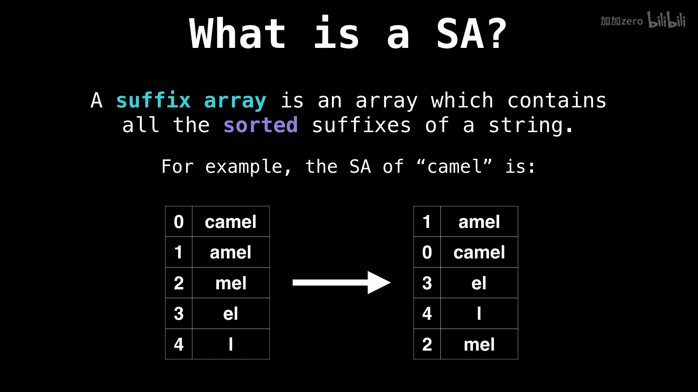

# 042：后缀数组简介

在本节课中，我们将要学习一个名为“后缀数组”的数据结构。后缀数组是进行字符串处理时一个极其强大的工具，它出现在20世纪90年代初期，主要是为了应对后缀树对内存的高消耗需求。

## 什么是后缀？

在开始学习后缀数组之前，我们首先需要理解什么是后缀。对于我们的目的而言，后缀是指一个字符串末尾的一个非空子串。

例如，对于字符串 `horse`，我们可以找出其所有可能的后缀。

以下是字符串 `horse` 的所有后缀：
*   E
*   SE
*   RSE
*   ORSE
*   HORSE

## 什么是后缀数组？

上一节我们介绍了后缀的概念，本节中我们来看看后缀数组的定义。后缀数组是一个包含了给定字符串所有后缀的**排序后**的数组。

让我们通过一个例子来具体理解。假设我们想为单词 `camel` 构建后缀数组。

首先，我们列出 `camel` 的所有后缀及其在原字符串中的起始索引。

以下是 `camel` 的所有后缀及其起始索引：
*   后缀 `camel`， 起始索引 0
*   后缀 `amel`， 起始索引 1
*   后缀 `mel`， 起始索引 2
*   后缀 `el`， 起始索引 3
*   后缀 `l`， 起始索引 4

接着，我们将这些后缀按照字典序（lexicographic order）进行排序。

以下是按字典序排序后的后缀及其起始索引：
*   后缀 `amel`， 起始索引 1
*   后缀 `camel`， 起始索引 0
*   后缀 `el`， 起始索引 3
*   后缀 `l`， 起始索引 4
*   后缀 `mel`， 起始索引 2

最终，后缀数组就是这个排序后列表中，后缀起始索引所构成的数组。对于 `camel`，其后缀数组 `SA` 为：

`SA = [1, 0, 3, 4, 2]`

本节课中我们一起学习了后缀数组的基础知识。我们首先定义了后缀，然后通过一个具体的例子，展示了如何从一个字符串构建出其后缀数组。后缀数组的核心是一个按字典序排序的后缀起始索引列表，它是许多高效字符串算法的基础。