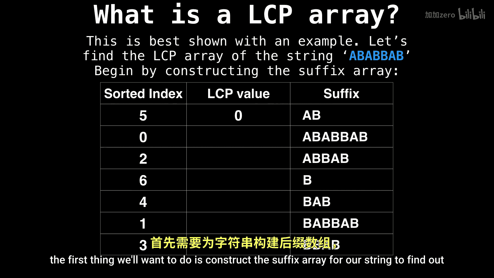
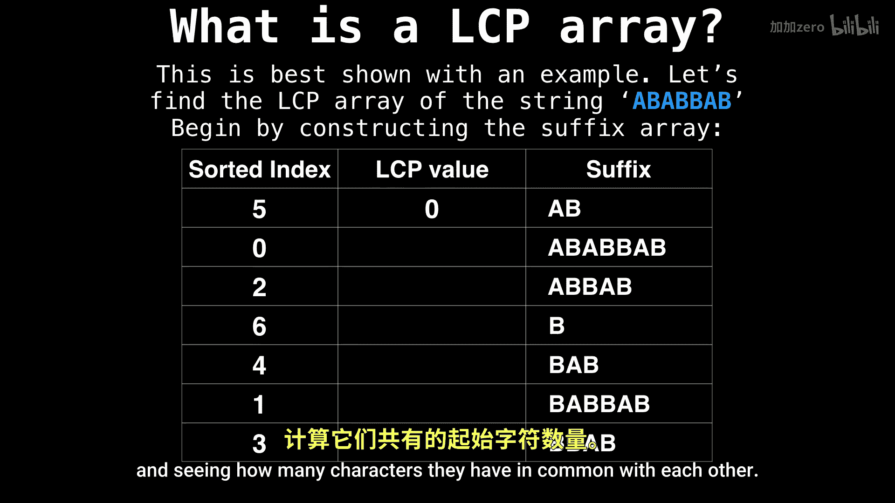
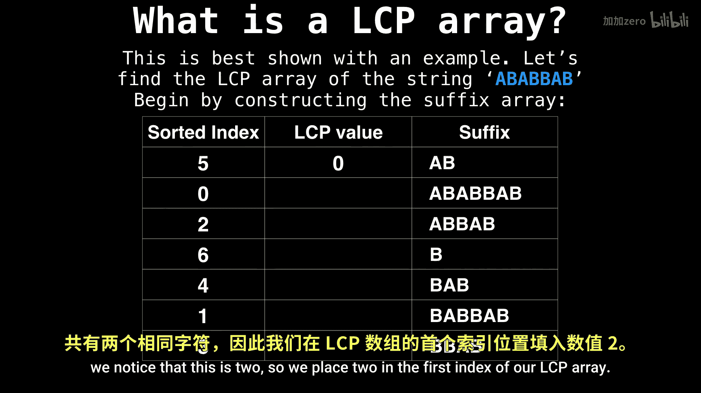

# 043：最长公共前缀数组 🧬

在本节课中，我们将探讨与后缀数组相关的最重要的信息之一：最长公共前缀数组，通常简称为 LCP 数组。

LCP 数组是一个数组，其中每个索引存储了两个已排序后缀之间共有的字符数量。让我们更深入地了解一下。

## 理解 LCP 数组

上一节我们介绍了 LCP 数组的基本概念。本节中，我们通过一个具体的例子来展示如何构建 LCP 数组。

我们将为字符串 `ABABBAA` 找出其 LCP 数组。

## 构建后缀数组

构建 LCP 数组的第一步，是为我们的字符串构造后缀数组，以找出所有已排序的后缀。

以下是字符串 `ABABBAA` 的后缀数组构建过程：

请注意，我们放在 LCP 数组（中间列）的第一个条目是 0。这是因为这个索引是未定义的，我们暂时忽略它。

## 计算 LCP 值

现在我们已经有了后缀数组，接下来开始构建 LCP 数组。让我们从查看前两个后缀开始，看看它们有多少个字符是相同的。

我们发现这个值是 2。因此，我们将 2 放入 LCP 数组的第一个索引中。

现在我们继续看接下来的两个后缀。

它们的 LCP 值也是 2。

再接下来的两个后缀没有任何共同字符，所以我们填入 0。

而最后两个后缀只有一个共同字符。

## 总结

本节课中我们一起学习了最长公共前缀数组的概念和构建方法。我们了解到，LCP 数组存储了后缀数组中相邻后缀对之间的最长公共前缀长度，它是许多高效字符串算法（如模式匹配、查找最长重复子串等）的关键组件。通过为字符串 `ABABBAA` 逐步构建 LCP 数组，我们掌握了其核心的计算过程。