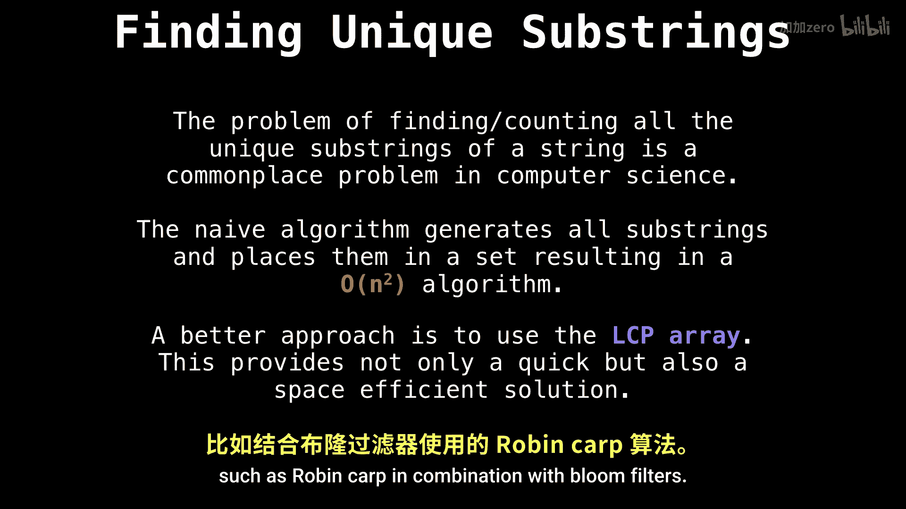
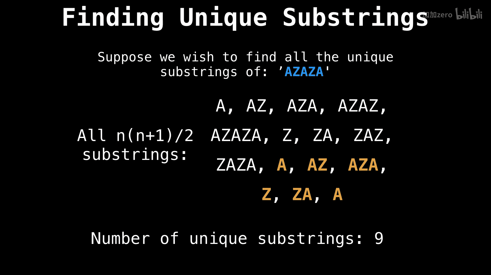

# 044：后缀数组应用 - 寻找唯一子串 🔍

在本节课中，我们将学习如何利用后缀数组（Suffix Array）和最长公共前缀数组（LCP Array）来高效地寻找并统计一个字符串中所有唯一的子串。这是一种比朴素算法更快速、更节省空间的优雅方法。

## 问题背景与朴素方法

在计算机科学，尤其是生物信息学领域，存在许多需要找出字符串所有唯一子串的有趣问题。

朴素算法的时间复杂度非常糟糕，为 **O(n²)**，并且需要大量空间。其思路是生成字符串的所有子串，并将它们放入一个集合中。

## 更优的解决方案

一种更优的方法是使用存储在LCP数组中的信息。这种方法不仅快速，而且空间效率高。需要说明的是，这并不是寻找所有唯一子串的唯一方法，还存在其他著名的算法，例如结合了布隆过滤器的Rabin-Karp算法。

上一节我们介绍了问题的背景和基本思路，本节中我们来看看具体的操作步骤。

## 示例：寻找唯一子串

现在，让我们通过一个例子来学习如何寻找字符串的所有唯一子串。我们以字符串 “AZAZA” 为例。

对于任何长度为 **n** 的字符串，其子串总数恰好为 **n(n+1)/2** 个。这个公式的证明将留作练习，但它并不难推导。

以下是字符串 “AZAZA” 的所有子串列表，请注意其中存在一些重复项：

*   A
*   AZ
*   AZA
*   AZAZ
*   AZAZA
*   Z
*   ZA
*   ZAZ
*   ZAZA
*   A
*   AZ
*   AZA
*   Z
*   ZA
*   A

我已将重复的子串高亮显示，总共有6个重复子串，因此唯一子串的数量是9个。

## 利用后缀数组与LCP数组

现在，让我们看看如何利用后缀数组和LCP数组中的信息来高效地计算唯一子串的数量。

核心思想是：**后缀数组按字典序排列了所有后缀，而LCP数组告诉我们相邻后缀之间共享的前缀长度。** 所有可能的子串都包含在这些后缀的前缀中。通过后缀数组，我们可以系统性地遍历这些前缀，并利用LCP值避免重复计数。

对于一个给定的后缀 `SA[i]`，它所能贡献的、以前缀形式出现的**新**子串数量，是其后缀长度减去它与前一个后缀的最长公共前缀长度。用公式表示，从后缀 `SA[i]` 得到的新子串数为：

`len(SA[i]) - LCP[i]`

其中，`len(SA[i])` 是当前后缀的长度，`LCP[i]` 是当前后缀与前一个后缀的最长公共前缀长度（对于第一个后缀，`LCP[0]` 通常定义为0）。

因此，要计算整个字符串的唯一子串总数，只需对每个后缀应用这个公式并求和：

`总唯一子串数 = Σ ( len(SA[i]) - LCP[i] )`，对 `i` 从 `0` 到 `n-1` 求和。

让我们将其应用到 “AZAZA” 的例子中。首先，我们需要构建它的后缀数组和LCP数组（构建过程在本系列前几节课中已介绍）。假设我们已得到如下结果：

*   后缀数组 `SA`: 索引代表排序后的后缀起始位置，例如 `[4, 2, 0, 3, 1]`（表示”A”, “AZA”, “AZAZA”, “ZA”, “ZAZA”）。
*   LCP数组 `LCP`: `[0, 1, 3, 0, 2]`（表示相邻排序后缀之间的LCP长度）。

根据公式计算：
*   后缀0 (`A`, 长度1): `1 - 0 = 1`
*   后缀1 (`AZA`, 长度3): `3 - 1 = 2`
*   后缀2 (`AZAZA`, 长度5): `5 - 3 = 2`
*   后缀3 (`ZA`, 长度2): `2 - 0 = 2`
*   后缀4 (`ZAZA`, 长度4): `4 - 2 = 2`

将结果相加：`1 + 2 + 2 + 2 + 2 = 9`。这与我们之前手动找出的唯一子串数量一致。

## 算法步骤总结

以下是利用后缀数组和LCP数组寻找或计数唯一子串的通用步骤：

1.  **预处理**：为输入字符串构建后缀数组 `SA` 和最长公共前缀数组 `LCP`。
2.  **初始化计数器**：设置 `unique_substrings = 0`。
3.  **遍历与累加**：对于 `i` 从 `0` 到 `n-1`（`n` 为字符串长度）：
    *   当前后缀 `SA[i]` 的长度为 `n - SA[i]`。
    *   当前LCP值为 `LCP[i]`（定义 `LCP[0] = 0`）。
    *   将 `(n - SA[i]) - LCP[i]` 加到 `unique_substrings` 上。
4.  **得到结果**：`unique_substrings` 即为唯一子串的总数。如果需要列出所有子串，可以在遍历时根据起始位置和长度生成。

## 总结

本节课中我们一起学习了如何高效地解决“寻找字符串中所有唯一子串”的问题。我们首先指出了朴素 **O(n²)** 方法的缺点，然后引入了基于后缀数组和LCP数组的优化方案。其核心公式 `新子串数 = 后缀长度 - LCP值` 使我们能够在 **O(n)** 时间内完成计数，这比朴素方法有了显著的效率提升。掌握这种方法不仅能解决此类特定问题，也有助于加深对后缀数组这一强大数据结构应用的理解。