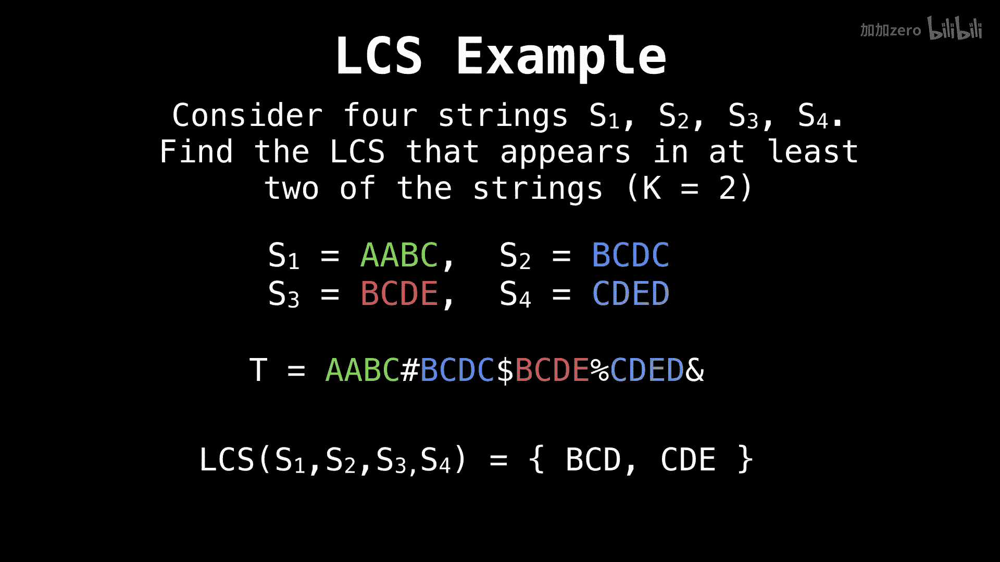
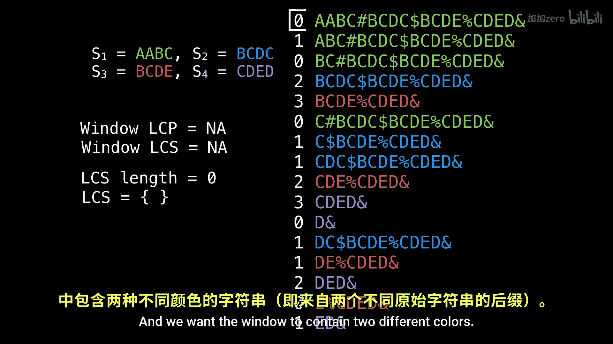

# 046：最长公共子串问题（后缀数组法）第二部分

在本节课中，我们将通过一个完整的例子，学习如何使用后缀数组和LCP数组来解决多字符串的最长公共子串问题。我们将处理四个字符串，并找出其中至少两个字符串共享的最长子串。

---

## 概述与问题设定

上一节我们介绍了使用后缀数组解决最长公共子串问题的基本框架。本节中，我们来看一个具体的计算实例。

我们设定四个字符串：S1, S2, S3, S4。我们将参数K设为2，这意味着我们要求至少有两个字符串共享这个公共子串。屏幕下方提供了拼接后的文本以及最终答案，你可以暂停视频先自行尝试。

首先，我们需要为拼接后的文本构建后缀数组和LCP数组，它们已分别显示在屏幕右侧和左侧。在算法执行过程中，请注意左侧变量的变化。

---

## 算法执行与窗口滑动

我们将使用一个滑动窗口算法。窗口的LCP值和窗口的LCS值将追踪当前窗口的最长公共前缀和最长公共子串候选值。而LCS长度和LCS集合则记录迄今为止找到的最佳结果。

以下是算法初始化状态：
*   窗口从顶部开始。
*   我们的规则是：窗口需要包含至少K（此处为2）种不同的“颜色”（即来自不同原始字符串的后缀）。因此，初始窗口不满足条件，我们需要向下扩展窗口。

---

## 逐步扩展与收缩窗口

随着我们向下扩展窗口，窗口内逐渐包含了来自不同字符串的后缀。当窗口满足“包含至少两种颜色”的条件时，我们开始检查窗口内的LCP最小值，这代表了该窗口内所有后缀共享的一个公共前缀长度，即一个候选的公共子串长度。

算法会持续向下滑动窗口。每加入一个新的后缀，我们更新窗口的LCP值；每移出一个旧的后缀，我们也相应调整。在这个过程中，我们始终追踪满足颜色数要求（K=2）的窗口中，最大的那个LCP值。

---

## 确定最终结果

通过遍历整个后缀数组并动态维护滑动窗口，我们最终可以找到满足条件的最长公共前缀值。这个值对应的前缀，就是至少两个原始字符串共享的最长子串。

屏幕左侧的变量`LCS length`和`LCS set`会记录下这个最终找到的长度和具体的子串信息。

---

## 总结

本节课中，我们一起通过一个具体实例，完整演练了使用后缀数组和LCP数组，结合滑动窗口算法，求解多字符串最长公共子串的过程。关键步骤在于：构建后缀数组和LCP数组，然后使用一个维护不同字符串来源数量的滑动窗口，在窗口中寻找LCP的最小值，并全局追踪其最大值，从而得到最终答案。

