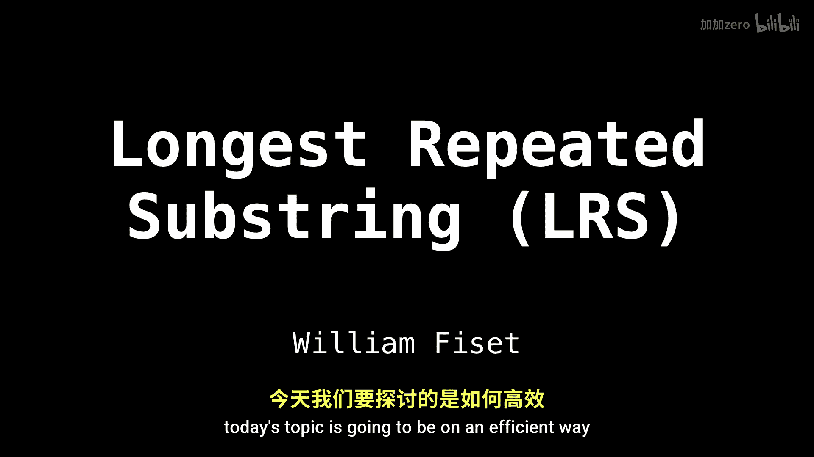
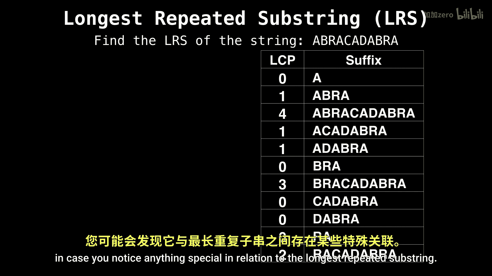

# 047：最长重复子串

在本节课中，我们将要学习如何利用后缀数组和最长公共前缀数组，高效地解决“最长重复子串”问题。我们将从问题定义开始，逐步讲解其重要性、朴素解法的不足，并最终展示基于后缀数组的优化解法。

---

## 问题定义与重要性

最长重复子串问题是计算机科学中一个相当常见的问题。许多其他问题实际上都可以归约为这个问题。因此，掌握一种高效的解决方法非常重要。

**最长重复子串** 指的是在一个给定的字符串中，至少出现两次的最长子串。例如，在字符串 `"Abracadabra"` 中，最长重复子串是 `"abra"`。

---

## 朴素解法及其不足

上一节我们介绍了问题的定义。朴素解法通常需要检查所有可能的子串对，这会导致 **O(n²)** 的时间复杂度和大量的空间开销。对于较长的字符串，这种方法是不可行的。

---

## 高效解法：后缀数组与LCP数组

本节中我们来看看如何利用后缀数组和最长公共前缀数组来高效地解决这个问题。这种方法的核心思想是：**一个重复出现的子串，必定是至少两个不同后缀的公共前缀**。

以下是构建高效解法所需的两个核心数据结构：

1.  **后缀数组**：一个包含字符串所有后缀的排序列表的数组。对于字符串 `S`，其第 `i` 个后缀是 `S[i..n-1]`。
2.  **最长公共前缀数组**：一个数组，其中 `LCP[i]` 表示排序后后缀数组中第 `i` 个后缀与第 `i-1` 个后缀的最长公共前缀的长度。

**核心算法公式**可以描述为：
`最长重复子串长度 = max(LCP[i])`，其中 `i` 从 1 到 n-1。

---

## 实例解析：`"Abracadabra"`

让我们通过字符串 `"Abracadabra"` 的例子来具体理解这个过程。我们已经知道其最长重复子串是 `"abra"`。

首先，我们生成该字符串的后缀数组和对应的LCP数组。后缀数组按字典序排列了所有后缀，而LCP数组记录了相邻后缀之间的公共前缀长度。

以下是关键观察：**LCP数组中的最大值，直接对应了最长重复子串的长度**。在 `"Abracadabra"` 的例子中，LCP数组的最大值是 4，这正好是子串 `"abra"` 的长度。并且，拥有这个最大LCP值的两个相邻后缀，其公共前缀就是我们要找的最长重复子串。

---

## 算法步骤总结

本节课中我们一起学习了利用后缀数组和LCP数组寻找最长重复子串的方法。其步骤可以总结如下：

1.  为输入字符串构建后缀数组。
2.  根据后缀数组计算最长公共前缀数组。
3.  遍历LCP数组，找到最大值 `maxLCP` 及其索引 `index`。
4.  最长重复子串即为后缀数组中第 `index` 个后缀（或第 `index-1` 个后缀）的前 `maxLCP` 个字符。

这种方法将时间复杂度从朴素的 O(n²) 优化到了构建后缀数组的复杂度（通常为 O(n log n) 或 O(n)），并且空间效率更高，是解决该问题的标准高效方案。