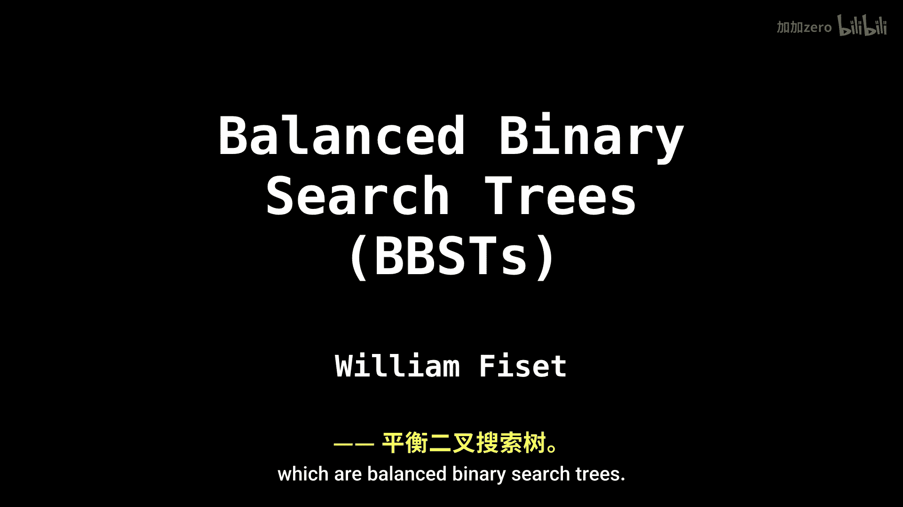
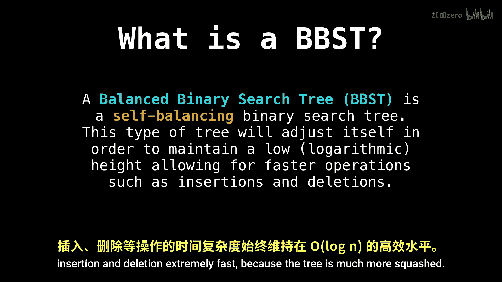

# 048：平衡二叉搜索树旋转 🔄

在本节课中，我们将要学习计算机科学中最重要的数据结构之一：平衡二叉搜索树。我们将重点探讨其保持平衡的核心机制——树旋转。

## 概述

平衡二叉搜索树与传统二叉搜索树有很大不同。它不仅遵循二叉搜索树的不变性，还能自我调整以维持其高度与节点数量成对数比例。这一点至关重要，因为它确保了插入和删除等操作的速度极快。



传统二叉搜索树的操作平均复杂度为对数级，这已经相当不错。然而，最坏情况下的复杂度仍然是线性的，因为对于某些输入序列，树可能会退化成一条链。例如，一个递增的数字序列就会导致这种情况。

为了避免这种线性复杂度，我们发明了平衡二叉搜索树，其所有操作在最坏情况下都能保持对数复杂度，这使得它们极具吸引力。

几乎所有平衡二叉搜索树实现其平衡性的核心秘密，就是**树旋转**的概念，这也将是本视频的主要主题。稍后，我们将观察一些特定类型的平衡二叉搜索树，看看这些旋转是如何发挥作用的。

## 树旋转详解

上一节我们介绍了平衡二叉搜索树的基本概念和重要性。本节中，我们来看看保持平衡的核心操作——树旋转。

树旋转是一种局部调整子树结构的操作，它能在不破坏二叉搜索树性质的前提下，改变树的高度和形态。旋转操作主要分为两种基本类型：左旋和右旋。

以下是理解旋转的关键点：

*   **不变量保持**：旋转操作必须保持二叉搜索树的性质（左子树所有节点值 < 根节点值 < 右子树所有节点值）。
*   **高度调整**：通过旋转，可以将较“重”一侧的子树节点提升或降低，从而减少整棵树或局部子树的高度差。
*   **局部操作**：旋转通常只涉及少数几个节点（如父节点、子节点、孙节点），因此效率很高。

### 右旋操作 🔁

右旋操作针对的是一个节点（我们称其为`P`）及其左子节点（我们称其为`C`）。当`P`的左子树比右子树高时，可以通过右旋来降低左侧高度。

旋转过程可以描述为：
1.  节点`C`成为新的子树根节点。
2.  节点`P`成为节点`C`的右子节点。
3.  节点`C`原来的右子树（`T3`）变为节点`P`的左子树。



用伪代码可以简要表示其核心关系变化：
```plaintext
// 设 P 为当前根，C = P.left
new_root = P.left
P.left = new_root.right
new_root.right = P
// 更新后，new_root 成为该子树的根
```


### 左旋操作 🔄

左旋是右旋的对称操作，针对的是一个节点（`P`）及其右子节点（`C`）。当`P`的右子树比左子树高时，使用左旋。

旋转过程如下：
1.  节点`C`成为新的子树根节点。
2.  节点`P`成为节点`C`的左子节点。
3.  节点`C`原来的左子树（`T2`）变为节点`P`的右子树。

其核心关系变化的伪代码如下：
```plaintext
// 设 P 为当前根，C = P.right
new_root = P.right
P.right = new_root.left
new_root.left = P
// 更新后，new_root 成为该子树的根
```


## 旋转的应用与意义

理解了左旋和右旋的基本原理后，我们来看看它们的实际应用。在AVL树、红黑树等具体的平衡二叉搜索树实现中，正是通过检测节点左右子树的高度差（平衡因子），并在插入或删除节点后，智能地应用单次或多次旋转（如左右双旋、右左双旋），来恢复树的平衡。

这种动态调整确保了树的高度始终为 **O(log n)**，其中 **n** 是树中节点的数量。因此，查找、插入和删除等操作的最坏时间复杂度都能稳定在对数级，避免了普通二叉搜索树可能退化为链表的线性复杂度问题。

## 总结

本节课中，我们一起学习了平衡二叉搜索树的核心平衡技术——树旋转。


*   我们首先了解了平衡二叉搜索树相比普通二叉搜索树的优势，即通过保持对数高度来保证操作效率。
*   然后，我们深入探讨了实现平衡的关键：左旋和右旋操作，并使用伪代码描述了它们的核心逻辑。
*   最后，我们明确了旋转的最终目的是动态维持树的结构，使得所有基本操作的时间复杂度稳定在 **O(log n)**。

掌握树旋转是理解后续更复杂的平衡树结构（如AVL树、红黑树）的重要基础。