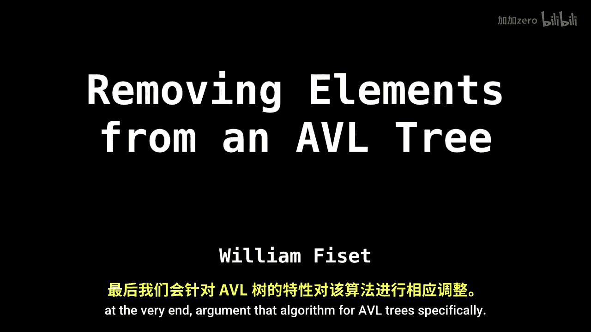
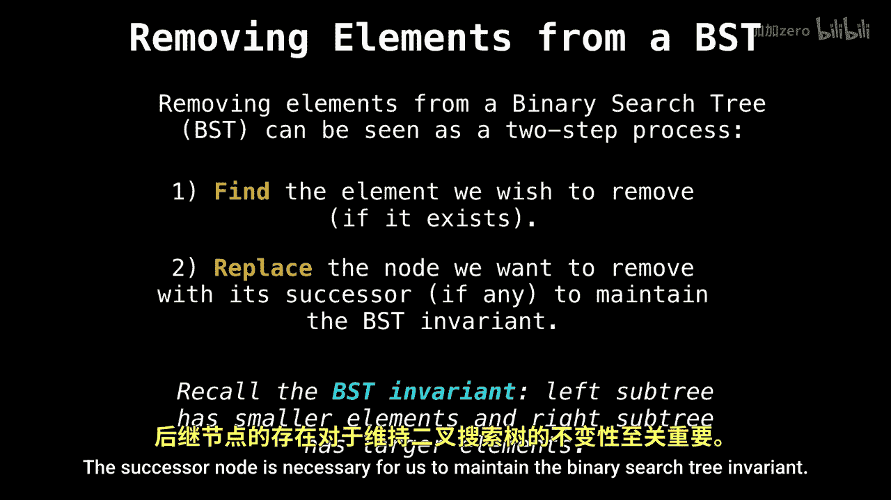
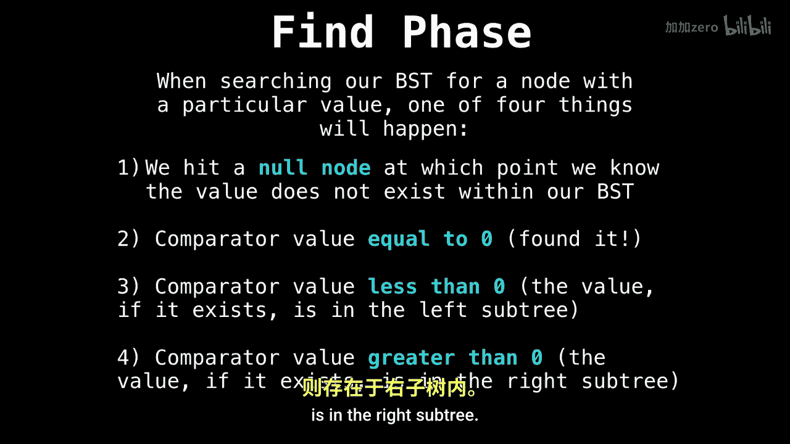

# 050：AVL树删除操作

在本节课中，我们将学习如何从AVL树中删除元素。你将发现，从AVL树中删除元素与从常规二叉搜索树中删除元素几乎完全相同。因此，本视频的大部分内容将首先详细讲解如何从二叉搜索树中删除节点，最后再针对AVL树的特点对该算法进行增强。让我们开始吧。

## 二叉搜索树删除操作回顾

上一节我们介绍了AVL树删除操作的整体思路。本节中，我们来详细回顾一下如何在二叉搜索树中删除节点。这个过程通常可以分解为两个主要步骤：**查找**和**替换**。

在查找阶段，我们需要在树中找到希望删除的元素（如果它存在的话）。在替换阶段，我们将该节点替换为其**后继节点**。这个后继节点对于维持二叉搜索树的性质是必要的。

### 查找阶段详解

以下是查找阶段可能发生的四种情况：
1.  我们遇到了一个空节点，这意味着我们要查找的值在树中不存在。
2.  我们的比较器返回值为0，这意味着我们找到了想要删除的节点。
3.  比较器的值小于0，这意味着我们要查找的值（如果存在）将在左子树中找到。
4.  比较器的值大于0，这意味着我们要查找的值（如果存在）将在右子树中找到。

让我们通过一个例子来演示如何在二叉搜索树中查找节点。