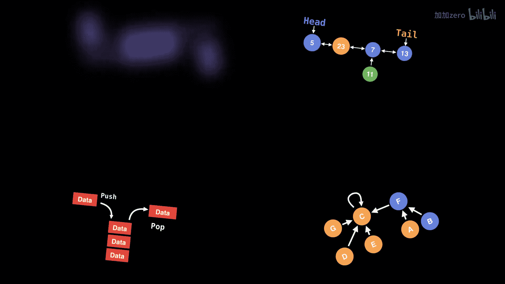
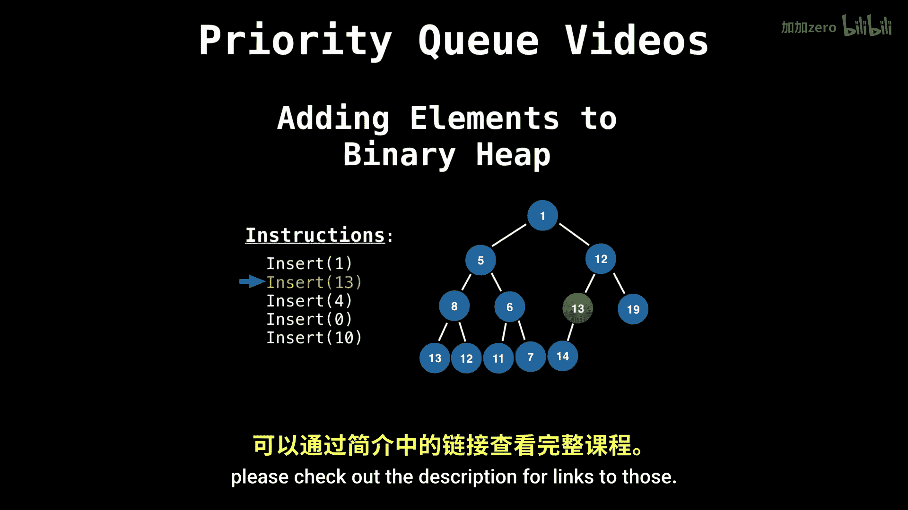
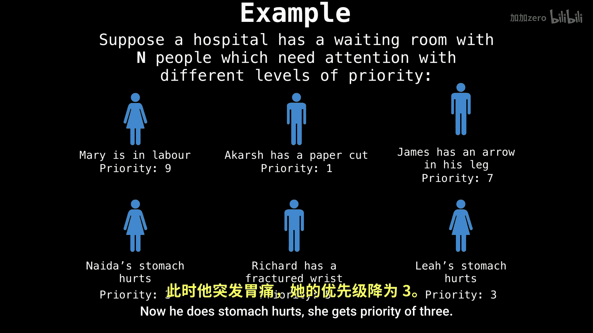

# 052：索引优先队列（更新版）


在本节课中，我们将学习一种非常实用的数据结构——索引优先队列。它是传统优先队列的一个变体，除了支持所有常规优先队列操作外，还允许我们快速更新和删除键值对。这对于需要动态改变队列中元素优先级的场景（如医院急诊分诊）非常有用。



## 回顾：传统优先队列

在深入了解索引优先队列之前，我们先快速回顾一下传统优先队列。优先队列是一种抽象数据类型，它允许我们以任意顺序插入元素，但总是按照某种优先级顺序（例如，数值最小或最大）来移除元素。常见的实现方式有二叉堆。

然而，传统优先队列有一个局限性：它很难高效地查找、更新或删除一个特定的元素（除非它是队首元素）。例如，如果你想改变队列中“James”的优先级，你需要遍历整个堆来找到他，这非常低效。


## 索引优先队列的核心思想

索引优先队列通过引入一个额外的“索引”概念来解决上述问题。每个元素在插入时都与一个唯一的索引（通常是一个整数ID）相关联。这个索引作为元素的“钥匙”，使我们能够直接定位到它，而无需遍历整个数据结构。

其核心在于维护三个关键数组：
*   `keys[]`: 存储每个索引对应的实际值（优先级）。
*   `pm[]` (Position Map): 存储每个索引在堆数组 `heap` 中的当前位置。即 `pm[i]` 告诉我们索引 `i` 的元素在堆的哪个位置。
*   `im[]` (Inverse Map): 存储堆数组中每个位置所对应的索引。即 `im[j]` 告诉我们堆位置 `j` 上存放的是哪个索引的元素。

它们之间的关系可以用以下公式表示：
```
pm[im[j]] == j
im[pm[i]] == i
```
这意味着，给定一个索引 `i`，我们能立刻知道它在堆中的位置 (`pm[i]`)。反之，给定一个堆位置 `j`，我们也能立刻知道那里存放的是哪个索引 (`im[j]`)。

## 索引优先队列支持的操作

以下是索引优先队列支持的主要操作及其简要说明：

*   **插入 (`insert(k, value)`)**：将值 `value` 与索引 `k` 关联起来，并将其插入堆中。
*   **更新 (`update(k, value)`)**：将索引 `k` 关联的值更新为新的 `value`，并调整堆以维持堆性质。
*   **删除 (`delete(k)`)**：删除与索引 `k` 关联的键值对。
*   **弹出最小/最大值 (`poll()`)**：移除并返回优先级最高（如最小值）的键值对。
*   **减小/增大键值 (`decreaseKey(k, value)` / `increaseKey(k, value)`)**：这是 `update` 操作的特化版本，确保新值比旧值更小或更大，常用于像Dijkstra这样的算法中。
*   **查看队首 (`peek()`)**：返回优先级最高的键值对，但不移除它。
*   **根据索引查找值 (`valueOf(k)`)**：快速返回索引 `k` 当前关联的值。


## 操作示例：医院分诊系统



让我们通过一个医院候诊室的例子来理解这些操作。假设我们有5位病人：

1.  Mary (索引 0)， 优先级 9 (分娩)
2.  Alex (索引 1)， 优先级 1 (纸割伤)
3.  James (索引 2)， 优先级 7 (腿部中箭)
4.  Naida (索引 3)， 优先级 3 (胃痛)
5.  Richard (索引 4)， 优先级 5 (手腕骨折)

初始时，我们根据优先级构建一个最小堆（数字小优先级高，先处理）。堆数组 `heap`（通过 `im` 映射）可能看起来像 `[1, 3, 2, 0, 4]`，对应 Alex, Naida, James, Mary, Richard。

**场景1：更新优先级**
假设 James (索引2) 的箭伤感染，情况恶化，优先级需要提高到 2。我们调用 `update(2, 2)`。
1.  通过 `pm[2]` 找到 James 在堆中的位置（假设是位置2）。
2.  将 `keys[2]` 的值从7更新为2。
3.  因为新值（2）比旧值（7）小（在最小堆中优先级更高），所以需要向上调整 (`swim`) James 在堆中的位置。
4.  调整后，堆顺序得到维护。现在队首可能是 James 或 Alex。


**场景2：删除病人**
假设 Alex (索引1) 的伤口经过简单处理，可以离开。我们调用 `delete(1)`。
1.  通过 `pm[1]` 找到 Alex 在堆中的位置（位置0）。
2.  将堆末尾的元素（假设是 Richard，索引4）移动到位置0。
3.  更新 `pm[4] = 0` 和 `im[0] = 4`。
4.  移除 Alex 的映射关系（`pm[1]` 设为无效值）。
5.  对新移动到位置0的 Richard 执行堆调整 (`sink` 或 `swim`)，以恢复堆性质。

**代码示例：关键操作框架**
以下是一个简化版的 `update` 和 `delete` 操作框架，展示了如何使用 `pm` 和 `im`：

```java
public void update(int ki, T value) {
    keys[ki] = value; // 更新值
    int i = pm[ki]; // 获取堆位置
    swim(i); // 可能需要向上调整
    sink(i); // 也可能需要向下调整
}

public void delete(int ki) {
    int i = pm[ki]; // 获取要删除的索引的堆位置
    swap(i, size - 1); // 与堆末尾元素交换
    size--; // 减小堆大小
    swim(i); // 调整交换上来的元素
    sink(i);
    // 清理
    keys[ki] = null;
    pm[ki] = -1;
    im[size] = -1;
}

private void swap(int i, int j) {
    int ki = im[i], kj = im[j];
    // 交换堆中的位置
    int temp = im[i];
    im[i] = im[j];
    im[j] = temp;
    // 更新位置映射
    pm[ki] = j;
    pm[kj] = i;
}
```

## 总结



本节课我们一起学习了索引优先队列。我们首先指出了传统优先队列在动态更新元素方面的不足，然后引入了索引优先队列作为解决方案。其核心在于通过位置映射 (`pm`) 和逆映射 (`im`) 数组，在索引、键值和堆位置之间建立快速关联。这使得**根据索引更新值 (`update`)** 和**删除特定元素 (`delete`)** 等操作变得非常高效（时间复杂度通常为 O(log n)）。索引优先队列是许多高级算法（如 Dijkstra 最短路径算法、Prim 最小生成树算法）高效实现的关键组件。掌握它将极大提升你解决复杂问题的能力。