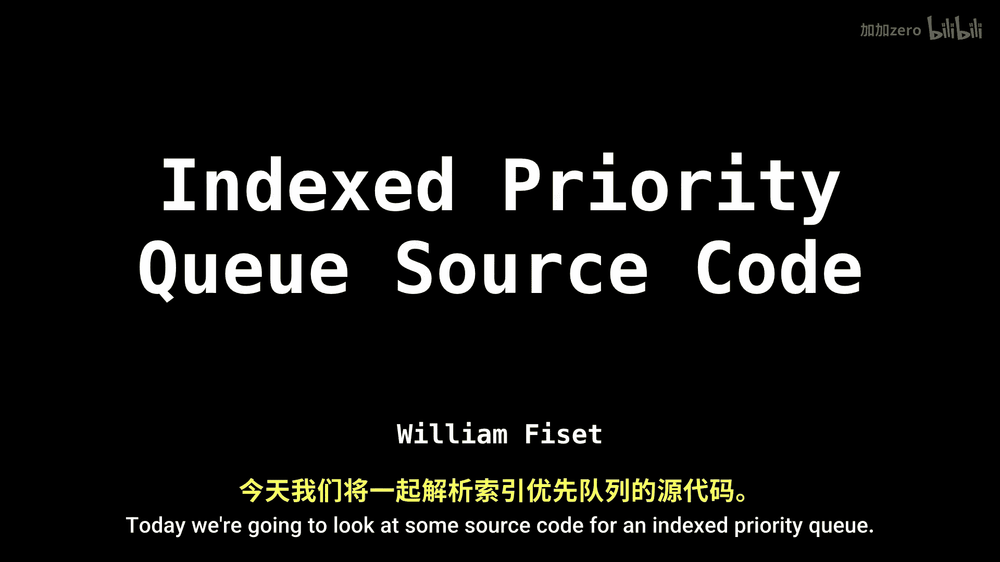
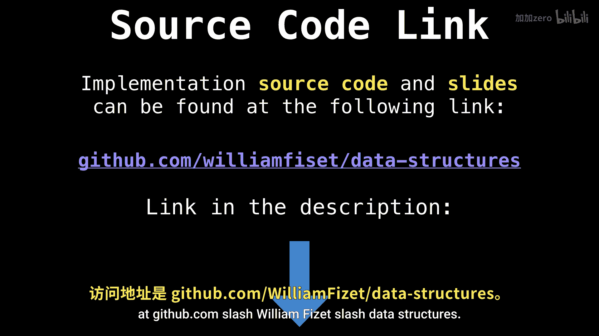
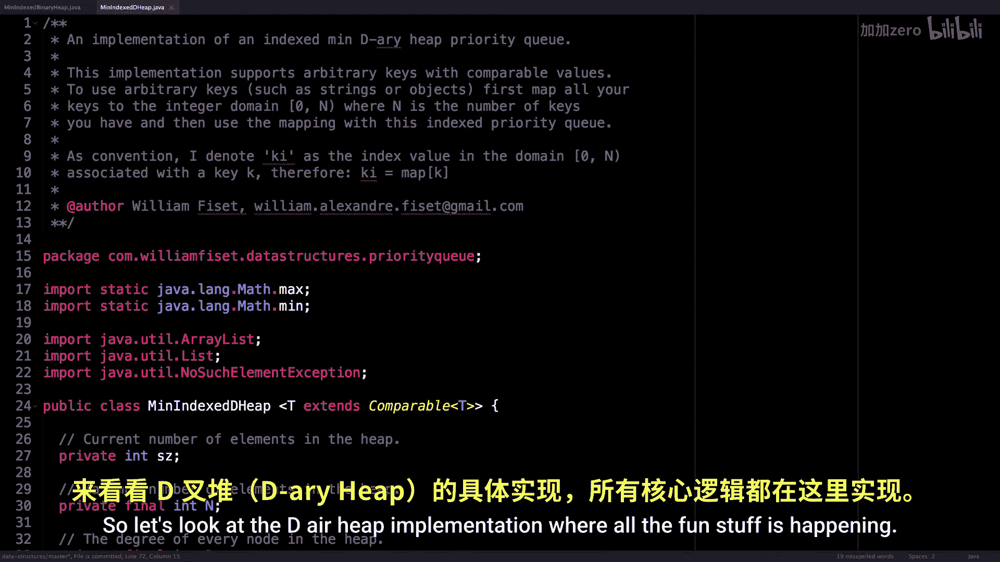
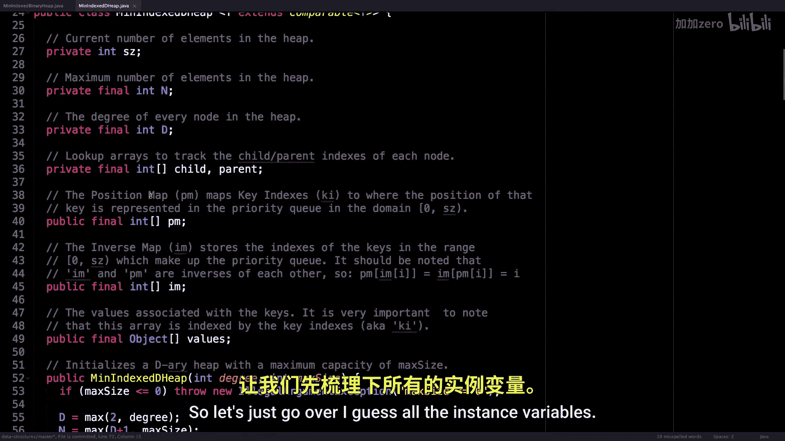

**数据结构课程：P53：索引优先队列源码解析** 🚀


在本节课中，我们将一起学习索引优先队列（Indexed Priority Queue）的源代码实现。我们将重点关注一个最小索引二叉堆（Min Indexed Binary Heap）的实现细节，并理解其核心机制。

---

上一节我们介绍了索引优先队列的概念和重要性，本节中我们来看看其具体的Java源代码实现。

所有源代码均可在我的GitHub数据仓库中找到：`github.com/williamfiset/data-structures`。

### **最小索引二叉堆类概览**

首先，我们来看最小索引二叉堆的类定义。它要求传入一个可比较（Comparable）的对象类型，以便在堆中对键值对进行排序。

```java
public class MinIndexedBinaryHeap<T extends Comparable<T>> extends MinIndexedDHeap<T> {
    public MinIndexedBinaryHeap(int maxSize) {
        super(2, maxSize);
    }
}
```

请注意，此类继承自一个更通用的 `MinIndexedDHeap`。在构造函数中，我们简单地初始化堆，规定每个节点最多有两个子节点（即二叉堆），而D堆通常支持每个节点有D个子节点。

### **深入D堆实现**



现在，让我们深入查看 `MinIndexedDHeap` 类，所有核心逻辑都在这里发生。



以下是该类的主要实例变量：

*   **`sz`**：堆中当前元素的数量。
*   **`N`**：一个常量，代表堆能容纳的最大元素数量。
*   **`D`**：每个节点的度（子节点数量）。对于二叉堆，此值为2。

```java
private int sz;
private final int N, D;
private final int[] child, parent;
private final int[] pm; // 位置映射（Position Map）
private final int[] im; // 逆映射（Inverse Map）
private final Object[] values; // 键值对中的值
```

为了管理索引和位置，我们使用了几个关键数组：

*   **`pm` (位置映射)**：`pm[k]` 给出键 `k` 在堆数组（`im`）中的位置。
*   **`im` (逆映射)**：`im[i]` 给出堆数组中位置 `i` 处存储的键。
*   **`values`**：存储与每个键相关联的值。

`pm` 和 `im` 之间的关系是核心，它们互为逆映射，满足以下公式：

```
pm[im[i]] = i
im[pm[k]] = k
```

### **核心操作方法**

以下是实现堆操作的关键方法：

**1. 比较与交换**

堆操作依赖于比较和交换元素。`less` 方法比较两个键对应的值，`swap` 方法交换堆中两个位置的所有相关数据。


```java
private boolean less(int i, int j) {
    return ((T) values[im[i]]).compareTo((T) values[im[j]]) < 0;
}


private void swap(int i, int j) {
    pm[im[j]] = i;
    pm[im[i]] = j;
    int tmp = im[i];
    im[i] = im[j];
    im[j] = tmp;
}
```



**2. 上浮与下沉**

为了维护堆属性，我们需要 `swim` (上浮) 和 `sink` (下沉) 操作。

*   **`swim`**：当一个节点的值变小时，它需要向堆顶移动。
    ```java
    private void swim(int i) {
        while (i > 0 && less(i, parent[i])) {
            swap(i, parent[i]);
            i = parent[i];
        }
    }
    ```
*   **`sink`**：当一个节点的值变大时，它需要向堆底移动。这需要找到其子节点中最小的一个。
    ```java
    private void sink(int i) {
        for (int j = minChild(i); j != -1; ) {
            swap(i, j);
            i = j;
            j = minChild(i);
        }
    }
    private int minChild(int i) {
        int index = -1, from = child[i], to = Math.min(sz, from + D);
        for (int j = from; j < to; j++) if (less(j, i)) index = i = j;
        return index;
    }
    ```



**3. 主要公开API**

基于上述内部方法，我们可以构建出对外的接口：

*   **`insert(k, value)`**：插入一个键值对。
    ```java
    public void insert(int ki, T value) {
        pm[ki] = sz;
        im[sz] = ki;
        values[ki] = value;
        swim(sz++);
    }
    ```
*   **`delete(ki)`**：删除指定键的节点。
    ```java
    public T delete(int ki) {
        int i = pm[ki];
        swap(i, --sz);
        sink(i);
        swim(i);
        T value = (T) values[ki];
        values[ki] = null;
        pm[ki] = -1;
        return value;
    }
    ```
*   **`update(ki, value)`**：更新指定键的值，并调整堆。
*   **`decreaseKey` / `increaseKey`**：专门用于增加或减少键值的优化方法。
*   **`peekMinKeyIndex` / `pollMinKeyIndex`**：查看或取出最小值的键。
*   **`peekMinValue` / `pollMinValue`**：查看或取出最小值。


---


本节课中我们一起学习了索引优先队列的核心源代码实现。我们剖析了最小索引D堆的数据结构，包括其用于高效索引管理的 `pm` 和 `im` 数组，以及实现堆排序属性的 `swim` 和 `sink` 方法。通过继承，二叉堆成为了D堆的一个特例。理解这些代码有助于你掌握如何构建一个能够通过索引快速访问和修改元素的优先队列。