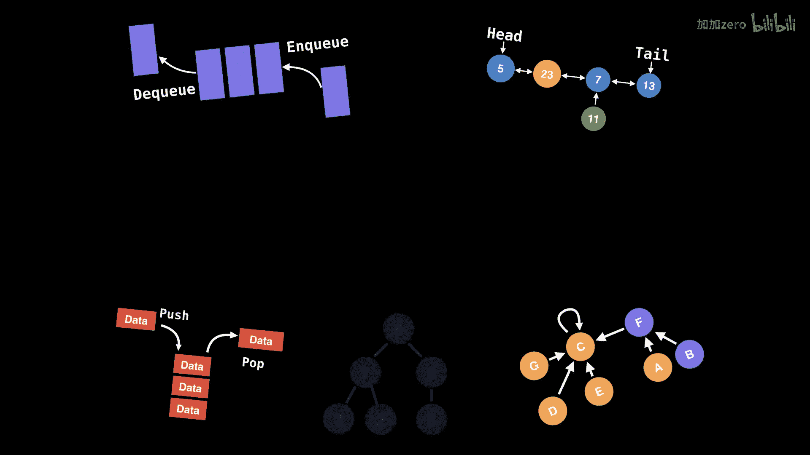
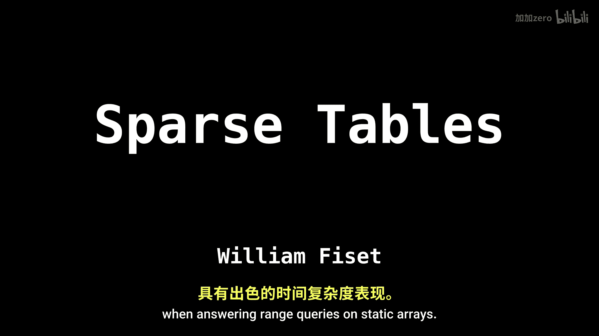

# 054：稀疏表数据结构

在本节课中，我们将要学习稀疏表数据结构。稀疏表是一种用于在静态数组上高效回答区间查询的专用数据结构，其时间复杂度表现优异。

## 适用场景

上一节我们介绍了稀疏表的基本概念，本节中我们来看看它的典型应用场景。

稀疏表主要用于对静态数组进行高效的区间查询。典型的应用场景是处理数据不可变的整数数组。

以下是几种常见的区间查询类型：
*   查找某个区间内的最小值。
*   计算某个区间内所有值的总和。
*   计算给定区间内所有值的乘积。

## 工作原理

了解了稀疏表的适用场景后，本节我们来探讨其背后的核心工作原理。

稀疏表的核心思想基于一个数学事实：任何正整数都可以由其二进制表示所对应的2的幂次之和来表示。

例如，数字19的二进制是 `10011`，这等价于 `2^4 + 2^1 + 2^0`。

类似地，我们可以将一个由左右端点定义的区间，分解为若干个长度为2的幂次的子区间。

例如，区间 `[5, 7]` 可以这样分解。

本节课中我们一起学习了稀疏表数据结构。我们了解了它的适用场景，即对静态数组进行高效的区间查询，例如求最小值、总和或乘积。我们还探讨了其核心工作原理，即利用二进制和2的幂次来分解任意区间，这是实现高效查询的基础。