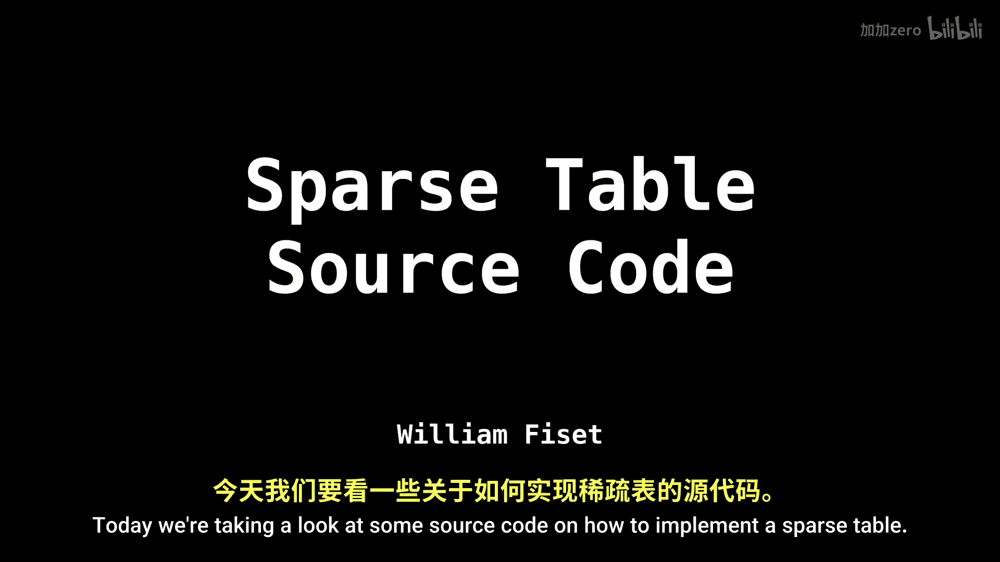
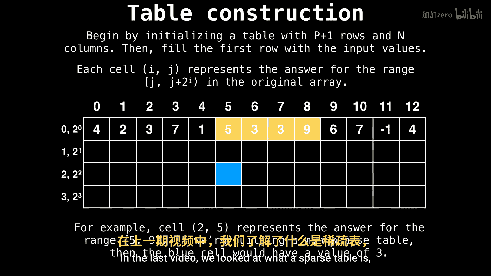
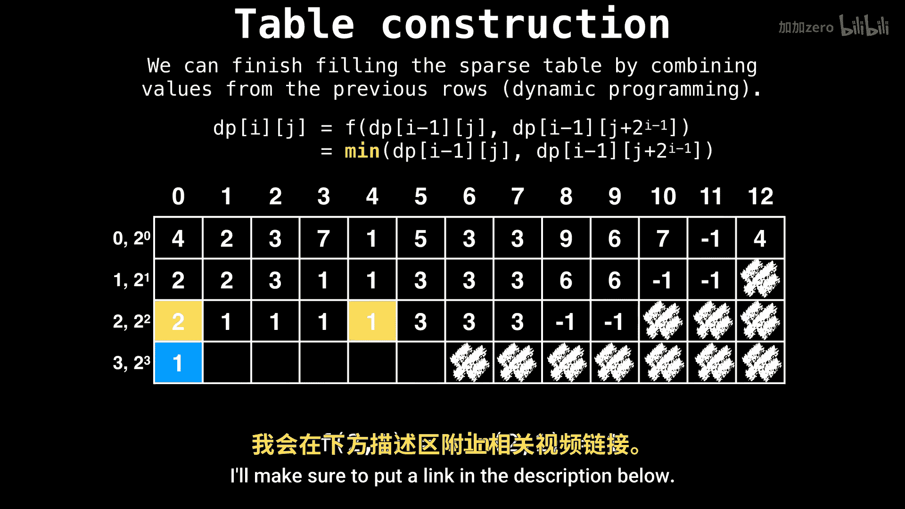
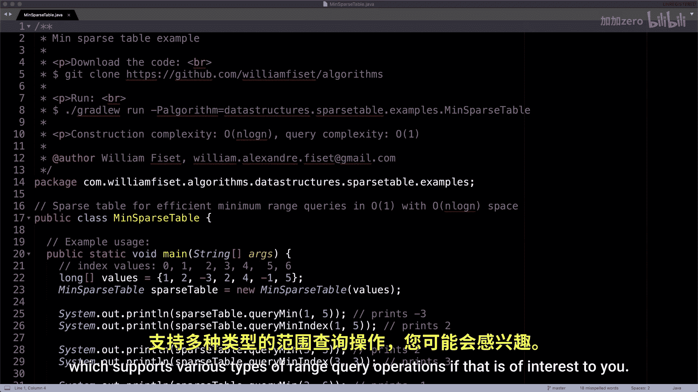
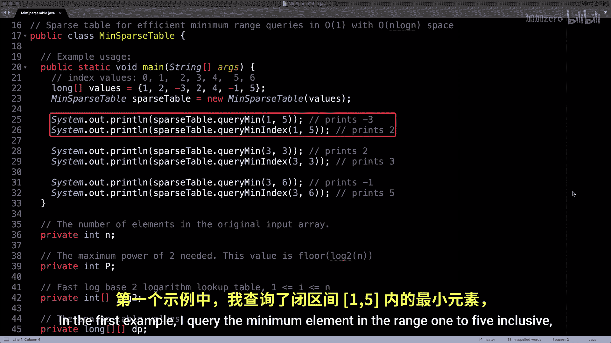

# 055：稀疏表数据结构源码解析 📚


在本节课中，我们将学习如何用代码实现一个稀疏表（Sparse Table）。稀疏表是一种数据结构，主要用于高效地回答数组上的静态区间查询，例如区间最小值、最大值或区间和。我们将基于Java源码，一步步解析其构建过程和查询方法。

上一节我们介绍了稀疏表的基本概念和原理。本节中，我们来看看如何用代码具体实现它。



## 概述与准备



首先，请注意本实现是一个**最小值稀疏表**，专门用于回答区间最小值查询。如果你需要进行其他类型的区间查询（如最大值、区间和），则需要修改代码。你也可以在GitHub上找到我编写的另一个更通用的稀疏表实现。

以下是如何使用本代码的示例：


```java
public static void main(String[] args) {
    // 示例数组
    long[] values = {1, 0, -3, 5, 4, -2, 10};
    // 构建最小值稀疏表
    MinSparseTable minSparseTable = new MinSparseTable(values);
    // 查询区间 [1, 5] 的最小值
    System.out.println(minSparseTable.queryMin(1, 5)); // 输出：-3
}
```

## 稀疏表类结构

现在，让我们深入`MinSparseTable`类的内部。类的核心是维护一个二维数组`dp`，用于存储预计算的结果。同时，我们还需要一个`log2`数组来快速计算查询区间长度对应的幂次。



```java
public class MinSparseTable {
    // 存储稀疏表数据的二维数组
    private long[][] dp;
    // 存储以2为底的对数值，用于快速索引
    private int[] log2;
}
```

## 构造函数与表的构建

构造函数接收原始数组并初始化稀疏表。构建过程分为两步：首先初始化`log2`数组，然后填充`dp`表。

以下是构建过程的步骤说明：

1.  **初始化与基础设置**：计算数组长度`n`，并确定稀疏表需要预计算的层数`P`（即 `floor(log2(n))`）。同时初始化`log2`数组。
2.  **填充第一层（基础情况）**：`dp`表的第一层（`p=0`）就是原始数组本身，因为区间长度为 `2^0 = 1`。
3.  **动态规划构建高层**：对于每一层 `p`（从1到P-1），我们计算所有长度为 `2^p` 的区间的最小值。其状态转移基于上一层的两个重叠区间：
    `dp[p][i] = min(dp[p-1][i], dp[p-1][i + (1 << (p-1))])`

```java
public MinSparseTable(long[] values) {
    int n = values.length;
    // 计算最大层数 P = floor(log2(n))
    int P = (int) (Math.log(n) / Math.log(2)) + 1;
    dp = new long[P][n];
    log2 = new int[n + 1];

    // 构建 log2 数组
    for (int i = 2; i <= n; i++) {
        log2[i] = log2[i / 2] + 1;
    }

    // 初始化 dp 表第一层
    System.arraycopy(values, 0, dp[0], 0, n);

    // 动态规划构建稀疏表
    for (int p = 1; p < P; p++) {
        for (int i = 0; i + (1 << p) <= n; i++) {
            long leftInterval = dp[p - 1][i];
            long rightInterval = dp[p - 1][i + (1 << (p - 1))];
            dp[p][i] = Math.min(leftInterval, rightInterval);
        }
    }
}
```

## 区间最小值查询

构建好稀疏表后，我们可以用它来回答任何区间 `[l, r]` 的最小值查询。查询的关键在于将任意区间分解为两个长度为 `2^k` 的、可能重叠的区间，这两个区间的最小值已经在`dp`表中计算好了。



查询步骤如下：

1.  计算区间长度 `len = r - l + 1`。
2.  找到不大于 `len` 的最大2的幂次 `k`，即 `k = floor(log2(len))`。我们可以直接从预计算的`log2`数组中获取这个值。
3.  查询覆盖区间左端点的长度为 `2^k` 的区间最小值，以及覆盖区间右端点（向左偏移 `2^k`）的另一个长度为 `2^k` 的区间最小值。
4.  返回这两个值中的较小者。

```java
public long queryMin(int l, int r) {
    int length = r - l + 1;
    int k = log2[length]; // 获取区间长度对应的幂次 k
    // 查询两个可能重叠的区间
    return Math.min(dp[k][l], dp[k][r - (1 << k) + 1]);
}
```

## 总结

本节课中我们一起学习了稀疏表数据结构的代码实现。我们首先看到了如何使用`MinSparseTable`类进行区间最小值查询。然后，我们深入分析了类的构造函数，它通过动态规划高效地预计算了所有2的幂次长度区间的最小值。最后，我们解析了`queryMin`方法，它利用预计算的`log2`表和`dp`表，在常数时间内回答任意区间的最小值查询。



记住，这个实现是针对**最小值**操作的。其核心思想——通过预处理2的幂次长度的区间来加速查询——可以推广到其他可重复贡献的问题（如最大值、区间和、按位与/或等），只需修改状态合并的函数（本例中的`Math.min`）即可。