# WriteyourOperatingSystem【中英⚡编写你自己的操作系统｜Write your own Operating System】 p03 P3 Write your own Operating System 2： Install your OS in a Virtual Machine -BV1BDBEByEBY_p3-

Hello and welcome back to this tutorial。In this second part。

 I'm going to show you how to install your operating system in a virtual machine because you don't want to reboot your machine every time you've made a little change to your current。

 right？So the software that you will need now is a virtual box， the virtual machine。Gra up a legacy。

 and。ASo easel。

Because we are going to create a virtual C image。And make that a bootable C。

 And then we will use that as boot medium in the virtual machine。So what we have to do now is。

We will change our make file。嗯。So that we will be able to create。My Colonel dot isil。

And this depends on。My kernel dropped in。And what we do now is first。

 we create a directory structure of that resulting。CD， okay。

 so the directory structure will be very similar to what we've worked with so far， so。First。

 we will make a。A directory to work in。And that should contain。A directory boot。

And that their o directory should contain a gr directory。Okay， so this should look familiar。

And when we've done that， we will just copy the kernel。Into this book directory。Actually， let's get。

Yes。And now we have to create the。Graps C F G manually， so。Let's do this。Okay， what is going in down？

😔，Well， we will have only one entry in there， so。This one entry is supposed to be the default selection。

And。Well， since we only have one entry， it makes no sense to。

To wait for some time out until the user has selected something because there is nothing to select。

 really。So， set。Time out。To0。Okay， and then then we'll just do what we did before。So menu entry。

Operating。System。F has。Multtiput。30度。来看了。等。

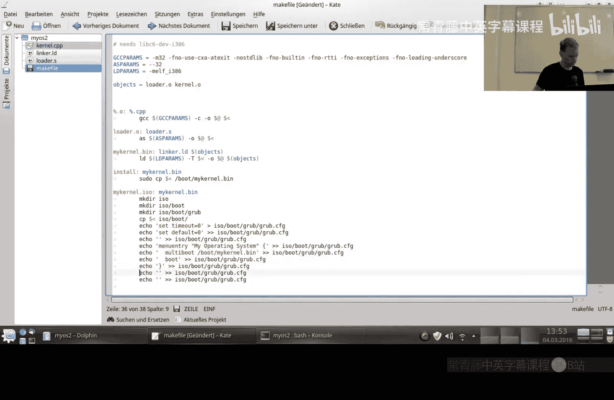

Okay， so when we run this。

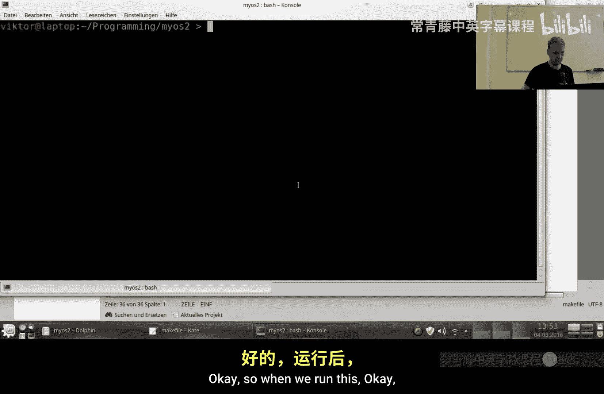

嗯。

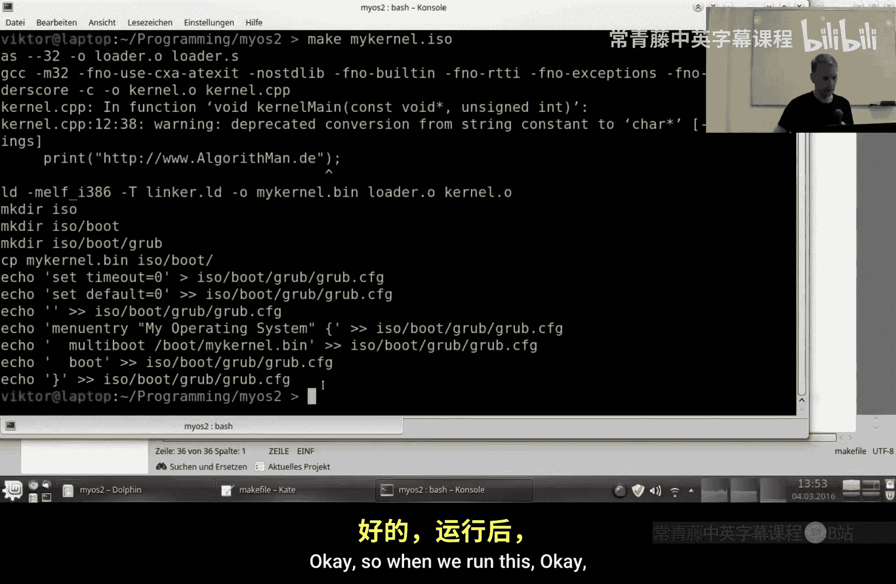

Okay， now it has created this iso directory with subdirectory port。Containing our kernel。

And directory G。Which contains a Sc C of3。Okay， so everything。Looks like we want it to be。Okay。

 I'll just delete this again。嗯。Because now now we create the CD image from that。And we do that with。

G up。MK。Rescue。Outputs。Is the target file。And as input， we are using this ISO directory okay。

And after we've created this image， we don't need this iso directory anymore so we can as well。Just。

Delete it。

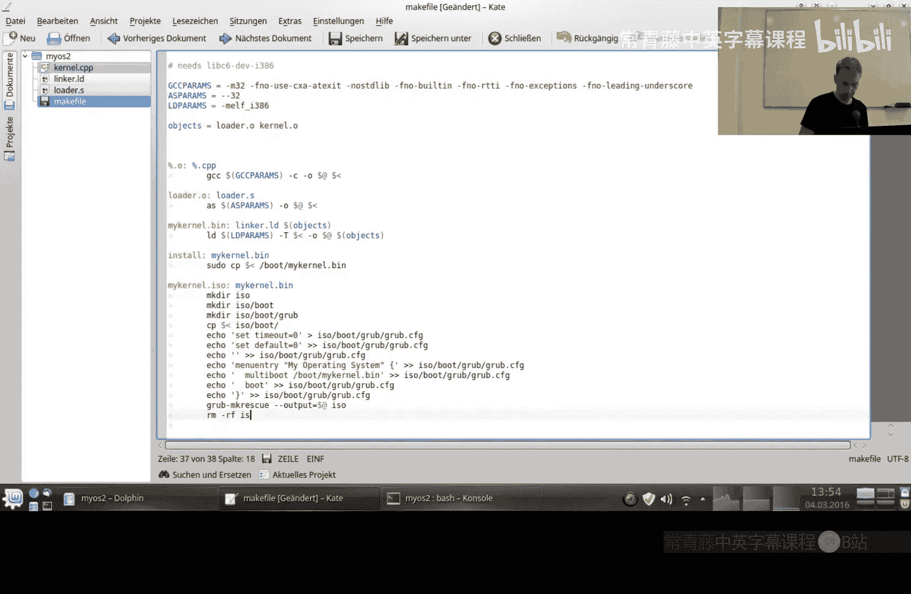

Okay。

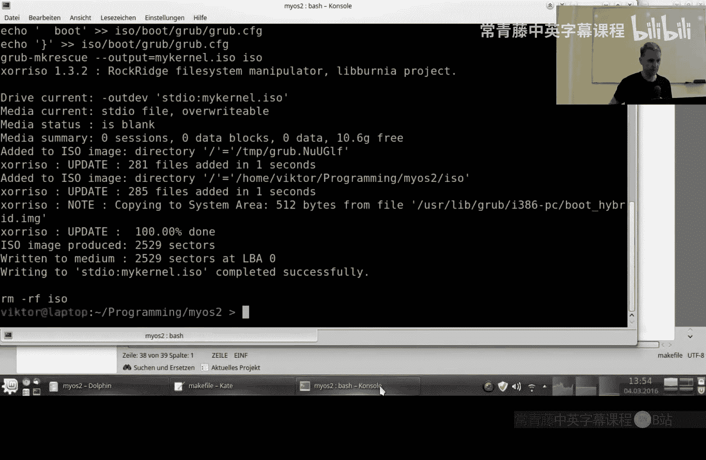

So now here we have my kernel at ISil。And now let's run this in virtual box。

So this is what retrobox looks like。I'll just create a new virtual machine。Well。

 it's neither a Windows nor a Linux or anything other here so。

IJust set this to as a operating system and unknown version。

I think 64 megaby of Ram should be sufficient。We don't need a hard drive right now。Okay。

 and now the operating systems virtual machine is finished。Now we can just start it。

 and virtual box will ask， well， what should I use as boot medium。And then， I just。Select。

This isoophil。And say， start。And there is our output。 So everything works as we wanted to。So。OurCl。

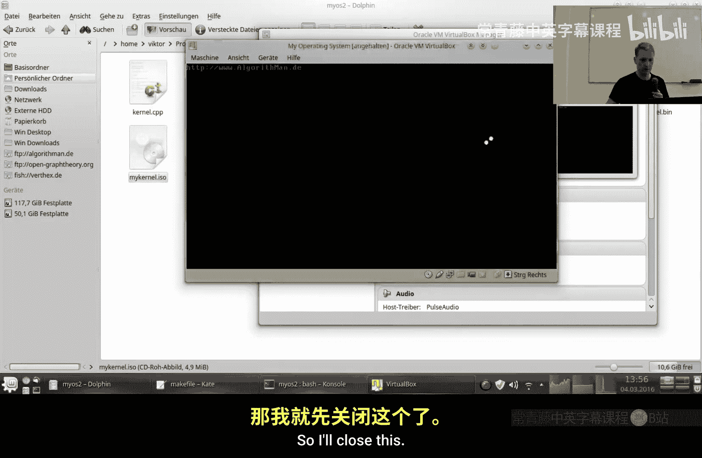

And。I will make another entry in the make file。Called run， which depends on。Mi可呢。That。あそう。

And this will just start virtualbox。And。Start this virtual machine that we've just created。

 Start the M。My看。As a background process， So that make。Doesn't run infinitely while the。

Where the virtual machine machine is running。

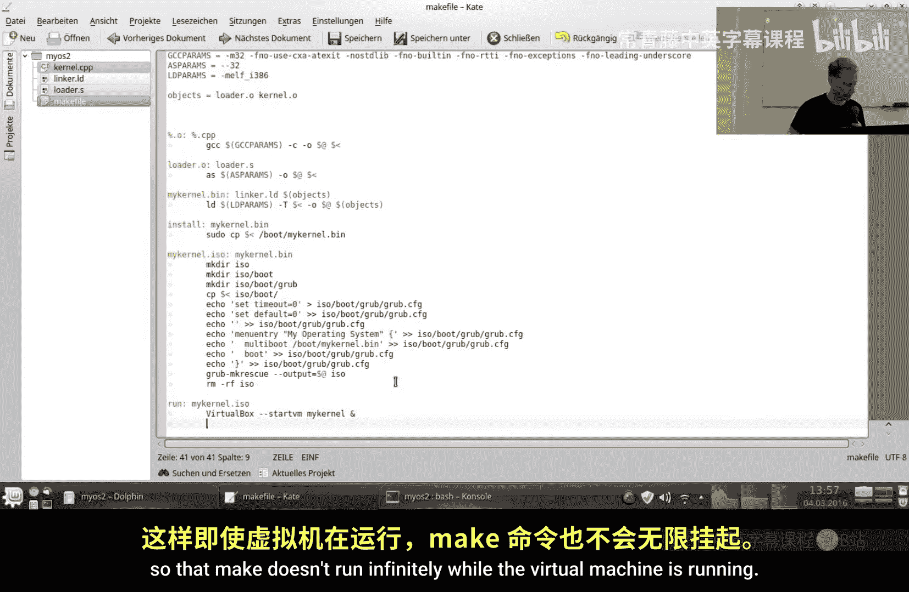

Okay， so。Let's say， make run。

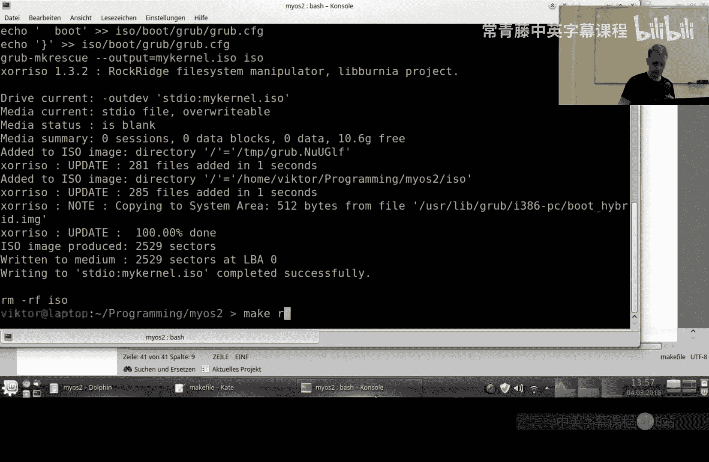

Oh， wait this。The operating system was named my。Operating。System。

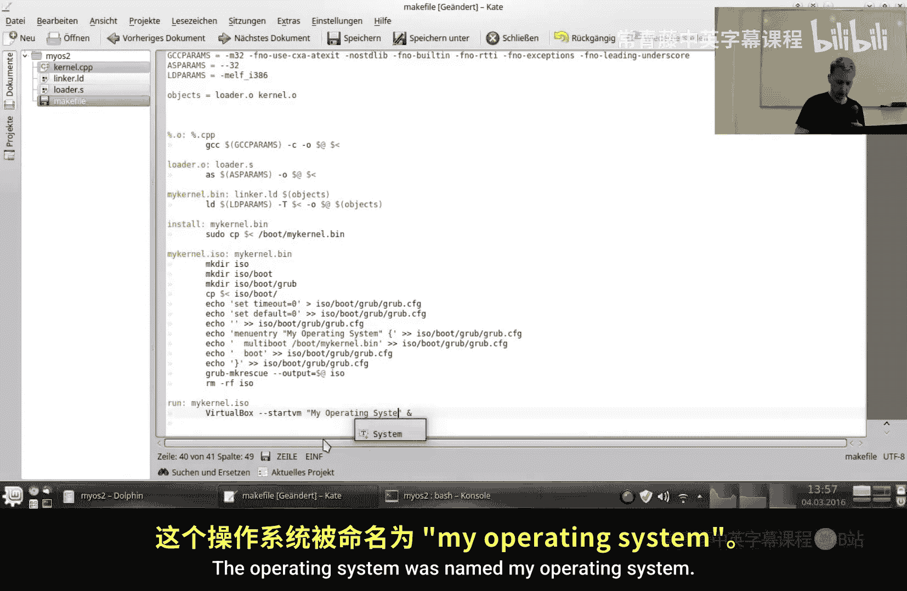

OK然后。Here it is。Okay，One problem we have now is if we try to run it again while it's still running。

 we get an error message。So。If the operating system is already running。

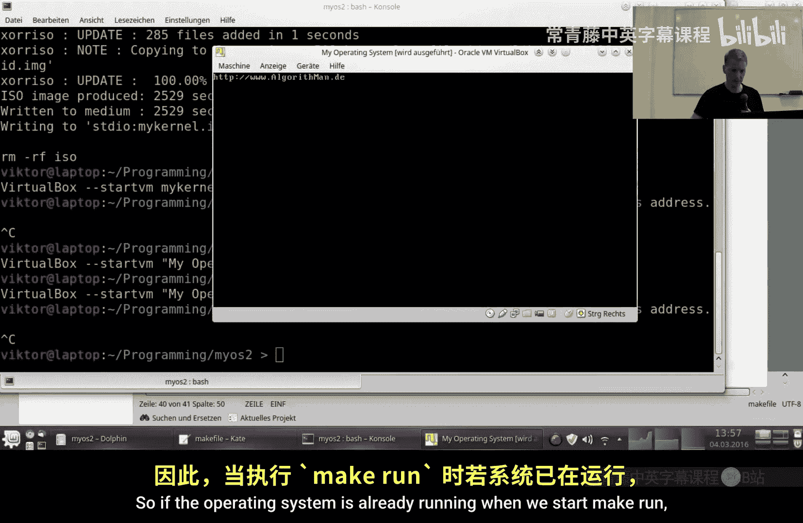

When we start make run， we should。We should force termination of the old version before starting a new one。

 So I'll say。好嘞。True books。嗯。Now， if no virtual box is running at this point。

 then Ki I will return an error message and then make will just not proceed starting a new one。

 so I just put our true here。It's a bit hackckish， but it works。😔，嗯。Now。

 another problem we have is kill all isn't fast enough， so。

When we say kill al virtual box and start a new one。

 then the new one will be started before everything is cleaned up from the old one， so。嗯。Yeah。

 we should just wait a little。So I'll just say sleep one。

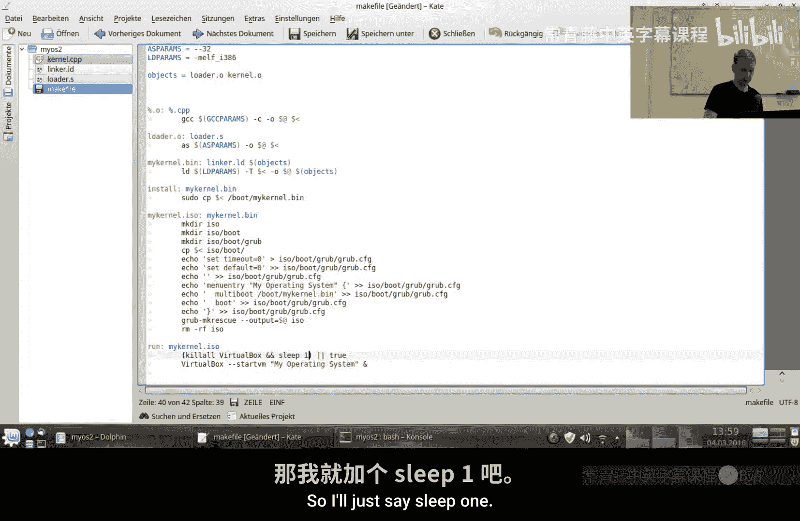

Okay， so now let's say that run。Here it is。And if I say may run again， the old one disappears。

 and here's a new one。Okay， so this is really handy to have this。

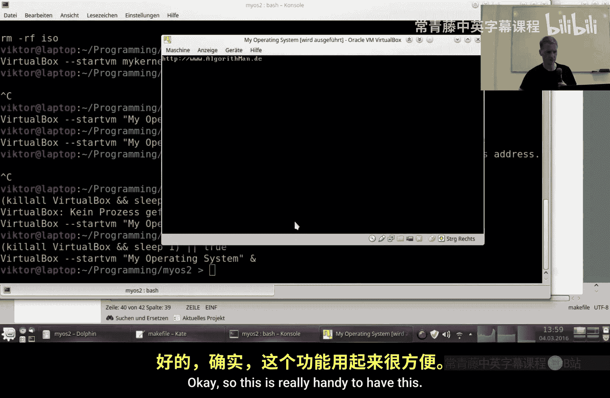

So you can just make changes and say， make run and。

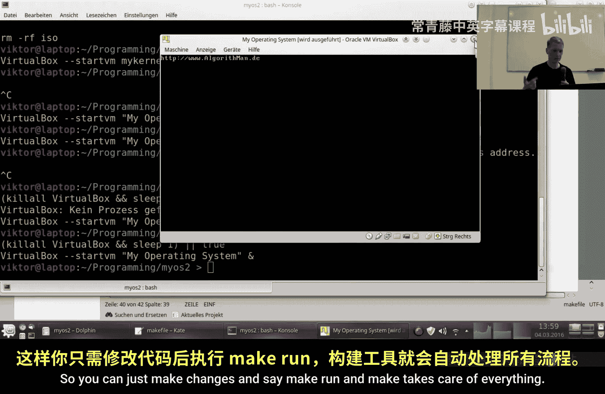

Make takes care of everything。So this works really beautifully。嗯。

Now in the next video， I want to talk about communicating with hardware。

And this is really a difficult thing。 And when you communicate with hardware。

 everything needs to be quite perfect I mean。I mean， let's say this is your Ram。

And say you have two different parts of your program。And maybe this one expects an int。

So and this one creates an in which it passes to the other one。Well， maybe it's a 16 bit end。

 So this is written here。And then this takes it from here and everything is fine， okay。Now， if。

 if we compiled both of these parts with the same compiler。

 we don't have to care if this is a 16 bit end or maybe。32 bit end or whatever。 in is in。

 and we are happy okay。But when we communicate with hardware， everything needs to be by perfect。

 We need to know exactly how many bytes are there and where are they， Where are they。

We need to be really precise。 Okay， so， for example。I had this。Here the。The multipro metric number。

This is an unsigned int at this point。And this works。

 But we are communicating with a part that is written in asler， and。

Well the as code is written so that it will always give us4 bytes。

And if we compile this kernel CPP now with something that with a compiler that thinks， well。

 un'm signedigned in is 8 by， then we will have a problem， okay。So。What we will。Do now。

 And this is really common practice is。We will create another file。Types that H。

With the usual protection。And now we will have just some type defs。嗯。So， we'll have。

A single character as。And。😔，8 T。So this is an eight bit integram。Uns trial is going to be in U in80。

Shortest in 16。I'm signed。Shart in。16。1 16。Inters into 32。Onite。Into as。32。And。long龙。Int is into 65。

Okay， so。So now we will just use these types all the time so that。

If we are running this on a compiler， which。Things differently which things， for example。

And int is 64。 Then we will just have to change this types dot H and everything else will just be fine。

 okay。So。In the kernel CPP。I'm just。Saying you and 32 T now。And this is an unsigned shot。

 It's U and 16。See now。

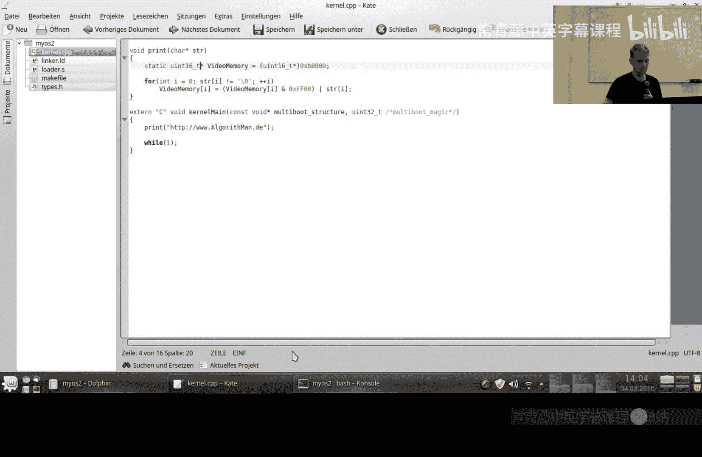

Okay。

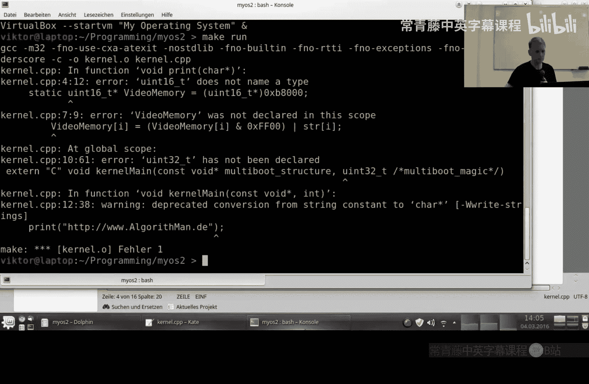

Okay， we should maybe include the file。

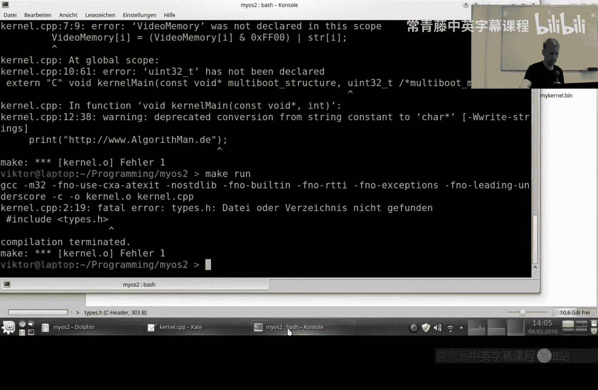

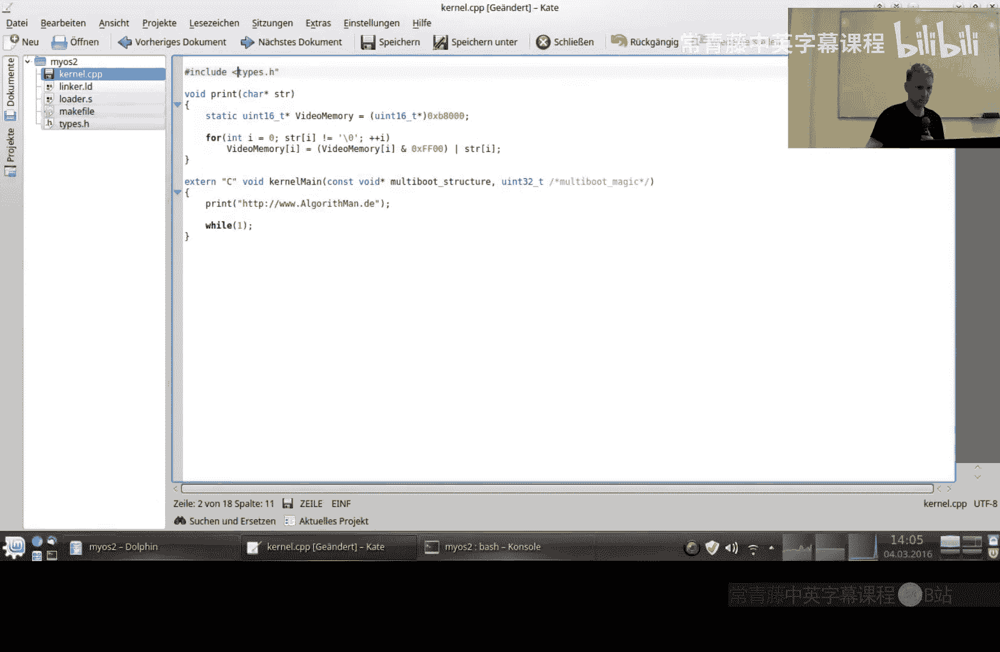

Okay， now everything runs again。So。

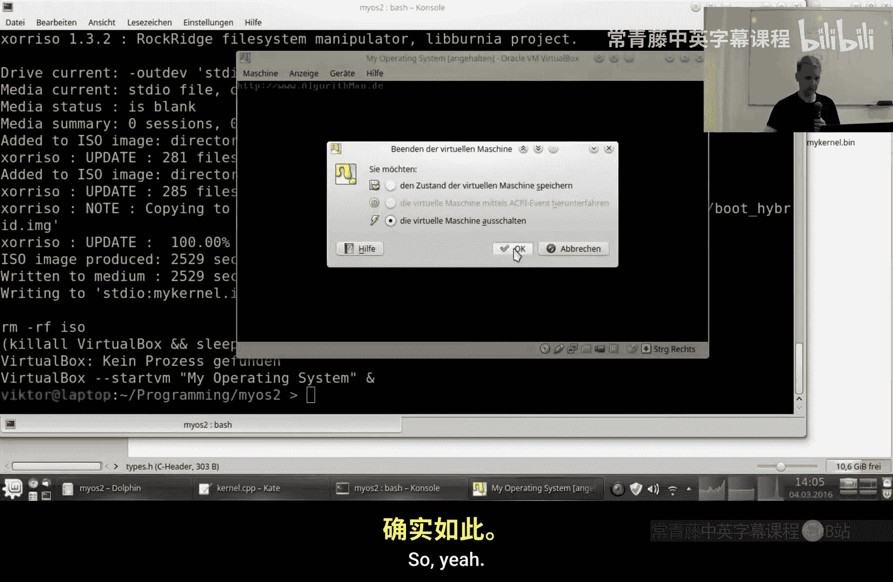

Yeah。This should be sufficient for now。And well， tune in next time。

Next time we will start talking about communicating with the hardware。 You know， for example。

 getting data from the keyboard。嗯。But let me tell you right now， this is not much fun。

 It's quite difficult because， yeah， you need to set up a lot of boring things in between so。

But once you have gotten that to work， everything after that becomes relatively easy。

 So once you can communicate with the keyboard， you can also very easily communicate with a mouse and。

Well， everything else follows from that。Okay， so see you next time。

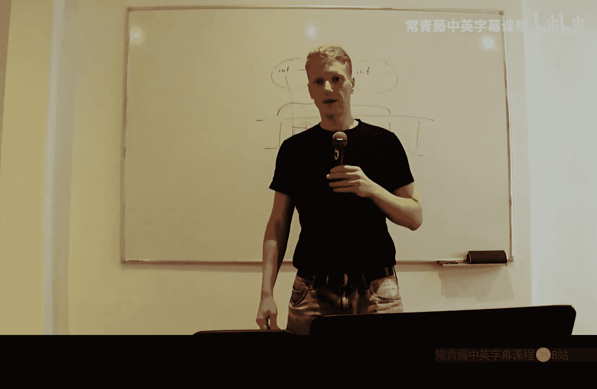