# WriteyourOperatingSystem【中英⚡编写你自己的操作系统｜Write your own Operating System】 p06 P6 Write your own Operating System 5： Interrupts -BV1BDBEByEBY_p6-

Hello and welcome back to the tutorial on writing your own operating system。In this fifth part。

 we will now really start talking to the hardware。嗯。So yeah， as I said in the last video。嗯。

If this is your keyboard and you press a key on the keyboard。

 then it will communicate with the programmable interrupt controller。Which is between you。

 between the keyboard and。The process on。And。Yeah， as I said before， when you start your computer。

 the p is set so that it will not pass this information through to the CPU。嗯。So。

We will have to talk to the p and tell it to give us this information。

But if we to it the p to give us this information。Yeah， if。

 if we don't set up the interrupt thescriptor table before。

Then it will give us this in in form of an interrupt， but without。This table an interrupt will just。

Create a general protection fault， and then。I don't know what happens。

 I guess your computer will probably restart or the virtual machine will probably just terminate or whatever。

 So so before we can tell the p to to give us this information。

 we first have to set up the interrupterscriptor table okay。So。

What goes in the interrupt descriptor table， Well， an entry in there。 Of course。

 it needs the information。What interrupt is this for。So嗯。An 8 bit integer。

So a U and8 T for the interrupt。That's the interrupt number。You know， when， when you press it。

The key on the keyboard， you will get an interrupt one。And also。

 the timer in the pick will give us an interrupt zero in a regular interval。So。Interrupt number。

Then we need an address in the Ramm where to jump to。You know， if there's a ceramic。

Then the code for the event handler for this interrupt is somewhere in the Ramm， so。

So we will have something like a void pointer to the handler。So the handflow。And some flags again。

And and of course， also the。The information So we will have flags and。嗯。Yeah。

 we talked about memory segments in the third video。 We also need a segment。

So this is going to tell the processor to switch to a certain segment before executing the handler。

So this is， for example， if the processor is currently executing code in the user space and the handler is in the kernel space then it needs to switch the segment to the kernel space and you also need the access rights。

Which is just a number from 0 to 3。3 is user space。0 is kernel space。

So these are the things that will go in this table。当。Yeah， and。Okay， now we we have one problem。

 this handleler here。嗯。I mean。In a C plus plus world or actually in any higher level language。

 you would actually want to get this interrupt number basically as a parameter of some function。

 right， So you would want to write something like void。Handle。

 interrupt and get the interrupt number as a parameter。Right， so this is actually what we want。嗯。

The problem here is。Yeah， the CPU cannot So， So to get this as a parameter。

 the CPU would have to push this number on a stack。And。Yeah。

 the CPU cannot make any assumptions about， is it safe to use the stack。 I mean。

 the stack might be set to something in the in the user space still， so。

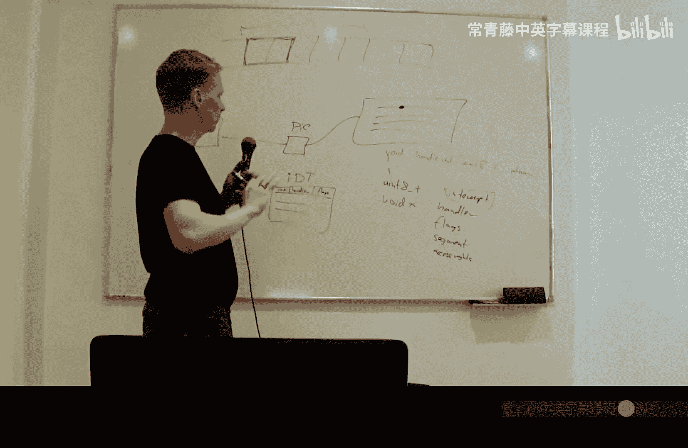

So it cannot push that to the stack。 So what it has to do instead。And it might seem stupid at first。

 but really， I don't think there is any alternative to this is you need different handlers。

 So different code for every single interrupt。 So here you would have one for。Interrupt 0。 here。

 You would have one for interrupt  one and so on。Right。So。And。And actually， how do you。

 how do you pass Well， how do you get this， these addresses to put into the。Into the table entries。

 right， so。As。I mean。This these interrupt10 plus。You know the。

The CPUU is really in an uncertain state when， when you start when you jump into there， so。

You should not really jump into a C plus plus function or anything because C plus plus the compiler might decide to put stuff there。

 which changes the registers and。This might really already screw up the code that you've been executing before。

So really we should write these handrs in asem。嗯。And then。Again， like we did before， you know。

 in the loader dot S， we would jump into the my kernel in the in the kernel main CPP。 you know。

 so we would jump from asmbler into C plus plus。And yeah， we really should do the same thing here。

 So we will write this。These handlers and actually we will automatically generate them with an assembar macro。

And they are basically， just pushing。Their number on the stack， and。And then jumping into such a。

Into such a C+ plus function。 And from there we can continue going back into the object oriented domain。

 right？So。Yeah， so。嗯。Let's start doing that。So maybe start with this asse code。

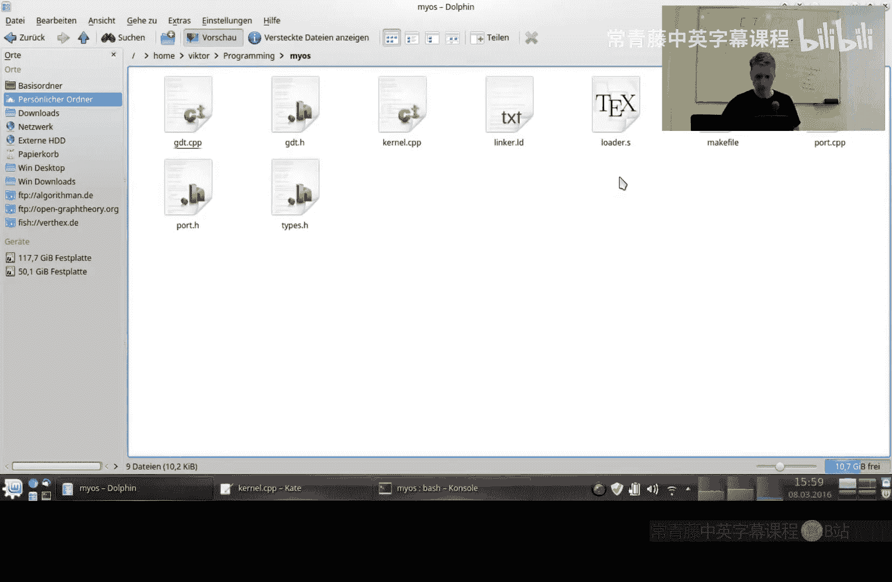

嗯。So， we'll have。Interrupt stop do S。

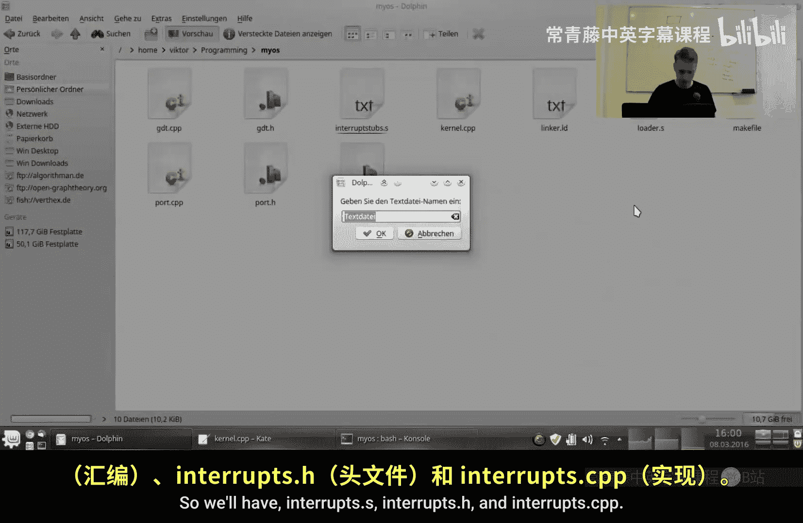

Interrupts that age。

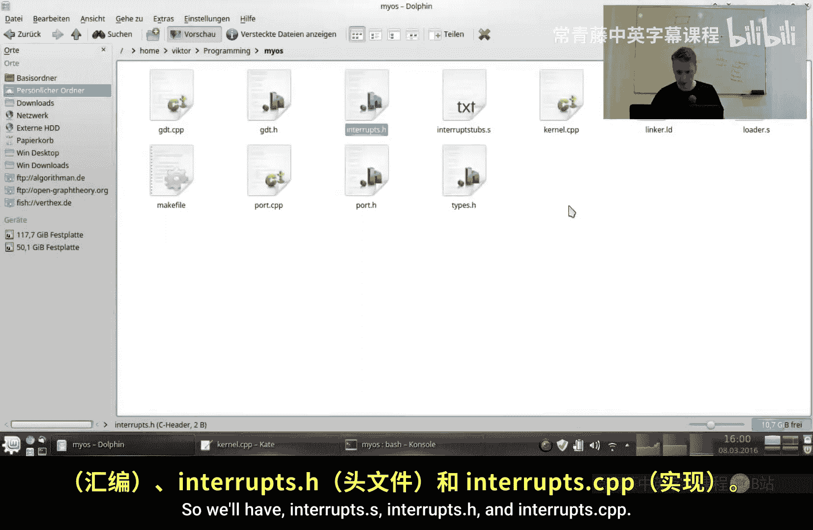

And。

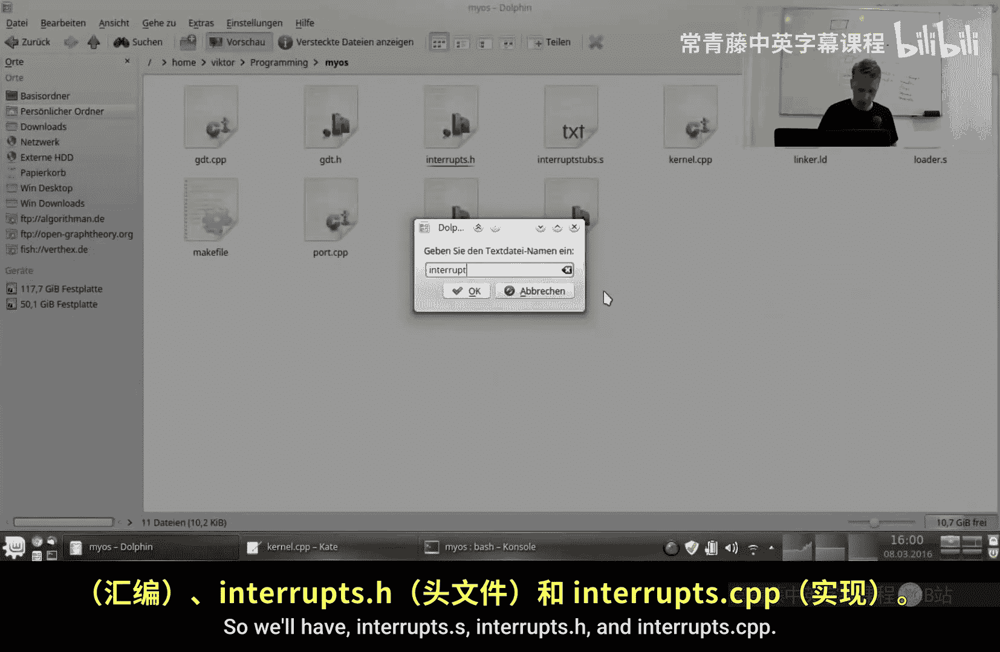

Interrupt that CPP。

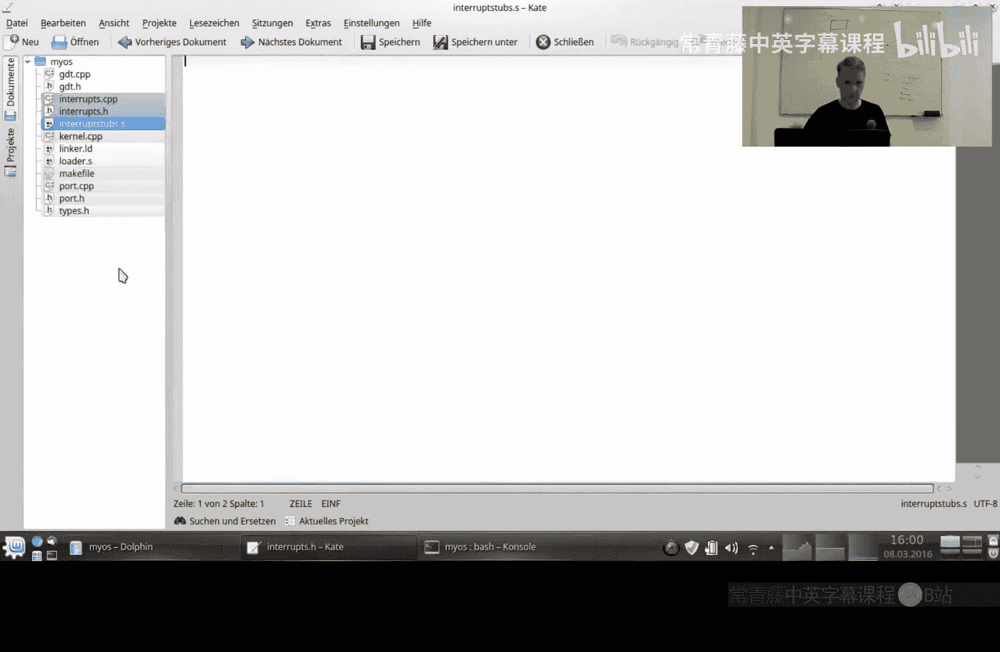

Okay， so this interrupt steps is mostly taken from the T project。

 I don't even know exactly how to pronounce it。

But I've。Translated it to new assembler from Nasm， so。Let's start here。Setction text。Now。

 we will have。Something。Maybe just have it start here。

So here we will have a class called Interop Manager。And this class will have。Public。

A static function。Actually， it's going to return and。32 bit inte。And it will get yellow。

The interrupt number。s8 bit integral。And。The the current stack pointer。 So the。

The assemblysemb code is going to give us a current stack pointer， and。Yeah， and。

In this interrupt CPP。It will base for now， it will just return the same。

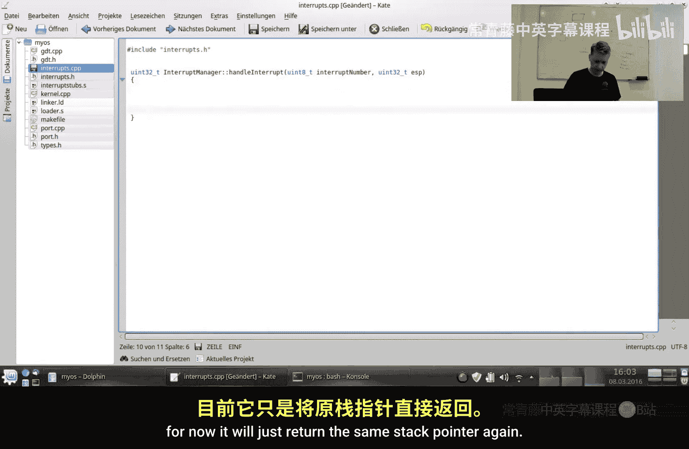

Stick pointer again， so。So this is really。So this is really there to。For tasks switching later。

 and also。There will be an a timer interrupt， which will give us a current point。

 or We will store that away， and then。Take the stack pointer of some other process and return that stack pointer so that the so that after they interrupt。

 the CPU is executing the code of the others of the other。呃。Process， okay。But for now， we will just。

Get the old stack pointer。 And since we don't have multiple processes， we， we will return it again。

嗯。And what I want to do here is。I'll make。The forward definition of print app。

So that here we can do something like。Print F interrupts。Okay。So。Now。

 if we compile this and maybe we just do this， actually。

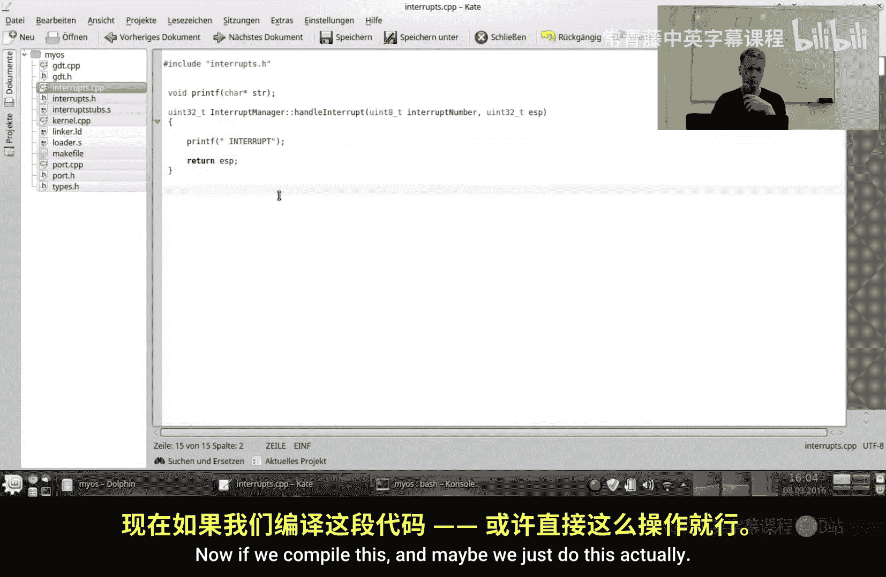

嗯。

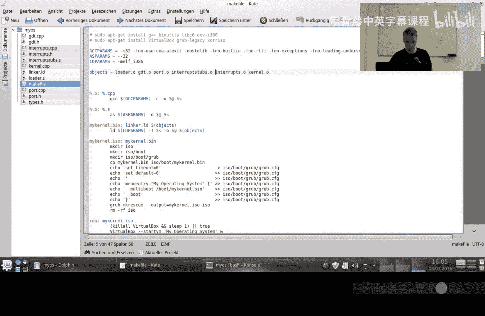

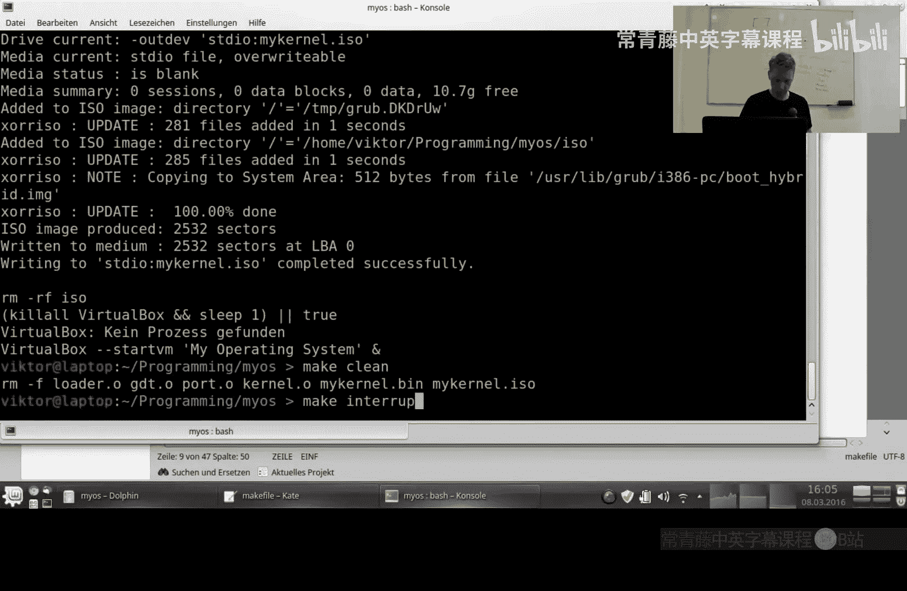

Okay， we need to include the types。And before I forget it， we also need to include the ports。

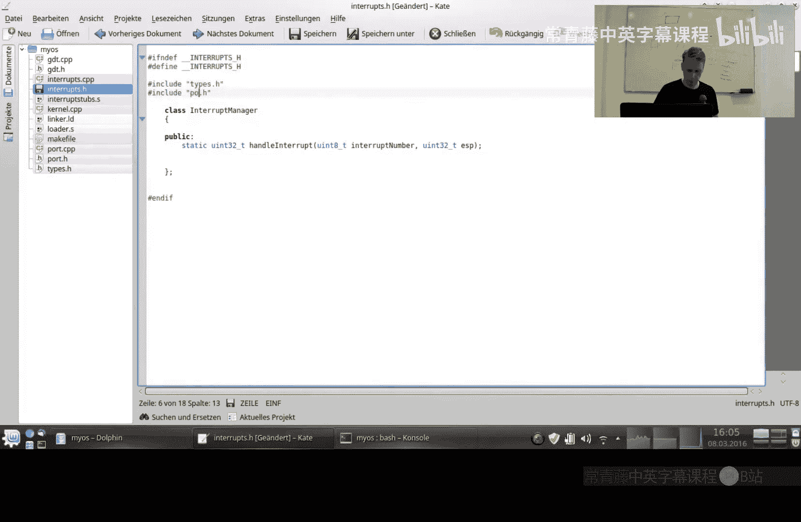

Okay。Okay， and now we'll look into the。Let's generate it。Object file。So。This is the name of the。

Of this handle interrupt。

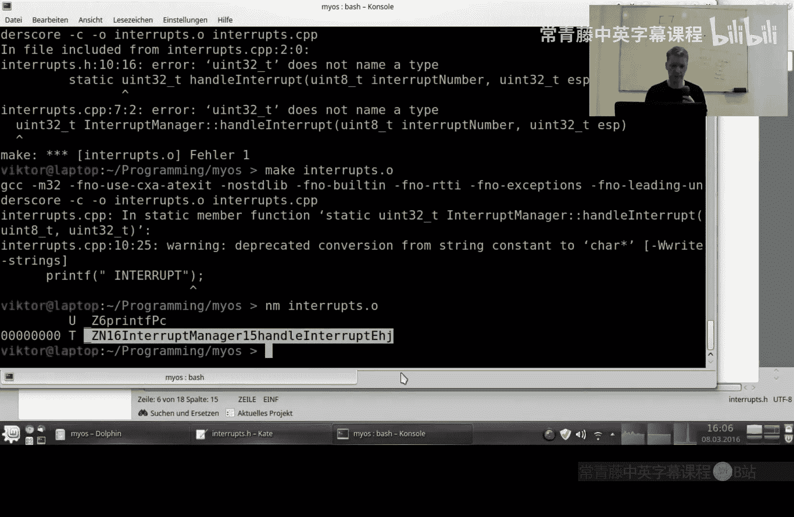

Stic method。 Okay， so this is what it is called to the outside。 I didn't want to name it。

Ex to make it X turn C， so。So yeah， we will just copy this。And in the interrupt steps。

Put this here so that now we can jump into that from this assembler file， okay。嗯。Okay。Now。

 inside this assmbler file。We will have this in bottom jump target。And this。Jump targets。

This basically。You are given this stack pointer， So push。EP。Push。The interrupt number。Then。

 call this。This method。Like this。And then after that， yeah， we would actually have to pop。

The old pointer and interrupt number like this。52。PSo， but we don't actually have to do this。

 So this would make it this would actually clean up this。Stuff from the stack pointer。

 But since we override the stack pointer immediately after that。With。With the result of， you know。

 the the return value from the function， we can just skip this so。So we do this instead。Okay， so。

This。Interboom would basically just jump into the this handle interrupt function。

It we need to also have。This interrupt number is。By it， which is initialized to0。

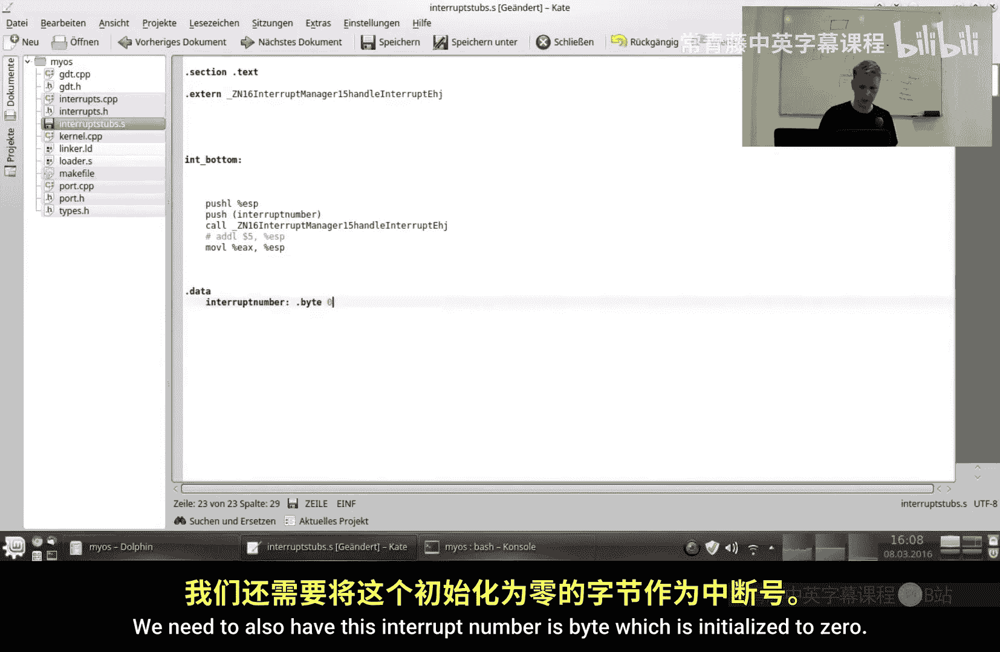

So。So this code will。Willll push these values on this stack and jump into this handle in。Now。

 as I've told you， we cannot simply do that because the contents of the registers might be important when we return from this。

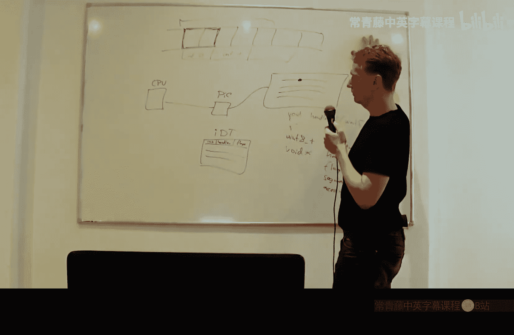

Event handle， so。So， before we can do this。We actually have to store away the the old values of the registers。

So， we have to。Push all the registers， and also push。嗯。The data segment。E。

Thinks this is a frame point。S okay？So we've thought this away now and。After we've。

After we come out of this again， yeah we。We need to restore the these values from the stack。 Okay。

 but in reverse order， of course， because it's a stack， so。So we take Gs first。Then。F， S。Then。E， S。

Then。D， S， and then。Are the other richers。Like this。Okay。嗯。And at the end of this， we need to。

We need to tell the process。 okay， we are finished handling the interrupt so you can return to。

To what you were doing before， or if we have switched the the stack， then it will jump， It will work。

On the different process after that。So what we haven't done yet is we we haven't set the interrupt number to anything。

Yet， so。And and we don't actually have different。Different jump labels for different interrupts yet。

 right， so。So for this， I'm going to write a little macro。嗯。And。Interrupt we。Request。

With one parameter。So， this is going to。诶。To publish to the outside， this jump label。Call it。

It's very similar to this one。So， interrupt manager。And interrupt。Request。Followed by this number。

But we get as a parameter。嗯。Interrupt requests。😔，This needs to become a 26。

 Now it's just the C plus plus syntax。呃。And it has no parameters。Like this。 Okay， so this is。

The name。 So， So in the。Interrupts that age。 we will have。Static。Vys。And。Interrupt request。

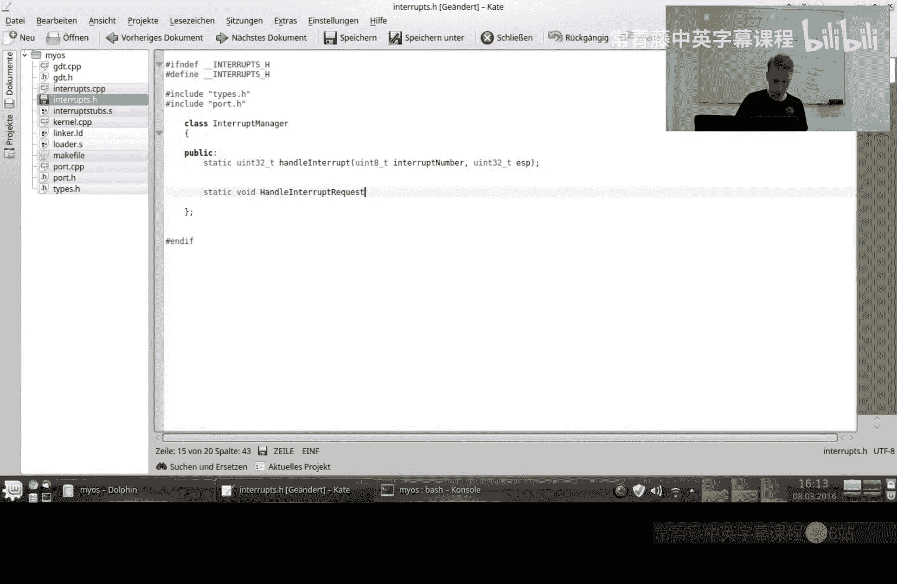

You know， like this and。呃。

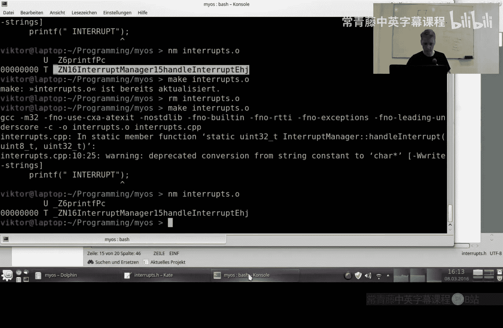

看下啥子么。😔，Let。😔，Our handle interrupt request0 x。Zero1， for example。This is going to be for the。

For the keyboard and 0，0 is going to be the timer interrupt。And in this interrupt steps。

 we will call this macro。With the parameter 0 x 0，0， and。Also， with 0， x 0。One， okay。So。

 so this really creates the implementation。Of these two。Forward declared functions， okay。So。

What do they do？Yeah， they basically just move this。OfThis number。Into this。Into this。

Variable and then jump to in bottom。Okay。Then， top。And not for。Okay， this is， but this isn't。

All this is for exceptions。嗯。So， this is hand。For accessoriesories and。ForExs， this must be a 19。

Okay， and。Yeah， they interrupt。Qusest。Will add to the number。 Also， the content of。

Of a compiler variable， IRQ base。Which we set to。嗯。2，32，0， x 20。Okay。Okay。Yes。So this looks good now。

 And， of course， for more interrupts， you would just copy this。Several times， okay。So。

So now that this。I think this should。Complete。These interrupt。Right。Jump targets。So now we need to。

 to construct the。Interrupt descriptor table。And。Yeah， the， the entries are called gate descriptors。

 so。So we will have a nested class again。Thestruct， in this case。

And this needs to be quite perfect again， so we give this attribute。Ped again。Okay。What goes in here？

You and 16。T。T。Yeah， this is again， like the entries in the global descriptor table so。

We have the address of the handler， and this is against split。So。Alet。Address。Low bits。Then we have。

The offset of the global descriptor table。For the code segment。One reserved by。Then。Comes。

The excess rides。And the hybrids of the handler address。Okay。Then。😔，For this structure。

 we will create an array with 256 entries。Seed。😔，G it this。Okay。Then， we will。

Have a constructor for this interrupt manager class。Which。

This will get a pointer to the global descriptor table， so。We will also have。

To include GDPDT dot age。So， it will get global。And of the structure。行ます。And it will also get。

A static。Function。Which sets the entries in the Intererscriptor table。Okay， again， what's。

What are the parameters for this well。2 and8。The interrupt number， of course。嗯。Yeah。

 basically just those things。For this that are in this structure， so。嗯后。😔，Ofet， yeah， then the。

A pointer to。To the handler。I need you and。知。😔，Ch。So basically， the access right and。ど。T for。

 basically is a flex。Okay。And we meet。Another function here。You can write interrupt request。😔。

Like this。O。What was all this。We need to set。So we need to implement these three methods， and also。

Inuiate this table， right， because it's a static。Meumbers。Okay。So。So in the construct， we were。

We will first set all the entries to this interrupt ignore method。 Okay， so。

Every interrupt that we don't set explicitly just should be ignored。 Okay， because if it isn't。

 then we get a problem。 So if。If we get an interrupt and we don't have a handr for it。

 we get a global protection fault and the。The operating system crashes， okay？So。Okay。So， here's a。T。

Then how do we set these entries。So， the。TheHler address。Ppis。I isn't surprising。

 we just take the low bits of the handleler address。LikeThis。Then the hybrids。Almost the same。

We done 60 bits first， okay？The code segment select is just copied from the parameter。嗯。The reserved。

But it is just。Always zero。Now we only need to set。The access rights。嗯。So， here we。

We combine this constant with。So descriptor type。From the parameter， and also。

With the privilege level。But this is shifted by 5。 And we only need the last two bits of this。

 You know， this is a number between。0 and 3。 So。We can do it like this。Okay， so this is to set。

An entry in the table。Its how the。The， the constructor of the interrupt manager will basically set these entries。

 so。This was called like that， wasn't it？😔，Yes。But this should be a U 16。Okay。嗯。Okay。

 and now we will just set these entries in a loop。So for the earth。Entry。嗯。

We takes a code segment from the global descriptor table。The address of the interrupt nu function。

Privi level 0， So kernel space。 and the type is an interrupt gate。O。Now。

 we have initialized everything with something same。 and then。We can create two explicit。Entries。爽。😔。

0 x 20 and 0， x 20。21， you know， we are。嗯。We are creating these。Hand us with0 x 0，0 and 0 x 01。

But we will get this number。Increased by this0 x 20。 Okay， so that's。What I'm doing here。So。

Cat sign segment。And interrupt。Cestt。0 x 0，0。So if we get an interrupt 20。

 let's say if we get an interrupt 21 or 0 x 21， etcter。Interrupt 3 through then。

We will jump into this handle， interrupt request 01。嗯。So this one， which is a copy of this。

Which will give us。This。0 x 20 plus this0 x 01。 So we will get a 0 x 21。Pushed。

When we jump into this。Handle interrupt function。Okay。So this sets the。

The interrupt descriptor table。 And now we need to tell the processor to use this so。What I'll do is。

Here， I will have another nested。Structure。Interrupt the script at David。Poト。Again。

 with attribute packed with a U end。32 T。This， which is the address of the table。And。

U and 16 T for the size。Okay。So after I've created the table， I can now。嗯。

Tell the processor to use it， so。Interrupt the scriptplet table。The size of the table is 265。

Because we have 200。56 entries。Times the size of a gate descriptor。And -1。So， this is a pointer to。

To this table， right。Chris。And then we need to tell the processor， too。

Load the interrupterscriptor table。zero。

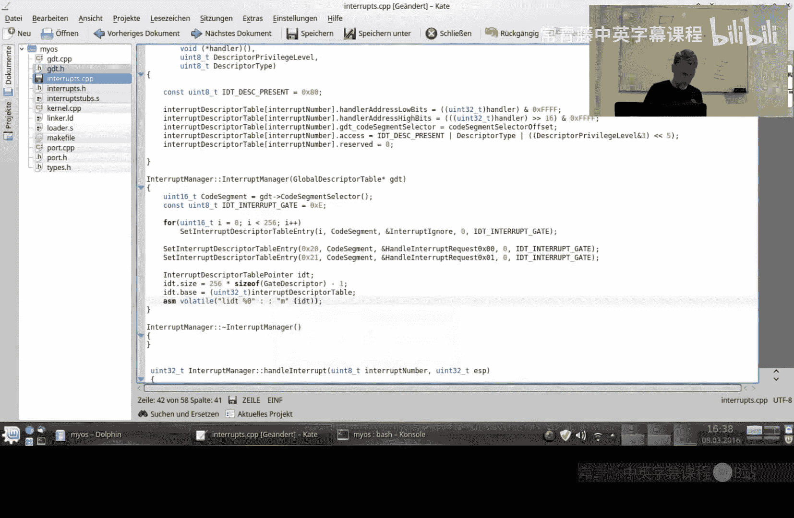

Like this。Okay， so。

So what we have done now is we have created the table。And we have told the CPU。To use this。

What we haven't told the CPU yet is to actually start sending these interrupts。So。

What we need to do next。His。We have another method here。And here we basically just say， asm。

Start interrupts。And the reason why this is in a different method is because in the kernel。

We will have the。Interrupt the scriptor table。Or an interruptop miniature。W。

Its the global descriptor table as parameter。So the reason why we have this as a separate method is because we will first instantate the table。

Then we will instantuate all the hardware and activate the hardware。

 and after that we will activate the interrupt。So when we instantate the hardware。

 we already need to have the interrupt descriptor tables so that the hardware can。Yet， so， so I can。

Tell the interrupt manager， hey， I want to handle interrupt 20 or whatever。嗯。Okay， so。

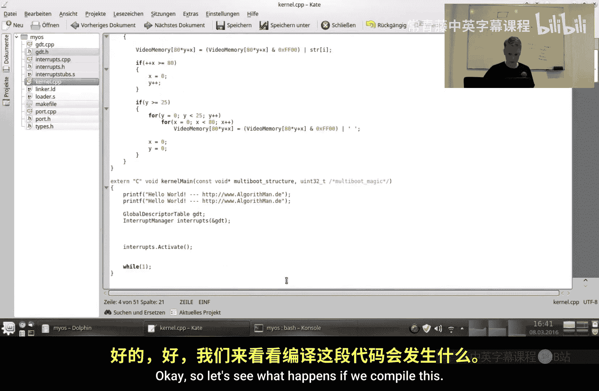

Let's see what happens， if we。Compils。

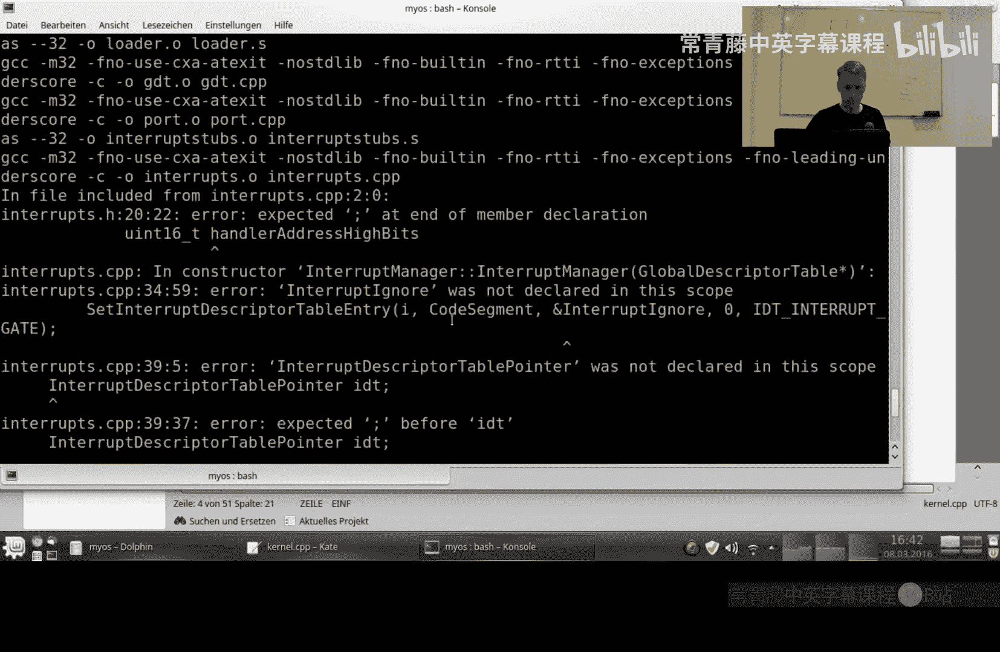

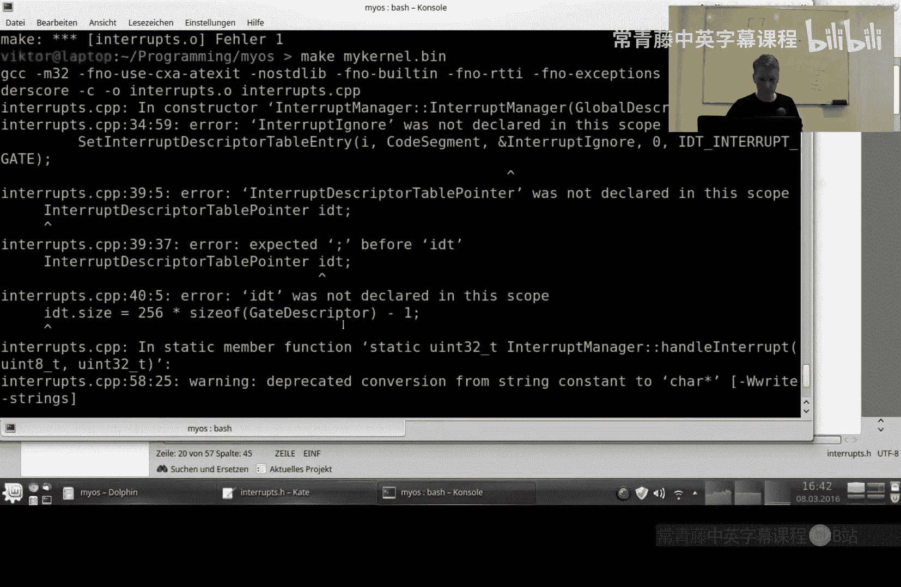

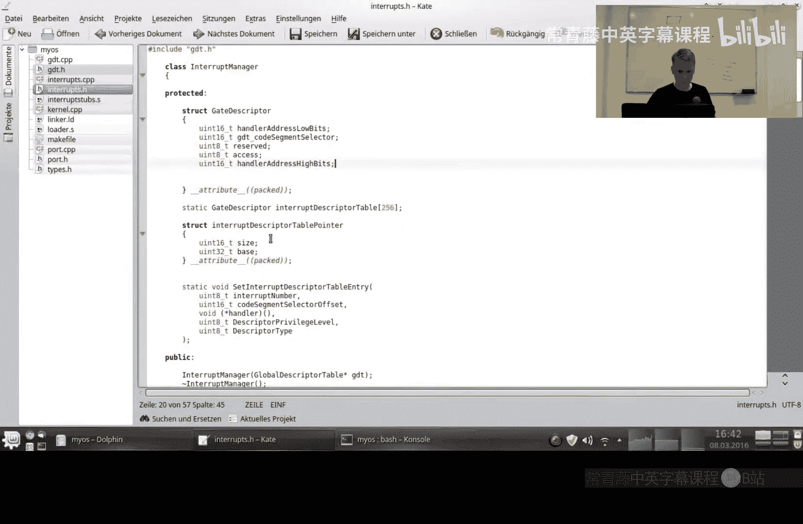

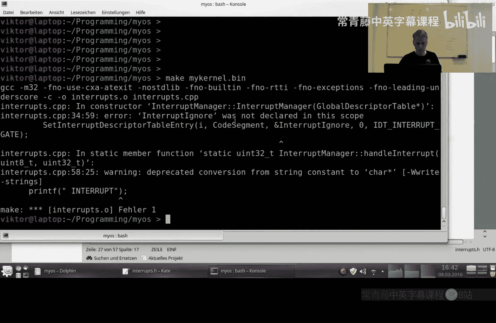

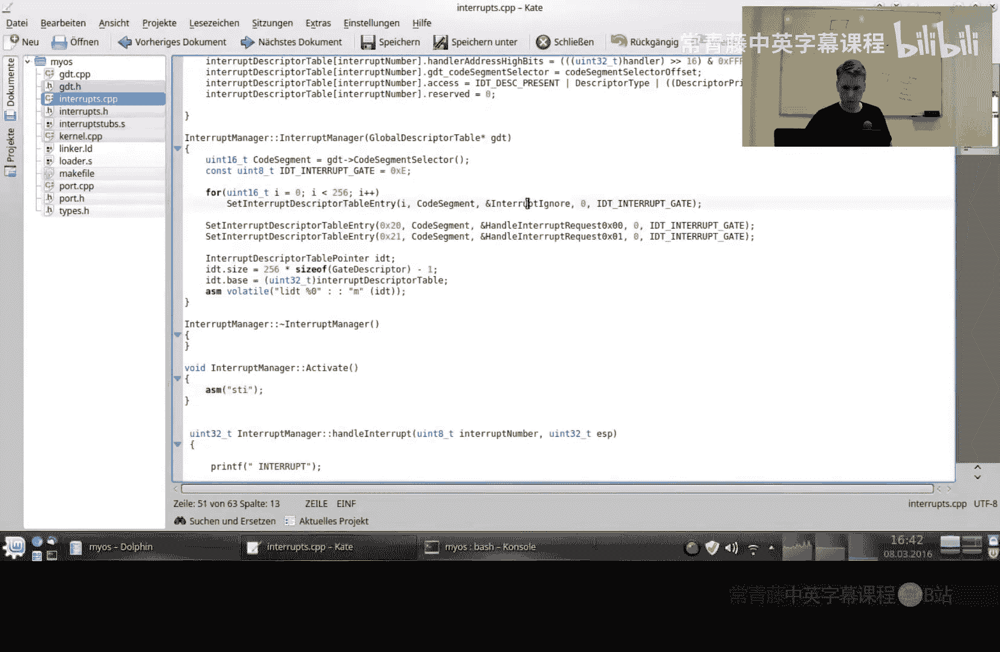

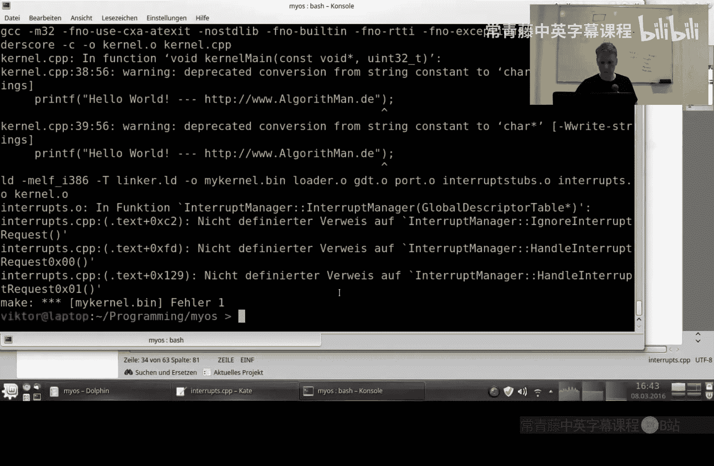

Okay， this kind of works， but。嗯。Doesn't accept。嗯。These functions that we've created in asemler。Okay。

 of course， we just declared。嗯。It was a jump target， but we didn't actually put it there， okay。O。😔。

Has the wrong case， it should be upper case here。Okay， the only thing in left is。The can。

Interrupt request。嗯。Okay， then without the4 bys there， there should be 22。Okay。

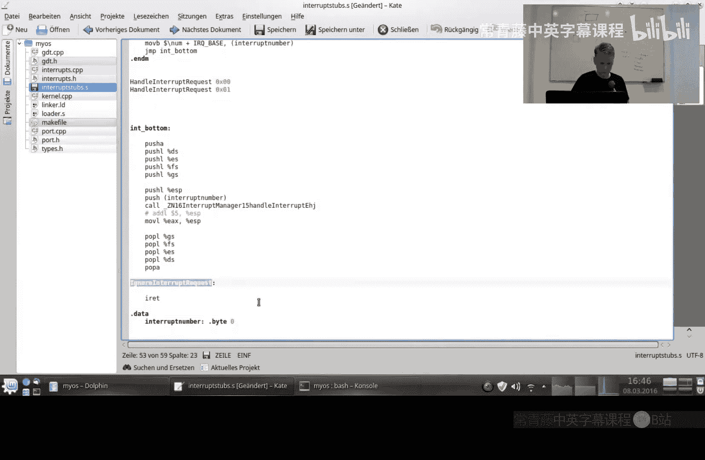

Let's see。Yes， no it worked。😔，Okay， so now we have。The interrupterscriptor table。

 we are telling the CPU to use it。嗯。So。

So at this point， we have the table。 The CPU knows that the table is there。

 but we haven't told the p。To send interrupts yet。 Okay， so this is really the last step we need。

 We need to tell the p。 Give us the interrupts， because everything is set up now。

 we are now ready to get these interrupts， okay。So how do we do that？😔，So in the interrupt manager。

 we already have support。So the first thing we need。嗯。

Is the parts for the communication with the peak， so。Partt 8 bit。Slow。One thing by the way。

 that I haven't mentioned yet is we don't actually have only one p， we have two different ps。

So the master pick and the slave pick。お。And a slave pick。

And we need to communicate with both of them。So we have one port for commands， one port for data。

A slave port for commands and a slave port for data。O。嗯。No。When we instantiate the interrupt manager。

Then， we first need to。Inscentuate these parts。嗯。The master command port is 0 x 20。

 The port number 0 x 20。嗯。Pick。Master data。They support 0 x 21。嗯。The slave commands on a0。😔。

And slave data is。A1。Slave data， slave command。O。嗯。Now， before we。Tell the processor to。啊。

To use this interrupt descriptor table， we communicate with。With these picks。还是一号。11，0， X 11。So。

 here we tell so。So as I've told you。If you press a keyboard， a key on the keyboard。

 you will get an interrupt one。The problem is that the CPU users interrupt one internally for exceptions also。

 So what we are doing now is basically， we are telling the。The master pick， if you get any interrupt。

 just add 0 x 20 to it。And the slave pick is told to add 0 x28 to it。Okay。

 so because both of these of these picks。Have8。Interrupts that they can use， so。

This is 20 to 27 and then this is 28 to。啊。30。In H。Okay。And then， this is some。好。Initialization。

 I think this。Tells the master。 you are the master。 This tells the slave you are a slave， I think。嗯。

Okay。可O。あ。Let's see， so。

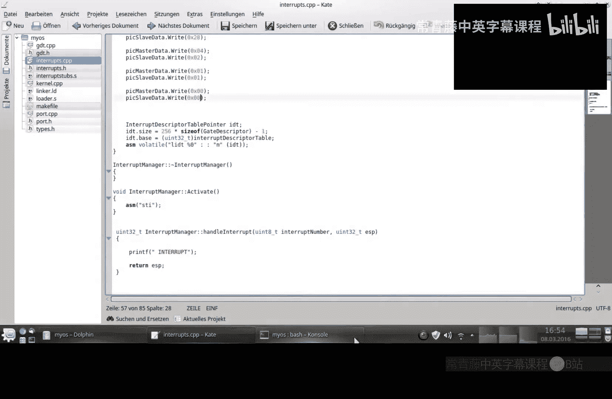

What happens if we run this？😔，第二。We are getting an interrupt。 We are getting an interrupt。

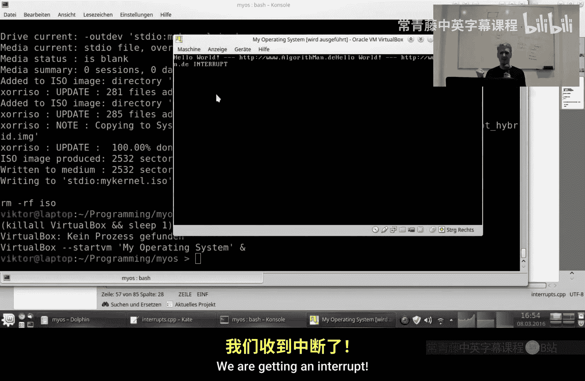

Did you realize what that means。That means that we just have received the first actual response from the hardware。

So。As you can see， we only get one interrupt right now。

 but actually the time I interrupt should give us more interrupt。And the reason for this。

 why we only get one right now is because we haven't told the p。Yeah， thank you for the interrupt。

 I have finished。Working with this， I Im so so the handling of this inter is finished。 Okay。

 so we also need to do that， but we'll do that in the next video。 Okay。

 so we have really spent enough time today。So。Tune in next time when we will answer these interrupts and then then we will actually communicate with the keyboard and get actual key strikes from there。

 Okay， so tune in next time and subscribe so that you don't miss the next video。 See you next time。

