# 编写你自己的操作系统：P9：整理项目结构 📁

在本节课中，我们将学习如何整理操作系统的项目结构。我们将创建清晰的目录，将源代码、头文件和目标文件分别存放，并使用命名空间来组织代码。这能让项目随着规模增长而保持整洁，避免混乱。

上一节我们介绍了中断处理程序的实现，本节中我们来看看如何优化项目的组织结构。

## 创建目录结构

首先，我们需要创建三个主要目录来存放不同类型的文件。

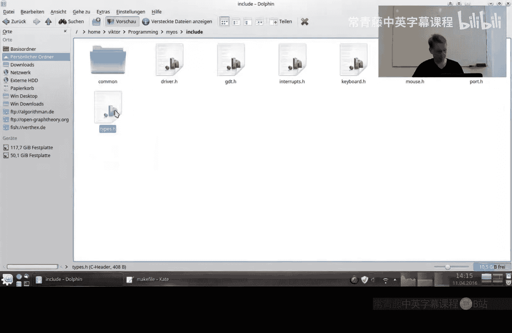

以下是需要创建的目录及其用途：
*   **`source`**：用于存放所有的 `.cpp` 源代码文件。
*   **`include`**：用于存放所有的 `.h` 头文件。
*   **`object`**：用于存放编译过程中生成的 `.o` 目标文件。

此外，在 `include` 目录下，我们还将创建更细分的子目录来对应不同的功能模块。

以下是 `include` 目录下的子目录规划：
*   **`common`**：存放通用类型定义和基础工具。例如，`types.h` 文件将放在这里。未来也可以存放类似标准库中的 `iostream`、`vector`、`map` 等通用组件。
*   **`drivers`**：存放设备驱动相关的类。例如，驱动基类、键盘驱动和鼠标驱动。
*   **`hardwarecommunication`**：存放底层硬件通信相关的代码。这类似于网络架构中的底层协议，负责与硬件进行原始数据层面的交互。

这种分层结构（`hardwarecommunication` -> `drivers`）类似于网络模型，底层负责原始通信，上层驱动则解释设备使用的“语言”。

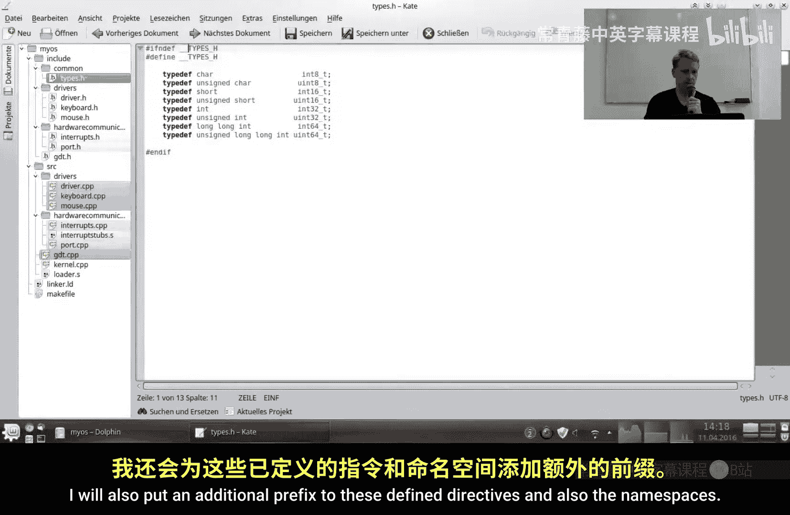

## 移动文件并修改代码

创建好目录后，我们需要将现有的文件移动到对应的位置，并更新代码以反映新的结构。

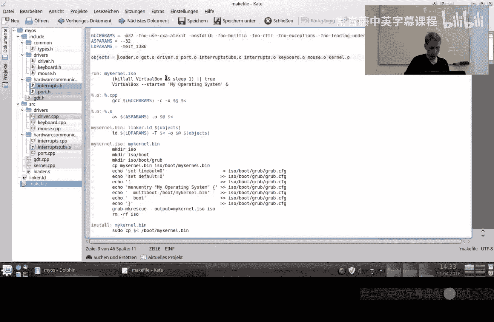

主要修改包括以下三个方面：
1.  **移动文件**：将所有 `.cpp` 文件移至 `source` 目录，将所有 `.h` 文件根据其功能移至 `include` 下的相应子目录。
2.  **更新包含指令**：在头文件中，将 `#ifndef` 等条件编译指令的宏名称加上目录名前缀，以避免命名冲突。例如，`types.h` 中的宏可能从 `TYPES_H` 改为 `COMMON_TYPES_H`。
3.  **添加命名空间**：为类添加对应的命名空间，命名空间名称通常与所在目录名一致。例如，`hardwarecommunication` 目录下的类将放入 `myos::hardwarecommunication` 命名空间。

完成文件移动和代码修改后，需要在文本编辑器中重新加载整个项目。

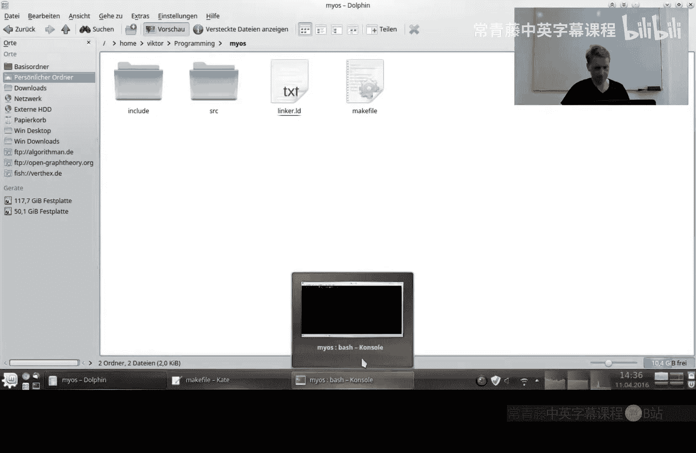

## 更新 Makefile

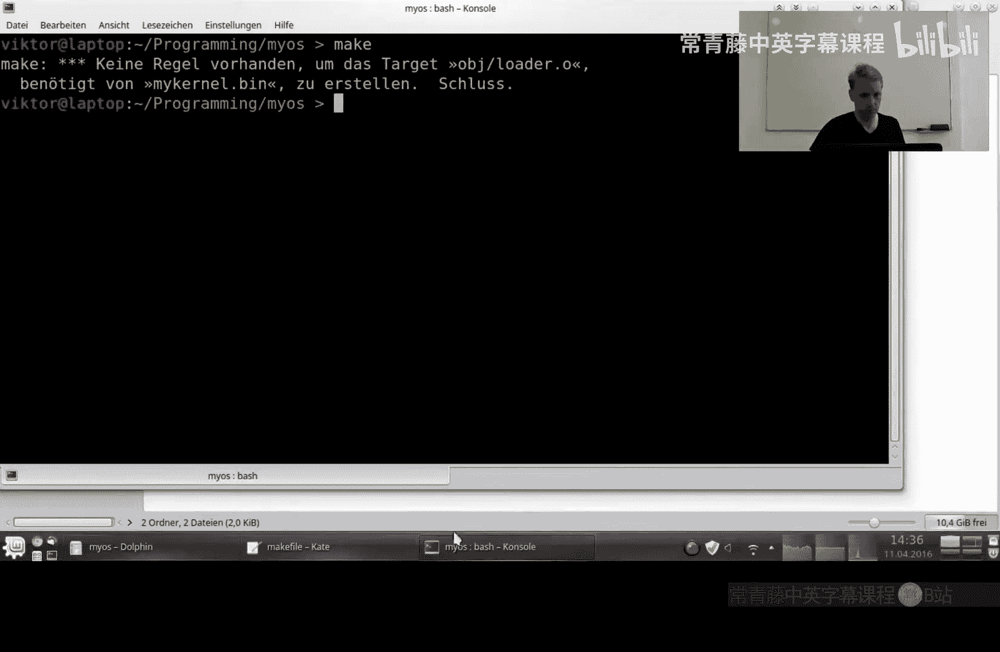

由于文件位置发生了变化，我们必须更新 Makefile 来适应新的目录结构。

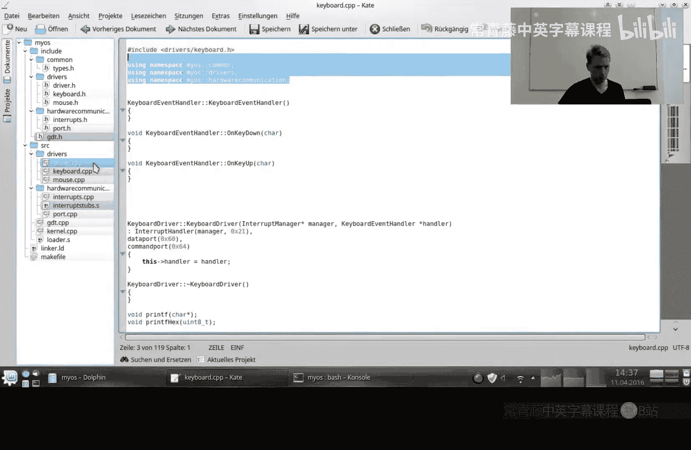

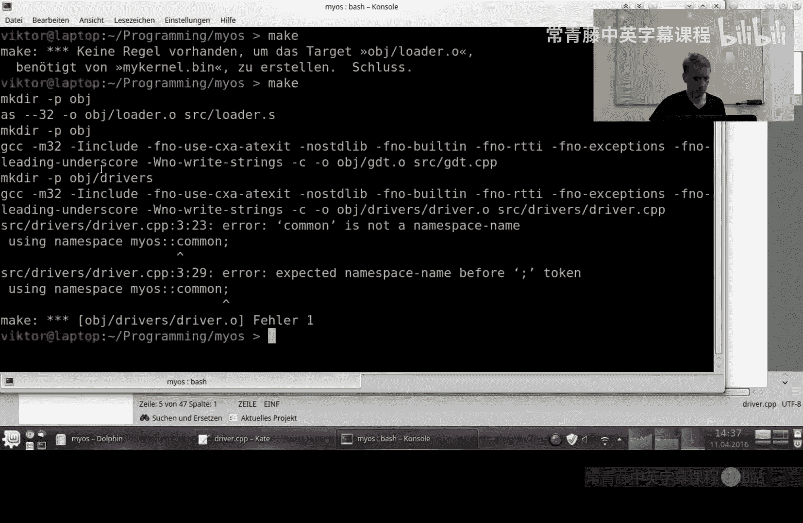

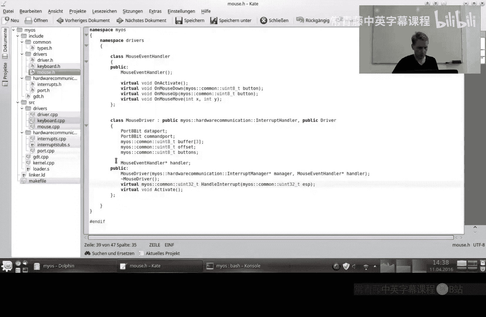

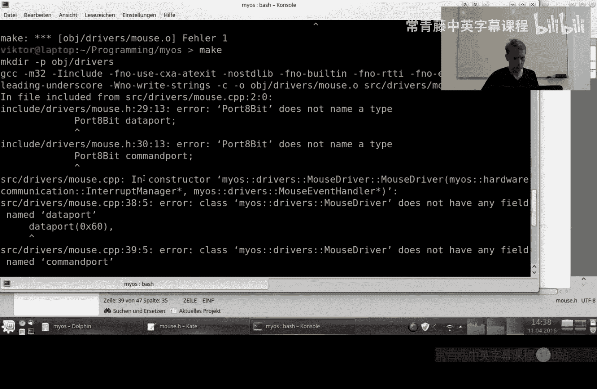

以下是需要修改的 Makefile 关键部分：
*   **目标文件路径**：将目标文件的输出路径从当前目录改为 `object` 目录。例如，规则可能从 `kernel.o: kernel.cpp` 改为 `object/kernel.o: source/kernel.cpp`。
*   **创建目录**：在编译规则前，添加创建 `object` 目录的指令，确保目录存在。可以使用 `mkdir -p object` 命令。
*   **清理命令**：更新 `clean` 规则，改为直接删除整个 `object` 目录，而不是逐个删除 `.o` 文件。命令为 `rm -rf object`。
*   **包含路径**：在编译指令中添加 `-I include` 选项，告诉编译器在 `include` 目录中查找头文件。这也解释了为什么我们需要将头文件中的 `#include “…”` 改为 `#include <…>` 形式，以使用系统/指定的包含路径。

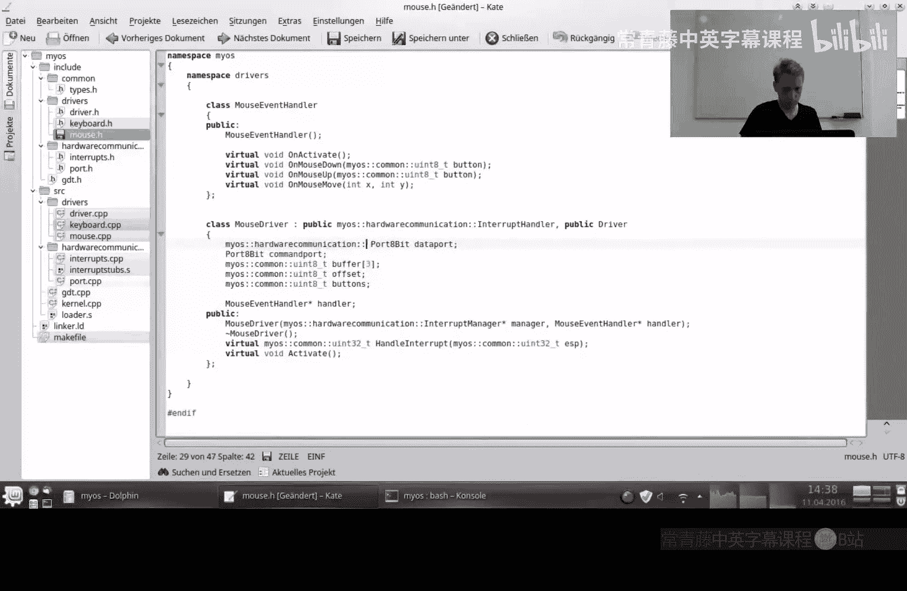

## 修复链接器错误

完成上述修改并尝试编译后，链接器可能会报错，提示某些中断处理函数（如 `handleInterrupt`）找不到。

这是因为我们为类添加了命名空间，导致编译器生成的内部函数名（mangled name）发生了变化。在汇编文件（如 `interruptstubs.s`）中，我们通过硬编码的函数名来调用这些 C++ 方法。

我们需要根据新的命名空间结构，更新汇编代码中的函数名。C++ 编译器生成的内部名称遵循特定格式：以 `_Z` 开头，然后是表示名称长度的数字和名称本身，最后是参数信息。

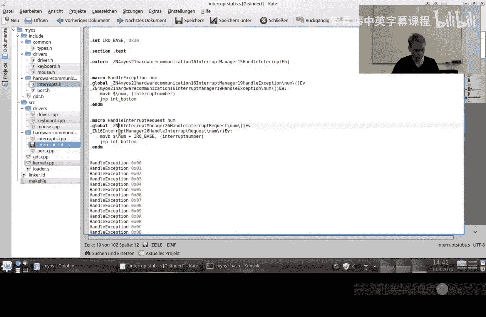

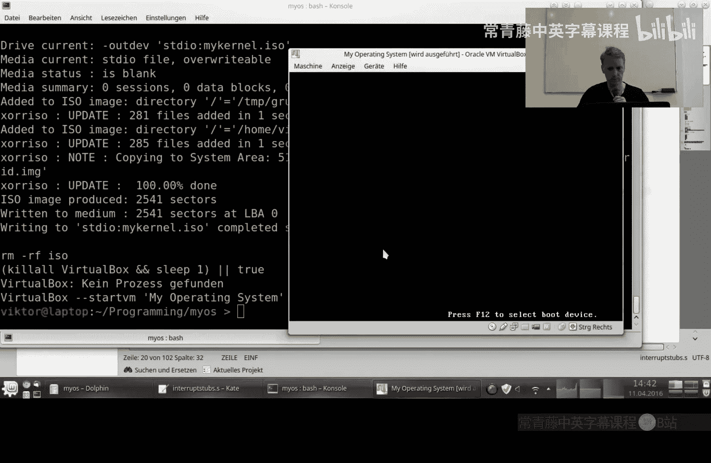

例如，对于 `myos::hardwarecommunication::InterruptManager` 类中的方法，其名称长度需要相应计算并更新。修改正确后，重新编译链接即可成功。

## 成果与展望

经过整理，我们的项目结构变得清晰、整洁，便于未来管理和扩展。我们将不同功能的代码归入不同的目录和命名空间，使得添加新的驱动程序或协议变得更加容易。

本节课中我们一起学习了如何构建一个清晰的操作系统项目目录结构，包括创建目录、移动文件、使用命名空间以及更新 Makefile 和修复由此引发的链接问题。

现在，我们拥有了一个良好的基础，可以在此基础上继续开发，例如在下一节中实现外围组件互连（PCI）总线驱动。整洁的项目结构将帮助我们更高效地组织越来越多的代码模块。