# 编写你自己的操作系统：11：基地址寄存器 (BAR) 🔧

在本节课中，我们将学习PCI配置空间中的一个关键概念：基地址寄存器。我们将了解它们的作用、两种不同类型，并编写代码来读取它们，为后续的设备驱动开发打下基础。

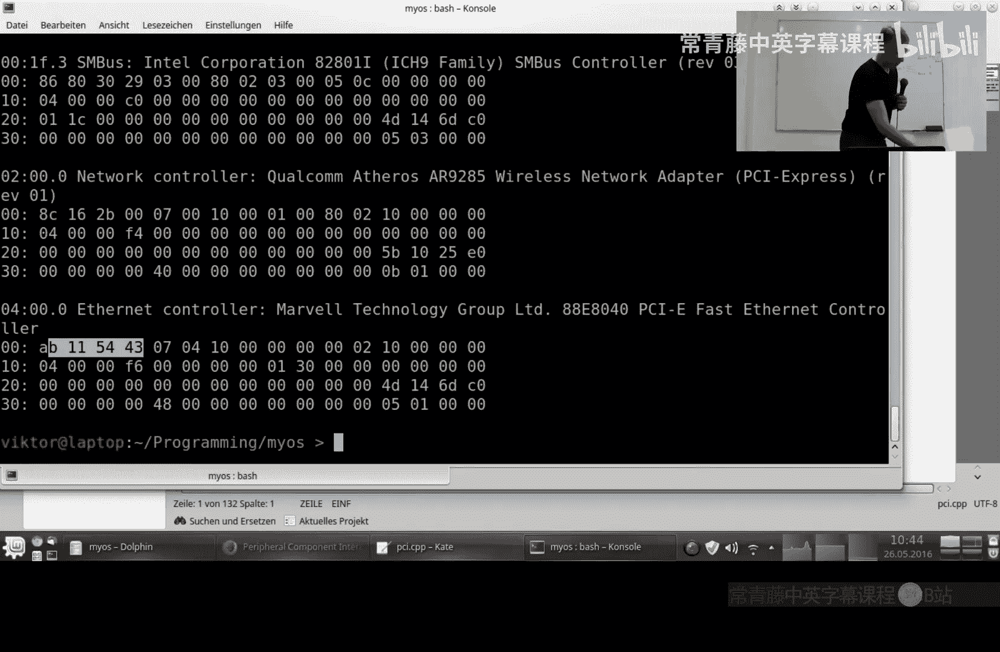

上一节我们介绍了如何枚举PCI总线上的设备。本节中，我们来看看如何与这些设备进行通信，这就要用到基地址寄存器。

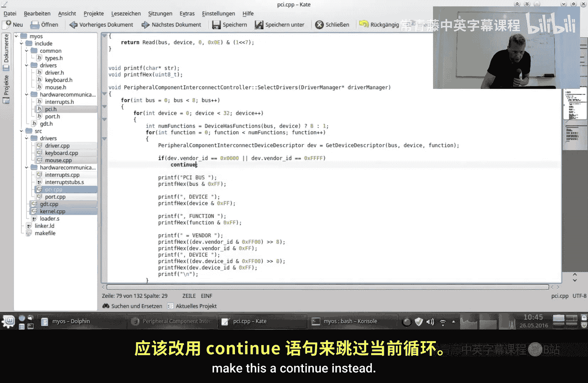

## 前期修正与补充

在深入之前，需要对上一节的内容做两点修正和补充。

首先，关于在Linux中使用的`lspci`命令。上次我犯了一个小错误。正确的命令是`lspci -n`，这个参数能让命令同时显示供应商ID和设备ID。

其次，你还可以使用`lspci -x`命令。这个命令会显示你所有设备的整个PCI配置空间。在这里，你会看到设备ID和供应商ID，但字节顺序是翻转的。


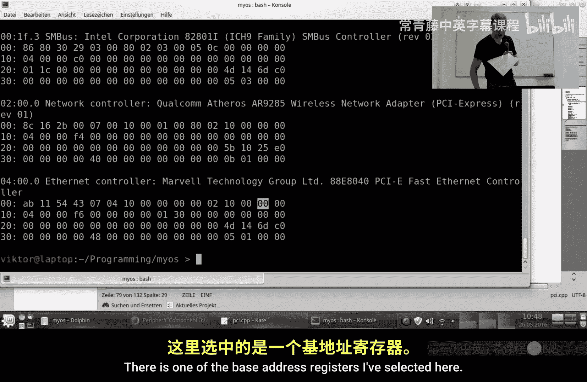


另一个需要修正的地方是关于PCI设备枚举的代码。在之前的代码中，当我们遇到一个不存在的功能时，我使用了`break`语句。但后来我了解到，功能编号之间实际上可能存在间隔。例如，你可能拥有功能1和功能5，但没有功能2、3、4。使用`break`会阻止我们找到这个间隔之后的其他功能。因此，我们需要将`break`改为`continue`。


## 什么是基地址寄存器？

现在，让我们来讨论基地址寄存器。它们是用来做什么的？

之前我们为键盘和鼠标编写了设备驱动，它们使用了固定的、硬编码的端口号和中断号。这种方式对于键盘鼠标是合理的，因为一台机器通常不会连接多个键盘，即使有，也只有一个焦点窗口，所以来自不同键盘的输入最终都会到达同一个进程和窗口。此外，计算机拥有键盘是相对标准的情况，因此以相对标准化的方式硬编码这些值是可行的。

但对于PCI设备，情况就不同了。你可能拥有多个显卡来驱动多个显示器，也可能有多个网卡。这种固定端口和中断的方法就不适用了。例如，如果你向一个固定端口发送数据，它应该显示在哪一个屏幕上呢？这没有意义。

解决这个问题的方案就是使用基地址寄存器。


## 基地址寄存器的位置与作用

基地址寄存器只是PCI配置空间中的一些寄存器。它们位于偏移量`0x10`开始的位置。每个基地址寄存器占用4个字节（32位）。


这些寄存器用于与设备通信并配置通信参数。例如，我们可以通过配置告诉设备：“如果发生了某事，请触发42号中断”。或者，我们可以设置另一个基地址寄存器，通过23号端口进行通信。不过，我个人并没有实际去设置这些值，我只是读取了GRUB引导程序已经设置好的值，并且它在我编写的代码中工作正常。目前，我们只对读取这些值感兴趣。

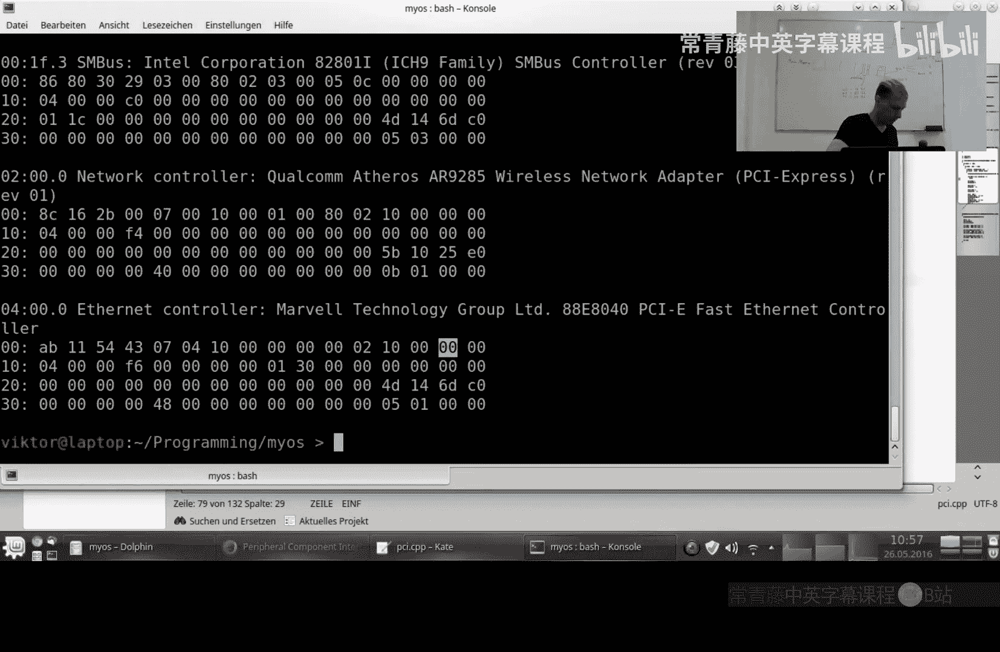

## 基地址寄存器的类型

基地址寄存器有两种类型，由寄存器值的最低有效位决定。

**1. I/O 映射基地址寄存器**
当最低位为`1`时，表示这是一个I/O映射的BAR。这种类型用于以传统方式与设备通信，就像我们与键盘和鼠标通信一样，通过独立的端口逐个字节地发送和接收数据。

在这种情况下，最低位是`1`，次低位是保留位。其余位表示端口号。需要注意的是，这个端口号必须是4的倍数，因为最低两位被用于其他用途。这种设计在硬件中很常见，但确实给编程带来了不便。

**2. 内存映射基地址寄存器**
当最低位为`0`时，表示这是一个内存映射的BAR。这种通信方式不同，你不需要逐个字节地发送和接收数据。相反，在内存映射中，你告诉设备：“使用这块内存区域（比如2KB）”。你只需将数据写入这个内存地址，设备就从那里读取；设备要发送数据给你，也写入这个地址，你从那里读取。这种方式性能更好，因为硬件可以在后台操作，而处理器可以腾出手来处理其他任务。

在内存映射类型中，最低位是`0`。接下来的两位（第2、3位）用于指示内存地址的宽度：
*   `00`：32位地址
*   `01`：20位地址（已过时）
*   `10`：64位地址

第4位是“预取”位。例如，键盘是不可预取的，你不能在读到一个键击之前就读取它。而硬盘是可预取的，操作系统可以预估程序将来需要的数据并提前读取。


在本系列视频中，我们实际上只会使用I/O映射的基地址寄存器。我将向你展示如何为其编程。如果你对内存映射版本感兴趣，可以在lowlevel.eu上找到一些优秀的源代码，我稍后会进行解释。

## 编程实现：读取基地址寄存器

现在，让我们开始为这个主题编写代码。

首先，我们创建一个枚举来区分内存映射和I/O映射。
```c
enum BaseAddressRegisterType
{
    MemoryMapping = 0,
    InputOutput = 1
};
```

然后，定义一个类来表示基地址寄存器。
```c
class BaseAddressRegister
{
public:
    bool prefetchable;
    BaseAddressRegisterType type;
    uint32_t size;
    uint64_t address;
};
```

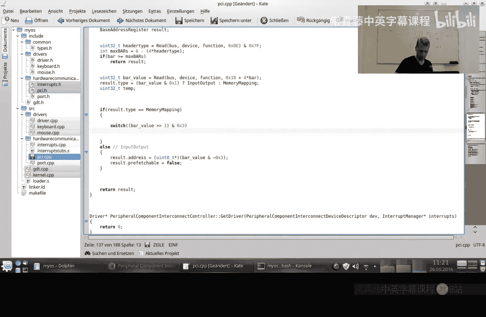


在`PCIController`类中，我们将添加一个方法来获取指定BAR的实例。这个方法需要总线、设备、功能号和BAR编号作为参数。
```c
BaseAddressRegister GetBaseAddressRegister(uint16_t bus, uint16_t device, uint16_t function, uint16_t bar);
```

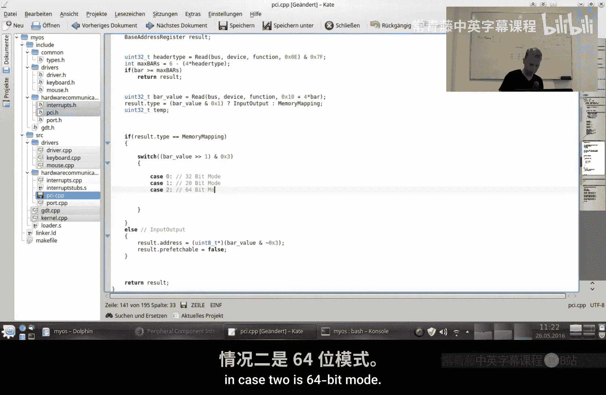


我们还需要修改`SelectDrivers`方法，使其能接收一个中断管理器的引用，以便后续将驱动与中断关联。
```c
void SelectDrivers(DriverManager* driverManager, InterruptManager* interrupts);
```

在`SelectDrivers`方法的循环内部，我们现在将读取每个设备的BAR。
```c
for(int barNum = 0; barNum < 6; barNum++)
{
    BaseAddressRegister bar = GetBaseAddressRegister(bus, device, function, barNum);
    if(bar.address && (bar.type == InputOutput))
    {
        deviceDescriptor.portBase = (uint32_t)bar.address;
    }
    // 获取并激活驱动...
}
```

`GetBaseAddressRegister`方法的实现核心是读取PCI配置空间中指定偏移量的值。BAR从偏移量`0x10`开始，每个占4字节。
```c
uint32_t headerType = Read(bus, device, function, 0x0E) & 0x7F;
uint32_t maxBARs = 6 - (4 * headerType); // 根据头部类型计算最大BAR数
if(barNum >= maxBARs) return result; // 请求的BAR超出范围，返回未初始化的result

uint32_t bar_value = Read(bus, device, function, 0x10 + 4 * barNum);
result.type = (bar_value & 0x1) ? InputOutput : MemoryMapping;
```

对于I/O映射的BAR，我们需要清除最低两位来得到实际的端口基地址。
```c
if(result.type == InputOutput)
{
    result.address = (uint8_t*)(bar_value & ~0x3);
    result.prefetchable = false;
}
```

对于内存映射的BAR，处理更复杂，涉及判断地址宽度和计算可映射区域大小。我们暂时不深入实现。如果你感兴趣，可以参考lowlevel.eu上的代码，其原理是：向BAR写入全1，再读回，设备会将不可写的位清零，从而得到一个掩码，用于计算区域大小和对齐要求。


## 设备驱动的获取与匹配

接下来，我们实现一个`GetDriver`方法，根据设备描述符来返回对应的驱动实例。目前我们没有从硬盘加载驱动的能力，所以先进行硬编码。
```c
Driver* GetDriver(DeviceDescriptor device, InterruptManager* interrupts)
{
    switch(device.class_id)
    {
        case 0x03: // 图形设备
            switch(device.subclass_id)
            {
                case 0x00: // VGA兼容设备
                    // 未来返回VGA驱动
                    break;
            }
            break;
    }
    return 0; // 未找到驱动
}
```

在`SelectDrivers`中，调用`GetDriver`，如果成功获取到驱动，就将其添加到驱动管理器中。
```c
Driver* driver = GetDriver(deviceDescriptor, interrupts);
if(driver != 0)
{
    driverManager->AddDriver(driver);
}
```

编译并运行我们的代码，它应该能成功识别出VGA设备和网卡。


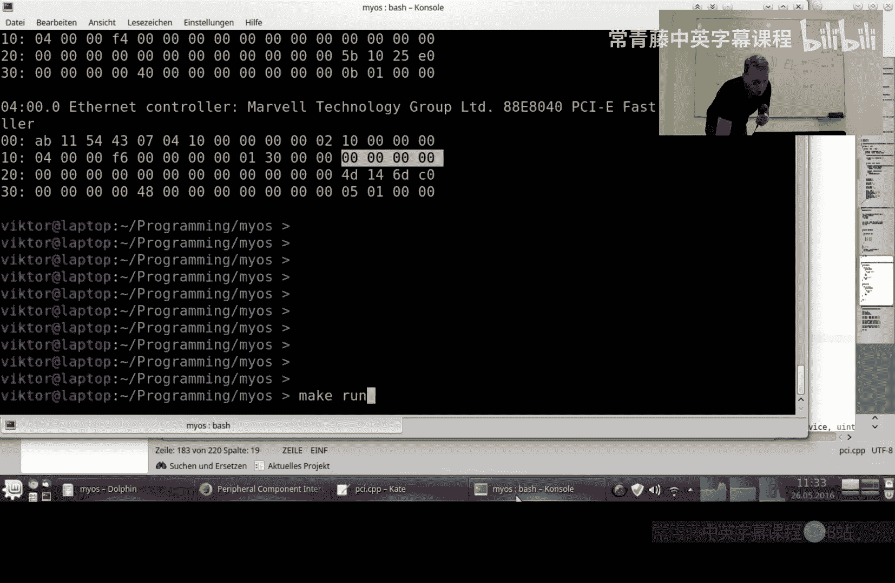
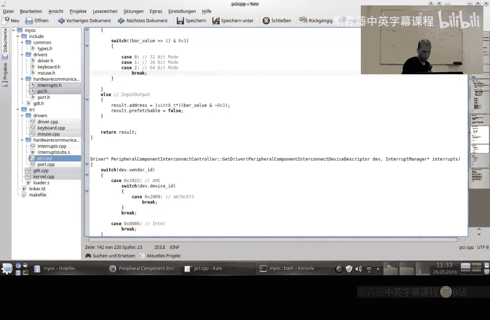
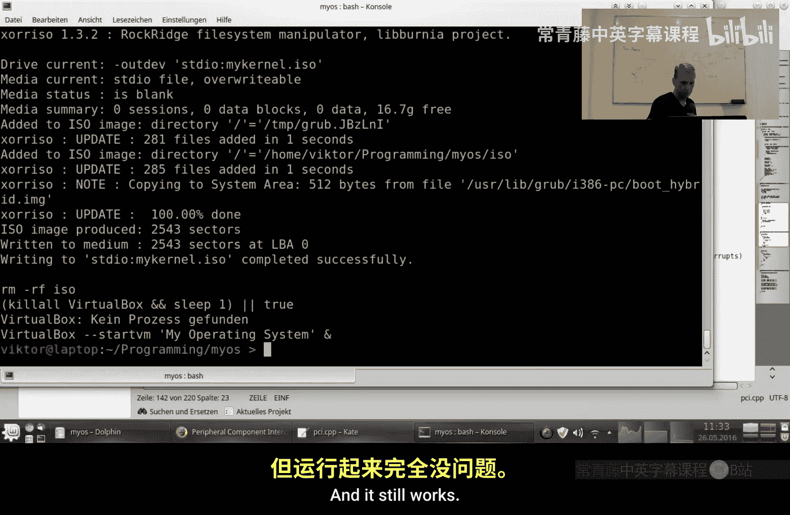
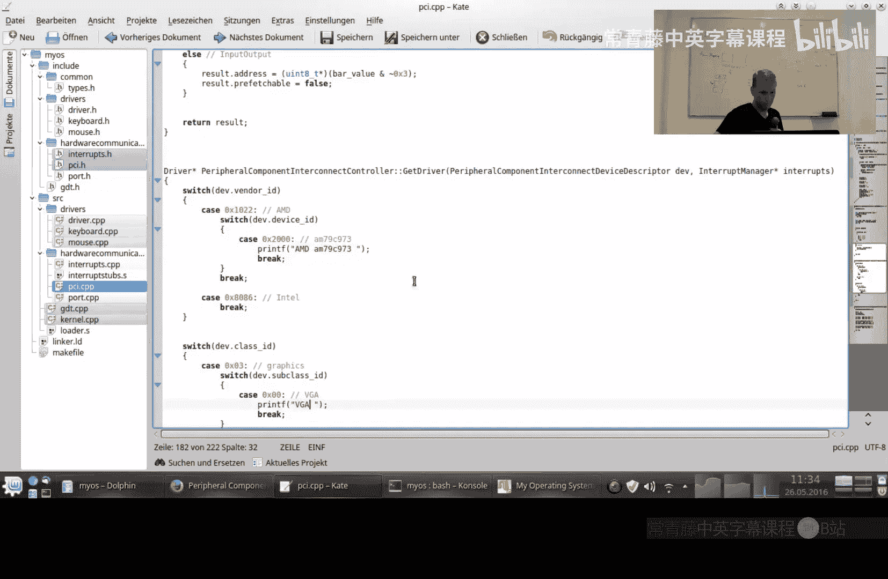
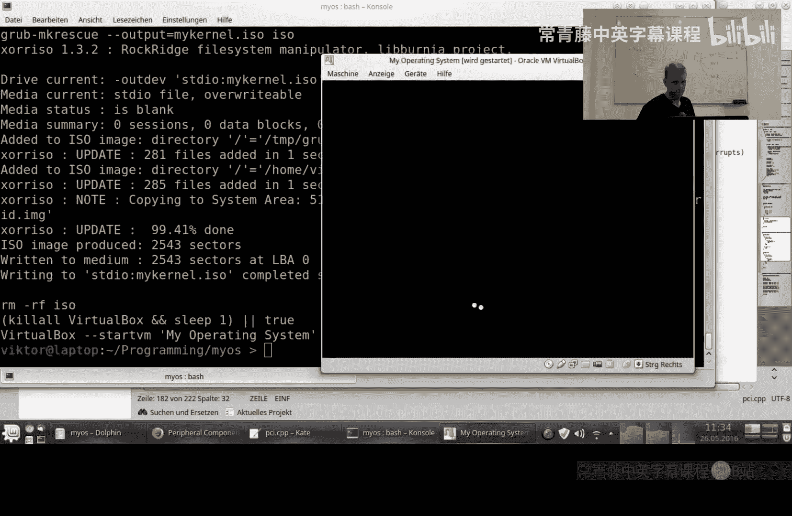


## 总结


本节课中我们一起学习了PCI基地址寄存器的核心概念。我们了解到BAR是设备与CPU通信的地址窗口，主要有I/O映射和内存映射两种类型，并通过最低位进行区分。我们实现了读取BAR信息的代码，并搭建了根据设备信息匹配驱动的框架。

现在，我们的抽象层已经足够厚实，可以开始在更高的抽象层级上工作，这正是我最喜欢的部分——告诉后端“我想做什么”，而后端的职责是知道如何在具体硬件上实现它。

下一节课将会非常有趣，我们将进入VGA图形显示模式。虽然不会太深入，但它将真正帮助你起步。请记得订阅，我们下节课再见！