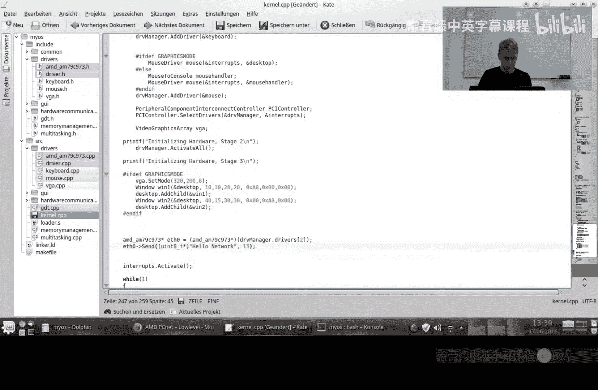
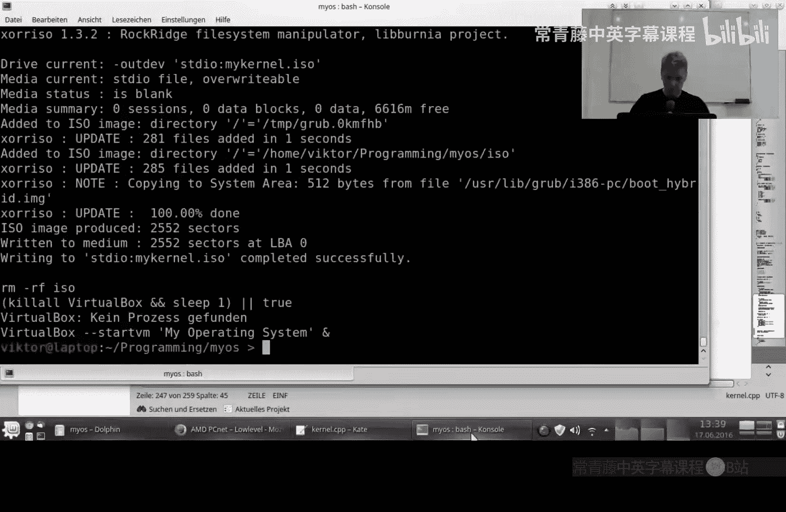
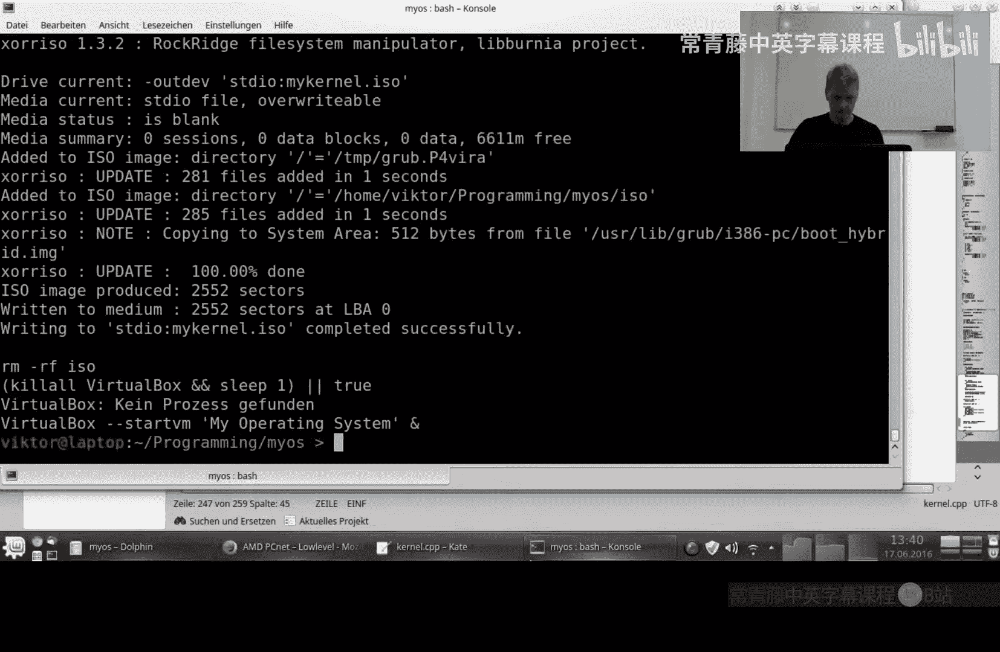
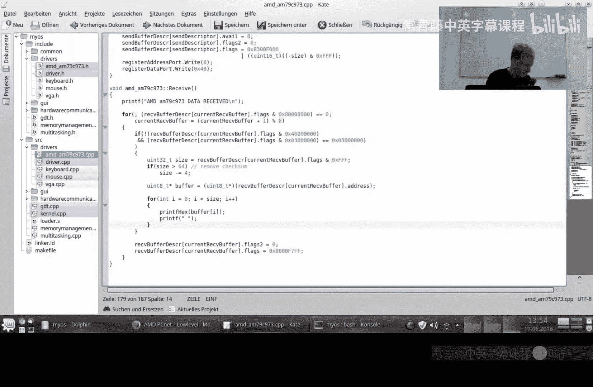

# 编写你自己的操作系统：18：网络通信（续）


在本节课中，我们将继续完成网络驱动程序的编写，实现数据的发送与接收功能，并简要介绍网络协议栈的基本架构。


## 发送数据

上一节我们介绍了网络通信的初始化，本节中我们来看看如何发送数据。发送方法的核心是选择一个发送缓冲区，将数据复制进去，然后通过向网卡寄存器写入命令来触发发送。

以下是发送方法 `send` 的关键步骤：

```c
void send(void* data, unsigned short size) {
    // 1. 根据当前发送缓冲区索引获取目标缓冲区地址
    unsigned int buffer_index = current_send_buffer;
    // 2. 循环移动到下一个缓冲区，以便并行处理
    current_send_buffer = (current_send_buffer + 1) % SEND_BUFFER_COUNT;
    // 3. 检查数据大小是否超过缓冲区限制（1518字节）
    if(size > MAX_FRAME_SIZE) {
        size = MAX_FRAME_SIZE; // 简单截断，实际应处理错误
    }
    // 4. 将数据从源地址复制到网卡发送缓冲区
    memcpy(send_buffers[buffer_index], data, size);
    // 5. 标记该缓冲区为“使用中”
    send_buffer_status[buffer_index] = BUFFER_IN_USE;
    // 6. 配置发送描述符，包括数据长度和状态位
    send_descriptors[buffer_index].length = size;
    send_descriptors[buffer_index].status = 0;
    // 7. 向网卡的命令寄存器写入“发送”指令
    outportl(io_base + REG_COMMAND, CMD_TRANSMIT);
}
```








代码中的 `MAX_FRAME_SIZE` 对应以太网帧的最大尺寸。向寄存器 `REG_COMMAND` 写入 `CMD_TRANSMIT` 是通知硬件开始发送的关键操作。


## 接收数据

发送功能完成后，我们需要处理数据的接收。接收方法 `receive` 会轮询接收缓冲区，检查是否有新数据到达，并进行处理。

以下是接收方法的关键逻辑：

```c
void receive() {
    // 遍历所有接收缓冲区
    for(int i = 0; i < RECV_BUFFER_COUNT; i++) {
        // 检查当前缓冲区是否有数据（状态位不为空）
        if((recv_descriptors[current_recv_buffer].status & EMPTY_FLAG) == 0) {
            // 获取数据包长度
            unsigned short length = recv_descriptors[current_recv_buffer].length;
            // 以太网帧长度检查，移除4字节的帧校验序列（FCS）
            if(length > 64) {
                length -= 4;
            }
            // 获取数据缓冲区指针
            void* data = recv_buffers[current_recv_buffer];
            // 此处可以处理数据，例如打印或传递给上层协议
            // process_packet(data, length);
            // 处理完成后，清除缓冲区状态，将其归还给硬件
            recv_descriptors[current_recv_buffer].status = EMPTY_FLAG;
            // 循环移动到下一个缓冲区
            current_recv_buffer = (current_recv_buffer + 1) % RECV_BUFFER_COUNT;
        } else {
            // 如果遇到空缓冲区，则跳出循环
            break;
        }
    }
}
```



在实际操作系统中，`process_packet` 函数会根据以太网帧头部的协议类型字段，将数据分发给不同的上层协议处理程序（如ARP、IP）。


## 网络协议栈架构

现在我们已经能够发送和接收原始的以太网帧数据。这就像学会了字母表，但要进行有效沟通，还需要理解语言（即网络协议）。以下是通信所必需的核心协议层：

*   **以太网帧**：最底层的数据帧格式。它包含源和目标的MAC地址（各6字节）以及一个16位的**协议类型**字段。例如，`0x0806` 表示ARP协议，`0x0800` 表示IPv4协议。
*   **地址解析协议**：用于根据IP地址查询对应的MAC地址。如果一台计算机不响应ARP请求，网络上的其他设备将无法与其通信。
*   **网际协议**：在以太网帧之上，提供逻辑上的IP地址。IP数据包头部包含源和目标IP地址。在IP头部中，有一个8位的**协议号**字段，用于指示上层协议。
*   **上层协议**：根据IP头部的协议号，数据会被传递给不同的传输层协议。
    *   协议号 **1**：对应 **ICMP**协议。例如，`ping` 命令就使用ICMP。操作系统需要响应ICMP回显请求，否则其他主机会认为该主机不可达。
    *   协议号 **6**：对应 **TCP**协议。它提供可靠的、面向连接的字节流服务，实现较为复杂。
    *   协议号 **17**：对应 **UDP**协议。它提供无连接的简单报文传输，比TCP更易于实现。

这种分层结构就是著名的**网络OSI模型**的简化体现。实现一个基本的网络栈，至少需要处理Ethernet、ARP、IP和ICMP。UDP是一个不错的进阶目标，而TCP的实现则是一个更大的挑战。


## 虚拟网络环境配置

在VirtualBox等虚拟化环境中进行网络开发时，了解以下地址会很有帮助：

*   **宿主机地址**：通常为 `10.0.2.2`。这是虚拟机内部访问宿主机（运行VirtualBox的物理机）的IP地址。
*   **默认网关**：通常也是 `10.0.2.2`。当虚拟机需要访问外部网络（如互联网）时，数据包会发送到此地址。
*   **客户机地址**：可以配置为同一子网下的地址，例如 `10.0.2.15`。


## 子网掩码的作用

子网掩码（如 `255.255.255.0`）用于界定网络边界。其工作原理通过按位与运算实现：

**公式**：`(源IP地址 & 子网掩码) == (目标IP地址 & 子网掩码)`

*   如果上述等式成立，说明目标主机在**同一本地子网**内。数据可以直接通过交换机发送，无需经过网关。
*   如果等式不成立，说明目标主机在**外部网络**。数据包应首先发送到**默认网关**，由网关负责将其路由到更广阔的网络中。


## 总结

本节课中我们一起学习了如何完成网络驱动程序的数据发送与接收功能。我们实现了 `send` 和 `receive` 方法，并了解了数据在网卡缓冲区中的管理机制。此外，我们还概述了构建一个基本网络协议栈所需的核心协议层次：从最底层的以太网帧，到ARP、IP，再到ICMP或UDP等上层协议。最后，我们讨论了在虚拟环境中进行网络配置的要点以及子网掩码的工作原理。在接下来的课程中，我们将开始探索硬盘驱动相关的知识。