# WriteyourOperatingSystem【中英⚡编写你自己的操作系统｜Write your own Operating System】 p20 P20 Write your own Operating System 19： Hard Drives -BV1BDBEByEBY_p20-

Hello and welcome to the 19th part of the tutorial on Writing Your own operating system。

Now in this 19th part， we will be talking about the hard drive。嗯。And yeah。

 this is actually quite simple。 So it's so simple， actually。

 that I consider moving it ahead in the timeline， maybe to around the。Keyboard and mouse。Drive us。嗯。

Yeah， because， of course， hard drives were one of the first things that were built for computers。嗯。

And so。Yeah， there are some quite simple ideas in there。So just like with the keyboard and the mouse。

 the ports and interrupts are relatively standard， although。Yeah， nowadays。

 you probably should look at the PCI controller and。In the enumeration of the PCI devices。嗯。

You a class I D。1， and subclass I D。6。I for the serial ATA。

So but let's look a bit back in time because as I've said， hard drives have been around forever。And。

I think we should know a little bit about the history of the hard drives。So。Yeah。

 I remember 20 years ago。The standard was。IdE hard drives。

 I think there were standards even before that， but。Yeah， I think 20 years back is far enough。

So that stands for integratedtrated device Eics。And。Yeah， that was。Later， continued to。

Advanced technology attachment， A A。And nowadays， we have serial ATA。Advanced technology attachment。

 not great names if you ask me， but yeah， that's the names。So this is what we are using today。嗯。

And from what I've read。Sial ATA devices are always。

Are almost always compatible to either AT A or AH CI。

An A H C I stands for advanced host controller interface。嗯。And yeah。

 ATA is relatively the same as IDE。So yeah， the thing is virtual books only offers AHCI when we。

When we include an serial ATA controller into our virtual machine。

And the code that I want to show you today is for IDE or ATA。So， yeah， in virtual box。

 we will have to。To to add an IDE controller， not an SATA controller， because of that。

 because if we took SATTA， we would only have AHI but I want to do IDE or ATA。嗯。Yeah。嗯。

Now there are two different ways of accessing a hard drive。There is programmed input output PO。嗯。

And that is relatively slow， but that is the one that we are going to implement because it's relatively simple。

嗯。Well programmed I owe basically the processor talks to the controller all the time and says。

 give me the exp biteite， give me the next biteite， give me the next bite。And yes， that works。

 It's not fast。 I've read that you get to around 16 MB per second， which is really not much， but。

Yeah， I think that's。It's a start。 You know， also the the better way would be。DMA。

Direct memory access in DMMA， you basically tell the。The controller。Hey。

 just write the data to this memory location and give me an interrupt when you're finished。Okay。

 and then， of course。If you do it with DMMA or U DMA nowadays， you。Of course。

 that leaves you that gives you much better performance because while the controller is writing the data to the Ram。

 the processor is free to do other things， so that gives you really much better performance。

 but it's also more complicated。So we will do programmed IO。Okay。And。Yeah， so。Let's。嗯。

So as I've said， the port numbers， although nowadays it's probably a good idea to to read them from the PCI controller。

 they are still relatively。Relatively standardized， the port numbers are interrupt numbers。

So I'm going to a hot coat then。And。Yeah， what else do you need to know？あ。Oh yeah， there's。

ThePO mode has 28 bit。And 48 B mode。嗯。Yeah， and these numbers basically just say how many bits do you transfer to the to the device。

To request the sector。 Now， you don't request every bitete individually。 You request a bunch of bys。

 512 bys， as it's normally， but。So， yeah， a sector。A sector is 512 bys。Yeah， and。

If you have 512 bytes multiplied with 2 to the 28， then you get two4 gigabtes。

Maybe maybe you remember that name that maybe youll remember that。Size。嗯。

There were times when you couldn't write files that were larger than 4 GB。

 Yeah that's the reason there were times when you couldn't have hard drives larger than2 GB。

 the same reason and you just had one of the bits were。Used for other things。

 So they used signed integer and。So you could only have two gigabytes hard drives。

 I even remember that time， so a friend of mine bought a hard drive back then that had 2。

5 gigabytes and then he had to partition the hard drive because he couldn't access all of it。

But okay， so yes。With 48 B， you can access up to 128 pet。 Yeah， that's a bit more than 4 GB。

 but we'll be doing 28 B because yeah。They are basically the same thing， okay so。They work very。

 very similar， so I'll just show you the easier one。 and actually it's even the more complicated one。

But， yeah， that's。What we are going to do。嗯。And yeah， when you。When you deal with hard drives。

 you will probably come across。Three more。😔，嗯。Terms。Cylinders。Het and sector。So yeah。

 back in the times of IDdeE， I mean， you probably know that。Hart drives look like this。

 they have several disks。😔，And several。Read and write heads。And yeah back in the days of IDE， yeah。

 the operating system basically had to know that the hard drive looked like that and take control of that so the operating system would say。

 hey， I want to talk to this cylinder number， this head number， this sector number。But。

So that is referred to as CHS addressing。So to select a sector on a hard drive。

 you would have to transmit these three values。 but in the meantime， between IDE and AT A， I think。

Yeah， they came up with a better idea because it's not really good that you have to know the geometry of the hard drive to be able to talk to it。

You，I mean， nowadays， you have solid state drives and they don't even have cylinders heads。

And sectors in that way。 So it would totally not make sense to talk to a solid state drive in CHS addressing mode so。

Yeah， what they came up with is。TheABA。Moode， which stands for logical block address。

And that basically just says， hey here's a number， I want to have the sector with that number。

 and it's the hard drives problem to translate that logical block address into CHS。CH S address。

 And so it's not your problem as a developer of an operating system anymore。

 And I think that's really a good thing because yeah， you shouldn't have to deal to think about。

 you shouldn't have to deal with such。Technical details of a device that should。

Offer that should offer you an interface like a black box。You know。

 and this is more like like a black box， this A。 but there is actually。

A formula to translate between this addressing mode and this addressing mode。诶。So。Yeah， when。

 when you look at the program F disk on Linux when you。When you partition a hard drive with that。

Then， F disk。Yeah， the the master book record has。Has has space for CHS addresses。

 but also for LBA addresses。 So there's a。CHS address here and an ABA address here。

And Fdi writes both of them。So。Although I think nowadays。

 it should be sufficient to only write this one， but yeah Fta said so。Whatever。So。

Just just don't get confused if you see CHS and A B A。

 it's usually that you can just ignore this and。呃，Use this。Yeah， I mean。

 you talk when you deal with hard drives。As I've said， as I've said， hard drives are really ancient。

 They have been around forever， and。They had a lot of ideas in there， and some of them carried on。

 and some of them died on the way。 But you still have some。Some reminders of them， like。Like there啊。

Just addresses in the。Just there are just bytes in the master Bo record or in the B parametermeter block。

 there's just space there for things that aren't really around anymore and yeah you。

They are supposed to be set to 0， but then。But then they are used for other things and if they aren't zero or they have an illegal combination。

 then that indicates that you should go into a different mode。哎。Yeah， it's kind of a mess， but。

I think we can。We can。Work with hard drives。In a relatively sane way by just ignoring this。

These things and just deal with the stuff that is。Still in use today。

So。Let's see。Yeah。嗯。Yeah。いな。う。So when we communicate with a hard drive。😔，Controller has several port。

 How many are they。😔，9ine parts。Yeah。嗯。我。So the first part is actually a 16 bit port。

 That's the data part。Through which we send the data that we want to write and we pull the data that we read。

But the other ones are it ports。This one is for error messages， for reading error messages。😔。

Through this， we tell the hard drive how many sectors we want to read。Then we have three ports。😔，嗯。

Through which we transmit the logical block address of the sector that we want to read。い。我こ了。哦。Yeah。

 through this part， we basically say。Whether we want to。嗯。To talk to the master of the slave。

And yeah in 28 bit mode， we also transferred part of the logical block address of the sector that we want to read through that。

Yeah。Then we have a command port。😔，Through which we transfer the。😔，The instruction， so we say， hey。

 I want to read this or I want to write to this part to this sector。And the control port。

 which is also used for status messages。😔，So as I've said， I will hard code the。

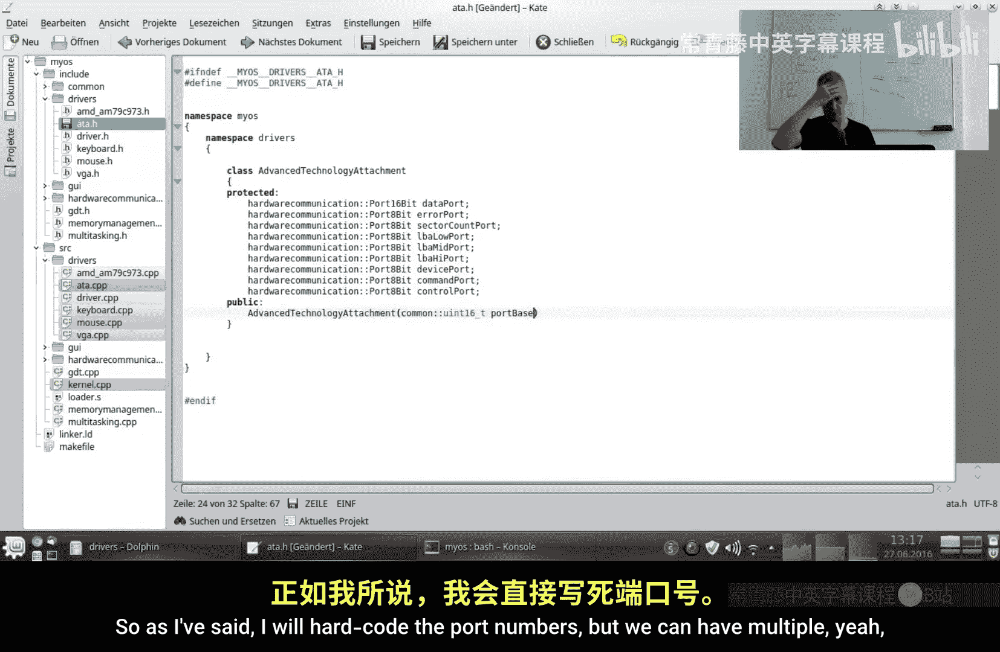

Partt numbers， but。We can have multiple。And yeah， actually we do have multiple。

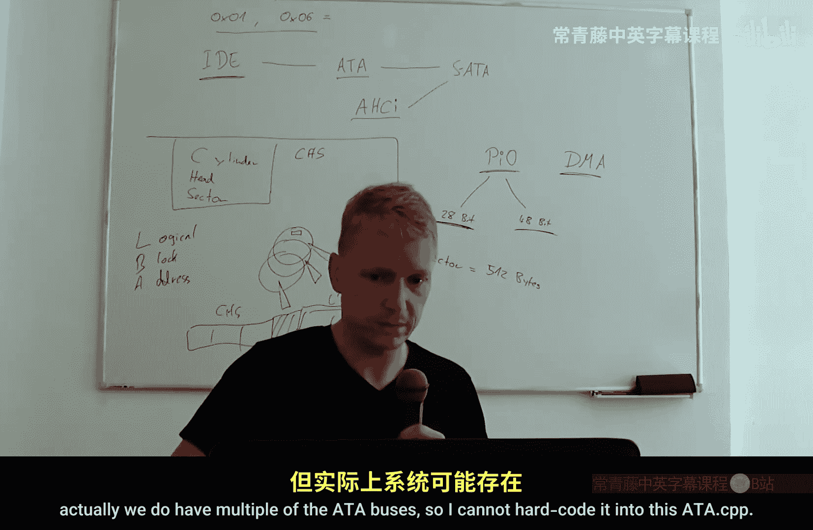

Of the of the ATA buses， so。I cannot hard code it into the。Into this 88 dot CP。

 I have to pass that from the kernel later。And I was saw a Booleion。For which says。

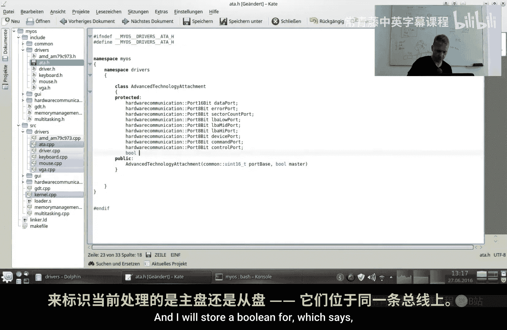

嗯。If this is a handler for a master or a slave。Which are two hard drives on the same bus。And。

 actually。The words master and slave don't mean anything。 It's just a random。

They are just random words to describe her。To， to distinguish one of the hard drives and the other one。

 but。Yeah， there were times when you could only boot from master。Hard drives。

 But I think those days are really gone。

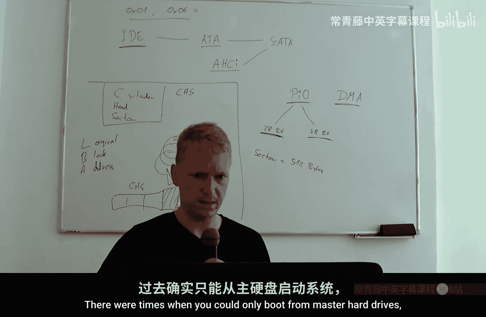

Okay， so。The operations that we really want to。To implement。

The identifier operation through which we， we talk to the hard drive and ask are you there and what kind of hard drive are you and stuff？

And I think through that， you can also。You can also read the information how many fights are in a sector。

But I'm not going into this。 I'll just。Seets this number to 512。 And that's it。や。い。い。Yeah。

Soaw the RE 28 method。😔，Gets a sector number as a 32 bit。Interrop， Yeah， so the highest bits of that。

Just need to be ignored。Yeah。Yeah。Okay， and then also。The method to flush。The cash offs。嗯。I drive。

 because。

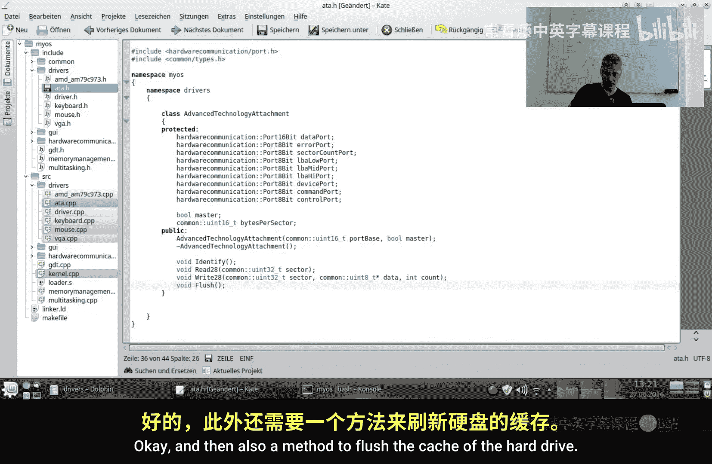

The thing。The thing is when you write to a hard drive， the hard drive first buffers that data。

In an internal buffer， and then you have to flush the buffer so that the hard drive really writes the data to the disk。

And。If you don't do that if， and， and let's say the。You pull the plug of your computer， so。

You have written something to a hard drive and not flushed it。 Then this sector is going to be lost。

Okay so the hard drive， you will not be able to read from that sector again until you write something to that sector again and then flash again and then this sector is not lost anymore。

So。Yup。嗯。In the long term， you will want to do something like journaling where you keep track of what you are about to do。

 so you would have something like two journals。嗯。And at least one of them always has to be。系啊。

It must have an integrity。So you would do something like。If you want to write to some sector。

 you would write to the first journal， hey， I want to write to that sector。Okay， now this journal is。

Doesn't have integrity。 so if you pull a plug now， then this journal is broken。

But this one is still intact。Okay。Then you say， hey， now I flash this journal。

And now I have two different journals which don't agree， but that's okay。

 And then you write the same information here， flush。And yeah， you write this here。

 and if you pull the plug now， then at least this journal is still intact。And this one is broken。

 but if。The power doesn't go down， you flush again， now you have to intact journals again。Okay。

 so you will always have an in tech journal like this。And these entries basically say， hey。

 I want to write to this sector now and hey， I want to write to this sector now。Yeah。

 once you have flushed the sector， you do the same thing and kick。诶。

This information out of the journal again， so。In the same way of doing it first here and then here。

 And the benefit of this is。So you say， hey， I want to do this now， then I've write。

 and now I don't flush。Because the power goes down， but then when I reboot， I can see in the journal。

 hey， this sector must be broken。O。Or maybe it's not broken。

 maybe I just couldn't update the journal after it was already updated。

 but I can directly identify which sectors are broken and recover them。And if I don't do that。

 then after such a power failure。Yeah， you would have to scan the whole hard drive and look for broken sectors。

And that is what you had to do regularly in the 90s where you had to run the program scanis regularly and often windows would start scanis on upon boot process so regularly。

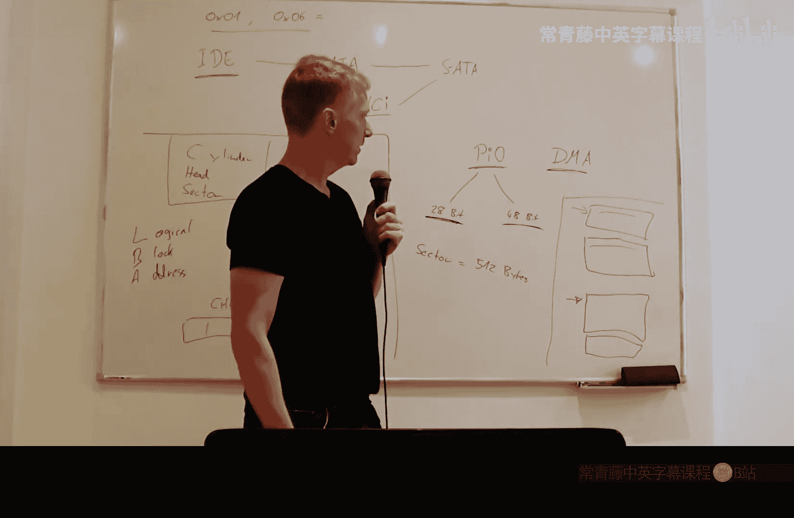

So this is the main reason for that。そう。Okay， so。Remember you need to flush。要把发死。Okay。

So as a constructor。😔，Was it。Ws per sector to 512。嗯。我。And set the ports for those other ports。没。

So whats an error for this for plus one。😔，Okay。And take a guess。What the control port is。Of course。

 it's port base plus 0 x 206， obviously。Yeah。不。はいはい。Yeah。O。So the primary master has port base 0 x。1。

 f or0。😔，So this is a master？And the slave just gets false here。😔，So primary master， primary slave。

 secondary master， secondary slave。😔，The secondary are on。然啊。Z x 170。😔，And if you have even more。

 then。They would start at。0 x 1， e。8。And the force starts。At0 x。😔，1，6，8。O。And by the way。

 the standard interrupt。Would be。Interrupt 14 for the primary。Bus and。15。Was a secondary。

And for the other two， I don't know。😔，O。嗯。Yeah。Okay， let's implement this identifier。Yeah。

 and these commands are always relatively similar， so。You're right to the device port。Okay。

Some information saying I want to talk to the master， I want to talk to the slave。Yeah。So， this。

Cl the H OB bit。 I don't even know what that is。 I just read that you should do this。

Then you read the status of the。Master。So to my knowledge。

 this reading the status really requires you to talk to the master and not the slave。😔，Yeah。

And if that is。255， then。We just returned because that means there is no device on that bus。Actually。

 it doesn't make sense to。Talk directly only to the master。Whatever I'll leave it this way。Okay。

 and now we've write the command。😔，0 x。意思。That's the command for identifyentifier。Okay。う。Okay。

 and if we get status 0 here。嗯。It again means there is no device。Okay， now we just。I mean。

It might take some time until the hard drive is ready to give us the answer to this identify command。

 so。What I'm going to do here is。😔，I will just wait until the device is ready。Yeah。

So I'll just update the status until the device is ready。As long as this flag is set。

 it means the device is busy and if。IfIf this flag is ever set， it means there was an error。

And in those cases， we will。Termininate a loop。Yeah。O。嗯。Okay， now if we reach this line here。😔。

It means that the data is ready， and now we can read it。Actually， I think this should。

They should only have 256 bys。😔，I mean， 512。Because we are reading。

2 byte integers from the data port。Yeah。你。So we read the data and I will just print if the data that we get。

う。So this is quite ugly， but okay。😔，So what I'm going to do now is I'm going to virtual box。😔。

And I will add a hard drive here。I'll take VDI， but I don't think it matters which one you select。

Dynamic size identifies itself as 2 GB。Okay， now we have this hard drive on the primary slave。😔。

And now， let's see。What do we have。

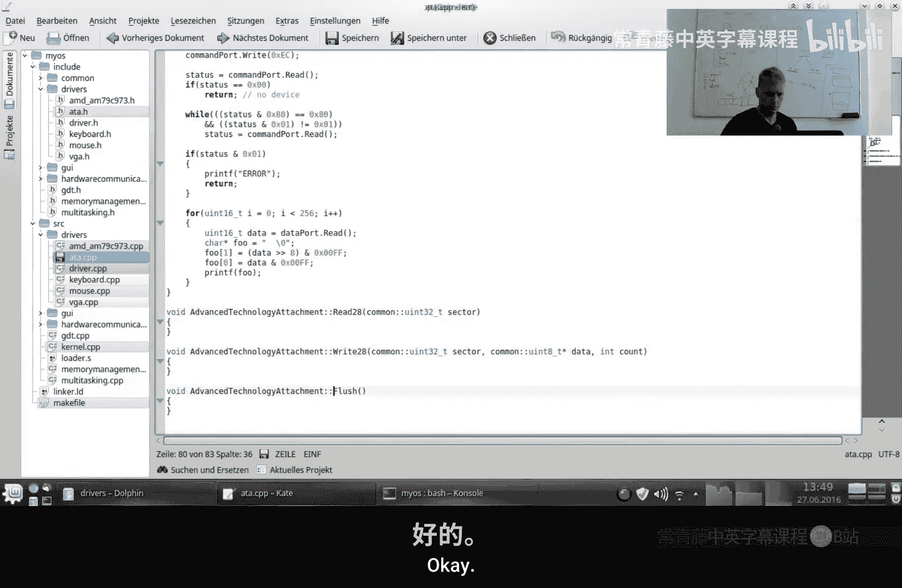

Okay。

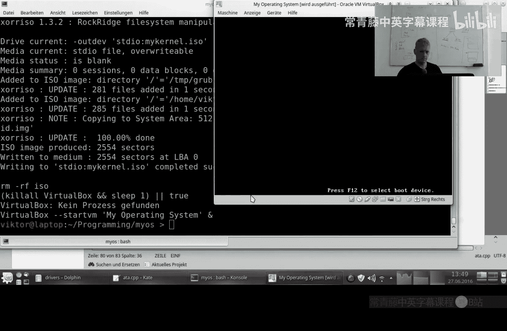

Okay， so what do we have here now， primary master gives us anarrow。I don't know why， I guess that。

Gup locks the drive， I guess， because that's the drive we booted from。 I don't know。 I don't care。

 I'm just going to ignore that。And the primary slave。

 so our hard drive gives us this information here。嗯。

So I don't know much about what that all that means， you can go into that yourself。This is how you。

Identify， so the general thing that the general way that you talk to the hard drive is usually the same way you select which drive you want to talk to。

How many sectors you want to read or write， the number of the sector that you want to read or write。

Len gives a read of right command。Then wait until the device is ready。

 and then you can read or write。To them。To the data port，So。Let's see。 I'm going to。

Just copy this whole thing now。😔，To the right and also to the read。Method。Because as I've said。

 it's always relatively similar。😔，Okay， so the right。いいよね？Yeah， of course。

 you cannot write to a sector larger than what you can address with 28 bits here。

So we need to check that the first。😔，4 bits are 0。Then。When we select the master or slave。

 we have to select E or。😔，F row。And yeah， for the。Reading and writing in 28 bit mode。I mean。

 we have three parts with 8 bit each。 So that gives you only 24 bits to send。And then。

 four bits are left。For the address from the address。

 so what we do is we put these into the device part also。Nexus。嗯。

Now we clear previous error messages。😔，Yeah， for now。

 we will just always read or write a single sector。

So now we have to split the sector number and put it into these three partss。So the low one。😔。

We put the low。So we put the low8 bits into this part。😔，Yeah。Theit bits in here。😔。

Like this and then we write the command0 x 30， which is the right command。😔，うんほどね。Yeah。嗯。Okay。

And in here。So we take the first。😔，the I byte from the data area here。And。Yeah。

 if the next is also there。Yeah。We put it in there or。😔，Like this。Okay。

 so let's print the data before we send it。し。Okay， so the device always expects us to send as many bytes as there are bytes in a sector。

 so we always have to write a full sector。Otherwise， we would get in。Interrupt with an error message。

So。That is why。After this loop， I will make another loop。So。So here we only write。

Number of bytes in this data，Yeah， actually。So if you try to write too much， I mean。

 this is only to write one sector。So if you try to write too much。It's just going to refuse that。So。

嗯。So if we write less than the 512 bytes or whatever the number is。

 then we fill the rest of the sector with zeros。But if count is an odd number at this point。Then。

The first one of these has already been。Written inside this loop with an empty。

Value was 0 for that bite。So in that case， just to cover that case， I will。At。Count modulus 2。

To the initial I。Okay。So this should。😔，Do the writing。😔，Now， let's see you。We reading。Yeah。Okay。

So when we read。😔，So the stuff that we do first is the same。😔，So the sector must be a legal value。😔。

We cannot write more than 512 partss at a time。We select the device in the same way。

The sector number is passed in the same way。😔，A as clear sector count as one。

Low mid and high pot are being set correctly。And then I have write。😔，Not 0 x 30。

 but 0 x20 to the command part。Okay。Now at this point。😔，然后。I mean when we write。

 we don't have to wait， you know we just say we want to write and then we send the data and the hard drive buffers that data and it's not our problem anymore。

 but when we want to read data then it might take some time until the hard drive is ready to give us that data。

And。That is why。I'm doing this loop again。Which waits for the device to be ready to give us the data。

Yeah。So we read the bys and we want to write it to this data area。😔，Right。So。

So now we have got the data in W data。😔，And the low bite is the next。One， we right to the bathroom。

So data。I equals。This。I don' know this here。And then again， if we。

If the next slide is also requested。Then we take that。😔，OkayAnd when we read from a hard drive。

The hard drive requires us to also read a full sector。At a time， so if we haven't read a full sector。

And that is indicated in the exact same ways。 And we just have to。

Just have to read and discard the rest of the。Of the sector like this。Okay。Okay。

 and the last thing we have to do is flush the device。So。Dvicice part is。

And then we right to the command part。😔，The command0 X， E 7。Which is a flush。😔，And then。And we knew。

 we didn't wait。Before or after the writing， but now we have to wait while the device is flushing。

Okay， this looks good。So。嗯。Yeah。嗯。う。So。We write something to the disk and flush。😔，And after that。😔。

Yeah。よ。You read the zeros sector。😔。

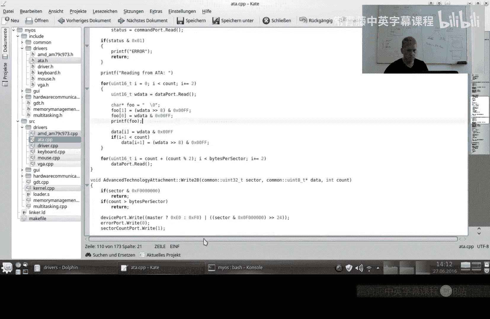

Now let's see what it does。

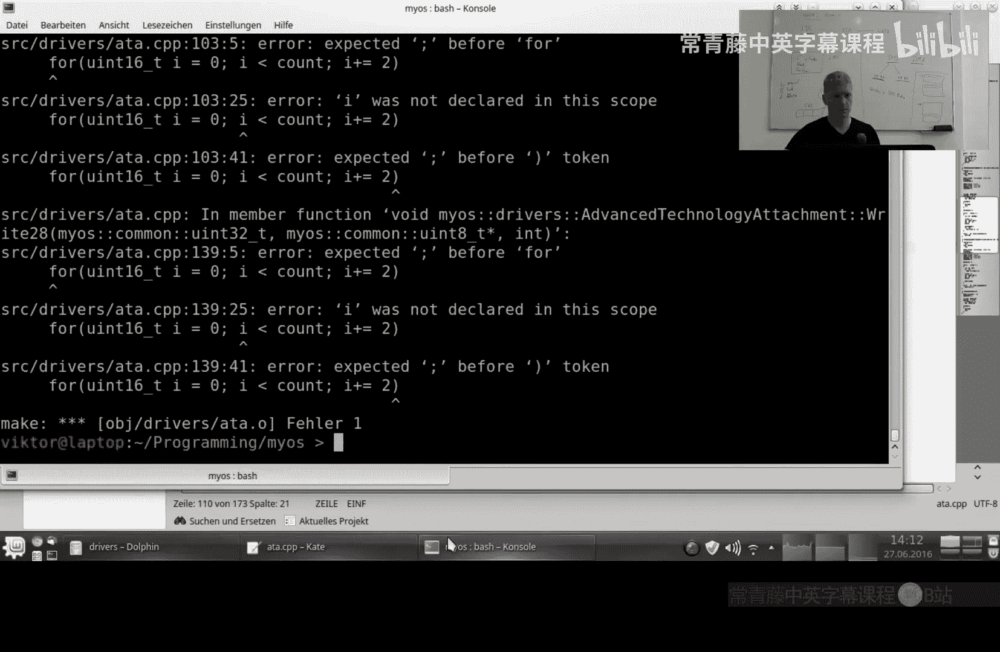

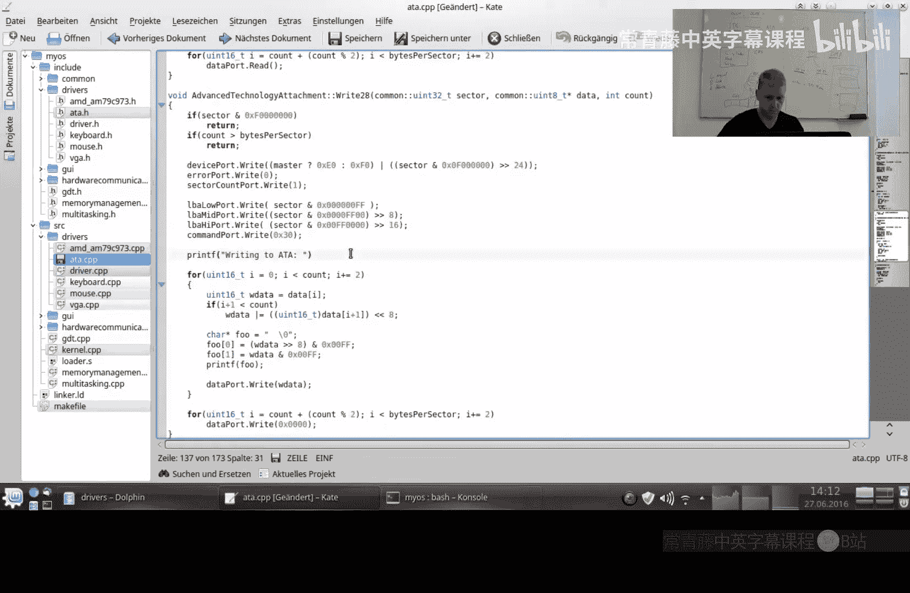

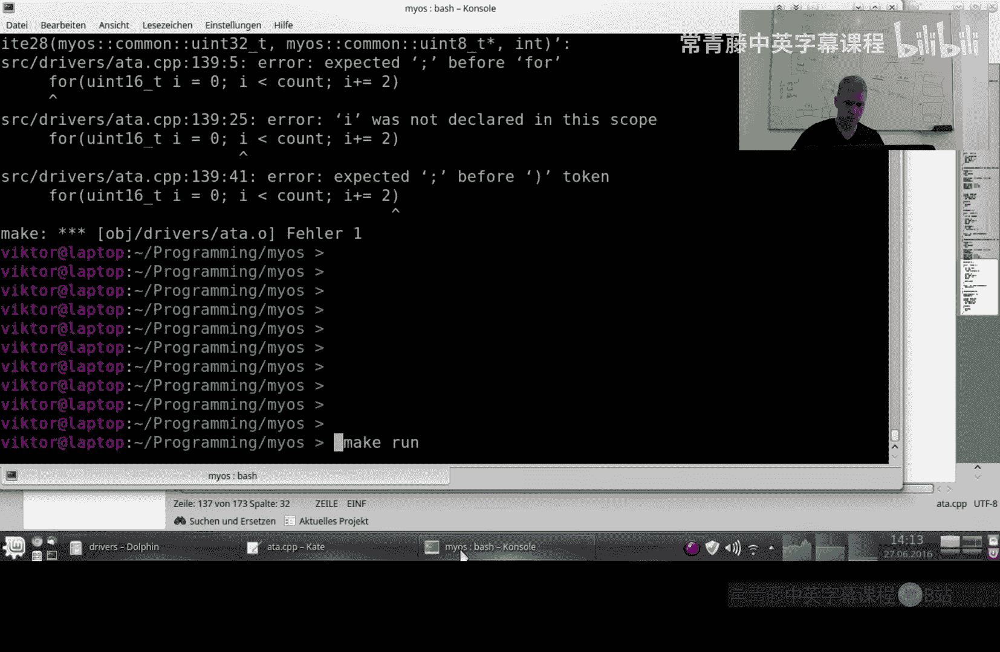

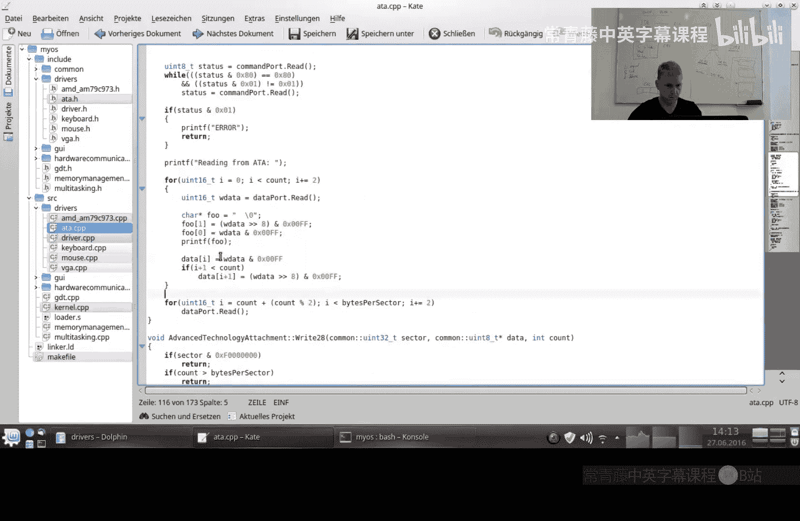

Yeah。Yeah。

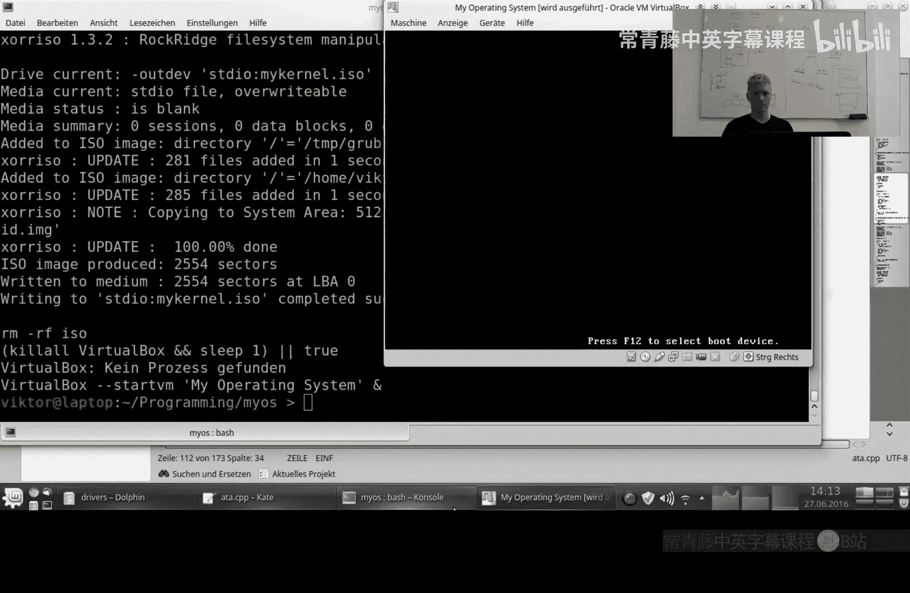

So we are writing。😔，Okay， this is a bit strange， wait。

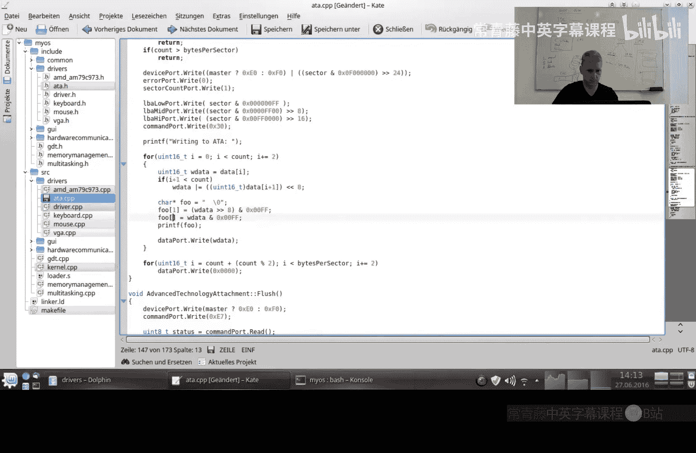

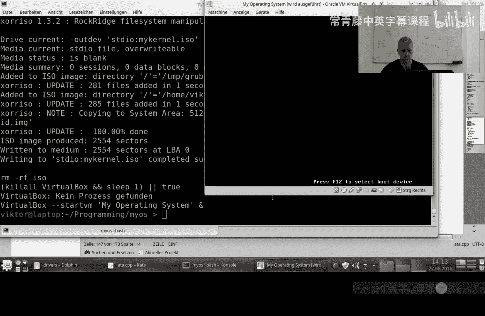

So we are writing。😔，The text that we want to write。And then we are reading it again。

This is looking good， so。Yeah， now this should be enough for today。I hope you have fun with this。

 I mean， we can only read individual sectors right now， but。

I'm not going to do much with hard drives anyway。 And yeah， we will look into。Into partition tables。

 and。系啊。And also into the file allocation table file system。 But yeah。

 not really much going into this， but yeah， I hope you can。Put this to good use， have fun with this。

Tune in next time。 Next time I'm going to talk about system calls。Because yeah。

 we basically have everything together we need。Right so our kernel。

Now has the ability to read from the keyboard， read from the mouse， read and write the hard drive。

 you can communicate with the network。You have multitasking。All sorts of stuff。

But what is missing is if you， I mean， you also can。

You could at least now copy or load a program from the hard drive into the Ram into a。

An area of the realm that you get by dynamic memory management and so on and so on。

 And then you could。Then you could launch that as its own task。嗯。But the problem is。

 if this program wants to do something。Like maybe write to a file on the hard drive。

 you cannot allow it to do that directly。For security reasons and。

So the program has to communicate with the kernel and does that through system calls。

To tell the kernel that the kernel is supposed to do that。 and then the kernel。Checks。

 hey is this program even allowed to do that and if not it doesn't do that and if it is allowed then it does it。

 so that's what you do with system calls and that's what we are going to do next time。So。Yeah。

 tune in next time。Hit subscribe so that you don't miss that next video。And if you like this video。

 hit like， I really like this video， I think it's really nice to have access to the hard drive now。

So， yeah。See you next time， bye。

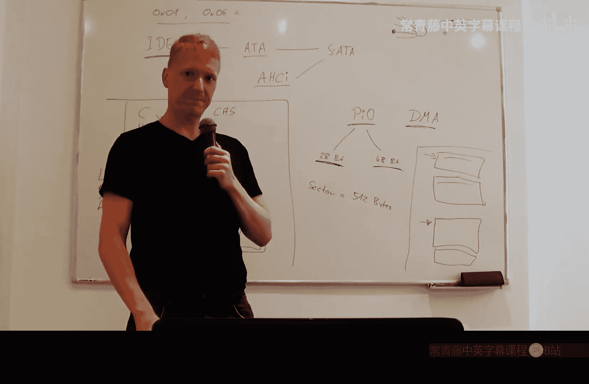