# WriteyourOperatingSystem【中英⚡编写你自己的操作系统｜Write your own Operating System】 p21 P21 Write your own Operating System 20： System calls, POSIX compliance -BV1BDBEByEBY_p21-

Hello and welcome to the 20th part of the tutorial on Writ Your own operating system。嗯。Yeah， I mean。

 in the last 19 tutorials， we've basically covered most of what you need in an operating system。

 I mean， we didn't have。Audio devices or something like that。 But I think that's really。

Something you don't desperately need you。I mean， what we have is a kerneler。Which we can boot。

 And it is able to。Do a lot of stuff。 That can。Load from a hard drive。 It can。Oh。Read and write。

From and to the network。嗯。It can。 whatever have we done all can allocate。

Memory it can print to the screen。 It can。唉。Yeah it can talk to the PCI hardware。

 read and read from the mouse and so on。嗯。So。What is the left to talk about。Well。I mean。

 let's see What the kernel can do is it can allocate some RAM。

And then it can load something from a hard drive in there， like， for example。

 an executable binary file。ok。And then it can attach this to its task management。Okay。

 so then it would execute this binary file in parallel。Okay， so this is what we already can do。But。

Yeah， now the binary file。I mean， in the long run， it's。You want to to disallow certain things。

 So the binary file is not supposed to talk to the hard drive， for example， directly because。

You want something like a user mode and the programs that run in this user mode are not supposed to write to certain system directories。

 right？But if you allowed the program to call， for example， the asmbler command out be。

Then it would be able to talk directly to the hard drive， okay。

 and then it would be able to just write to some sector and this sector might happen to be a sector that belongs to a system directory so you have to disallow us in a way。

Okay， so。How user space works is you tell the processor， hey， I'm going into user space now。

So if there is an outB command， just ignore it。Or generate a general protection fault。

Something like a blue screen or something different or tell me that this has happened and then I will just kill this process。

Okay， so， so now you have disallowed this binary from talking to the directly， but。I mean。

 programs do read files， you know， just not system files。

So there has to be some way for the binary to talk to the hard drive。

 but not through the outbe command because yeah， as I've said， if you allowed the outB command。

 you could。You couldn't stop this binary from writing to system files。So what you do instead？嗯。

Is called a system call。So the binary。We basically， just call。Software interrupt。I think0 x 80 is。

The， the usual thing for。As a usual code for this was called interrupt。And。Before that， you， you set。

The A X register and B X register to something。 A X is usually A X will be the code of an。

Of an instruction。Okay， so。So let's see， for example。So in this list here， you can see a lot of。

These codes here on the left。For example。If you write a 5 into a X， it means that。

BX is a pointer to a file name。And I want to open that file， and then。Yeah， so。

If you set A X to 5 and B X to。The string slash。Something。Let's saylashlash dot T XT。That means。

I want to open this file okay。And now on the kernel side。

 you just have to attach an interrupt handler。Which handles this interrupt。

And which then looks at these registers and says， okay， he he called the system called。Number 5。

So he wants to open this file， and now the kernel can look at this file name and decide h。

Slash is a system directory， I will not allow this。And then。

It might set AX to some error code and just return。

 but if you try to open something that you are allowed to open。I mean， you can for you can。

 of course， look at the process I D and。Yeah， in this multitasking。Class for tasks。 You could。

 You could have a user Ids， for example and。Then， I mean， who executes this process？嗯。

So you could have a user I D in there。 and then the kernel could look at this user I D and say， yeah。

 this user wait wait， this is a root user。 So he is allowed to open this。

 Then I don't set A X to an error code。 I set A X to I don't know an。系啊。How does it handle that。

It might set a X to0 and Bx to a file handle or something doesn't really matter。

 the interesting part is the way this binary file can now communicate with the kernel you know it sets the registers called an interrupt and then the interrupt handler looks at these registers and says is this user allowed to do this and this。

If yes， then I do what he asks me to do。 and otherwise I will not do what he asked me to do and give him some error code or terminate the program or whatever。

O。So。あ。Yeah。Let's coat this。う。So， to examine。AX and Bx inside the interruptt handler。

We will need this multitasking dot H2。To have this CPU state structure。Okay。Okay。

 so this would be an interrupt handlelum。Yeah。Okay。Yeah。I will just pass this。😔，Two of them。嗯。

To the base constructor。And overwrite this method。そ。嗯。O。Yeah。不是。Okay。

 we need this CPU state structure。 So I'm going to。Include this file also。😔，Okay。Okay， so。

Insight the handle interrupt method。I mean， the ESP pointer still points to the start of this CPU state that we get here。

 So we'll just cast it just like we did in the。InThe interruptop tenta。

And we shouldn't make that mistake again。ImNot returning something， okay。

So what we can do just now just as basically a big switch statement。And now you really just need to。

 I mean， just need to implement。This。For all these possible values。And I'll say。That maybe is right。

Okay。Okay， so in case4， we will do print F。😔，And pass it the pointer that we get from EBx。Okay。

 something like this。And then we just have to tell it that there will be something called print。😔。

Yeah。Okay。And in the corner。😔，Okay， here we have the interrupt in drum。Yeah。

I'm not sure if we need to put0 x80 there。😔，I think we do because it's not a hardware interrupt。😔。

Okay。And I will activate the。How's these tests looking？But these tasks。嗯。

Should now be using something different and print。 If I want to do this through the。诶。

Through the system called。い。So something like Suprint F。😔，So task A and task B are supposed to。

To call the print F through a system call。And this is done by doing the assemblymb command。😔。

Interrupt。Dollar 0 X 80。Setting A X。To what was it？😔，4。Was it really fall？Yes。Setting a x to4。😔，And。

EBX。To this。String point。Okay。嗯。Okay， so the base construct。Will attach it。Tos the interrupt drop。

Okay， so the only thing left is。Yeah， let's see。I'llDo this by hand exception。😔，0 X A。Okay。

 let's see if this works。😔。

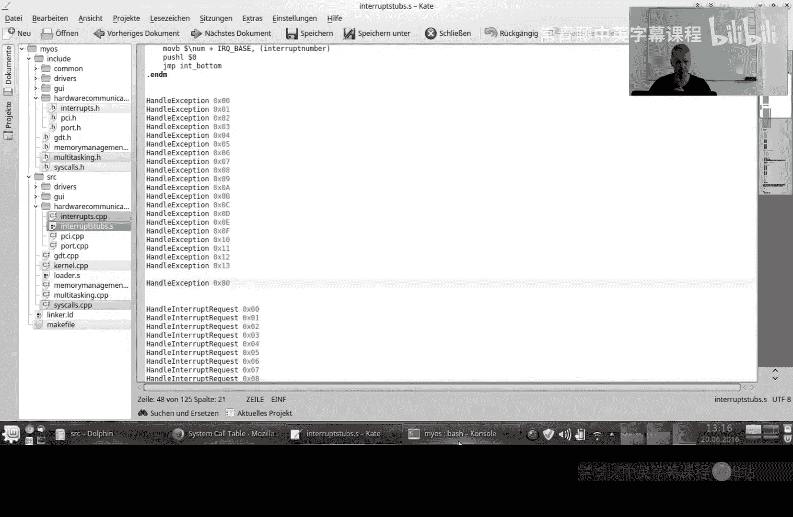

Yeah。

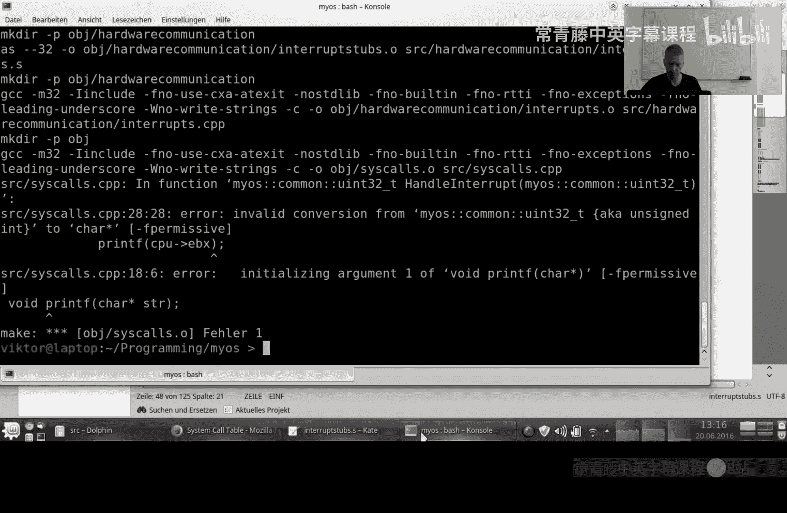

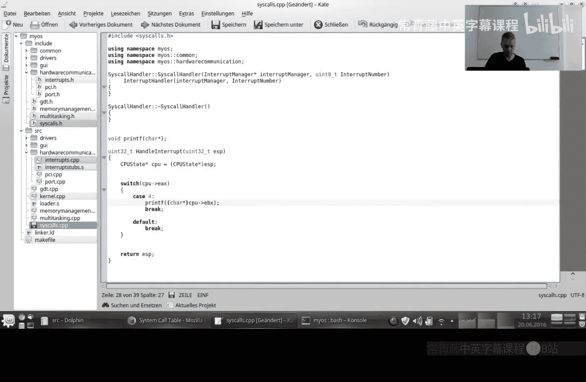

嗯。嗯。Yeah。Okay。あ。Unhanded interrupt to E。😔。

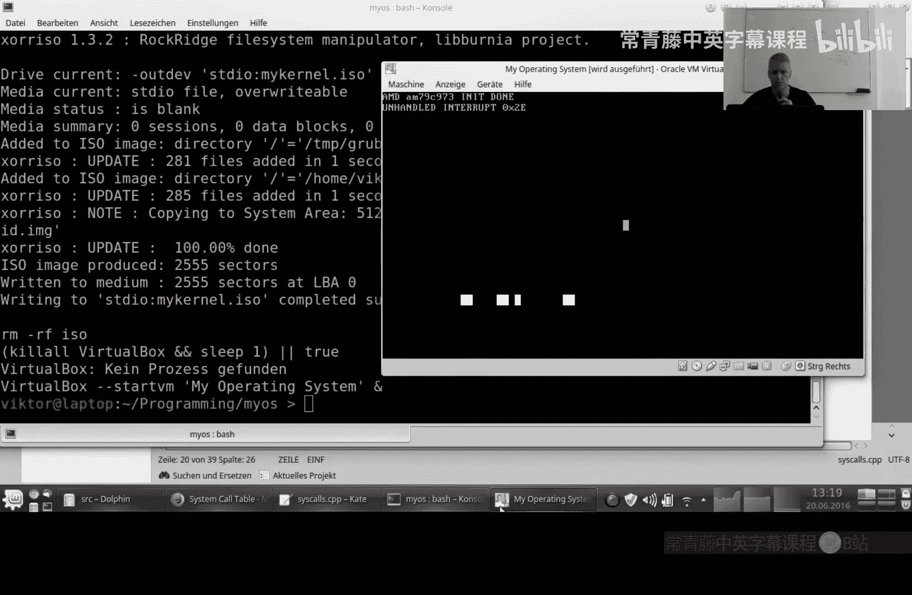

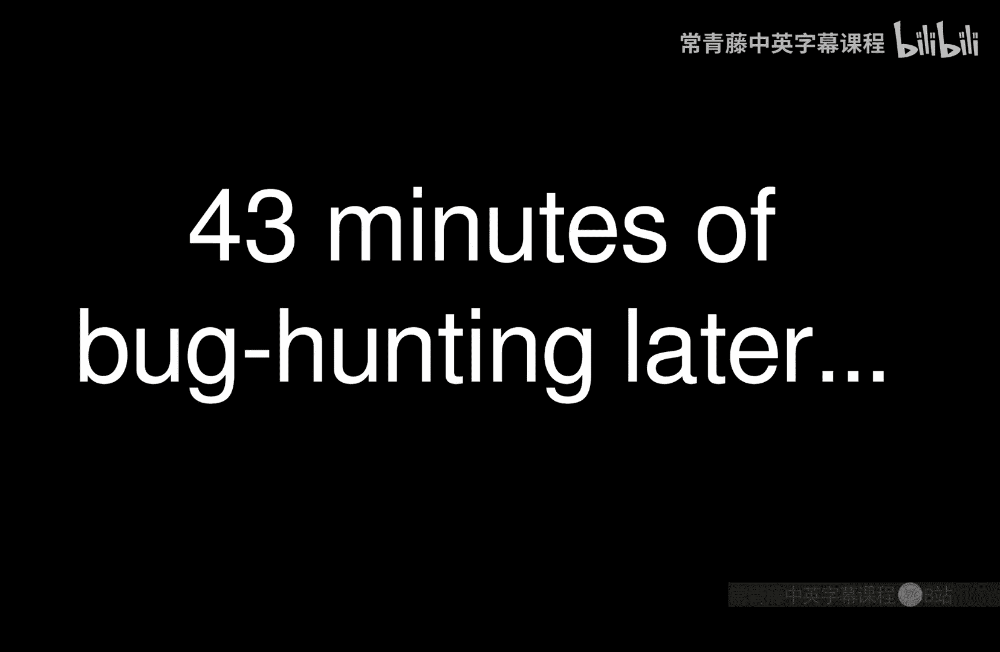

Yeah， so I have found the mistake。Yeah， it was the typical thing again。 So I had。

Included this handle interrupt request here。Which was correct or did a priorhand exception before。

 I don't know。So it should be handled interrupt request。For interrupt 80。

Because the software says interrupt 8T。And。What I forgot to do was。To， yeah。

To enter this also in the interrupt dot CPP and interrupt dot H， You know， you had to。

Have these forward definitions here。So I put this forward definition for the method that is created here。

😔，And here， I forgot to enter it。In the interrupt descriptor table。So。Yeah。

 so this is not this is not coming from the programmable interrupt controller。 So therefore。

 the interrupt。Offset isn't added。You know， the controller Ad。So。So the task calls interrupt 80。

And in the interruptscriptor table， we need to set the entry number 80。And have it called the。

The interrupt request 80 in the interrupt steps， but the handle interrupt request here。

Does add this 20 to it。 So therefore， what I also had to do was。Yeah， in the system calls。嗯。Actually。

 I think I will just add it here。嗯。啊。Sos a ci。😔，So the constructor of the cis called the hand now。😔。

Thats。This。To the offset， So that in the。In the kernel CPP， we don't have to add this。😔，So now it's。

It at least looks like it makes more sense。 you know， So here we call interrupt 80 or0 x 80。

And here we。Here we handle interrupt0 x80 and。Yeah。

 now it's not the kernelel's problem that internally， there is a。The 32 added。

 a0 x20 added somewhere in between and then subtract it again。 So yeah。So by the way。

 I deactivated the hard drives in between for because they gave me some interrupt that I don't know why。

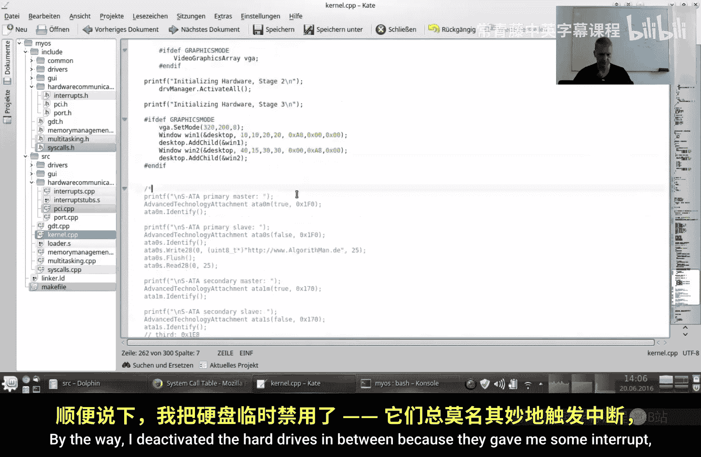

啊。

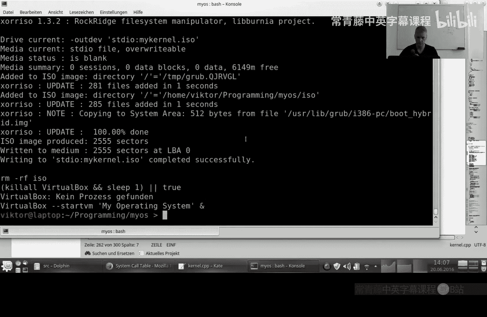

What was they thinking。Makes absolutely no sense of what I did here。

You need to add this to the interrupt number， of course。

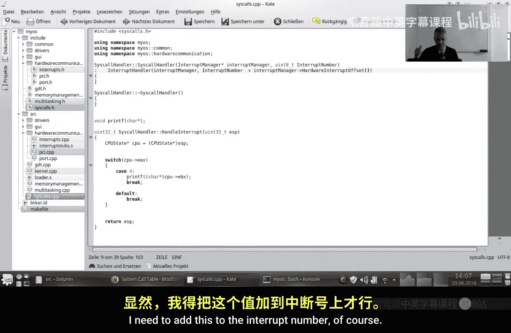

Okay， and now you see。

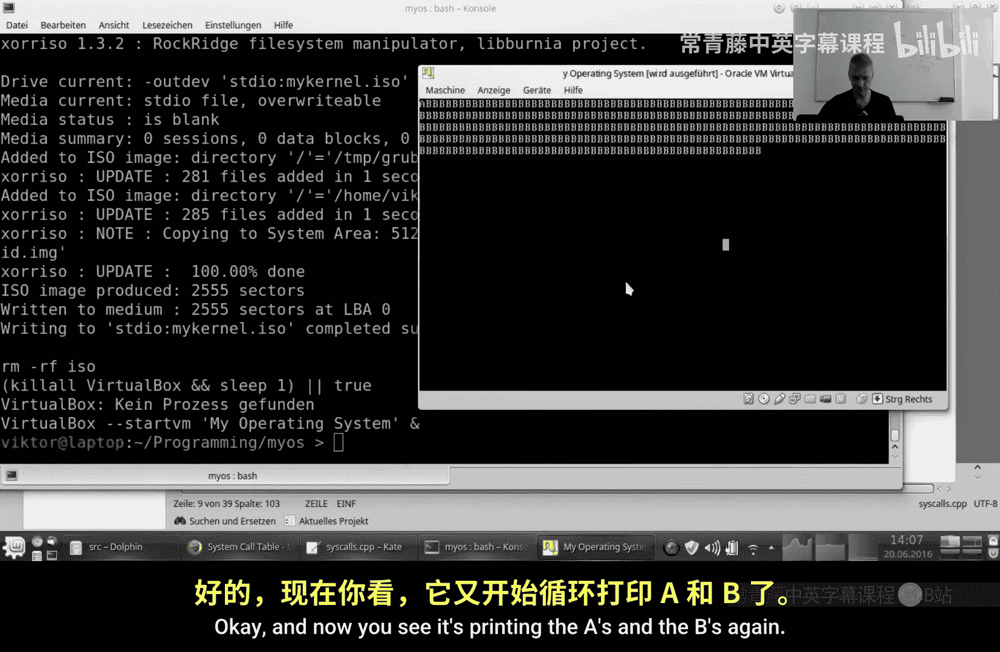

It's printing the A's and the B's again。And this is really nice because yeah。

 here you now really have this step for the system called。And。Yeah， this。

So these tasks here now only do things that are legal in user mode。You know， they。

 they loop and they call an interrupt and。Yeah， the access to the hardware is done by the kernel and the kernel is also allowed to do that。

So， yeah， that's， that hasn't been much code this time， I think。

But mostly because we had most of the stuff already。I think this was relatively easy。So，Yeah。

 that's all for today。Oh， by the way， what I wanted to mention。This。In this， this called that CP。

Here's these。These cases are really。A big piece of the Posss compliance。 You know。

 I think the Posss standard， I think， also defines a lot of programs that you have to offer。嗯。

And which paraits they are supposed interpret to interpret in which way， but on the kernel side。

 this interpretation of。Which value of a X means which system command。嗯。

This is really the kernel side of Pos compliance。 So yeah。Working on this， you can get a lot of。

 You can do all the。Well the back ends for opening files， closing files， reading files， and so on。

And then you can， you can implement。Something like a Glip C。Just the library that you can， Yeah。

 probably you should staticly link them to your binaries。

But they should then contain the calls to these system calls。 And if you have all the methods。

Inside this lip C， inside the standardized lip C， then you can really execute all C programs that there are。

Okay， so all at at least all the。Those the C programs that comply to。The standard。So yeah。

This is really one of the last steps。We can communicate with the hardware。 We can。嗯。Yeah。

 we can mediate between。 We can。Communicate with a program and interpret what it wants， and。Yeah。

 I think basically the the last things that are left。

 really on the kernel side are offering a way to。To have programs communicate with each other。

 but I think you can do this through this Cis interface also。

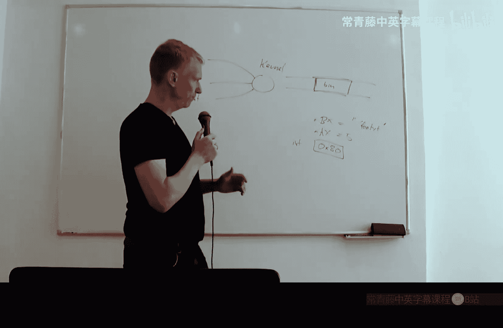

I don't think we should， I don't think we need to go into that the last thing that maybe we have time for another video。

嗯。So the last thing that we would really need for a kernel is to put these tasks really in user mode and force them to use these Ciiss call and but not access the stuff anyways。

 although they are supposed to use this so we should look at how we force the programs to use this instead of this。

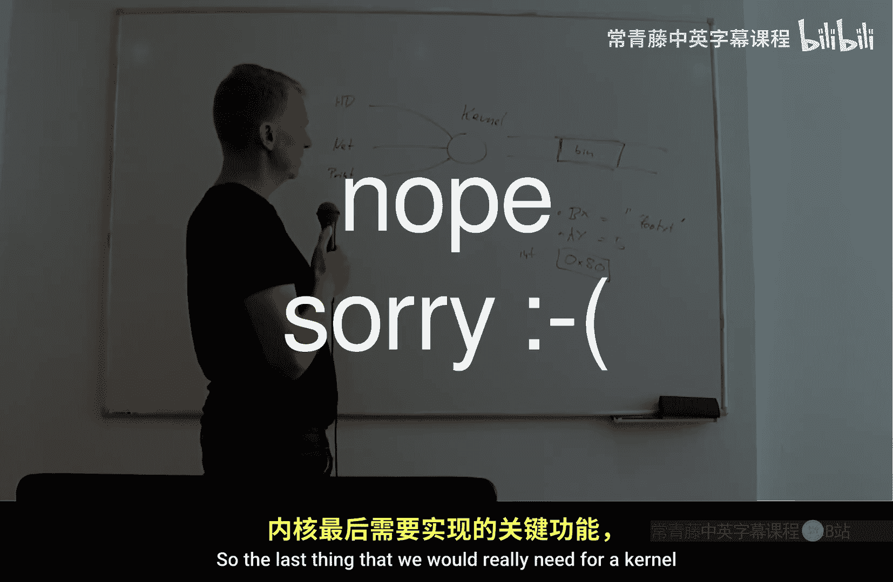

Okay， so yeah。Hopefully we'll have time for that。嗯。If so。

 then see you next time don't forget to subscribe so that you don't miss that video hit' like if you like this video and see you next time maybe and at least I think I I'll have time for the appendix for some。

For some network protocols， so。So I don't think this will be the last video at all， so yeah。

 see you next time。But。

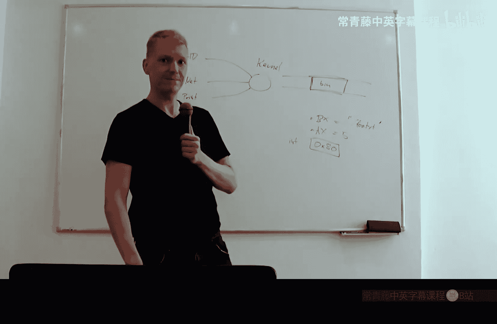