# WriteyourOperatingSystem【中英⚡编写你自己的操作系统｜Write your own Operating System】 p22 P22 Write your own Operating System A01： Ethernet Frames -BV1BDBEByEBY_p22-

Hello and welcome to the first appendix to the tutorial on writingriting your own operating system。

Now， as I've said in the appendices， I want to talk about these network protocols。

 although they technically， I think， aren't part of an operating system。

 but I think they are so important。That we should talk about them a little。

So what we already have is a driver for this AMD PC net device， AM79C973。

And we can send raw data with that and we can receive raw data。

And what I want to do today is I want to attach a handler for this raw data。And。

This should look at the raw data it gets。And decide。To which of the next protocols。

 it passes this data on。Okay， so as I've said， the Wikipedia page on the topic is really good。

You can see here how the raw data is。Its structured。So you get raw data。And the first six bys。

The Mac address of。As a destination。So this should be our。Mac address， if it's directed at us。

 or it can be0 X， F， F， F， F， F， F， F， F， F， F， F， F。So， that is a broadcast。

Which is sent to all the participants in the network， for example， when。

When you will turn on a computer， it sends a broadcast and tells everyone， hey， I'm here。

Where who else is。Is here。So then you have six bytes for the source who sent this data。

Then you have two bytes with a so called ether type。And then you have。But checks some。Four nights。

And in between that。There is the data。一。Okay， so。So we could look at the destination and see is this for us。

 And if so， then we could look at the ether type and say okay， it's if it's。806。

 although this is encoded in Big Indian， just like the other values also。嗯。So。If it's 0 x8006。

 then we give it to the ARP handler， if it's 800， then we give it to the IPV4 handler and so on。嗯。

And yeah but I want to do this again in a more object oriented way where I will have an array。

Of these handlers。 And then such a handler can。Can write itself into this area， so。Yeah。

So that we have this inversion of control paradigm again。

Which is very common in the object oriented program。Okay， so this is what we will get from the。

From the trip and we just have to look at it and decide where do we give whom do we give this to？

Yeah。So let's start programming this。😔。

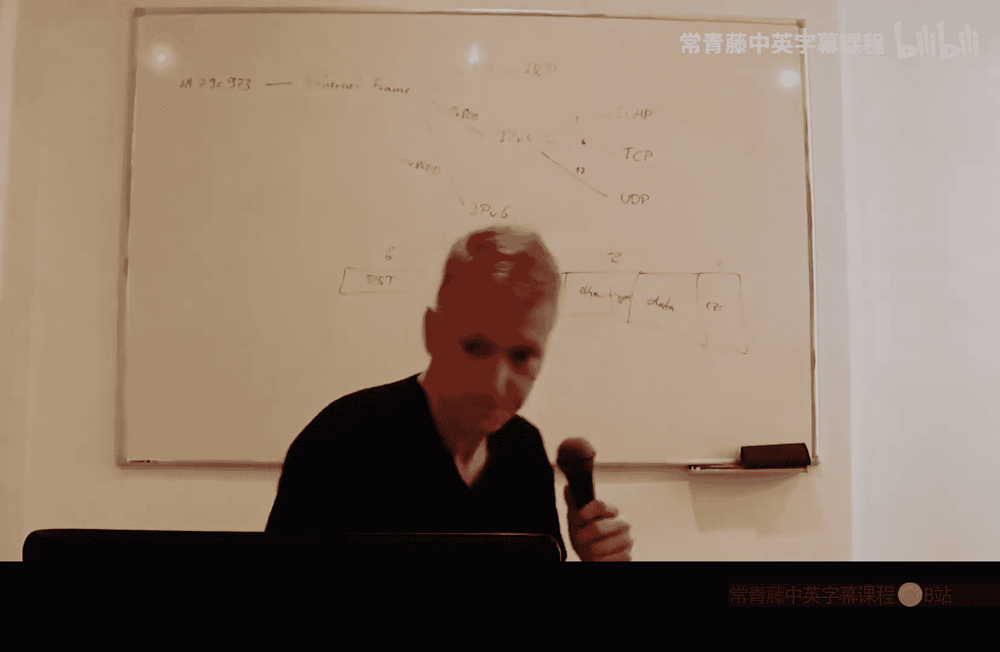

I will make a new directory here。😔，Yes。Yeah。Yeah。Yeah。そ。Okay， what I want to do now， actually。

 we should have derived the AM M 79。And so on driver from something， I don't know。

 either a net driver or something。嗯。So， but I want to impose this typical。

Event handling that we did with。The keyboard and the mouse already， so。嗯。

So this means we will do something like。Some raw data handflow。And in the。

In the driver for the network device， we will have。We will have such a handler now。And then。

 we will have。This passed through the constructor。😔，Although this isn't a good idea。

 actually the constructor is called in the PCI dot CPP。😔，嗯。In fact， I will do something differently。

😔，Yeah。嗯。Okay。Yeah。And then the constructor set it to zero。😔，Okay。Okay， so here we receive the data。

😔，And instead of printing the data。😔，I will pass it to the handleler。Yeah。Yeah。Exs。But yeah。

 we really should have derived this driver from an ethernet driver。

 which should already have this and。And then the raw data handler should have something like。

Like Ethernet Drive back end， because。

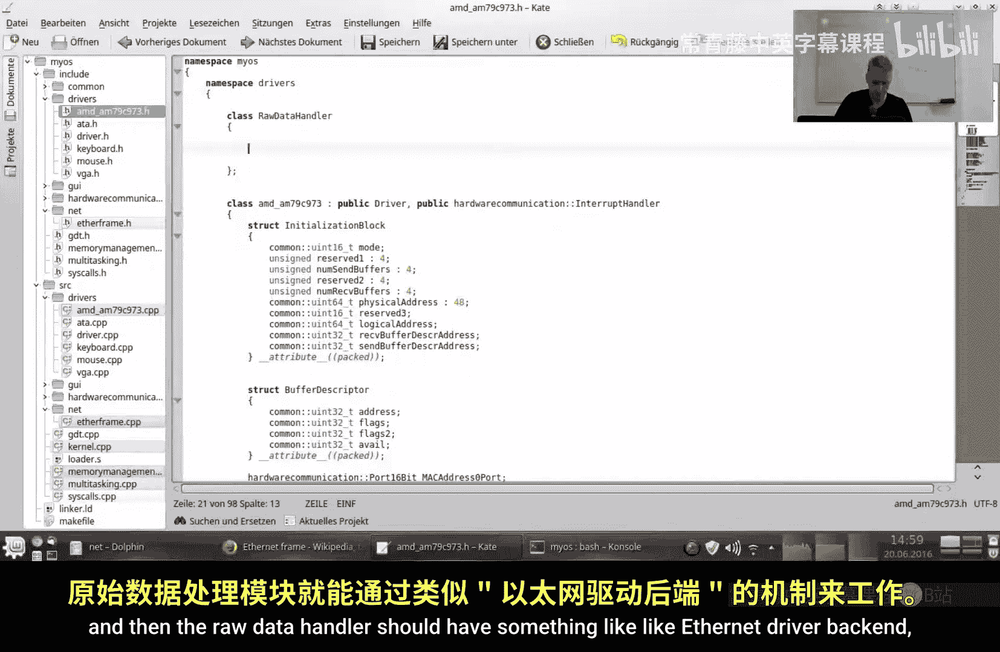

Unlike with the mouse and the keyboard， we actually want to send data to the device。So。

We also need the handlet to know。It's backend where it's getting its data from。

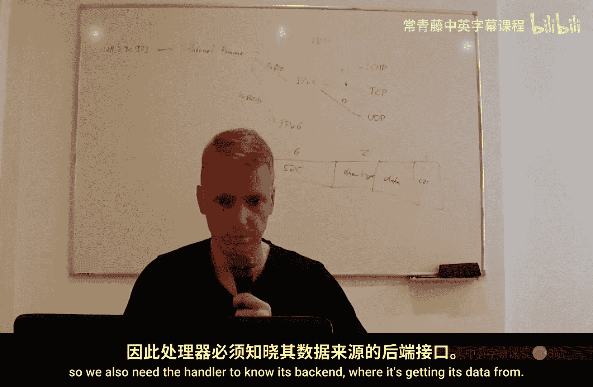

So as I said， this should not be the pointer to AMD and so on it should be a pointer to Ethernet driver。

Re base class of red class。嗯。

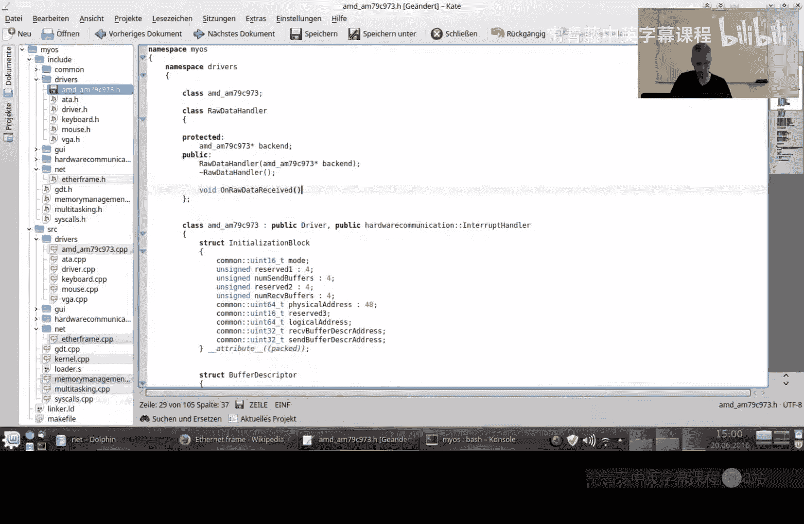

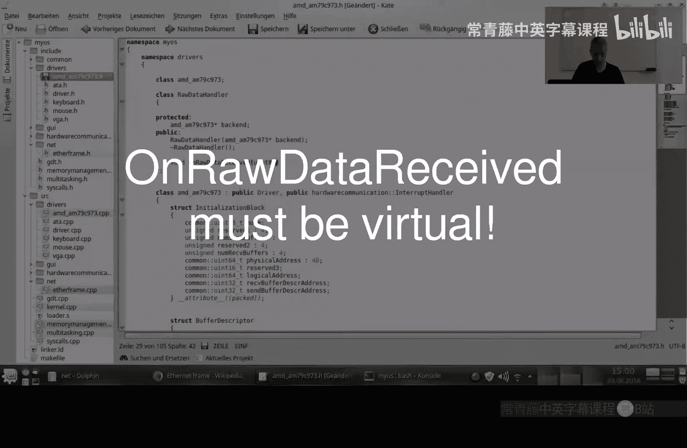

O。Yeah。Yeah。Okay， and this is where we will attach the ES frame handler。Okay。嗯。你。う。一。Thank。Yeah。Yeah。

Yeah。Yeah。So， we will have a way to。嗯。To send something to a destination Me address given in big Indian。

And this is a type。Yeah。你自。うん。不对。Yeah。次？Yeah。Okay。う。Yeah。Actually。

 I want to call the handler class Ether frame handler。😔，So that ARP。

 IPV4 and so on can be derived from that， and then this is called ESA frame provider。Okay。

 so the A ether frame provider will have a pointer to an ether frame or actually。As I said。

An area of point us。嗯。嗯。嗯。Yeah。Yeah。嗯。没。嗯。

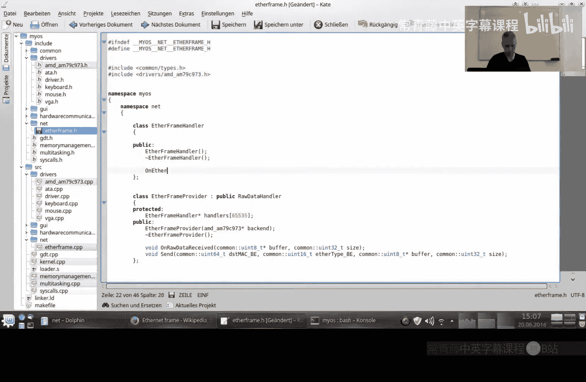

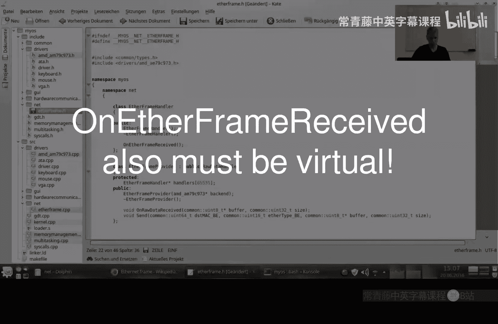

嗯。Thank。嗯。嗯。嗯。Yes。Yes。Okay， let's keep it like this for now。Yeah。Yeah。Okay。Actually。

 I'm going to change the return type to Bwill。😔，嗯。Because I want a simple way of sending something back。

Okay， so in the constructor first， I will call the base constructor。Yes。

And then I will set all the handus to0。好。I sub frame handler will get a UN and 16。😔，でもで。お？嗯。Okay。

In the distract， I will。Yeah， in the construct I will。

 I will register this handler in the ES provider。Okay。Yeah。是。Like this。And in the deor。

And willll remove it again。😔，し。And the default implementation of on ES frame received for just return faults because we are not sending anything back by default。

Okay。So if we receive data。😔，嗯。Yeah， Ill make a structure。

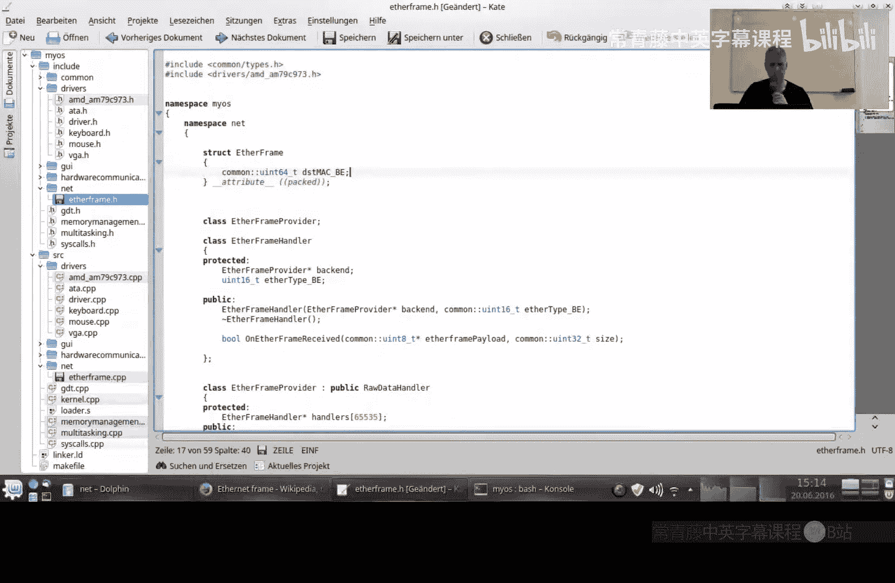

So' I'm gonna make a structure to lay over the header。

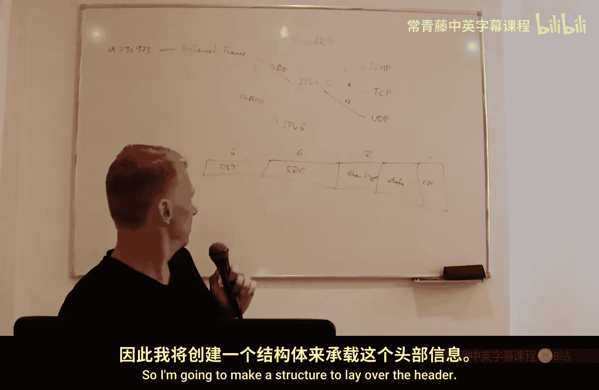

嗯。Okay。不し。Yeah。Okay。没什。Okay。So。So un rawaw data received。😔，嗯。Yeah。

 what do we do when we receive data we。はい。Yeah， we would put such an ES frame header structure over it。

Yeah。Yeah。Yeah。But we can do this only。😔，Wait， wait， wait， wait， wait， wait， to wait。😔。

I' making this pull on itself。😔，Yeah， so in the end， I want to。Sent this back on。So W。

So the raw data handleer already has to return a bullet。😔，Starting to get a bit confused here。😔。

So this is our raw data handline， and this needs to be boringing。😔，Yeah。ち。嗯。何？O。Yeah。Okay。Yeah。Okay。

When I。Think of points。Whats happened now？Okay。So I want is frame handler。😔，To get its。

To get its ether type， not in big Indian。So。Then we have to convert this two big Indian ourselves here。

😔，O。So， on our data received we。然，我。We put the ether frame header over this。😔，Now。Its the。

Frame destination。And。Says it's never。A broadcast， or it's really for us， then we handle it。Yeah。

So these are 12 Fs。😔，Yeah。Okay。嗯。う。Yeah。We a frame provider。The second of that was the A& D。😔，嗯。

So we need a way to ask for the Mac address。😔，And where was that。

 that was in the initialization block。😔，Well we have written it。😔，O。

So this isnet frame is really for us。😔，Then we look into the handlers and see if we have a handler file。

😔，For this frame type。やます。Okay。So we call handlers。😔，Methods。But we want to give it only the payload。

 only the data inside the frame。😔，So， that is。La plus。嗯。嗯。It， it's really。😔。

The pointer to the buffer plus the size of the。呃， head到。

And the size we pass is the size we've got minus。😔，This size。Like this， okay。嗯。Keep in mind。In the。

Driver for the network card。Yeah， we have。We have decreased the size by far。

 and this already removes the checkum at the end。So we don't have to remove the check sum manually here。

Okay， after this。嗯。Yeah， if we want to send the data back again。

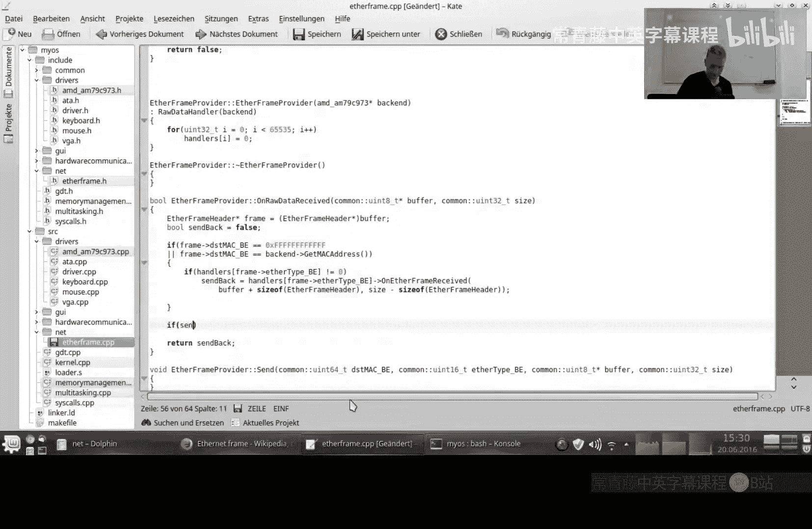

Yeah。嗯。So we have gotten this data。 Okay， now the handler does something on it。 Maybe， for example。

 the ARP handler writes it's。Its answer into this data and returns true。

 then what we have to do is we have to return true also so that the driver sends this whole data back but。

Yeah， we have to switch the source into destination。

So that the network understands that this is now going to the computers that sent us the request before。

But now we have another problem， is the destination。Could be。The broadcast address，0， X， F F， F，F。

 and so on。So what we will do is we will copy the source to the destination and set the source to our Mac address and then everything's fine。

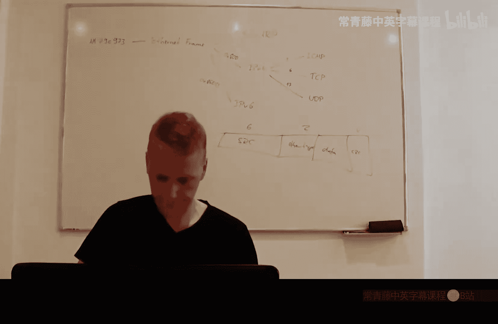

Yeah。So the destination becomes what has been the source before。😔，And the new source。Is ourselves。O。

This is looking good。Okay， I also want the send method for the。Is a frame handlelo。😔。

Which basically just calls the scent of the back end。Okay。So we will pass our own ether frame type。😔。

Okay。Okay， so this is looking good。一。Yeah。Now we still need the send method of the ESa frame provider。

😔，嗯。Here we will need the dynamic memory management。嗯。Yeah。う。嗯。Yeah。嗯。对。So， we get。

Memory for the header plus the size of the buffer that we want to send。嗯。Then， we impose。

Header on it again。Okay。So this is supposed to be in big Indian already。😔，And。

Here we do has a big Indian。Now we just copy the buffer from the data from this buffer to。

is this platform？Yeah。Yeah。嗯。Yeah。Yeah。Yeah。对。Yeah。Yeah。Like this okay。 and after we did that。😔。

We pass it to the back end。😔，O。So I think this should work now。😔，I know。

just included in the make file。😔，Yeah。ちんと？么看녕。嗯。Yeah。嗯。嗯。Yeah。Yeah。Okay， so we would not set。

 we would not send data directly now。😔，But we would instantuate。Such an is frameer。😔。

You have frame provider。Okay。嗯。And we wanted to attach it to。Yeah。Yeah， just the big end。Okay。

 so we still don't have any， oops， we still don't have any。嗯。Any way of finding the。嗯。Yeah。

 you know what， I'll just try some thing。😔，Yeah。So， Im。So 2。The broadcast address。安。嗯。Using。

The ARP protocol。But the bytes are switched because of big Indian and also it's not 0806。

 it's 0608 instead。

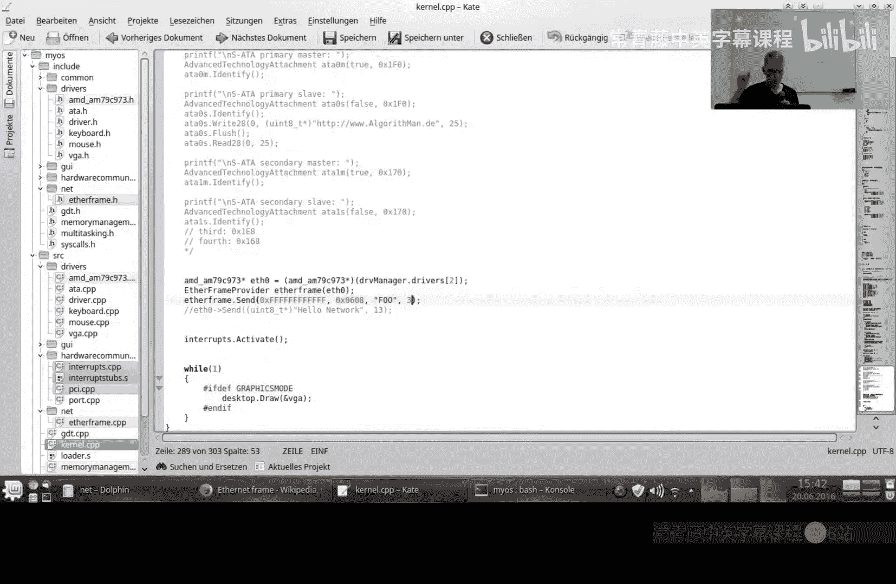

Let's just see if it's even comps。😔。

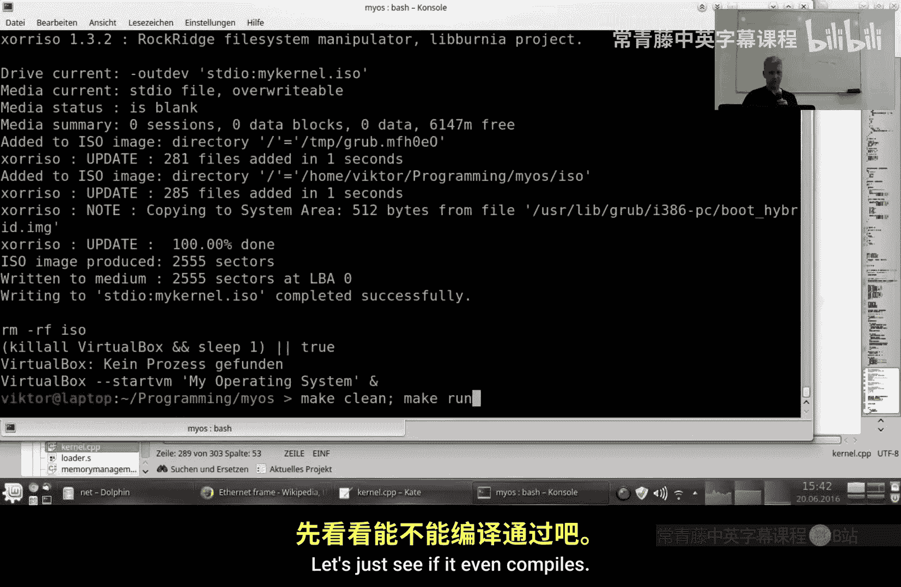

Okay。あるね。Yeah， the handler is。对。Turningning。The information。

 whether it's supposed to send the data back。So if we receive something。😔，能。If， if this。

Handler returns true， than we just。Sent this out again， so。Yeah。39。Yeah， it's protected。😔。

So I'm not allowed to do this here。😔，嗯。Yeah。Make Eha frame handler a front of the class。😔，とえず。嗯。Yeah。

Yeah。Yeah。Yeah。

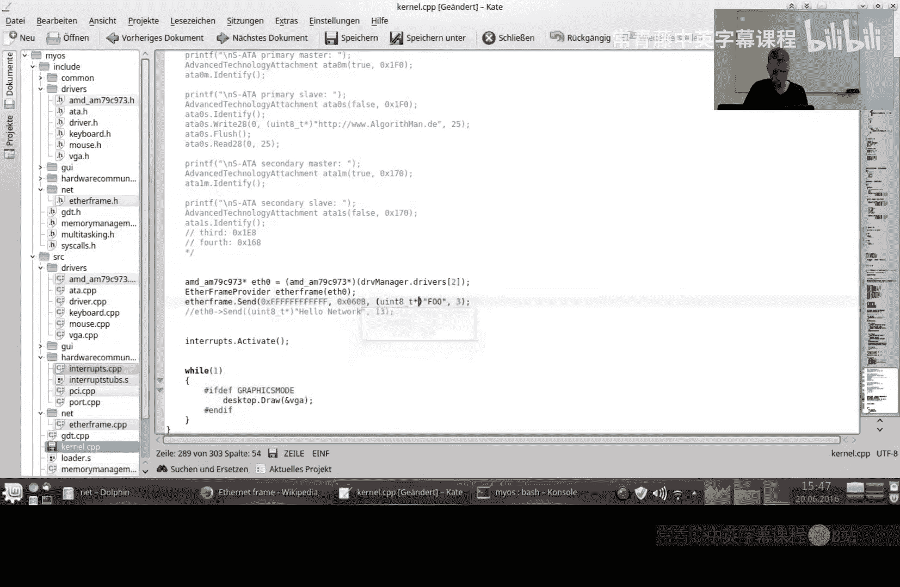

い。

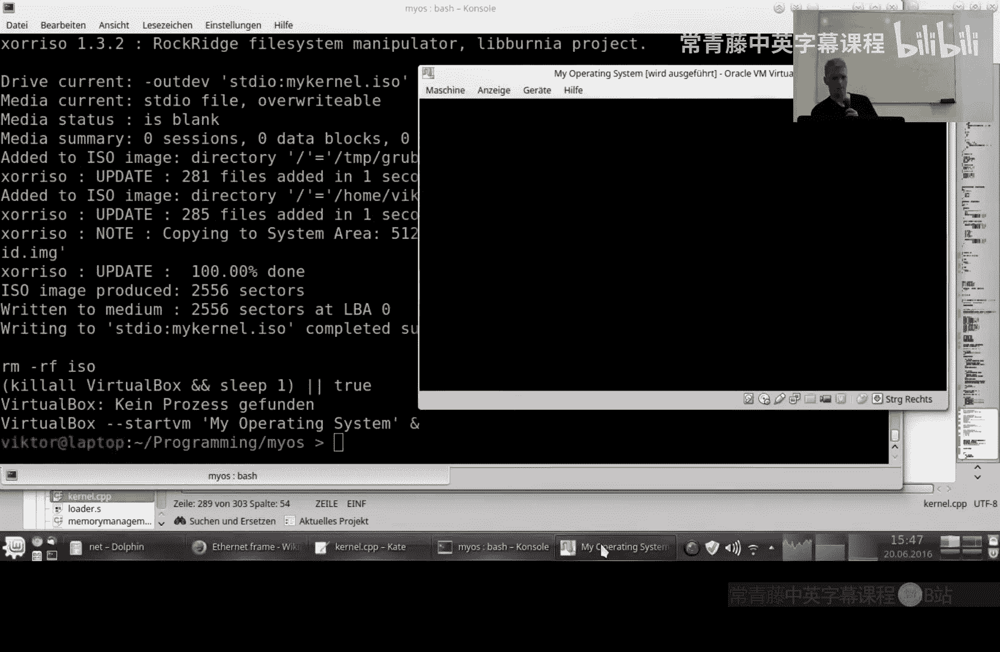

嗯。It has some problem with the instantiation of the driver it。😔，I don't know this。

 This doesn't seem to be a problem of the。E frame handler。 So I'm going to ignore this for now。

 and because this video is really long enough now。So。Yeah。

 I think this should be sufficient for today。Next time I want to talk about the address resolution protocol and hopefully this won't take that much time。

 I mean now that we have the ethernet frame， a lot of the other stuff we can copy from this so it won't be such a big trouble again I hope。

So yeah tune in next time， don't forget to subscribe so that you don't miss the next video and if you like the video hit like yeah and see you next time。

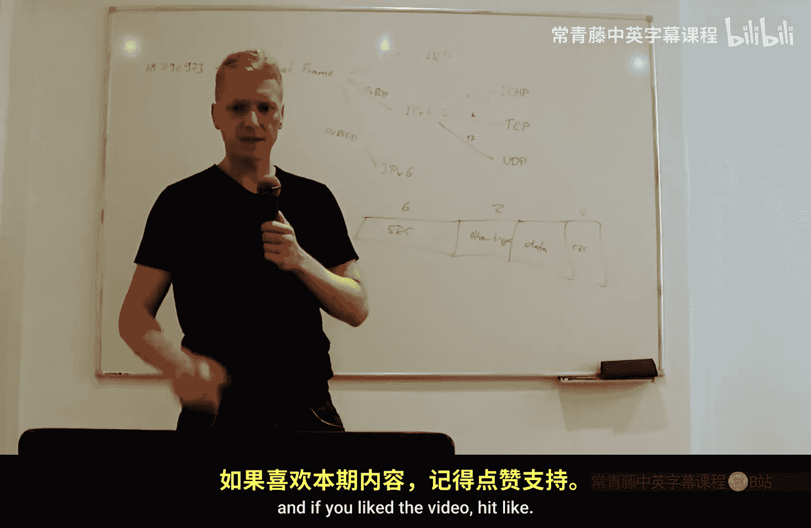

Right。