# WriteyourOperatingSystem【中英⚡编写你自己的操作系统｜Write your own Operating System】 p25 P25 Write your own Operating System A04： Internet Control Message Protocol (ICMP -BV1BDBEByEBY_p25-

Hello and welcome to the falsese Appendix to the tutorial on writing our own operating system。

So last time we talked about IPV form。Now we have this driver for the network card that Vibox offers。

We've connected it to a handler for Ethernet frames， which passes the data。To one of the handles。

 we already wrote。The handler for the address resolution protocol。

 at least the small part of it last time we wrote the handler for IPV form。

There's still this picture on the board here。And IPV4。

 the main thing IPV4 did was looking at this protocol。Bight and passing the data onto the。

To the next layer here。And yeah， we haven't written any layers so far。

 but any handlets for these data。But we will。Implement a handler for the Internet control message protocol ICMP today。

This is a quite simple protocol。I think it will really only take a few minutes to implement this。

In particular， because a lot of the stuff that we want to do， we have already done in IPV form。嗯。

Yeah。So ICMP is used for ps。And yeah， I think。Being able to ping is。

An important thing that you really should be able to do， so yeah let's code this。嗯。Yeah， again。

 the Wikipedia page about ICMP is。Again， very。Very good。 It tells us an ICMP message has8 bytes。

A type and a code。 these basically just tell us what does the sender of the message want from us。

Then a checkum， which is just the same， which is computed in the same way that the checkum in。

The IPV4 is computed， so we will just use。The check some method of。Of IPV form。

And then we have some arbitrary data， which。Might or might not have any relevance。

In case of ICMP pings。We are just supposed to send these4 bytes back。 Okay， so that's really。

 that's actually why it's also called an echo request。一平。Okay， so。So let's see。I mean。

 this is really simple， right， We only need a structure with28 bit integers，1。

16 bit integers and one 32 bit integer。So。没有。Okay。う。

So this will be derived from internet Pro handlel。😔，Yeah。Yeah。

We have to override an internet protocol received。😔，Yeah。And I will also。Implement a method that。

Requests an echo reply， Soing。あじ。And this is supposed to just。Take an。

IP that we want to ping in Big Indian。还有。Yeah。So。He。

We just have to make a little structure for this ICMP headers。So type and code。😔，Which tell us what。

😔，The send once from us。O。So。Mhhm。Yeah。We need the types， we need IPV4。😔，Yeah。

And I think this is already all we need here。😔，So as I've said， this is really simple。O。Yeah， so。

We need to for you。Aerometers。Actually， only the back end。

Which we just passed to the base constructor。Together with yeah， ICMP has the number one。So0 x，01。

And that's all we have to do for the constructor。Yeah， I told you there's this really simple。

 a simple protocol。Yeah。So if we want to request a ping。

We just instantiate such a message and set its type code， data and check them。

So type8 means it's a p。嗯。Yeah， the list here says。That the code must be 0， but I don't know it's。😔。

Somewhat。I don't care。It must be zero， apparently we'll just set it to zero。

Souds to those who understand why I set this data to this value。😔。

So you can set this data to anything else you want， but。Yeah， I mean， I I don't want to confuse you。

 So The reason why I said this is that the big Indian version of this is。1，3，3，7。

 And that's just something cool。

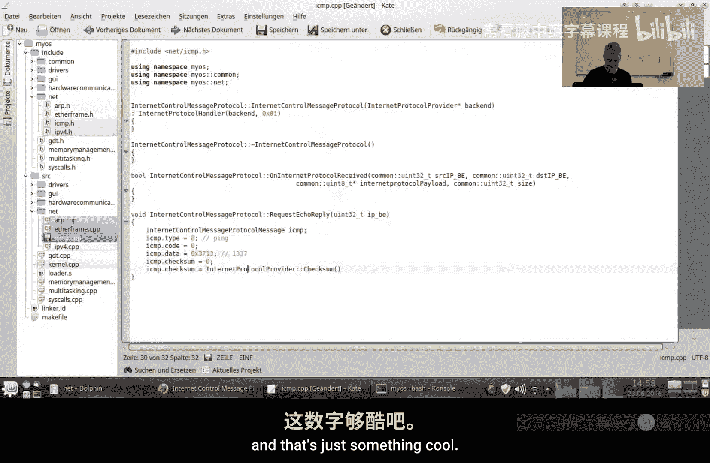

Because we are so elite now， right？

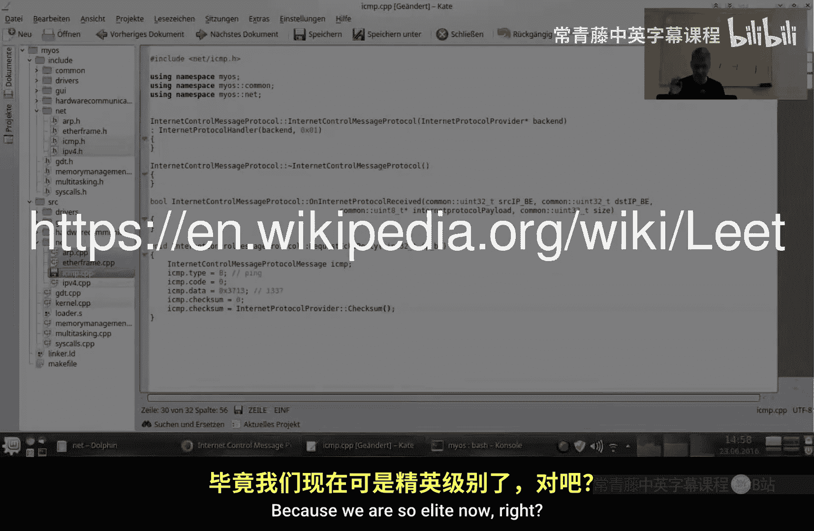

We are doing our own network stick。不。Okay， now the message is complete and then we can just send it。

And we have a method for that。😔，Dived from。Internet protocol handler。😔，So where do we send that？😔。

Yeah， we are。We have to give it an IP address， but the I address is。

Also given to us through the parameter。So we sent this message。😔，Yeah。Yeah。

 and this is the size of the message that we want to send。Okay。

 so this is all we have to do to send a ping。Now， this was really easy。I think。

And when we receive data。嗯。So。The message needs to be large enough for us。Yeah。

So we put the structure over the data。😔，And then we can just do this。😔。

So case0 means we have an answer to a ping。Yeah。不知道。Okay。Yeah。嗯。So here we will just say。😔，Okay。

 so this is what we get when we have asked for a ping。嗯。And8 means， yeah， as we've seen down here。

It means we are being pinkned。So what we will do now is。We would set the type to0。

 so we are turning this into a response。嗯。Yeah， the coach should be zero anyways。

And for an echo reply it。😔，嗯。Also zero， so we'll just leave the code the way it is because it should be zero and if it is then。

It is correct。Yeah。Okay， so we reset set the check sum to0 first and then。😔。

Computer checks them again。😔，And then we just return true because we want to send the data。F。Yeah。

 yeah， cool， this is all we had to do。So let's see。我。Yeah。嗯。Yeah。Yeah。

So this just gets a pointer to IPV4。😔，And I think that's all we need。😔，It is so simple。Yeah。

As this only takes。The I address。So let's see if this works。😔。

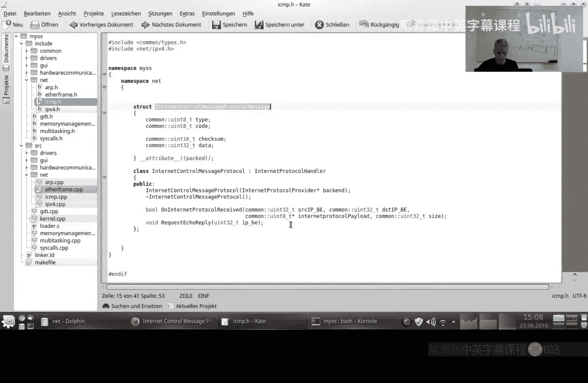

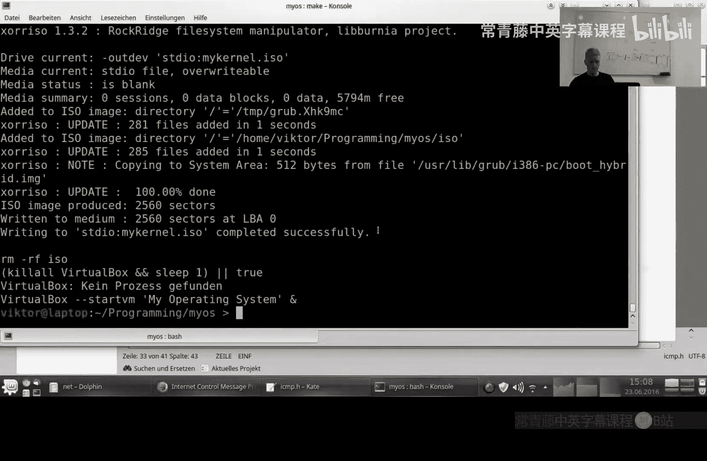

So， first， we do the。The ARP request， because we want to send something。To a machine whoses。

Whose me address we don't know？Then we get a response。And here。So， this is going to。嗯。

So this is a time to live。😔，Protocol1 is ICMP。😔，This is a trickum。😔，Sat IP address， destination。

 IP address。😔，So，8 is。Pin request。Coold 0。云笔。37。Should be a check some。

And this is the data that we send。

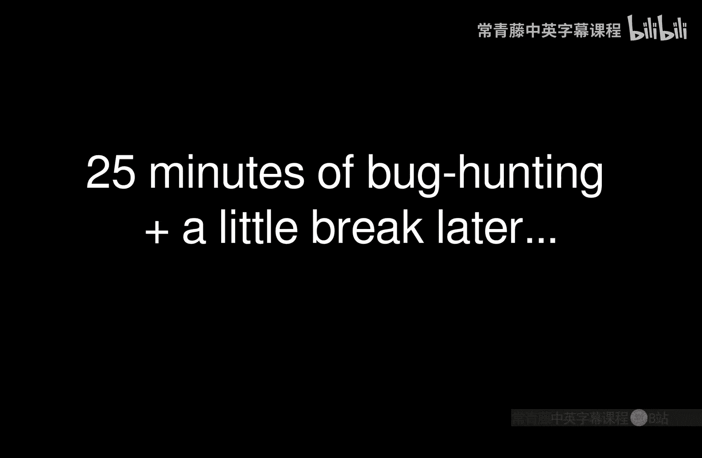

Okay， so I've found the problem。 The problem is that here in the checkum of the IPV4。

We need to take the bitwise complement of temp here。对啊。I heard stuff like that。😔。

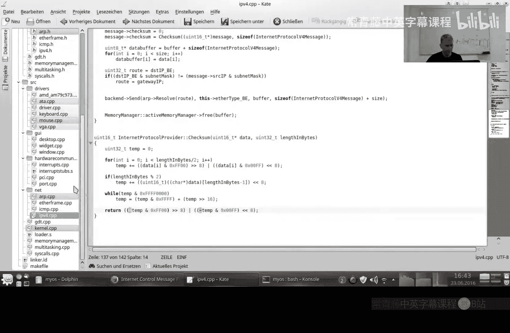

Okay， but now if we run this。By the way， in the meantime， I've changed the output a little bit。

To make it a bit shorter and more clear to read。So what you see here is we send an ARP request。

 this is the answer。Then， we send。The ICM p。But what we get instead is an ARP request to us。

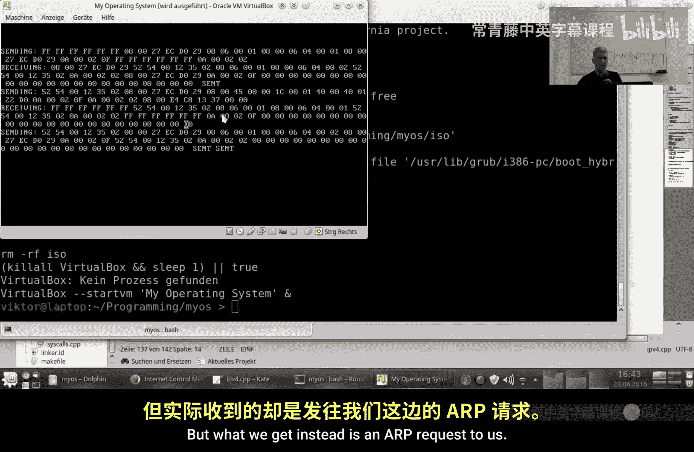

So the problem is the。😔，The gateway。The virtual Gateway doesn't know our IP and Mac address at this point。

So。

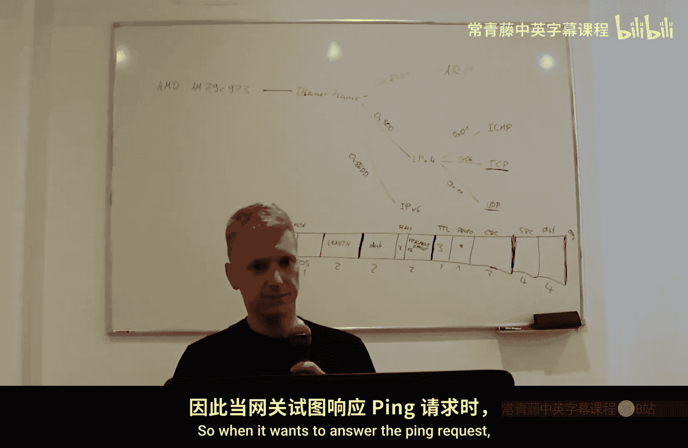

When it wants to answer the p request， it cannot do that because it doesn't know our。

IP and Mac address so that's why it sends this broadcast message。And okay。

 here we answer this broadcast。But we still don't get an answer to the ping。

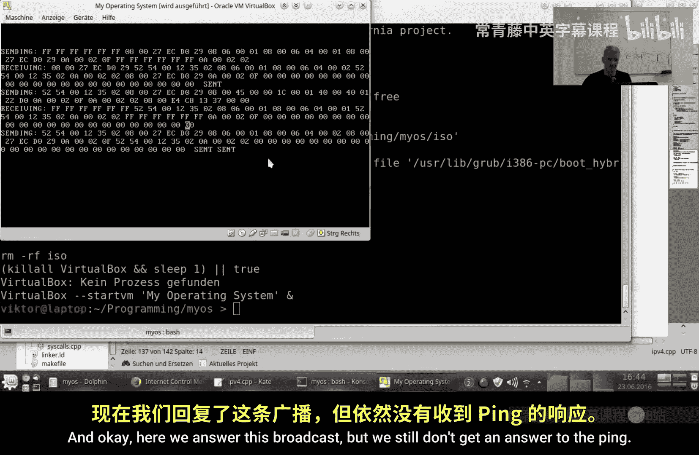

So yeah， as I've said， the problem is that the gateway doesn't know our Mac address。

So what I'm going to do now is。In the ARP， I will add a method。

To explicitly send our Mac address to some machine by doing a fake。ARP response， you know。

 a response to a request that hasn't been issued。Yeah。Yeah。Okay。

 and the implementation of that is very simple。I'll just copy the request。😔。

So we take an ARP message。😔，Hardware type Ethernet is correct IPV4。

Sizes of Mac and IP address are correct。But we are not doing a request， we are doing a response。

Soce Mac， source IP， these are correct。And here。We resolve the I P。Address。First。

 so this will issue the。The first ARP request。 And when we get that back， then we send。Our own。

Mac address and I address to。That machine。Okay。So in the corner。Yeah。

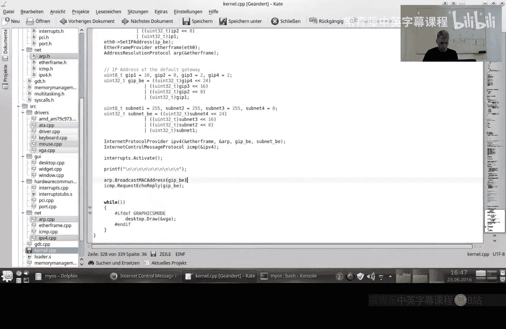

So like this， we should。😔，We should tell the gateway hour。😔，IP and P address。Before doing the ping。

Okay， so。ARP request， ARP response。Then we are sending our fake ARP response。And here is now the。

ICM批评。And here's the ICMping response。So I， I can head on。Sender recipient。Yeah， before we had 0，8，0。

0。 and here we have 0，0，0，0。 check some， check some and the。Raw data。

 And that is a ping response as the ICMP module tells us。 So yeah。

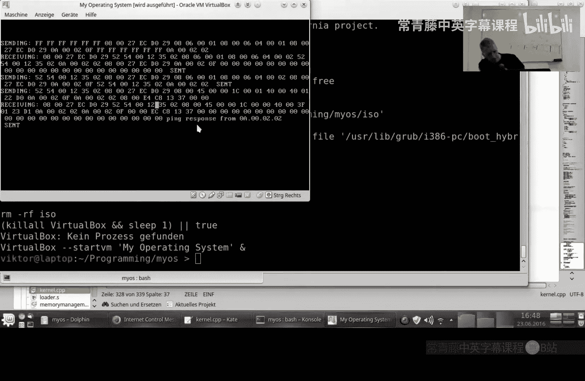

So now you can do ICNP pings。Yeah， I think that's quite cool。Definitely something that you。

That you need。Yeah。So that's all for today。Tune in next time I haven't decided what I'm going to do。

 Maybe UDP， although UDP is relatively complicated compared to ICMP， but。

Quite simple compared to TCP。Yeah， but I also want to do a little bit about file systems and partitions。

 masterboard record。嗯。I think we will not have time， probably for。For the user space， unfortunately。

 but there's a good tutorial on OSd。org。So you will have to look into task state segments and ring0 R three for this。

 but okay so。

So yeah， whatever， no matter what the next video will be。

 hit subscribe so you don't miss the next video if you like this video hit like。And yeah。

 see you next time， right？

