# WriteyourOperatingSystem【中英⚡编写你自己的操作系统｜Write your own Operating System】 p27 P27 Write your own Operating System A06： Transmission Control Protocol (TCP) -BV1BDBEByEBY_p27-

Oh boy。 What have I gotten myself into this time。So I didn't plan to do TCP。

 I thought I would only talk about some。Theoretical basics of it， but。Yeah。

 I've found a little bit time for it。😔，And because TCP actually is the most important of the。

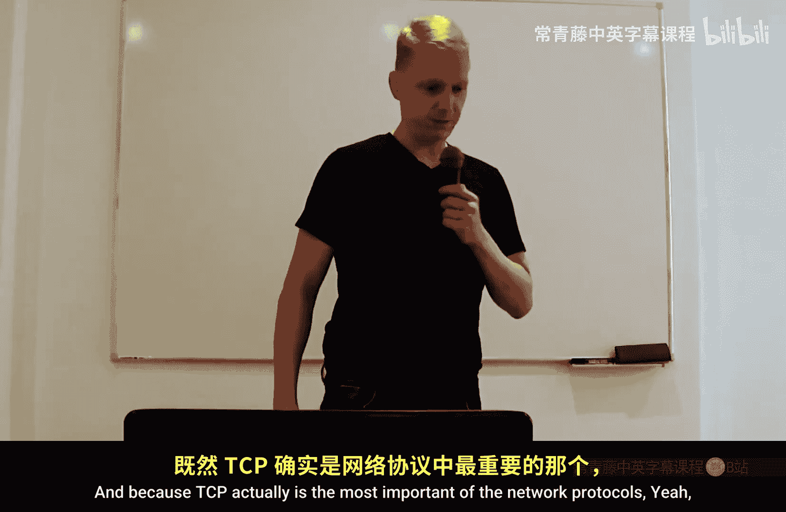

Network protocols。Yeah， today we are going to talk about TCP and actually implement it。

At least a little something that's kind of compatible to TCP。

 we won't implement a complete TCP implementation。

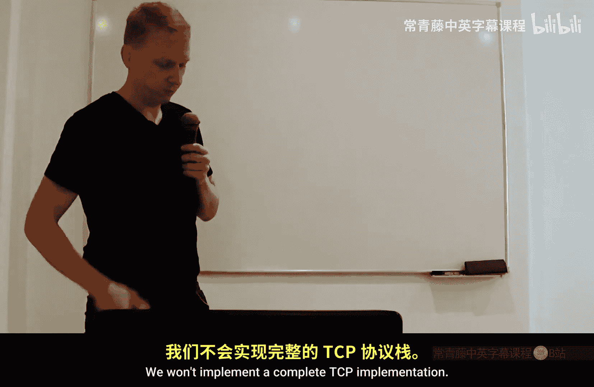

嗯。

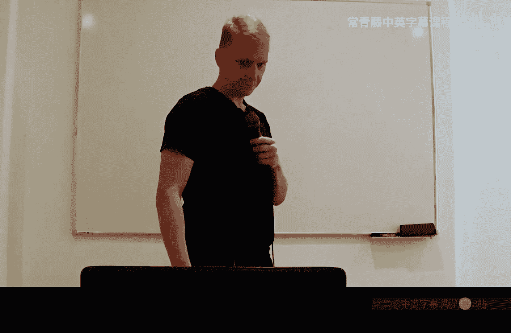

Yeah， so as always。The Wikipedia page about TCP is the transmission control protocol is really good。

嗯。Very interesting， as usual， is the structure of the header here。

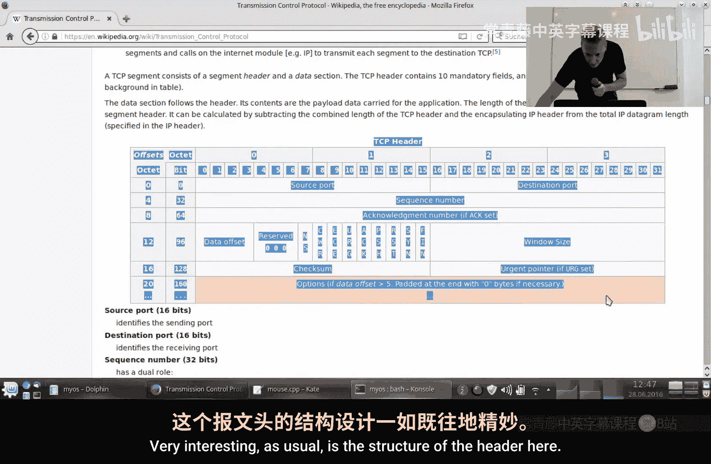

So。

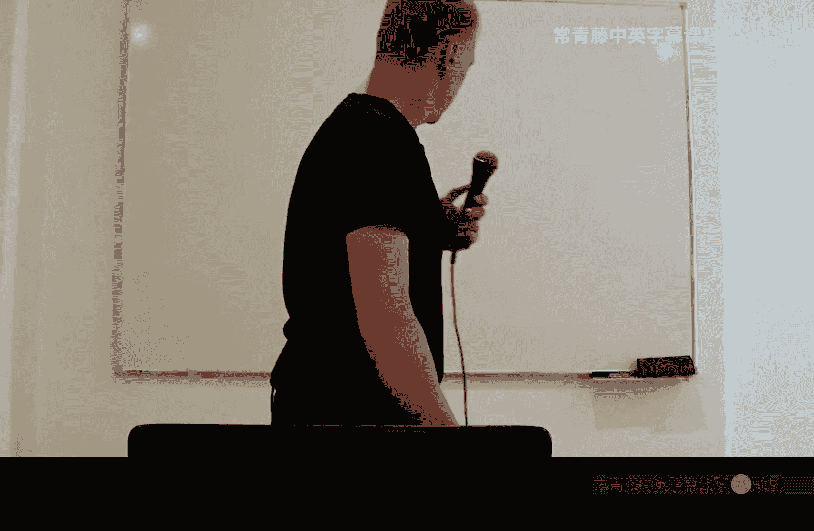

Yeah， but let us talk about some theore stuff first。So with UDP。

You had the problem that your data might arrive in the wrong order， or it might arrive， not at all。

So yeah， that's that it's okay if you do something like video conferencing and yeah a lost packet will just cause a little glitch on the screen。

Yeah， if two packets are the other way around。The screen might be might have two areas switched or something。

 although I think。Yeah， I think video conferencing tools probably sent some information。Which says。

 which gives the packets an order。 And if a packet arrives too late， then。It's probably dropped。

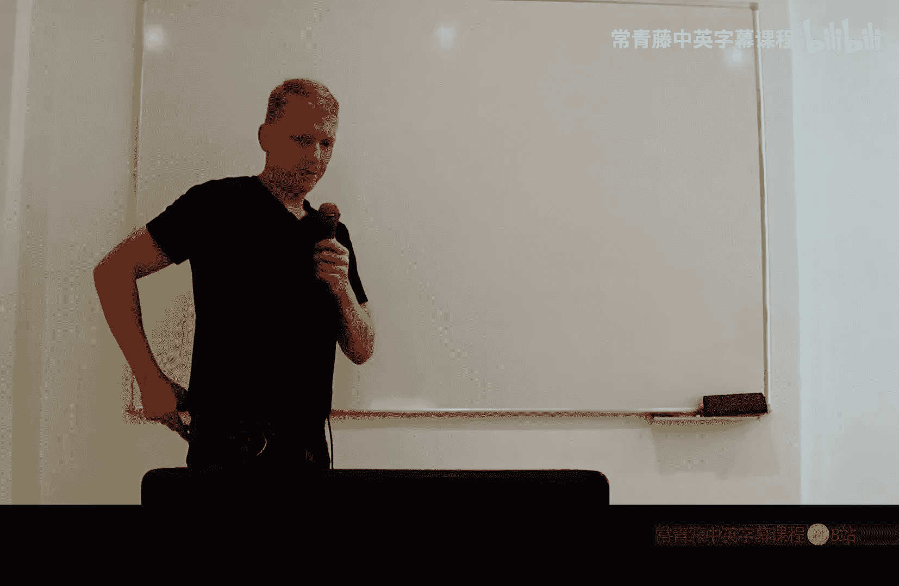

嗯。Yeah but TCP is different I mean the problem with UDP is that it operates on IPV4 and the IP network is unreliable so it gives you no guarantee that things you send actually arrive and it gives you no guarantee that things arrive in the correct order。

Now TCP also uses IPV for。Actually， that doesn't make sense。 You know。

 if both of them use the same protocol， how can one be reliable and the other one not。Well。

 the thing is that TCP。From。Additionally， I mean， TCP also has this stuff with the sockets and the partss。

 but。Yet， TCP has。The following behavior。So here's the Ram of the sender。

And here's the Ram of recipient。Of the message okay。Now the sender sends the message。With。With IDs。

 say 1，2，3，5。And the send is required to store this data。For some time。

 So let's say we send all this data to the recipient。 Okay， and the say the first packet arrives。

Now the recipient sends the information， hey， thank you。

 the first packet has arrived and then the sender is allowed to delete this from his memory。ok。

And now let's say two and three arrive in the or let's say。嗯。Let's say three doesn't arrive at all。

 four arrives next and two arrives after four。 then what happens is it would say okay。I have four。

 so I will store it over here。And then I get two。 so I copy it here。 and now I see I， okay。

 so the next block of this message。So now I can。Sent the message。 Okay， I have gotten number 2。

So he can delete that。And then after some timeout， Cacenda decides that after a timeout。

 if it hasn't got an acknowledgement for number three， it resends it。

 so then it resends number three。Now number three arrives， he copies it here。

 acknowledges number three， acknowledges number four。Then啊。

You can delete that and now number five arrives。系咯。Yeah， maybe it has arrived earlier， but whatever。

 so。So that's really the point of TCP that you have these。You have the sequence number。

 which tells you in which order the packets。Are supposed to be handled。And yeah， if。

If things go wrong， it reorders the stuff it。And if something gets lost， it's retransmitted。So。Yeah。

 but for security reasons， because you don't want a malicious attacker to send TCP packets。

Pretending to be you。 So it's， I mean， it's not a great way of protection against that， but。

Before we have any transmission， the sender and recipient agree on an offset with this。

With is sequence numbers。So we don't start at 1，2，3，4，5。 We start at。42， 43， 44 and so on。

 and yeah just to prevent malicious attacker from sending TCP packets。嗯。And。

Claiming to be the send up， okay。So that's one of the reasons why we have this。

This relatively well known TCP handshake so when。嗯。I mean， in UTP。

 you would just send data to the recipient。And yeah。

 if the recipient doesn't even have a server running， it will just drop these packets。

And you won't even be notified about that。So， yeah。

 a difference between another difference between TCP and UDP is that when。

When you connect to a different machine， you don't just instantiate a socket on your machine and that's it。

 you also send the data to the server and say， hey， I want to connect to you。Okay， so。

 and if there is no server running or the server is not。Doesn't agree。

 So maybe you're on a blacklist or something。 then the server will tell you no you are not connecting to me。

 and then you will know that you cannot send data。Okay， and that's。

This relatively well known TCP handshake。Here is your server， heres your client。😔，So。

 the client first sends。A message。Soon for synchronize， with this message it sends this offset。Then。

The server sends a message。Synchronize and acknowledge。And transmits its own offset。 You know。

 they can have different offsets。These offsets should actually for security reasons。

 they should be random， but we'll just have a hard coded offset。Yeah， and after that。

 the send the client sends。

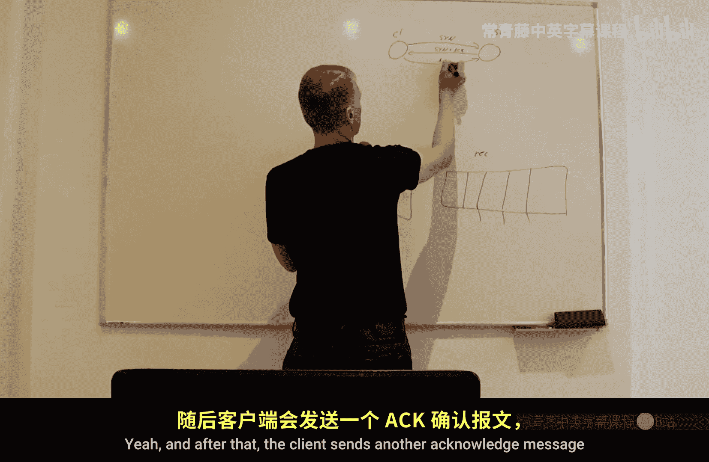

Another acknowledge message。 And then then the connection is established and。

Both sides can communicate with each other okay。So。嗯。Yeah， this is how the TCP handshake looks。

And when you have an established connection。The graceful disconnect。 I mean。

 there is also an ungraceful disconnect， but the graceful disconnect looks like this。

The one who disconnects sense of f。When。The other part， I mean， at this point。

 there's no actual difference between client and server anymore， so。嗯。

The one who wants to disconnect sends a f。Then the other one sense and。Acknowledge for that Finn。

After that， it。Also send a f。😔，And then the one who wanted to disconnect sense。Another acknowledge。

And then the connection is terminated。Okay， so。In practice。

 it's common not to send two different messages for this acknowledge and this f here。 So in practice。

 you just send both with one message， So F and a。And yeah， why is that such a complicated disconnect？

So。When he sends a f。Then he knows， except for this final acknowledge， he won't send any more data。

Okay， so this f means I'm not going to send any more data starting now。Okay。

 so when that fin arrives and except for this final acknowledge message。嗯。He can now be sure that。嗯。

He is not sending anything after as a Finnin。So he can start a time out。

Of two minutes and after these two minutes。Every packet that has been sent by the sender。

Either has arrived or is older than two minutes because it must have been sent before this fin。Right。

 so。Then it's older than two minutes。 And if it's older than two minutes， it's。

It should have been dropped by the network and it will have been dropped by the network。

So after this time out， the the other other side knows。Okay。

 there won't be any more messages coming from him。I mean， they could before this time out。

 there could be messages that are just late， but after this time out there won't be any more messages and then he can reuse the port number in the socket。

Okay， so。Without risking that any older messages from him will go to a different application that。

That is actually now communicating with a different guy， okay。And it's the same on the other way。

 on the other hand， so。When he sends his thin act， then he can start his time out and say， okay， if。

If I。Have it F now I can start this time out and after two minutes， I know there won't be anything。

Coming from him anymore。So I can reuse。😔，This。As these resources。O。

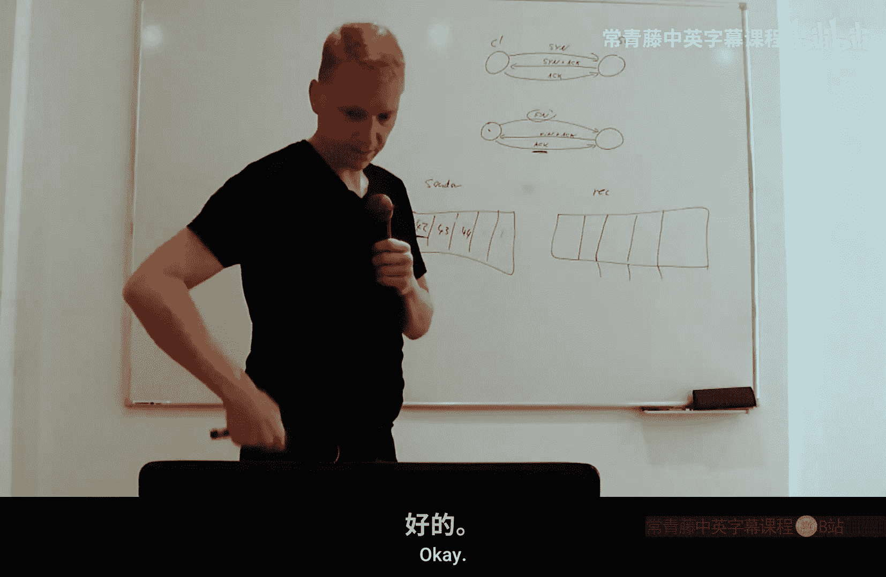

So。Yeah， if you take this。

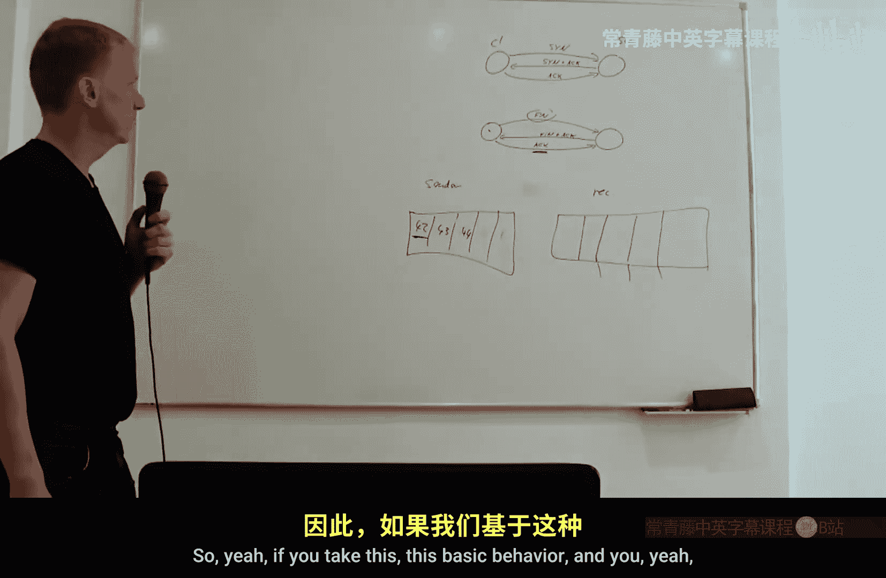

This basic behavior。嗯。And you。Yeah， you make a diagram of。What can happen when。

 when can you get which of these messages。There is this nice diagram， also relatively well known。

Here。

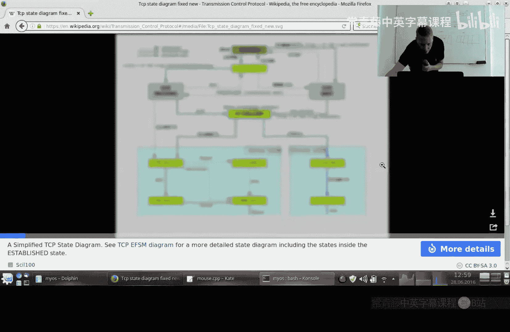

Which shows you different states that such a socket can be in。 It starts out closed。

Then it can send us soon。Receive us an act and send another act。Then it's established。

Or if you are the server， you go into listening mode， you get a soon send us an a。

 go here and when you receive the a， the connection is established。You all this is just。

Just what happens here。

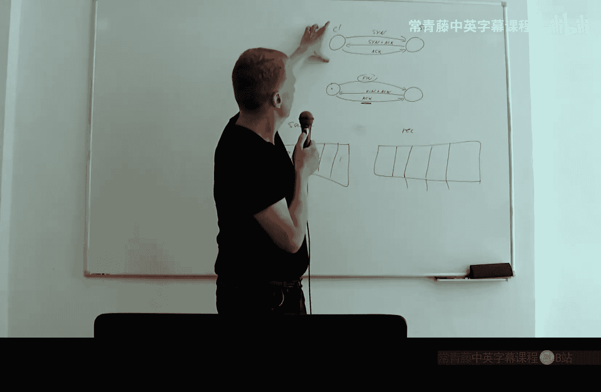

On both sides。And from an established connection， when。When the other guy sends a f， you send an arc。

嗯。You get a f and an arc。You should send also a f。😔，And receive an a。Yeah， it's a bit strange here。

 but whatever。😔，And here， on the other hand， if you actively close。The connection you send a in。Oops。

You actively send a f。Receive an a。Then you receive another Finn， and sent。Another act。Okay。

 and this state here only。Onlymni occurs when。When you send a fin and the other guy also wants to close a connection and has already sent also a f。

 so you have sent a f， you receive a f， then you go into that state。嗯。Yeah， but。Yeah。

So this is how that works。So， let's。Let's look at this。At this TCP header。So what do we have now。

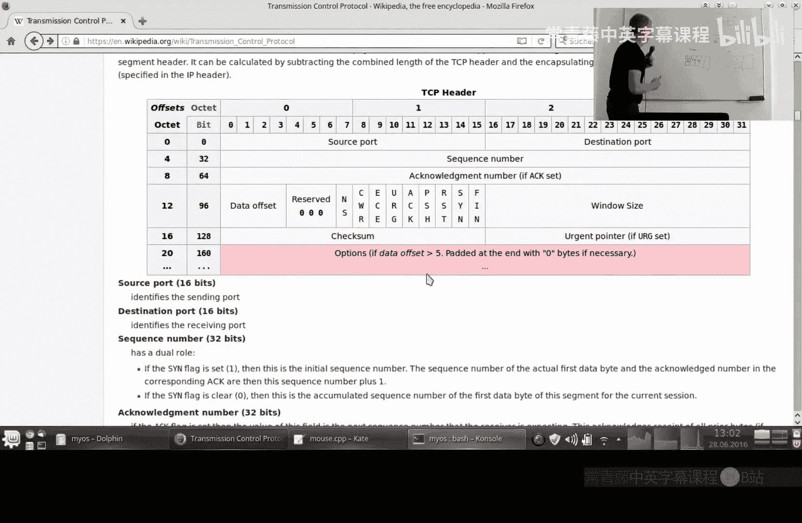

おり？

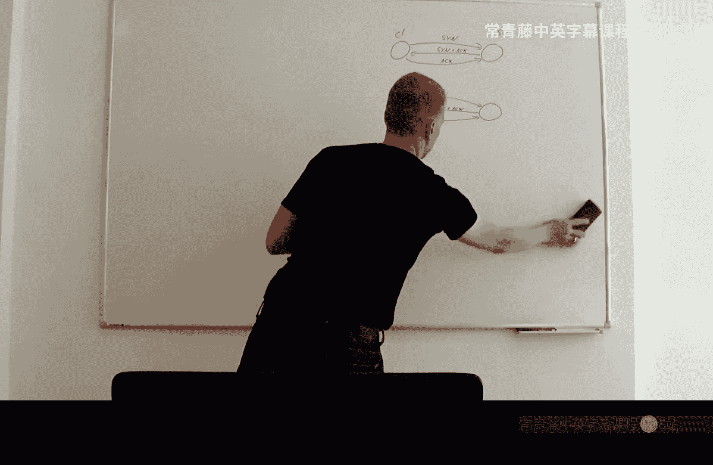

Okay， you have two bys for the。For the part of the send of the message。Two bys for。

Pt on the destination。Side， then you have。4 bys for this sequence number。You know。

 this I D in this where， where am I in this。Stream。Then。An acknowledgement number。So when you send。

Some data。 and the recipient has gotten the data。 It will send you an acknowledgement number to tell you。

 okay， now you can。Now you can delete this much of your preferred message。

That's in this acknowledgegment number and the sequence number is telling is the thing that tells the recipient。

 hey， this is packet number 44 okay？So sequence number， acknowledgement number。

Then you have four bits。Which。Give you an offset。So the size of the header。But in。

But this is just a fourth of the actual size， so the size is counted in 32 bit integers。

Then you have three reserve bits。😔，Then you have nine bits。😔，For flags。

These basically contain these Sac， fin， and some other flags。Okay。Then after that。

 you have two bytes for a so called window size。This is， for example。

 if the recipient is just a little tiny device。

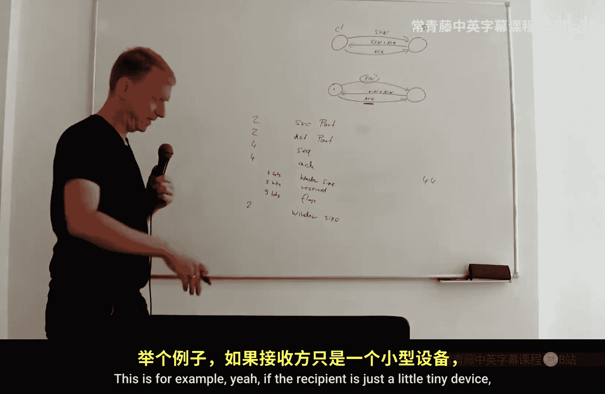

Using this number， he could tell the sender， please don't send too much at once。 Okay。

 give me small chunks。 I don't have so much buffer to。Two star， I don't know，10 MBby。

Before processing it。嗯。Then you have a two by to check some。Then you have a two byte urgent point。

We will ignore this Yeah， one of the flags is the urgent flags and if that's set。

 it means it basically means hey。Over here in this message。So。So here's a TCP message。

 and one of the flags says， hey， I have some urgent data and this urgent pointer says。

Over here is the urgent part。 so you can process this whenever you want。 But this。

 you should process immediately。ok。And then after that， you can have。You can have some options。😔。

Just like with see IPV 4， but。I don't think we'll be。Using Z in any way。

The computation of the check some is really complicated， I'm not sure I'm really going into that。嗯。

But yeah， well， I mean， when you look at this， it mostly makes sense， I think。嗯。

From what I've told you， you know， source port destination port sequence number。

 acknowledgement number。Yes， it's window size， we will basically not really use the urgent pointer we will basically not really use the check is a checkum。

The header size is an offset。To the payload and。Yeah。

 the last thing we should talk about before we start implementing this are these flags。

So what are these flags？😔，そ。Where first there are。3 flexs。And S。

 I don't actually know what that does， and I think the Wikipedia page only says that it's somehow experimental。

Then CWR and ECE。And they have to do with congestion control。 So if you send data and。I don't know。

 your proxy server。Is under heavy load。 It might tell you， sorry， I can do it right now。

 S this later。 Okay， that's。For this， but we will ignore that。Then there's this urgent。

Flaag that I've already talked about， which tells you that this urgent pointer should be used。

But we'll also ignore that。And then are the more interesting flags， the knowledge flag。

Which tells you， hey， this is an acknowledgement message。

So you can remove this many bytes from the buffer。You know only if the X flag is set only。

 then this number is relevant。嗯。Then there's the PSH flag which basically says flash your buffer。

 so if you if you have buffer your data， then PSH says so now you can something like okay so the complete message is so the whole message is now complete so you can now。

Process it。So it's something like a flush， flashy buffer message。Then there is an RST。😔。

That's a reset flag and that's， I mean， this was the graceful disconnect。The RST flag。

 the reset flag is for an ungraceful disconnect。 it basically says。Don't send anything anymore to me。

 This is， for example， what you get when you try to connect a server that or try to connect to a computer on a port on which there is no。

No socket listening。And then there's a syn synchronize and。😔，So finalize。😔，Son and Finn here for。😔。

For the handshake and the grace will disconnect。O。So let's code this。

 but I'm warning you this is really going to be a lot of code。Yeah， so look at this。Okay。

So these are certain pages of code。

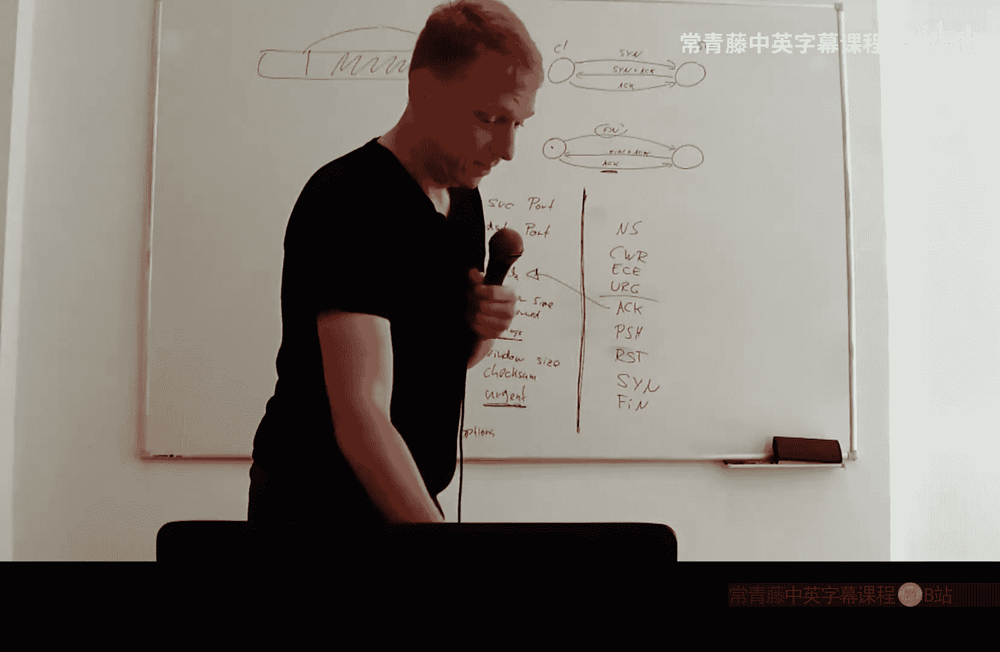

唉Oh boy。So I guess this will take really some time。 I guess it will take about。Two or three hours。

 but yeah， let's do this。

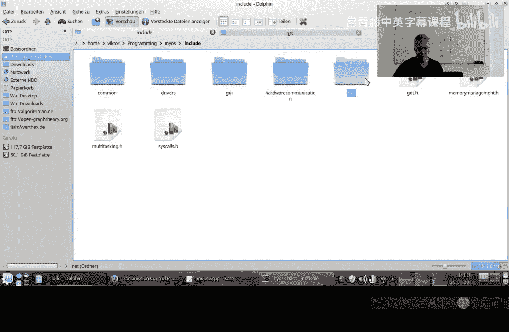

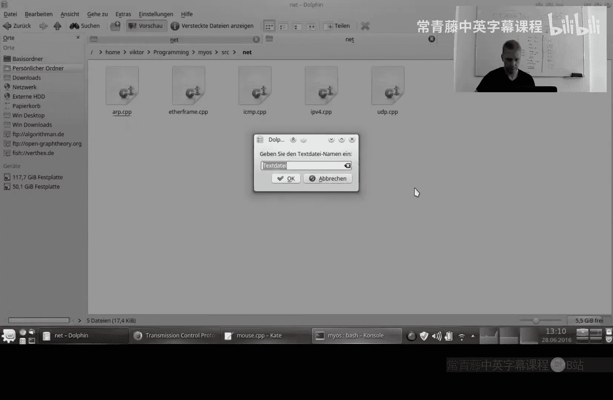

Actually， I'm going to copy a lot from the UDP protocol。So。😔，う。Okay。あ。Yeah。えそ。Yeah。Yeah。嗯。Okay， so。

Andor has。Andandler can receive。Raw data。From。Aticically socket。

A socket has a back end and a handler。😔，The listening will be done in a different way。Now。

 we'll have to change this a little bit。😔，老脑子。ok啊。TCP has the IPV I D 6， not 17。

But we'll reuse all the stuff with the sockets。 So here we set all the sockets to0。

Well have a free port。This is what we do when we get an IP message。😔。

So this is where we will where we will spend the most time because。Yeah。

 for a lot of combinations of these flags， we'll have to implement different ways of handling this。

Depending on。The state in this state transition diagram。That we have here。😔，あ。

So and the connect will look a a bit differently。😔，As a listening， the disconnect。路 sent。Okay。

 binding will stay the same。 sending， disconnecting， listening。Listening will be relatively similar。

 but。Yeah。Okay， so connect， receive。😔，Sent。And listen， these are the things that we have to go into。

And the first thing I'm going to do here now is。😔，I'm going to make。系啊。Yeah。

An enumeration for the states that you have here。So every socket will be in one of these states。

 a closed state， a listen state， and so on。嗯。う。う。う。うに？Okay。うん。ゆ？Yeah。Yeah。O。すな？

So the header looks differently。 we have a source pot destination part。A sequence number。

Acknowledgement number。😔，Okay。Okay， a socket。Has a remote part， remote I P， Local part， local I。

It has a back end， and a handler， and。Yeah， now it， it doesn't have this listening。

Wully in value it instead has。嗯。Yeah has， such a state here。So。

First thing I want to do is just change this listening。Method。Yeah。So local part， local I。😔。

Why am I doing it like this？😔，Yeah， whatever太 thought。So when I'm listening on a TCP socket。I don't。

 So Ive， I've removed this。This listening b， which I just had to set to true。 Instead， I will just。

あの。Set its state to listening。😔，So that's all you should have to do for listening。😔，Yeah。给你。Okay。

 let's look at the sending。 I think that that's。Not that hot。我。い。On the other hand。

 I think connecting and disconnecting is probably。Yeah， okay。

 we will need to send for both of them anyways。嗯。嗯。Yeah。Yeah。So we instantuate a socket。😔。

Set its remote plot to the part。😔，So we want to connect to local port we are on。😔，Hot。

我哋系 p local i p 。And then switch the。Endiumness。So we have to set the state， I mean， in the diagram。

 when we connect ourselves， we go to we send the Z and go to the Z sent state。😔，Yeah。Yeah。

 but I will actually send so soon。😔，Only after the socket is connected to the TCP。Second end。

Because otherwise， yeah， maybe we could。 We would already receive a。An answer that we wouldn't get。

If we sent to the soon before。😔，Setting the handler correctly。お。Yeah。Okay， the back is sent by this。

😔，We set the remote address， remote part， local address local part。😔，嗯。Yeah。

 we need to store our own sequence number。In the socket。Yeah。Yeah。嗯。So the。As a soet needs to know。

Which number to send next。😔，As the sequence number。And I will just set this to this。So this funny。

Ex word。So we put the socket in the in our list。😔，And。Then， we should send。😔，On the socket。No data。

But。😔，Asynchronous。What is a synchronize， Okay， where do I define that。😔，嗯。うはい。Yeah。Yeah。对。Yeah。い。

Okay， so this already looks nice， I think。So， here we send0。😔，0 by of actual payload data， but。Yeah。

 we need to change the scent so that it also。Acepts。嗯。Yes there's values for the flags。Okay。

 how do we disconnect？Yeah。は。Yeah， when we disconnect。😔，We change the state。😔，Actually。

 this removing the socket from from this list is actually not done here anymore。

 This will be done in the。The handling。Of the appropriate message。 So when， when we know。

When we have received the last acknowledge， then we will remove the。A socket from this list。

So we actively。😔，Close， it means。We sent a Finn。And go to Fin weight1。Again。

 we send no actual data we only send。😔，神。And I think it。It's okay to also send in。Aknowledge。Yeah。

Yeah。Yeah， I think it's okay to also send to also set this acknowledge bit。So that's the disconnect。

😔，Now， how do we actually send data？えと。

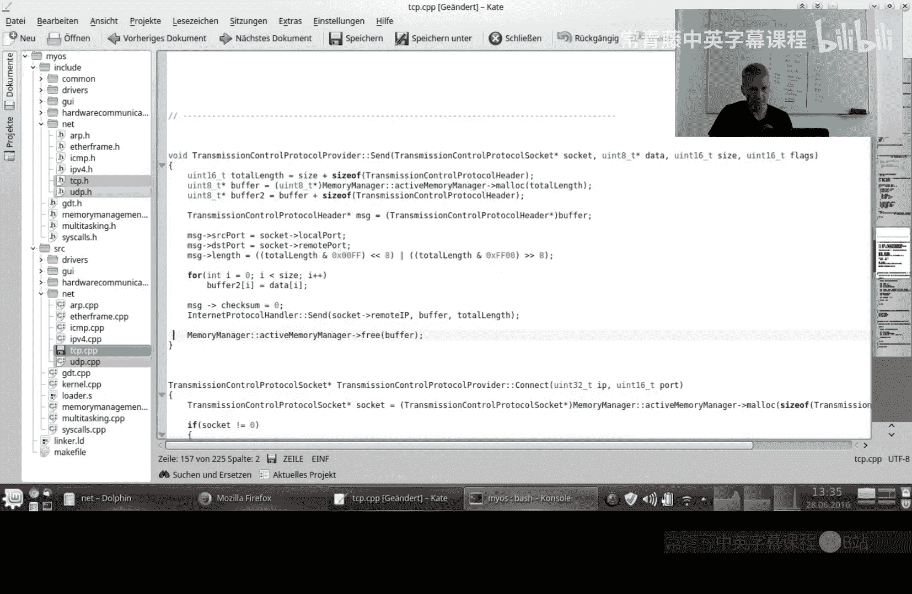

So I've just checked the running time of this video is already quite long。

I think I will just do the sending in the next video， which。Actually， also makes sense， because。Yeah。

 the sending also requires a certain check sum。I think it kind of makes sense to。

To stop here and continue in another video where we will also discuss this checkum。Yeah， and。So。

So tune in next time， next time we will go into the sending of data through TCP connections。嗯。

It's a bit harder than it sounds， especially because of this。Aful check somewhere， but okay。

 so yeah don't forget to subscribe so that you don't miss the next video on sending data。

Hit like if you liked this video and。See you next time， bye。

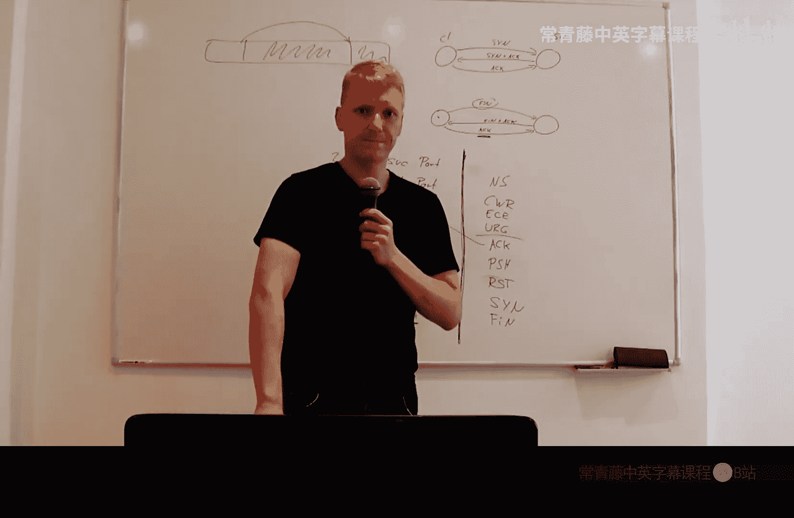