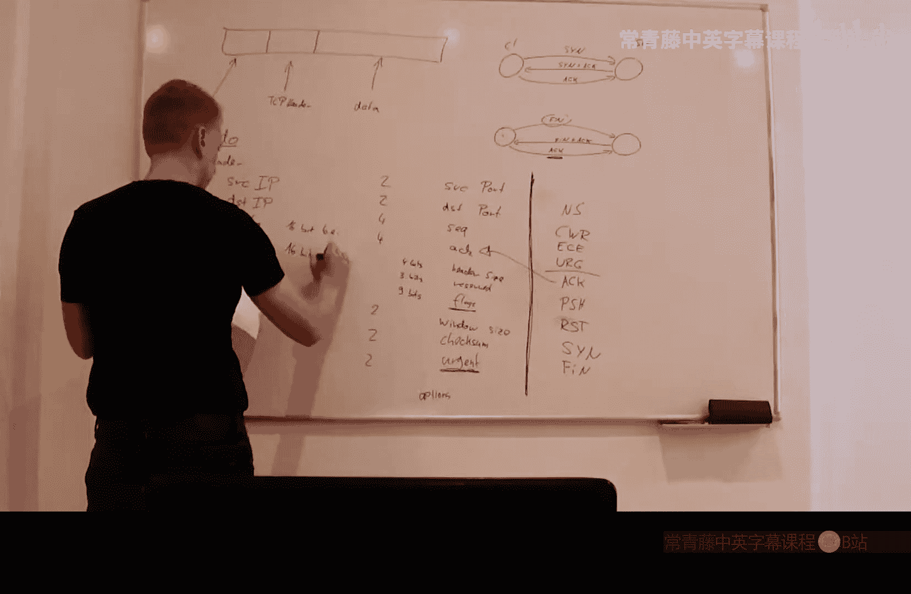
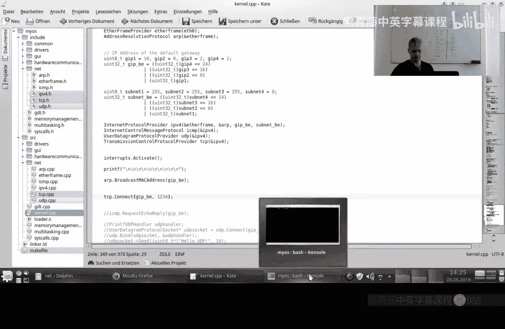
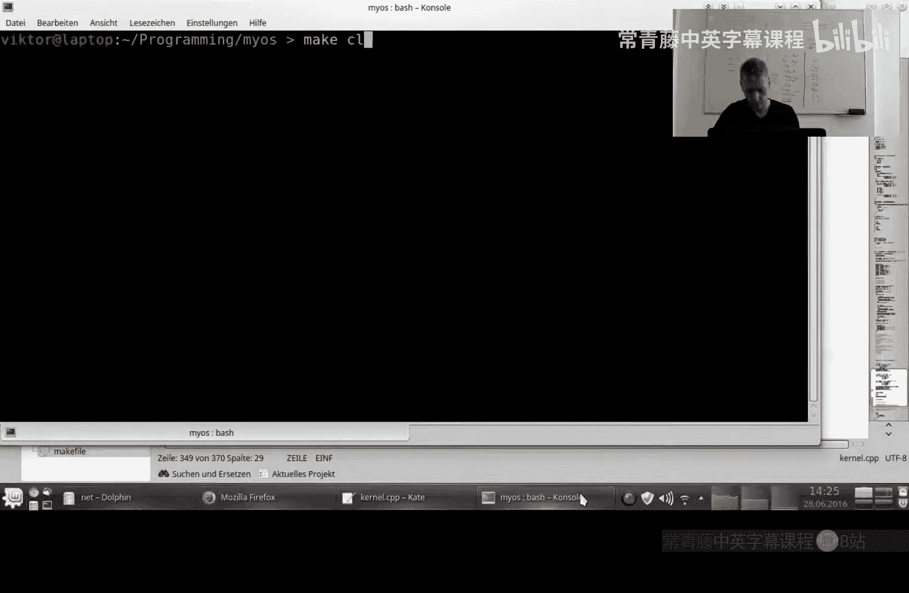
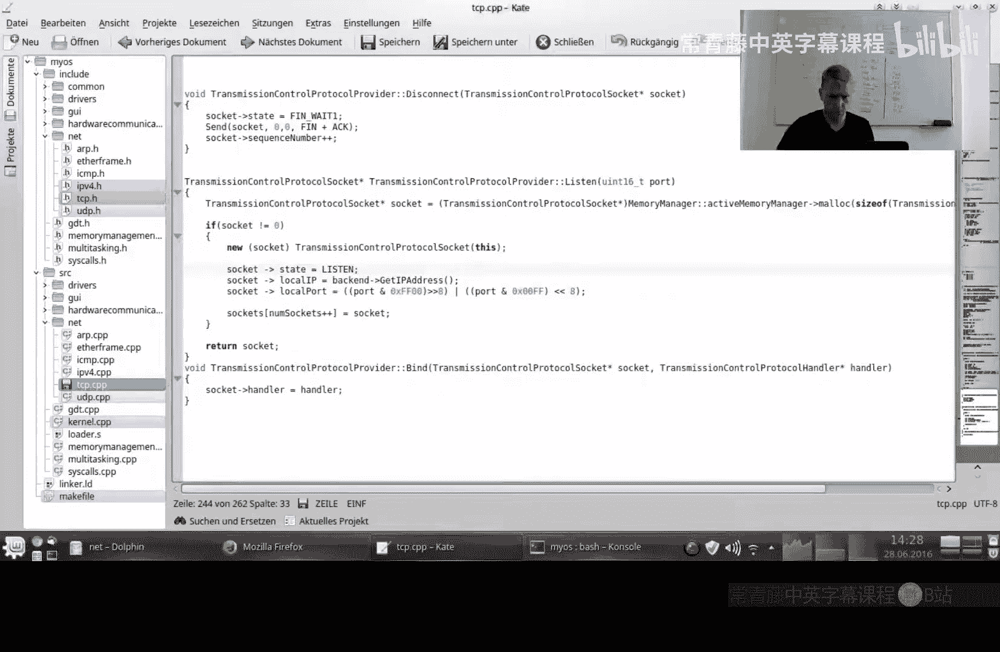
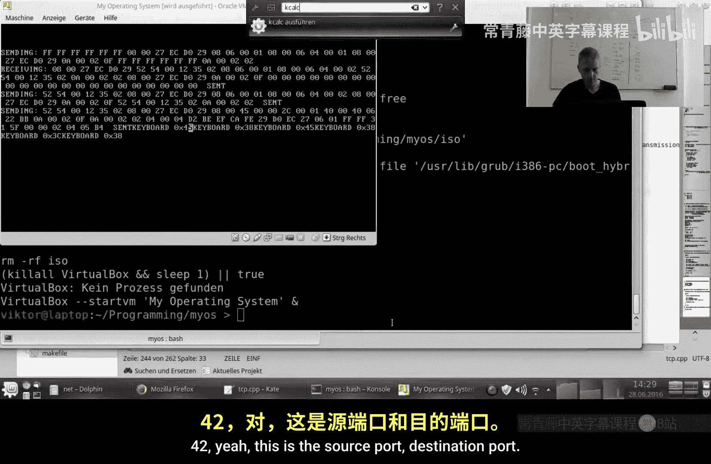
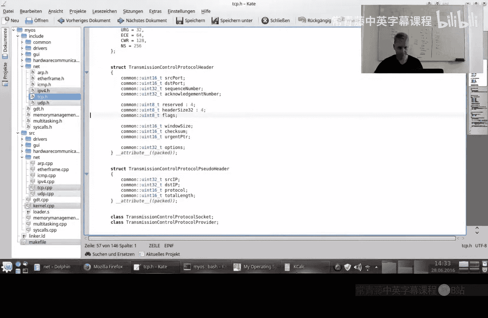
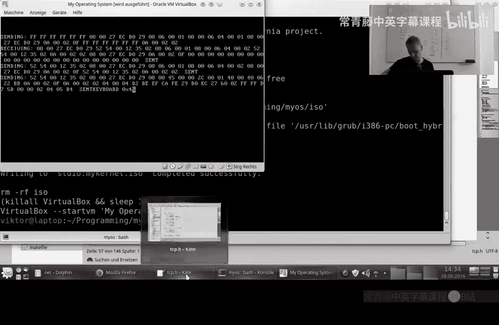
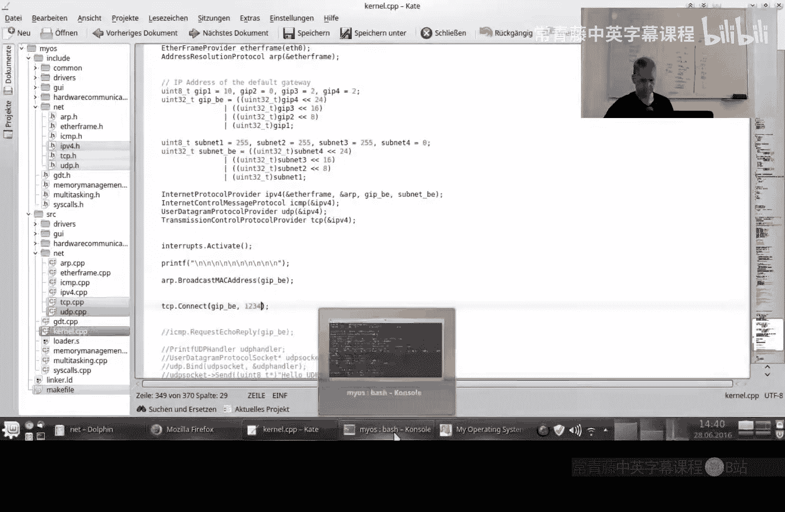
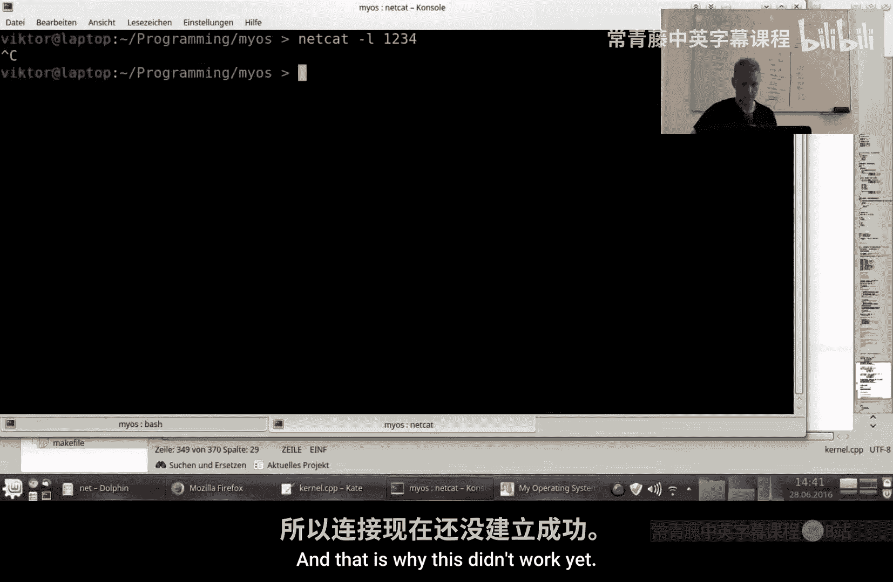

# WriteyourOperatingSystem【中英⚡编写你自己的操作系统｜Write your own Operating System】 p28 P28 Write your own Operating System A07： Transmission Control Protocol (TCP) -BV1BDBEByEBY_p28-

Hello and welcome to the seventh part of the appendix on。

The tutorial on writing your own operating system Yeah， and the last video。

 we started implementing the transmission control protocol。TCP。And yeah。

 this is really a lot of code。 So we didn't get through， actually。

We are relatively far away from being through。So in this video， we will implement the sending。

Of data through TCP connection。然后。And yeah， we've discussed a lot of the details of this process。

 but。Yet it also involves a。Yeah， a relatively complicated system for computing at checkum。I mean。

 we do have the check some of IPV4。And it's basically the same thing。

 but we feed it with different values。So。So we take that check some of IPV file。

And we feed it with the TCP header。The data that we want to send。And also。

Something called a TCP pseudo header。Which basically contains。系啊。

The IP address of the source and the destination， the protocol number。Which is 6， in case of。Of TCP。

And because the IP protocol number。That's what we are talking about and the length。Some。

So it's IP destination IP。Protocol number， strangely enough。 This is a 16 bit number。

 although I protocol numbers are only。8 bit。 But okay， so this is 16 bit Big Indian。

These of course are also big Indian， but we store them in big Indian anyways。

And then the total length。😔，Of the message， which is also 16 bit。Also pick Indian。

Okay， so this is how we compute the checkum。So let's go into sending data。😔，Yeah。哦。So。気し。

When we want to send data， I have already added this flex parameter here。😔。

I haven't addeded it in the。Clress definition， yet。

So the default value for this will just be zero because。Yeah， that's just a normal。

Packet containing normal data when we set the flags to 0。Okay， so we sent。Actually。

 why are we doing it like this。I think it's smarter。So we want to send this many partss， right？😔，嗯。

So I think it would actually make sense。To。To add the。As a pseudo header already at this point。😔。

So that we don't have to copy the whole data again later in the checkum。う。完毕。好。うん。Yeah。So here。

 I would。Directly allocate length。Including sort of header。嗯。Bha2 is where the。

Where we copy the data that we want to send。うね。So0。😔。

The actual header starts after the pseudo header。😔。

So we create a buffer large enough for other data that we want to send an actual header and a pseudo header。

😔，When we set the pseudoto header to the start of Sir。😔，Oet of。And。Yes。The actual header。Behind the。

So to head on。Yes。Yeah。And the buffer for a copy of the data after that。So。What do we have to set？😔。

Yeah。So this header size will just be size of。Size of the head on。😔，But divided by4。😔。

Because it's in 32 bit。嗯。Interral sizes。嗯。Sounds and destination part。😔，Yeah。So。

 these must be turned into。Big Indian。32 bit values。😔，Yeah。

 I just make a stupid little function for that。好。不谢。Okay。Yeah。

So this needs to go to the right three places， this needs to go from here to there， so only eight。😔。

Okay。5。嗯。いませ。We don't other。😔，We cannot not treatment number yet。In the。I mean。

 we have it in the socket in the messages， but not in the socket yet。嗯。嗯。So result sps out0。

The flags that we get from the parameter。So we say we have a lot of frame。😔。

We are not using the Virgin pointer。😔，And also。We set that to 0。

So I will make a little bit of space in the header also。😔，For one option。Yeah。Okay。

I don't even remember what that did here， but。嗯。So， in case。😔，I I。

I really don't remember what that does。😔，So the question is。

 if we send something that contains a synchronized bit， then we set this options。Yeah。

So if we have a synchronized bit， then。We set the option to 0 x， B，40，50，42。

Then we increase the sequence number for the next message。Yeah。

By the size of the data that we get that we are sending。Okay， after that， we copy。

The data to the buffer。是。嗯。So this is the number six for IP for the TCP protocol in。So then。

The protocol number of TCP in the IP protocol numbers。But as big Indian。Yeah。Yeah。Yeah。Yeah。

So the total length of the message without the pseudo header。😔，In big Indian， again。Yeah。不是。So， then。

So now we invoke a check some of the IPV4 on the buffer， on the complete buffer。😔，It looks good。

And in the end， we sent the data。But not the complete only。The data set starts at the。

At the start of the head。Okay， what do we have have？We have the bind。 We have to listen。

 We have disconnect， connect and send。😔，We have constructor destructor。😔，Thank。Okay。Yes。嗯。Okay， so。

What I'm going to do now is I'm going to include this here in the makefi。😔，Yeah。う。

And instantate it in the kernel。😔，And。Then with us。Try to connect。To。あ。

To the host machine on thought， I don't know when to3 far。😔，So， okay， so this won't really work。

 I think。

Yeah， let's just compile this。

Here a check some， we have。😔，Britain and the。You mean what。Yeah。

Wait if we get a synchronize and we were listening。😔，We go， we go to us soon received。Yeah。

Okay， so the connect should。Send some data。So this should be an ARP request。😔。

And what do we have here？😔，嗯。Songport。Station part。

42。42， yeah， this is a source port destination port。

The sequence number that we choose as first offset。😔，Was this beef cafe。嗯。Yeah。

 we don't have an acknowledgement number yet， so this is irrelevant。😔，This is the window size。

 I think。😔，Well。かな。Flack1。Yeah， okay。Okay， in my implementation， I did it this way。😔。

I trust ignore the last。😔，The last flag。And。I take four reserve bits， instead。

But the main problem is these two needs to need to be need to be switched。Because of big Indian。うし？

Yeah。So，6。Do we have six words？😔，Yeah。6。Yeah， 24 bytes is the size of， yes， the six is correct。😔，But。

Oh yes， and this is 02 now two is a synchronize。😔，Window point， window size。Check some yellow。😔。

Urgent pointer is 0。And the options are。0，2，0，4， and 0，5， before。Is that correct？

嗯。Yeah， this does look correct， so I don't know why it doesn't do anything。😔。

Maybe I'll try。😔，嗯。So what happens if there actually is something to talk to？😔，Okay。Okay。

 now now this netcut server answers。And there are these timeout requests， so it says， hey。

 I haven't gotten anything。😔，What are you doing？Yeah， but so we have send a synchronize。

 we are receiving this syn act。But we are not sending the a right now。And that is why。

This didn't work yet。😔，But yeah， I mean， we correctly try to synchronize， that's good。

So we sent the in， we received the syn act。啊。And let me see。😔，Yeah。

 so this video is again long enough， I think。But it's actually a good thing we have come forward now。

 so now we can send data through TCP connections， we can connect disconnect。

We only have to handle the data that we receive， but that's still a lot of things we have to do。

So I'm going to move that into the next video。It's SF。Expected， it's we are approaching。

Probably something around three hours now。Totals。Right now we have about two hours， but。

The receive method is long。So。So yeah， but we'll do that next time， so tune in next time。

 when we will finally have a working TCP implementation。And I think that will be really。

 really great。😊，And yeah， hit subscribe so that you don't miss that next video when we will finally have a complete TCP。

 not complete complete， but something that really works to communicate with the outside world。

And he'd like if you liked this video。And see you next time， bye。

