# 编写你自己的操作系统：附录B02：文件分配表 (FAT32) 🗂️


在本节课中，我们将学习FAT32文件系统的基本结构。我们将了解如何从硬盘分区中读取BIOS参数块，定位根目录，并最终读取目录中的文件内容。通过本教程，你将掌握在自制操作系统中实现基本文件读取功能的关键步骤。

## 概述

上一节我们介绍了硬盘分区表。本节中，我们将深入探讨FAT32文件系统的具体结构。FAT32是微软曾广泛使用的一种文件系统，理解其布局是操作文件与目录的基础。

## FAT32 磁盘布局

一块格式化为FAT32的硬盘分区，其布局大致分为三个部分。

以下是这三个主要部分：

1.  **保留区**：包含BIOS参数块。
2.  **文件分配表区**：包含一个或多个FAT表副本。
3.  **数据区**：存放目录条目和文件的实际数据。

数据区被划分为多个**簇**。一个簇包含若干个扇区（例如8个，共4KB）。文件系统以簇为单位分配空间。

## BIOS 参数块

BIOS参数块位于保留区的第一个扇区，它包含了描述文件系统结构的关键信息。其结构定义如下：

```c
struct bios_parameter_block {
    uint8_t  jump_code[3];
    char     oem_name[8];
    uint16_t bytes_per_sector;
    uint8_t  sectors_per_cluster;
    uint16_t reserved_sectors;
    uint8_t  fat_copies;
    uint16_t root_dir_entries; // FAT32中通常为0
    uint16_t total_sectors_16; // FAT32中通常为0
    uint8_t  media_type;
    uint16_t sectors_per_fat_16; // FAT32中通常为0
    uint16_t sectors_per_track;
    uint16_t head_count;
    uint32_t hidden_sectors;
    uint32_t total_sectors_32;
    // 以下是FAT32扩展部分
    uint32_t sectors_per_fat;
    uint16_t flags;
    uint16_t version;
    uint32_t root_cluster;
    uint16_t fs_info_sector;
    uint16_t backup_boot_sector;
    uint8_t  reserved[12];
    uint8_t  drive_number;
    uint8_t  reserved1;
    uint8_t  boot_signature;
    uint32_t volume_id;
    char     volume_label[11];
    char     fat_type_label[8];
};
```

我们需要关注其中几个核心字段：
*   `sectors_per_cluster`：每簇扇区数。
*   `reserved_sectors`：保留扇区数，用于定位FAT表起始位置。
*   `fat_copies`：FAT表副本数量。
*   `sectors_per_fat`：每个FAT表占用的扇区数。
*   `root_cluster`：根目录的起始簇号。

通过这些信息，我们可以计算出关键区域的偏移量。

## 定位关键区域


掌握了BIOS参数块的信息后，我们就可以计算出文件系统中各个关键部分的起始位置。


以下是计算步骤：

1.  **FAT表起始扇区**：`fat_start = partition_start + reserved_sectors`
2.  **数据区起始扇区**：`data_start = fat_start + (fat_copies * sectors_per_fat)`
3.  **根目录起始扇区**：`root_dir_sector = data_start + ( (root_cluster - 2) * sectors_per_cluster )`

注意：簇号从2开始计数，因此计算偏移时需要减去2。

## 目录条目

数据区中的目录（包括根目录）本身也存储在簇中。一个扇区可以容纳16个目录条目。

目录条目的结构定义如下：

```c
struct directory_entry {
    char     name[8];
    char     ext[3];
    uint8_t  attributes;
    uint8_t  reserved;
    uint8_t  creation_time_tenths;
    uint16_t creation_time;
    uint16_t creation_date;
    uint16_t last_access_date;
    uint16_t cluster_high; // 簇号的高16位
    uint16_t write_time;
    uint16_t write_date;
    uint16_t cluster_low;  // 簇号的低16位
    uint32_t file_size;
};
```

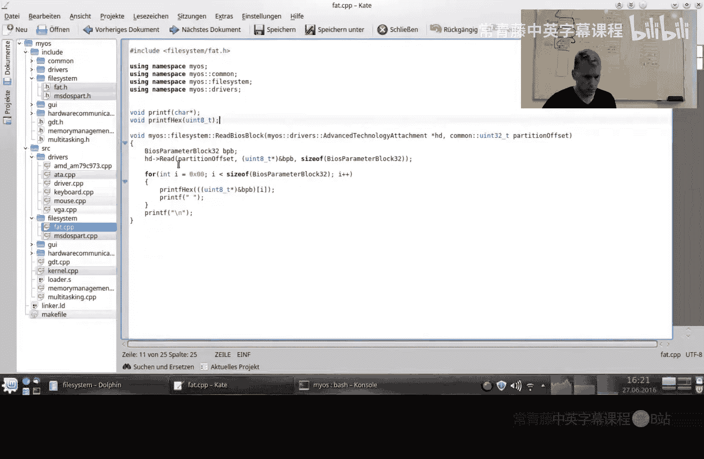

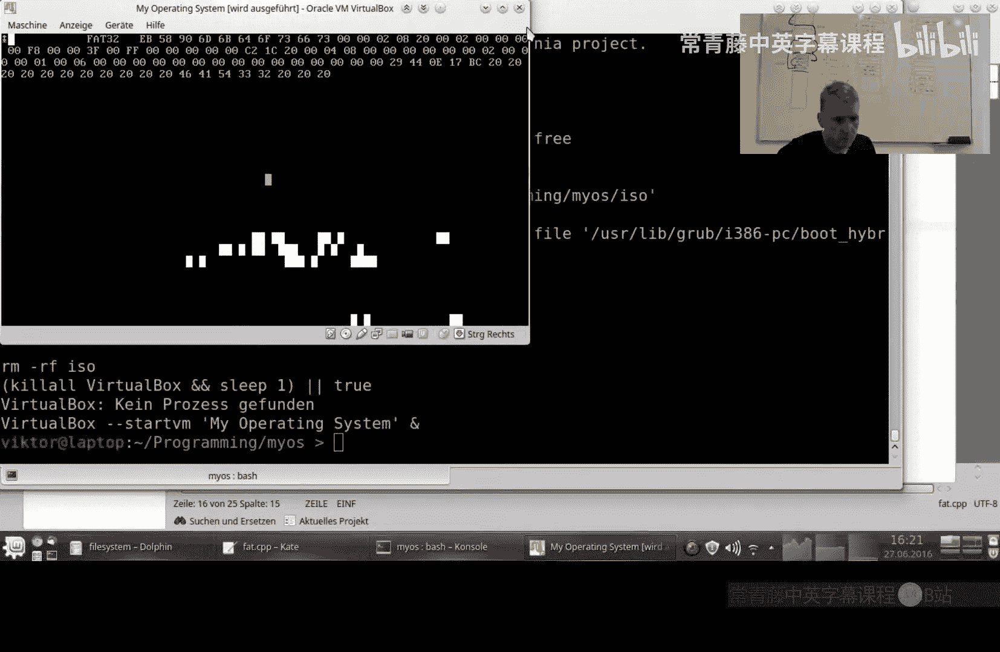

关键字段说明：
*   `name` 和 `ext`：文件名和扩展名（传统8.3格式）。
*   `attributes`：文件属性，例如用于判断是文件还是目录。
*   `cluster_high` 和 `cluster_low`：共同组成文件或子目录起始簇的32位簇号。计算公式为：`cluster = (cluster_high << 16) | cluster_low`。
*   `file_size`：文件大小（字节）。

如果条目是目录，其簇号指向存储该目录内容的簇。如果条目是文件，其簇号指向文件数据的第一个簇。

## 文件分配表的作用

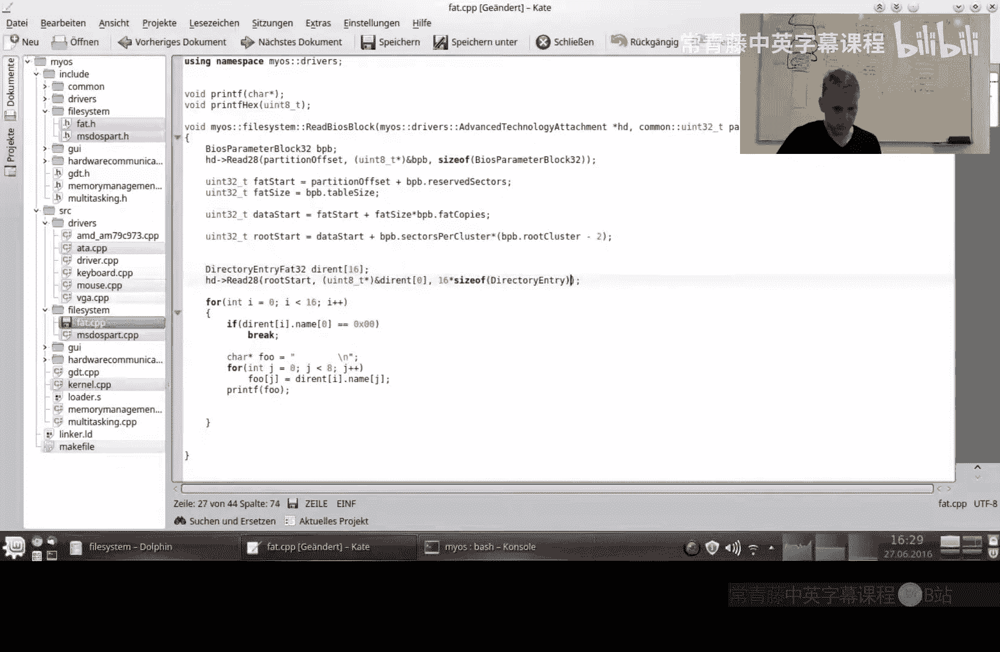

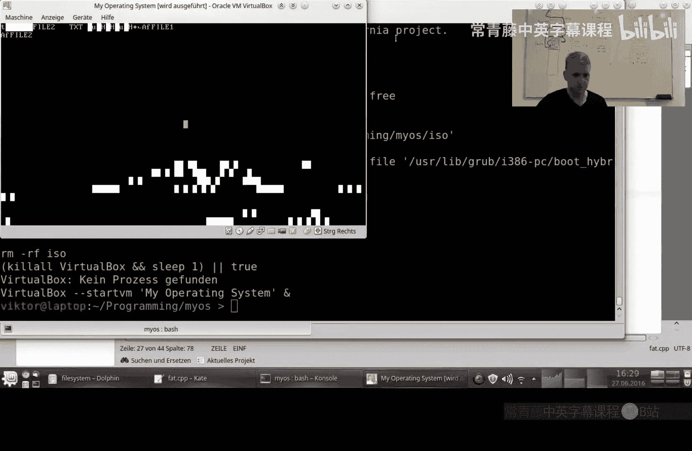

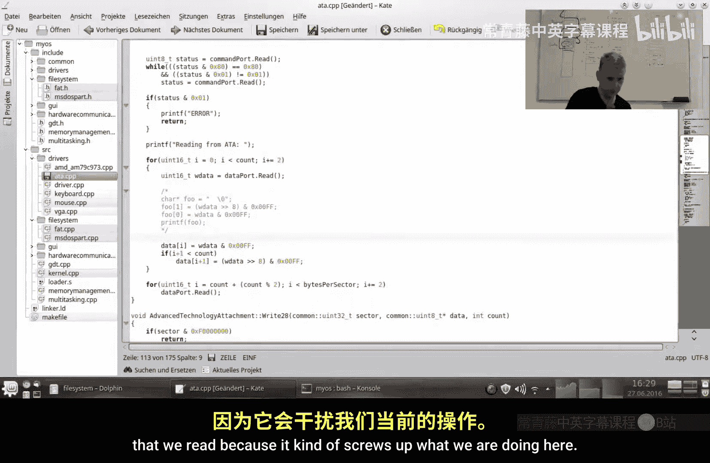

当一个文件或目录的大小超过一个簇时，就需要使用文件分配表来追踪其后续的簇。FAT表本质上是一个簇号的数组，每个表项指向文件的下一个簇，形成链表。文件结束的标志是一个特定的值（如`0x0FFFFFFF`）。

读取一个多簇文件的流程是：
1.  从目录条目获取起始簇号 `N`。
2.  读取簇 `N` 的数据。
3.  查询FAT表第 `N` 项，获得下一个簇号 `M`。
4.  如果 `M` 不是结束标志，则读取簇 `M` 的数据，并重复步骤3。

## 实践：读取根目录和文件

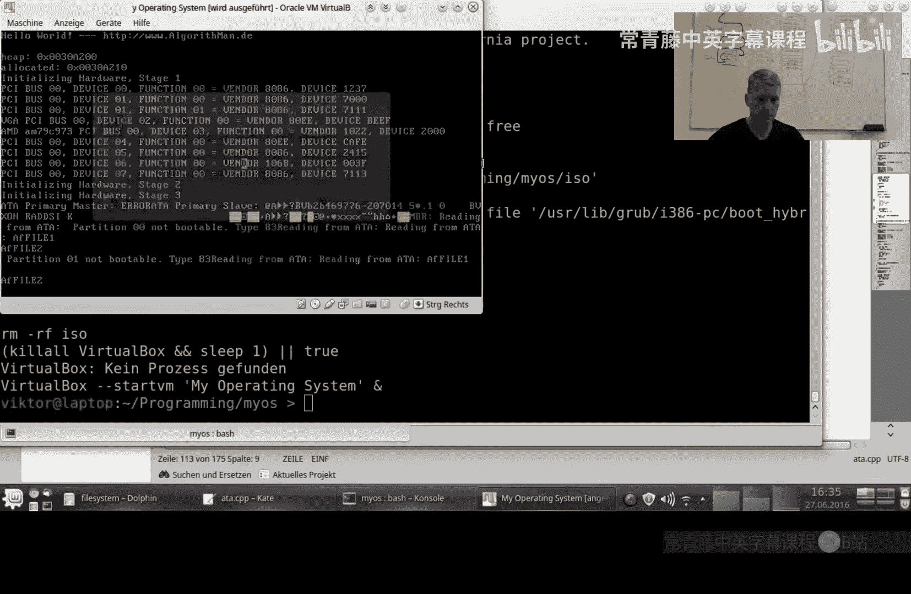

现在，让我们将理论付诸实践，编写代码来读取根目录并显示其中的文件内容。

以下是实现步骤：

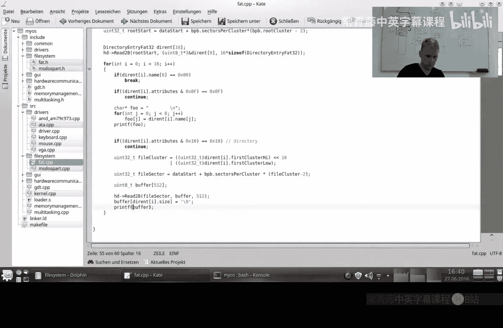

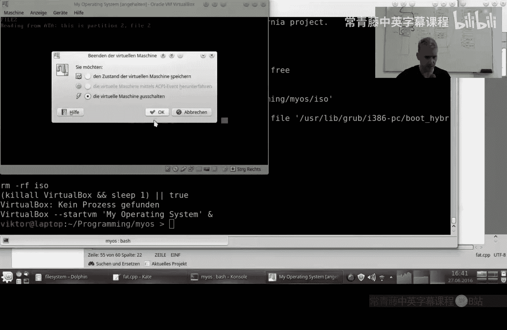

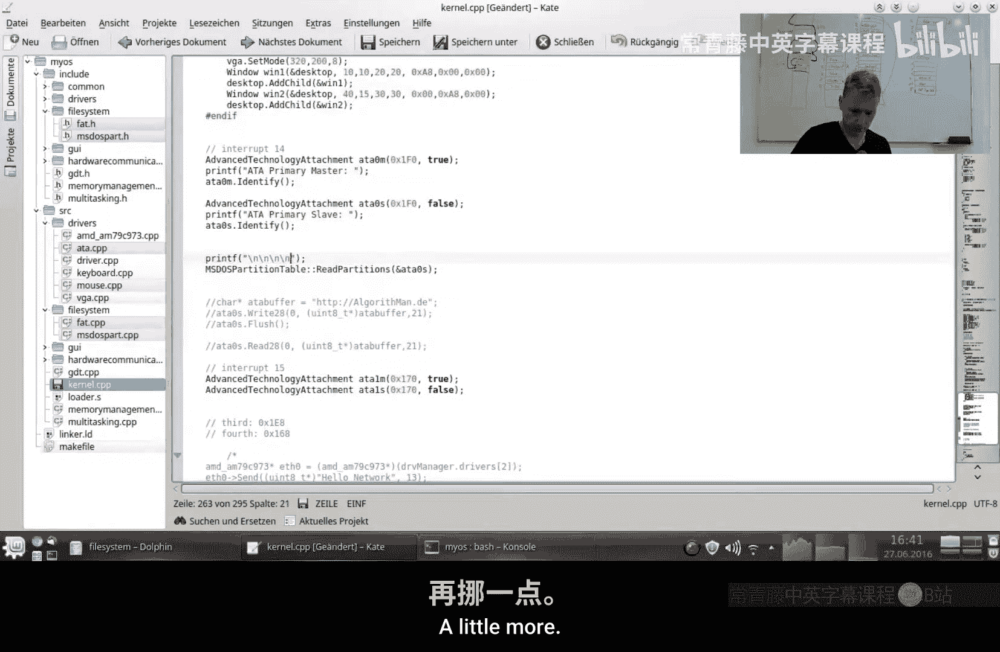

1.  读取分区起始扇区，解析BIOS参数块。
2.  根据参数块信息，计算并定位到根目录所在的扇区。
3.  读取根目录扇区，遍历其中的目录条目。
4.  对于每个有效的文件条目（跳过目录和长文件名特殊条目），打印其名称。
5.  根据文件条目的簇号，计算文件数据所在的扇区，并读取和打印其内容（这里仅读取第一个簇）。

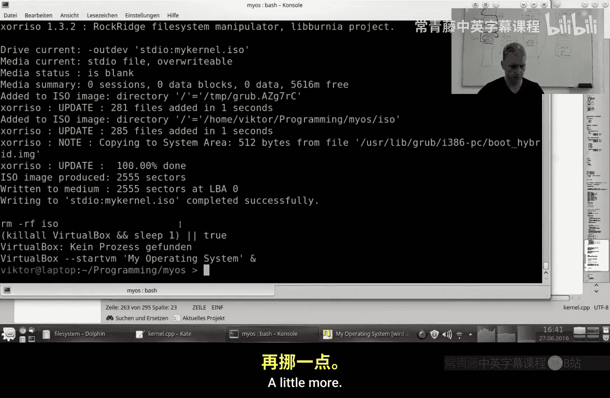

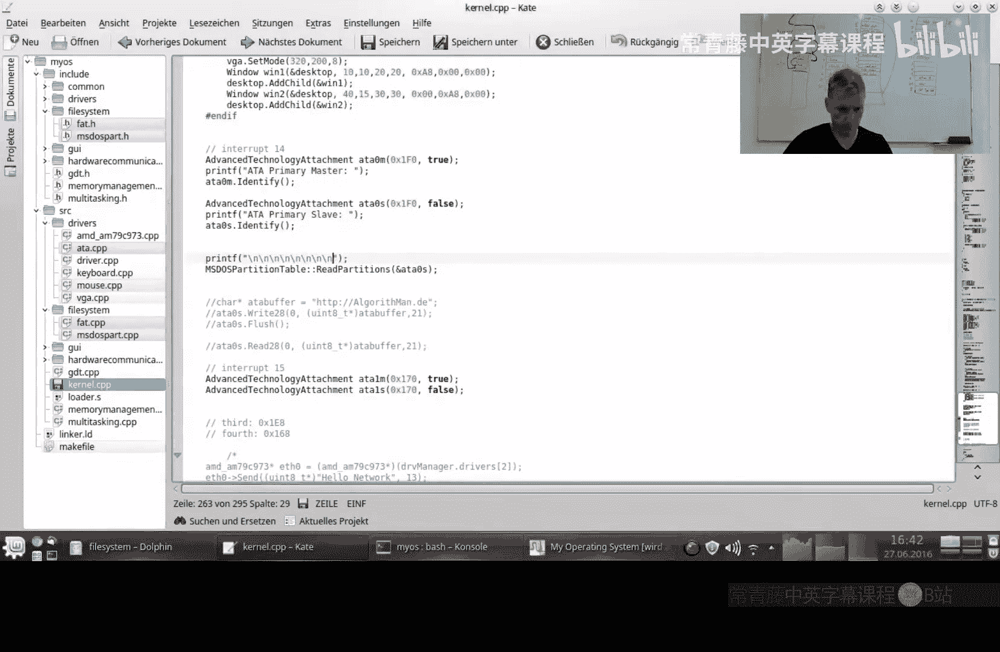

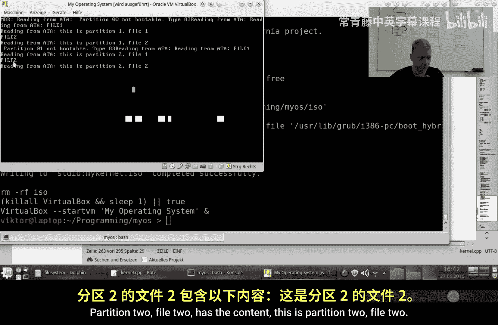

核心代码逻辑如下（伪代码示意）：
```c
// 1. 读取并解析BPB
read_sector(partition_start, &bpb);
// 2. 计算根目录位置
root_sector = data_start + ((bpb.root_cluster - 2) * bpb.sectors_per_cluster);
// 3. 读取根目录
read_sector(root_sector, dir_buffer);
// 4. 遍历条目
for (entry in dir_buffer) {
    if (entry.name[0] == 0) break; // 无更多条目
    if (entry.attributes == 0x0F) continue; // 跳过长文件名条目
    if (entry.attributes & 0x10) continue; // 跳过目录条目
    // 打印文件名
    print(entry.name);
    // 5. 读取文件内容
    file_cluster = (entry.cluster_high << 16) | entry.cluster_low;
    file_sector = data_start + ((file_cluster - 2) * bpb.sectors_per_cluster);
    read_sector(file_sector, file_buffer);
    print(file_buffer); // 假设文件内容为文本
}
```
运行此代码，将能列出根目录下的文件（传统短文件名），并显示每个文件第一个簇的内容。

## 总结

本节课中我们一起学习了FAT32文件系统的基础知识。我们了解了磁盘的三个主要区域（保留区、FAT表区、数据区），解析了包含关键信息的BIOS参数块，掌握了目录条目的结构，并实践了如何定位根目录、遍历文件以及读取文件数据。虽然FAT32包含许多历史遗留字段，但核心机制清晰。通过实现这些步骤，你的操作系统便获得了访问文件系统的基本能力。在下一节中，我们将进一步探讨如何利用文件分配表来读取跨越多簇的大型文件。