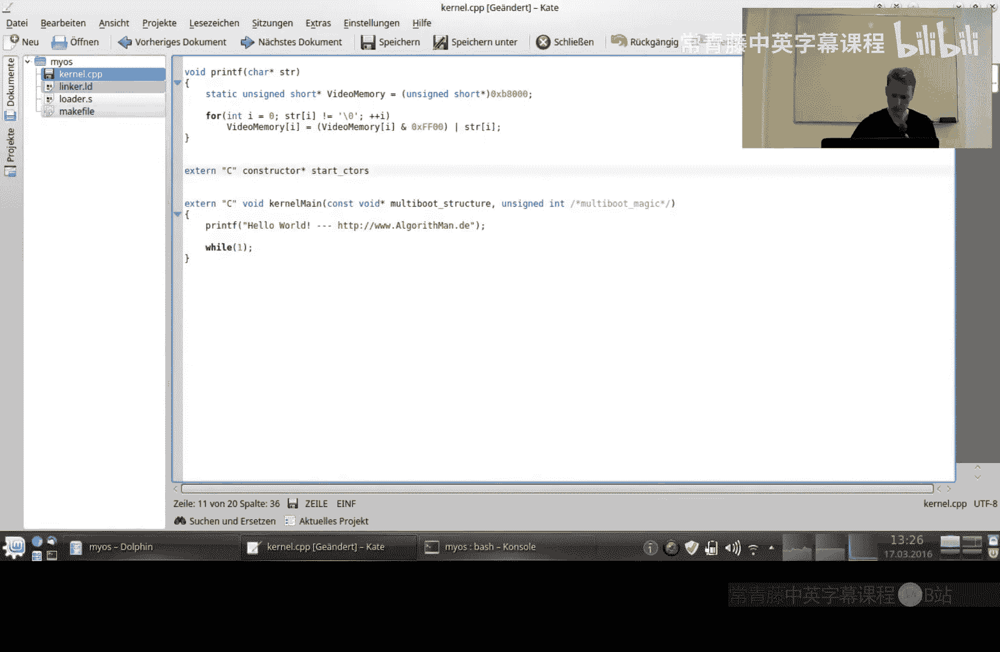
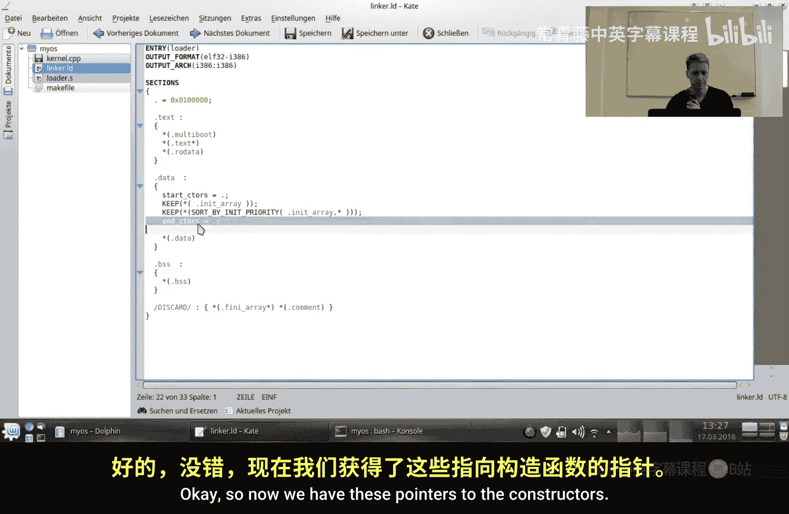
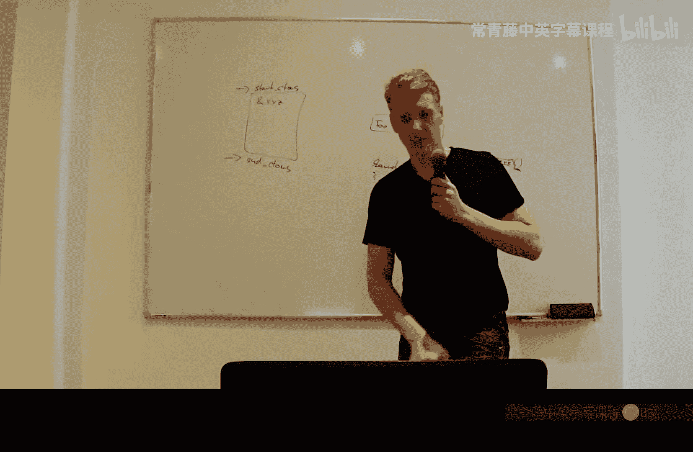
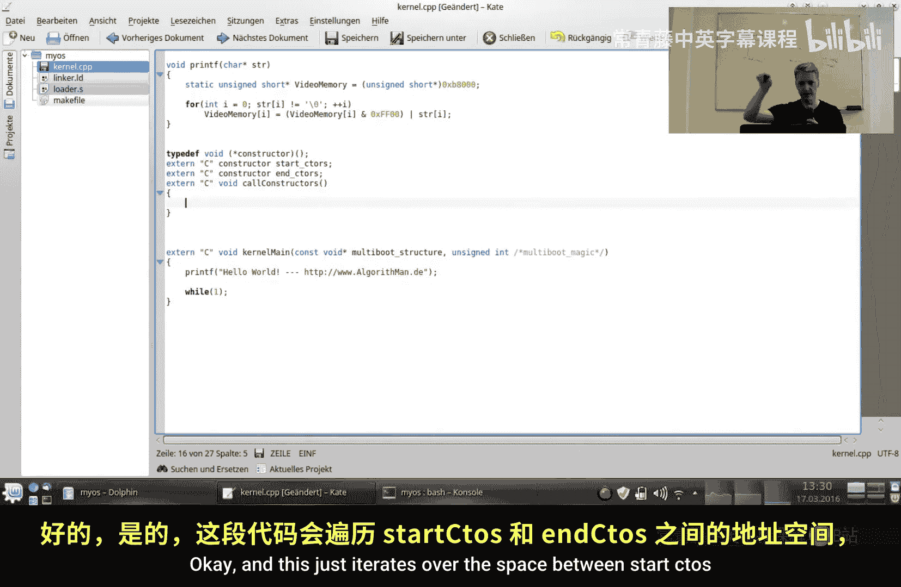
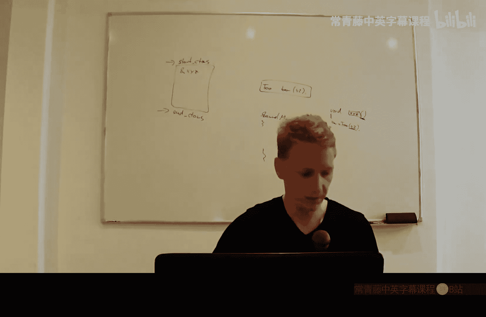
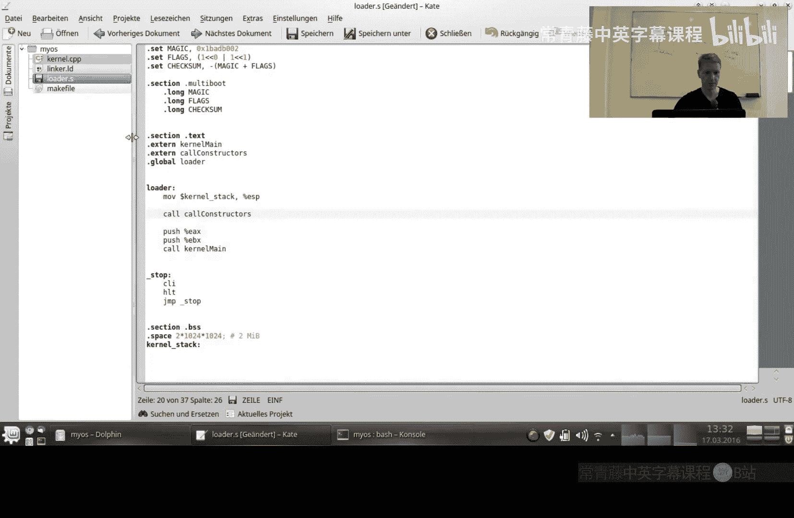

# 002：补充说明 🔧

在本节课中，我们将学习如何修复一个在之前视频中遗漏的关键步骤：显式调用全局和静态对象的构造函数。这对于确保C++程序中的复杂对象能够正确初始化至关重要。

上一节我们介绍了链接脚本和内核入口点。本节中我们来看看如何确保所有全局对象的构造函数被正确调用。

## 问题概述

在之前的设置中，链接脚本将所有构造函数地址收集到了特定的内存区域（由符号 `__CTOR_LIST__` 和 `__CTOR_END__` 界定）。然而，我们只存储了这些函数的地址，却从未实际调用它们。这导致了一个问题：任何具有构造函数的全局或静态类实例（以及可能的结构体实例）都不会被初始化。

这种情况之所以在之前的教程中没有引发问题，是因为通常我们不会大量使用静态复合对象。更常见的做法是使用指向它们的指针，而指针是基本数据类型，不受此问题影响。


## 核心概念与修复步骤

构造函数在C++中是一种特殊的成员函数，用于初始化对象。对于全局对象，编译器会生成一个匿名函数来封装对构造函数的调用，并将该匿名函数的地址放入构造函数列表中。




我们需要做的是：遍历这个构造函数列表，并逐一调用其中的每个函数指针。



以下是实现此功能的核心代码逻辑：

```c
typedef void (*constructor)();

extern "C" constructor start_ctors;
extern "C" constructor end_ctors;

extern "C" void call_constructors() {
    for (constructor* i = &start_ctors; i != &end_ctors; i++) {
        (*i)(); // 调用构造函数
    }
}
```

**代码解释**：
1.  `constructor` 是一个指向无参数、无返回值的函数的指针类型定义。
2.  `start_ctors` 和 `end_ctors` 是在链接脚本中定义的外部符号，分别指向构造函数列表的起始和结束地址。
3.  `call_constructors` 函数遍历从 `start_ctors` 到 `end_ctors` 的每一个函数指针，并执行它，从而初始化所有全局对象。

## 集成到启动流程中

修复步骤不仅涉及C++代码，还需要修改汇编启动代码。



我们需要在进入内核的 `main` 函数之前，先调用 `call_constructors` 函数。这通常在设置好栈之后进行。

以下是在汇编启动文件（例如 `loader.s`）中需要添加的调用：





```assembly
; 设置栈指针等初始化代码之后...
call call_constructors ; 调用所有全局对象的构造函数
call kernel_main       ; 跳转到内核主函数
```

通过以上两步，我们确保了在 `kernel_main` 执行之前，所有全局和静态C++对象都已通过其构造函数正确初始化。

## 总结



本节课中我们一起学习了如何修复操作系统引导过程中遗漏的构造函数调用问题。我们了解到：
1.  **问题根源**：链接脚本收集了构造函数地址但未调用它们。
2.  **解决方案**：编写一个 `call_constructors` 函数来遍历并执行构造函数列表。
3.  **集成方法**：在汇编启动流程中，于设置栈之后、跳转至 `kernel_main` 之前调用此函数。


这个补充步骤对于构建一个能够完全支持C++特性的操作系统内核是必要的。下一节，我们将探讨全局描述符表（GDT），这是进入保护模式并开启更多有趣功能的关键一步。