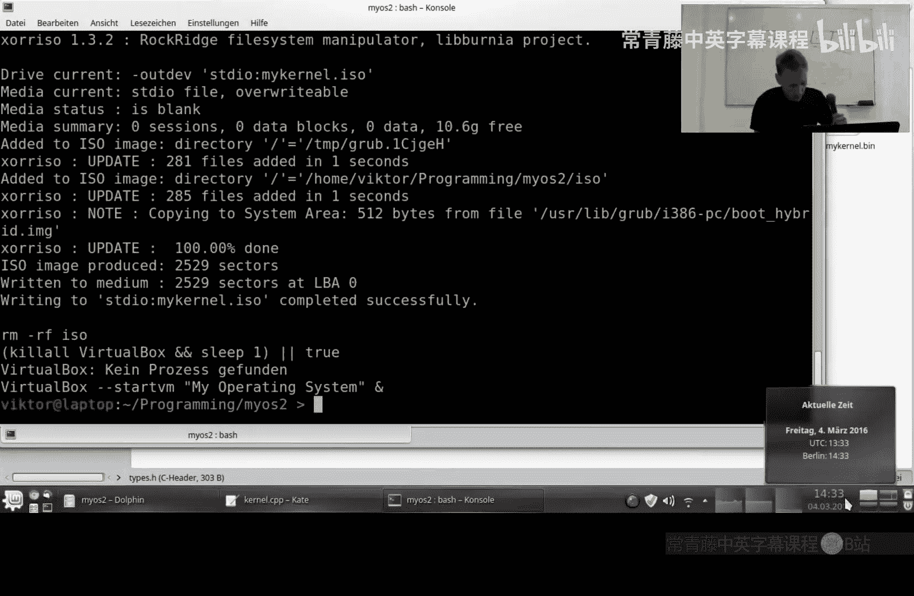
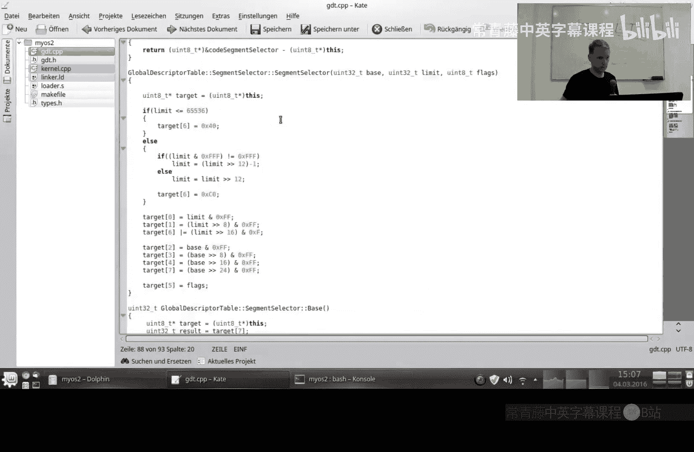
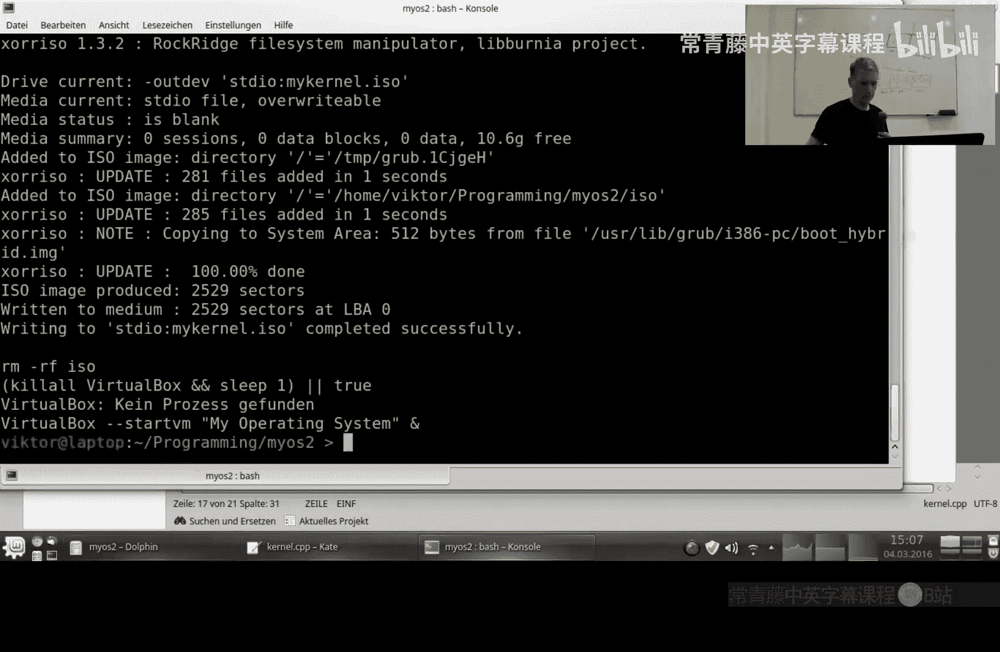
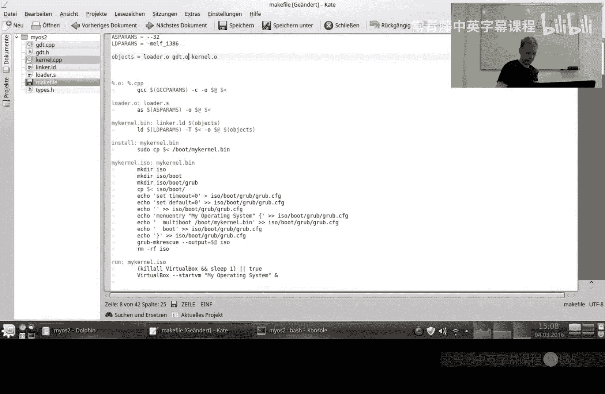
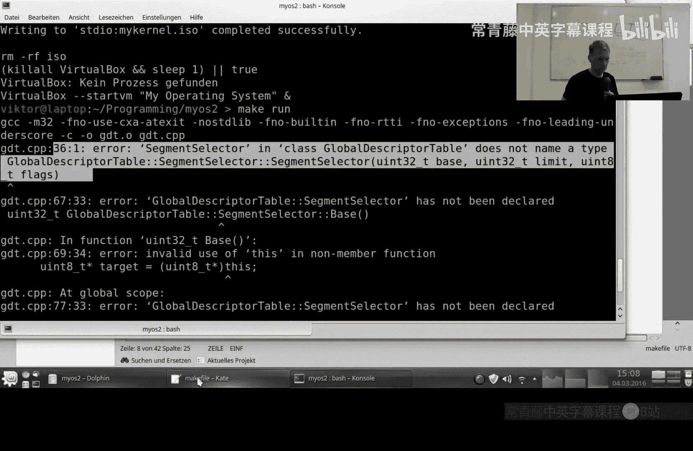
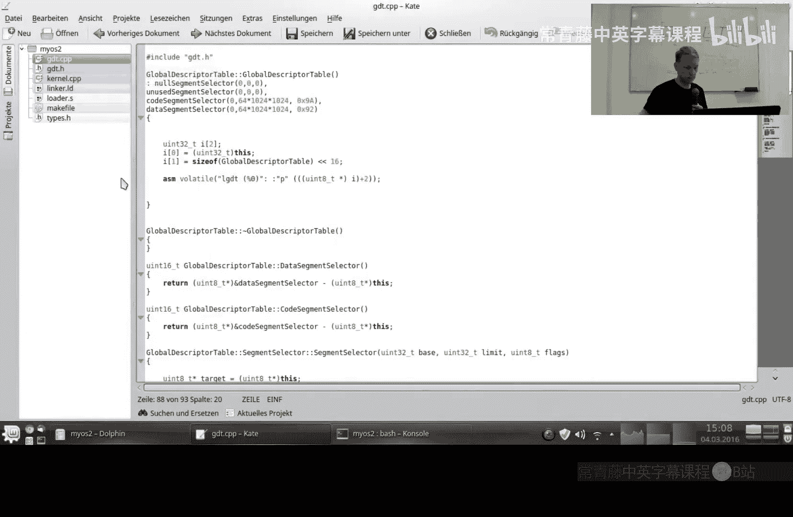
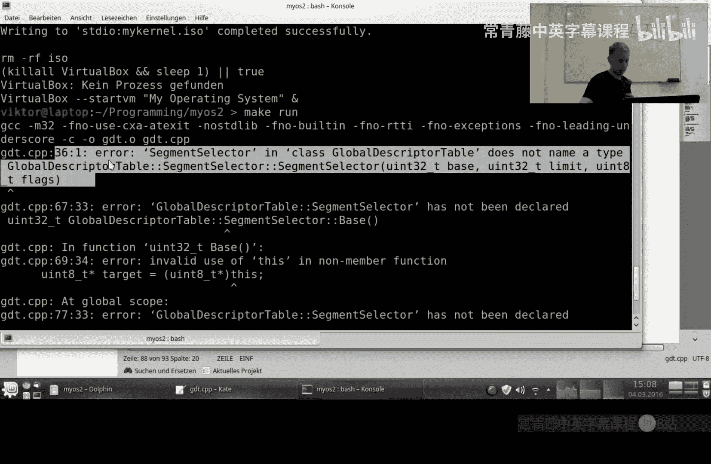
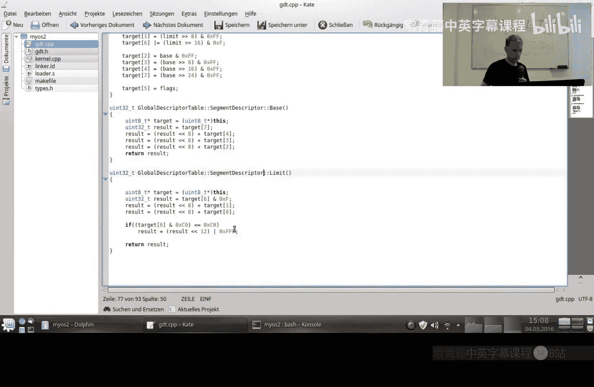
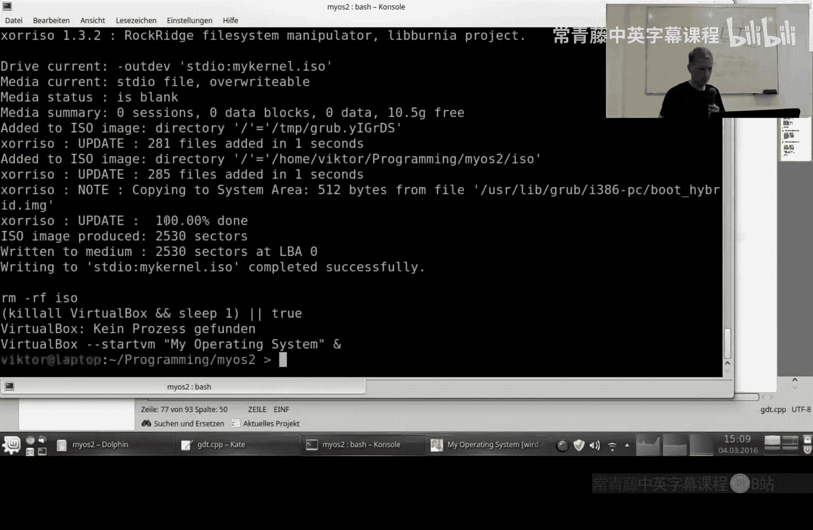

# 004：内存段与全局描述符表

在本节课中，我们将学习操作系统中的内存分段概念，并动手创建一个全局描述符表。这是实现硬件通信（例如处理键盘输入）前必须完成的关键步骤。

## 概述：为什么需要内存段？

上一节我们实现了向屏幕输出字符。与硬件通信，发送数据相对简单，但接收数据（例如处理键盘输入）则复杂得多。在开始处理硬件中断之前，我们首先需要理解内存分段。

想象你的内存空间。这里运行着你的内核代码和数据，那里可能运行着用户程序。几年前，一种常见的攻击方式是让程序将恶意代码加载到数据段，然后跳转执行它。现代操作系统的防护机制之一，就是告诉处理器：**数据段是不可执行的**。这有效消除了此类安全威胁。

此外，操作系统通过内存段实现了权限隔离。内核运行在具有高权限的“内核空间”，而用户程序运行在权限受限的“用户空间”。

## 中断与段切换

现在，假设处理器正在用户空间执行代码。此时，你按下了键盘上的一个键。键盘控制器会向CPU发送一个**中断**信号。CPU需要暂停当前工作，跳转到处理键盘中断的内核代码处。


但问题来了：CPU当前处于用户空间，其访问权限被限制在用户内存段内，它“看不到”也“跳不到”内核空间的代码。为了解决这个问题，我们需要设置一个**中断描述符表**。这个表可以告诉CPU：“当发生键盘中断时，请切换到内核的内存段，并跳转到这个地址执行。”

然而，在创建IDT之前，我们必须先定义这些内存段是什么。这就是**全局描述符表**的作用。



## 全局描述符表简介

GDT是一个表，其中的每一项都定义了一个内存段。每个段描述符主要包含以下信息：
*   **基地址**：段在内存中的起始位置。
*   **段界限**：段的长度。
*   **标志位**：描述段的属性，例如是代码段（可执行）还是数据段（不可执行），以及访问权限等。

从概念上看，这并不复杂。但实际实现却颇具挑战，因为GDT的条目格式为了向后兼容早期的处理器而变得非常复杂。

## GDT条目结构解析

一个GDT条目长度为8字节，其结构分散且不直观：
*   **段界限**被拆分存放在3个地方。
*   **基地址**被拆分存放在4个地方。
*   **标志位**和**其他属性**填充在剩余位置。

这种布局对程序员不友好，我们必须手动进行位操作来组装和解析这些条目。

以下是描述一个GDT条目结构的类定义概要：
```cpp
class GlobalDescriptorTable {
public:
    class SegmentDescriptor {
    private:
        uint16_t limit_lo;
        uint16_t base_lo;
        uint8_t base_hi;
        uint8_t type;
        uint8_t flags_limit_hi;
        uint8_t base_vhi;
    public:
        SegmentDescriptor(uint32_t base, uint32_t limit, uint8_t type);
        uint32_t Base();
        uint32_t Limit();
    } __attribute__((packed));
private:
    SegmentDescriptor nullSegmentSelector;
    SegmentDescriptor unusedSegmentSelector;
    SegmentDescriptor codeSegmentSelector;
    SegmentDescriptor dataSegmentSelector;
public:
    GlobalDescriptorTable();
    ~GlobalDescriptorTable();
    uint16_t CodeSegmentSelector();
    uint16_t DataSegmentSelector();
};
```
注意 `__attribute__((packed))` 确保编译器不会为了内存对齐而改变结构体布局，这对硬件交互至关重要。

## 实现GDT

接下来我们看看GDT构造函数的核心实现逻辑。它需要处理棘手的界限计算和字段分布。

构造函数接收32位的基地址和界限，但硬件只允许在条目中存储20位的界限值。为了支持更大的段，当界限值的低12位不全为1时，需要进行调整：先将界限右移12位（相当于除以4096），然后减1，最后将条目中的低12位设为全1。这样，处理器在解析时会自动将其左移12位，从而还原出接近原始值的大段界限。

以下是分布基地址和界限到各字节的简化逻辑：
```cpp
// 将 limit 的低16位放入 limit_lo
limit_lo = limit & 0xFFFF;
// 将 limit 的16-19位放入 flags_limit_hi 的低4位
flags_limit_hi |= (limit >> 16) & 0x0F;

// 将 base 的低24位分布到 base_lo 和 base_hi
base_lo = base & 0xFFFF;
base_hi = (base >> 16) & 0xFF;
// 将 base 的最高8位放入 base_vhi
base_vhi = (base >> 24) & 0xFF;
```
`Base()` 和 `Limit()` 方法则执行相反的操作，从分散的字节中重组出完整的基地址和界限值。

## 加载GDT到处理器

创建GDT实例后，我们需要告诉CPU使用它。这需要两步：
1.  准备一个6字节的数据结构，前2字节是GDT大小减一，后4字节是GDT的起始地址。
2.  执行一条特殊的汇编指令 `lgdt` 来加载这个结构。

在我们的代码中，这是在 `GlobalDescriptorTable` 构造函数中完成的。

## 当前实现与展望

目前，我们只定义了两个覆盖整个内存空间的段：一个代码段和一个数据段。这虽然简化了初期的开发，但并未实现真正的内存保护。安全性的提升将是后续课程的内容。

## 总结







本节课我们一起学习了内存分段的概念及其在操作系统安全中的重要性。我们详细剖析了全局描述符表条目的复杂结构，并成功实现了一个能够创建和加载GDT的C++类。这为下一步创建**中断描述符表**并最终实现与键盘等硬件的交互通信奠定了坚实的基础。











下一节，我们将着手创建IDT，真正的硬件通信即将开始。