# 014：GUI框架基础 🖥️

在本节课中，我们将学习如何为我们的操作系统构建一个图形用户界面框架的基础。上一节我们成功进入了图形模式，这是一个重要的里程碑。本节中，我们来看看如何利用这个图形模式来创建一个基本的GUI框架。

## 概述

GUI框架是操作系统中用户交互的核心部分。虽然在实际操作系统中，桌面环境通常是独立于内核的进程，但理解其工作原理对于构建完整的操作系统体验至关重要。我们将设计一个基础的、面向对象的GUI框架，其核心思想与许多常见的框架相似。

## 核心概念与基础类

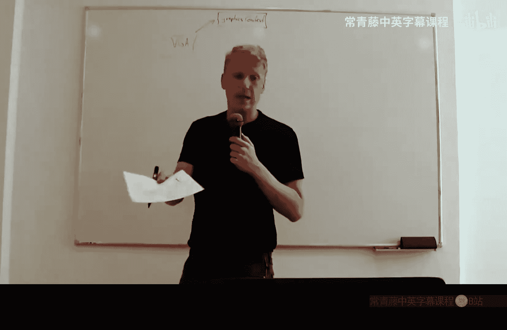

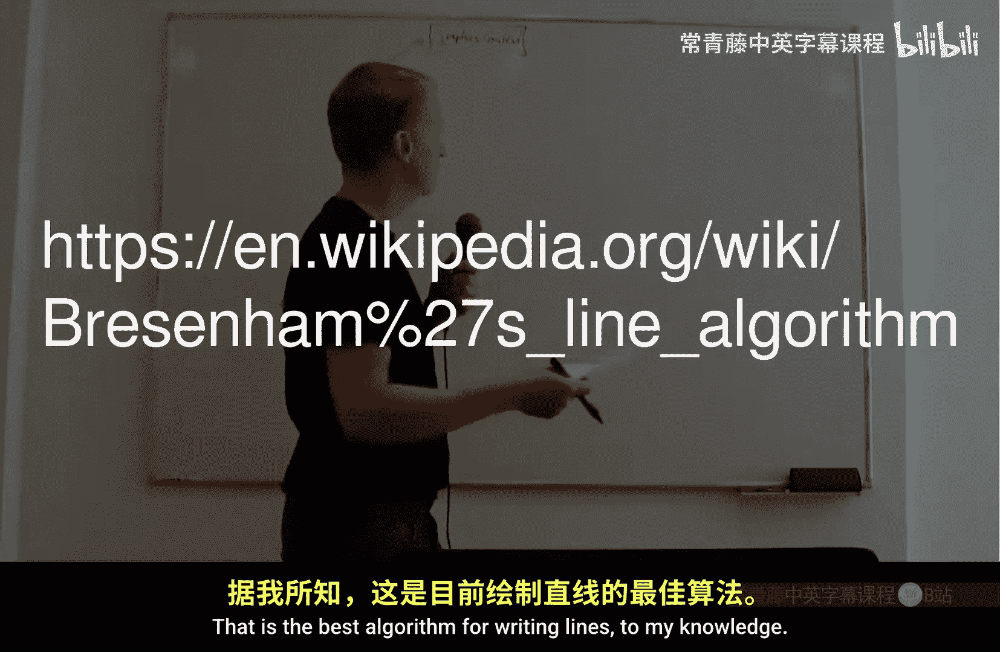

### 图形上下文

首先，我们需要一个**图形上下文**类。它定义了在屏幕上绘制的基本操作。在实际设计中，`VGA`类应该派生自一个像`GraphicsContext`这样的基类。

`GraphicsContext`基类会定义如下方法：
*   `put_pixel(x, y, color)`: 在指定坐标绘制一个像素。
*   `fill_rectangle(x, y, width, height, color)`: 填充一个矩形。
*   `draw_line(x1, y1, x2, y2, color)`: 绘制一条线。

一个关键的设计原则是：像`fill_rectangle`和`draw_line`这样的复杂方法，应该有一个**默认实现**，这个实现仅依赖于基础的`put_pixel`方法。这样，具体的图形驱动（如我们的VGA驱动）只需要实现`put_pixel`，就能自动获得所有高级绘图功能。

例如，绘制一条高质量的直线可以使用**Bresenham算法**。

此外，颜色应该被封装成一个独立的`Color`类，而不是将红、绿、蓝分量作为单独参数传递。

### 基础部件

GUI框架的起点是一个名为`Widget`的基础类。它代表屏幕上可绘制和交互的一个元素。

`Widget`类应包含以下核心属性和方法：
*   **坐标与尺寸**：`x`, `y`, `width`, `height`。这些坐标通常是相对于其父部件的。
*   **父部件指针**：`parent`，指向其父`Widget`。
*   **绘制方法**：`draw(graphics_context)`。该方法接收一个图形上下文，并利用其方法（如`put_pixel`, `fill_rectangle`）将自己绘制出来。
*   **坐标转换**：`model_to_screen(&x, &y)`。此方法将部件自身的相对坐标转换为屏幕上的绝对坐标。其实现是递归调用父部件的`model_to_screen`，并加上自身的偏移量。
    ```cpp
    void Widget::model_to_screen(int &x, int &y) {
        if (parent != nullptr) {
            parent->model_to_screen(x, y);
        }
        x += this->x;
        y += this->y;
    }
    ```
*   **命中测试**：`contains(x, y)`。判断给定的坐标是否位于此部件区域内。这对于处理鼠标事件至关重要。
    ```cpp
    bool Widget::contains(int point_x, int point_y) {
        return (point_x >= x && point_x < x + width) &&
               (point_y >= y && point_y < y + height);
    }
    ```
*   **事件处理方法**：如`on_mouse_down(x, y)`, `on_mouse_up(x, y)`, `on_mouse_move(old_x, old_y, new_x, new_y)`, `on_key_down(key)`, `on_key_up(key)`。这些是部件响应交互的接口。
*   **获取焦点**：`get_focus()`。当部件被点击时，它需要通知上层窗口自己获得了焦点。默认实现是将请求传递给父部件。

## 复合部件与事件传递

### 复合部件

`CompositeWidget`是`Widget`的一个重要子类。它包含一个子部件数组，并负责管理它们。

以下是`CompositeWidget`需要重写或实现的关键方法：
*   **绘制**：`draw`方法首先绘制自己的背景，然后**按从后到前的顺序**遍历并绘制所有子部件。这样，索引靠后的子部件会覆盖靠前的，形成正确的层叠效果。
*   **鼠标事件**：`on_mouse_down`等方法会遍历子部件（从最前面的开始，即索引从大到小），对第一个包含事件坐标的子部件调用相应的事件处理方法，然后停止遍历。
*   **键盘事件**：`on_key_down`和`on_key_up`通常直接传递给当前获得焦点的子部件（`focused_child`）。

### 窗口与桌面

`Window`类可以派生自`CompositeWidget`。它代表一个可移动、可调整大小的应用程序窗口。

`Window`类需要重写`get_focus`方法，不再将请求传递给父部件，而是将自己设置为父窗口（或桌面）的`active_window`或`focused_widget`。

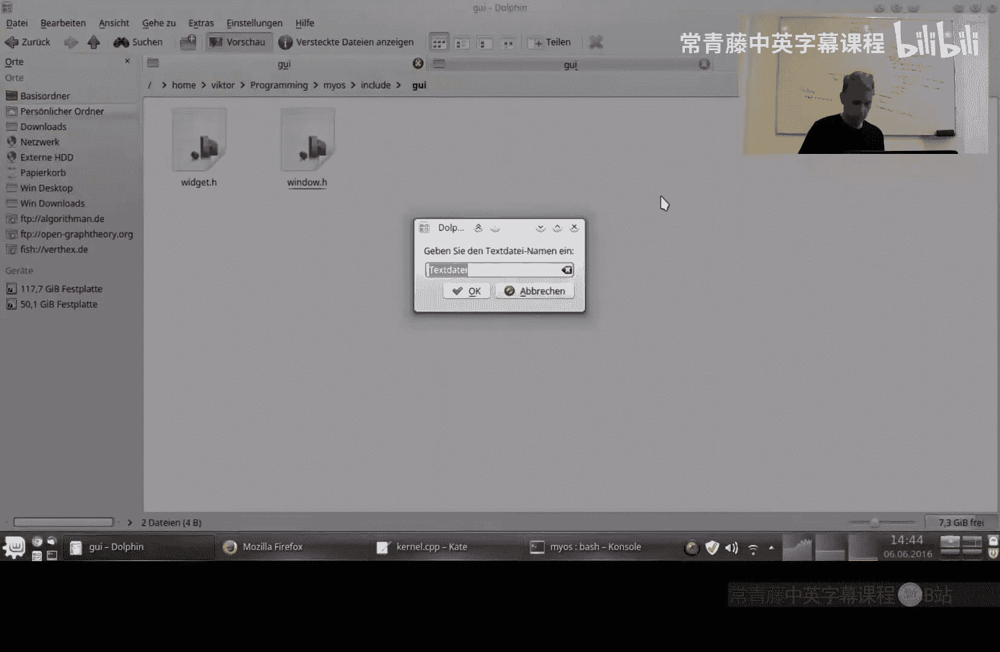

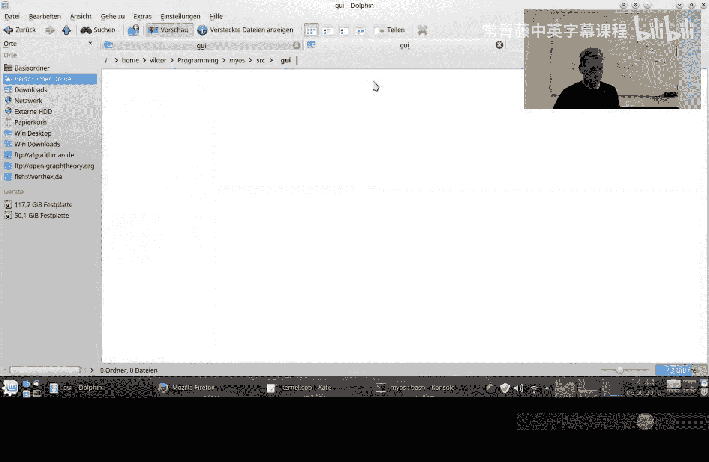

`Desktop`类也派生自`CompositeWidget`，它是所有窗口的容器，是部件树的根。
*   它维护一个`active_window`指针，指向当前活动的窗口。
*   它的`get_focus`方法会将传入的窗口设为`active_window`，并可能将其在Z轴顺序中移到最前面。
*   键盘事件会发送给`active_window`。
*   鼠标点击某个窗口会使其成为新的`active_window`。

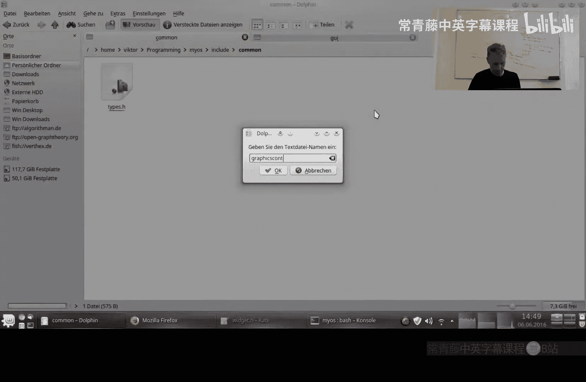

## 代码结构示例

以下是一个简化的代码结构框架，展示了上述类的部分关键实现：

```cpp
// 基础部件类
class Widget {
protected:
    int x, y, width, height;
    Widget* parent;
    bool focusable = true;

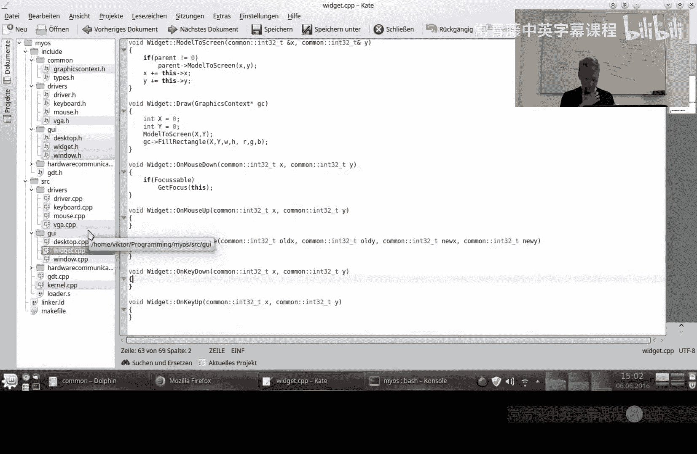

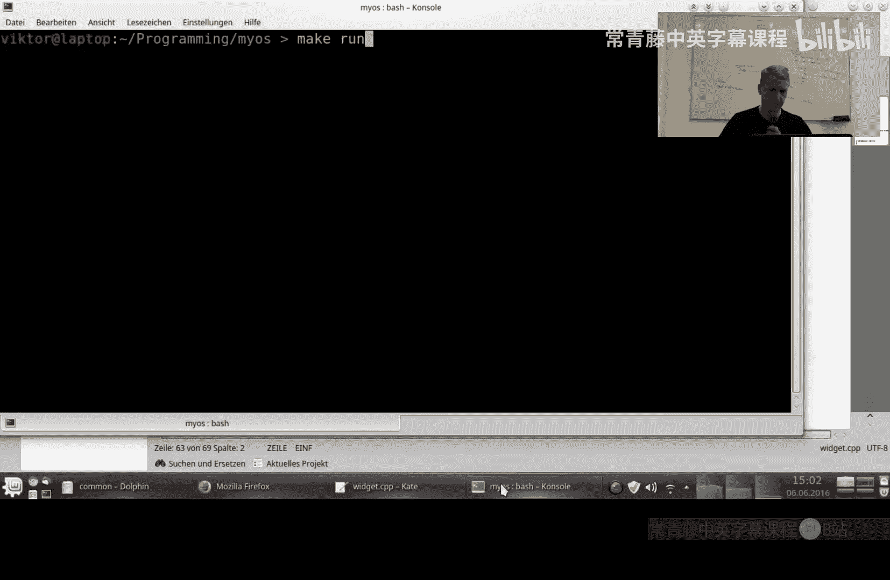

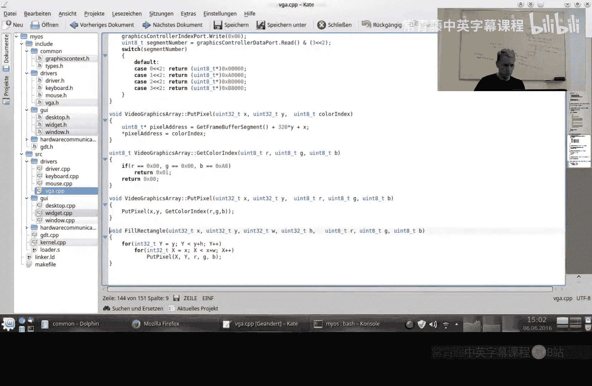

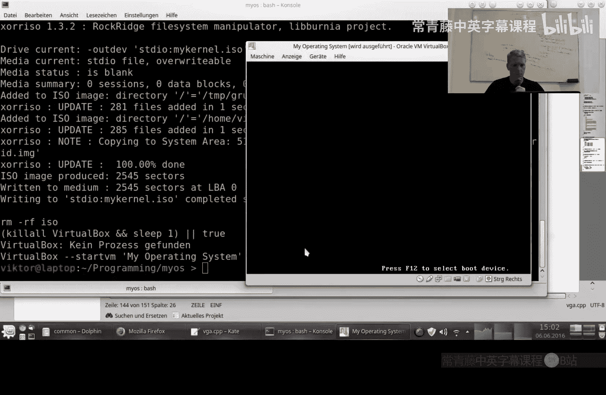

public:
    virtual void draw(GraphicsContext* gc);
    virtual void model_to_screen(int &x, int &y);
    virtual bool contains(int point_x, int point_y);
    virtual void on_mouse_down(int x, int y);
    virtual void get_focus(Widget* widget);
    // ... 其他事件方法
};

// 复合部件类
class CompositeWidget : public Widget {
protected:
    Widget* children[100];
    int num_children;
    Widget* focused_child = nullptr;

public:
    void draw(GraphicsContext* gc) override {
        // 1. 绘制自身背景
        gc->fill_rectangle(x, y, width, height, background_color);
        // 2. 从后向前绘制子部件
        for (int i = num_children - 1; i >= 0; --i) {
            children[i]->draw(gc);
        }
    }

    void on_mouse_down(int x, int y) override {
        for (int i = num_children - 1; i >= 0; --i) {
            if (children[i]->contains(x, y)) {
                children[i]->on_mouse_down(x - children[i]->x, y - children[i]->y);
                break; // 仅最前面的部件接收事件
            }
        }
    }

    void on_key_down(char key) override {
        if (focused_child != nullptr) {
            focused_child->on_key_down(key);
        }
    }

    void get_focus(Widget* widget) override {
        focused_child = widget;
        // 可以继续向上传递，通知窗口或桌面
        if (parent != nullptr) {
            parent->get_focus(this);
        }
    }
};

// 桌面类
class Desktop : public CompositeWidget {
private:
    Window* active_window = nullptr;

public:
    void get_focus(Widget* widget) override {
        // 假设widget是一个Window*
        active_window = (Window*)widget;
        // 将活动窗口移到子部件数组前端以实现置顶
        // ... 重新排序 children 数组的代码
    }

    void on_key_down(char key) override {
        if (active_window != nullptr) {
            active_window->on_key_down(key);
        }
    }
};
```

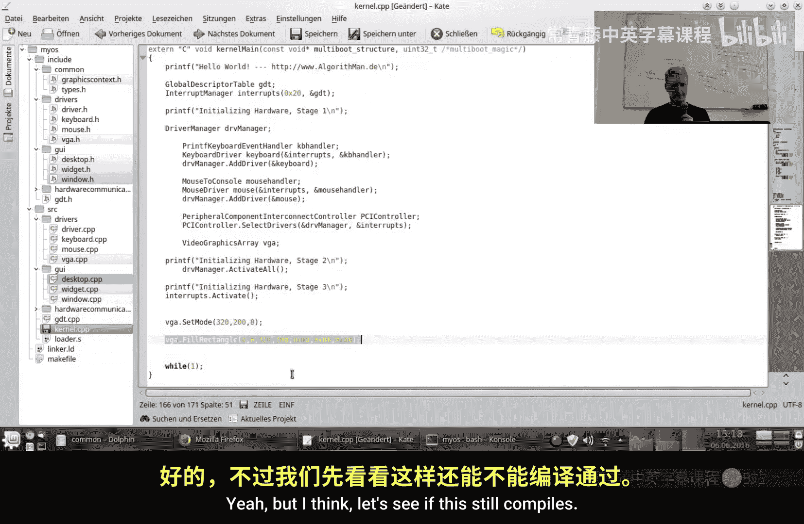

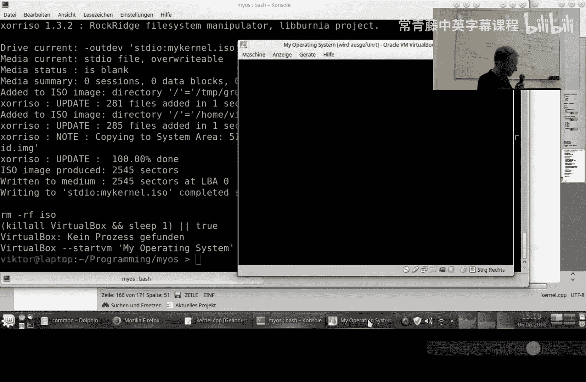

## 总结

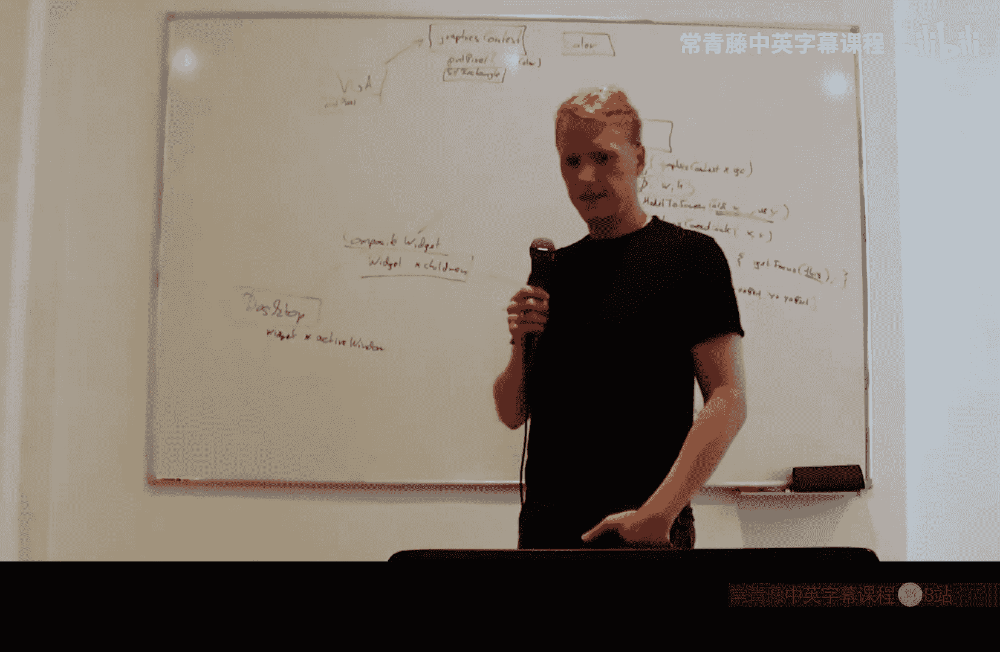

本节课我们一起学习了构建一个简单GUI框架的基础知识。我们介绍了核心的`Widget`类及其坐标转换、命中测试功能，探讨了`CompositeWidget`如何管理子部件并传递事件，并概述了`Window`和`Desktop`类在管理焦点和窗口层叠秩序中的作用。虽然GUI框架的开发深度可以无限延伸，但这个基础结构为我们实现可交互的桌面环境奠定了重要的第一步。在下一节中，我们将尝试实现窗口类，并让它能够响应鼠标事件进行拖动。