# 016：多任务处理 🧵

在本节课中，我们将学习如何为我们的操作系统实现多任务处理。多任务处理是操作系统的核心功能之一，它允许系统同时运行多个任务，并在它们之间快速切换，从而创造出并行执行的假象。

## 多任务处理的基本原理

上一节我们介绍了中断处理。本节中我们来看看如何利用中断机制来实现任务切换。

### 中断与任务切换

处理器正在执行一段代码，同时使用一个栈（我们称之为内核栈）。当一个定时器中断发生时，处理器会自动将一些寄存器的值（如指令指针EIP）压入当前栈中，然后跳转到中断处理程序。在中断处理程序中，我们也会手动保存其他寄存器的状态。

中断处理完成后，这些保存的寄存器值会被恢复，处理器跳回中断发生前的指令继续执行。这是单任务环境下的正常流程。

为了实现多任务，我们需要为每个任务分配独立的栈空间。当创建新任务时，我们为其栈空间预置一个初始的CPU状态结构，其中包含了所有寄存器的初始值，最关键的是将指令指针（EIP）设置为该任务的入口函数地址。

### 任务切换的关键

任务切换的核心发生在中断处理程序返回时。以下是关键步骤：

1.  当中断发生时，当前任务的CPU状态（寄存器值）被保存在其专属栈上。
2.  在中断处理程序中，调度器决定下一个要运行的任务。
3.  中断处理程序返回时，不再返回到旧任务的栈指针（ESP），而是返回**新任务栈顶的CPU状态结构指针**。
4.  处理器将这个新指针加载到ESP，然后按照中断返回的流程，将栈上的值弹出到各个寄存器中。
5.  由于EIP被设置成了新任务的入口点，处理器接下来就开始执行新任务的代码了。


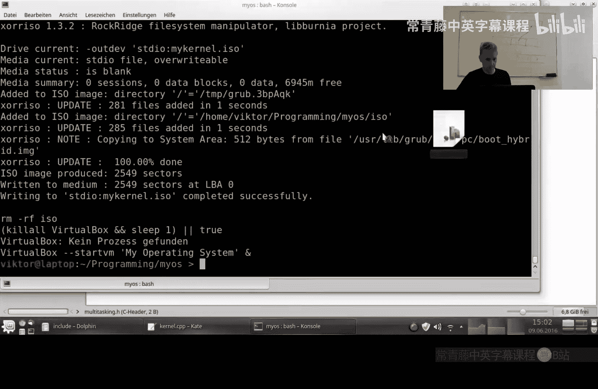

这样，通过巧妙地操纵中断返回时的栈指针，我们就实现了从一个任务到另一个任务的上下文切换。

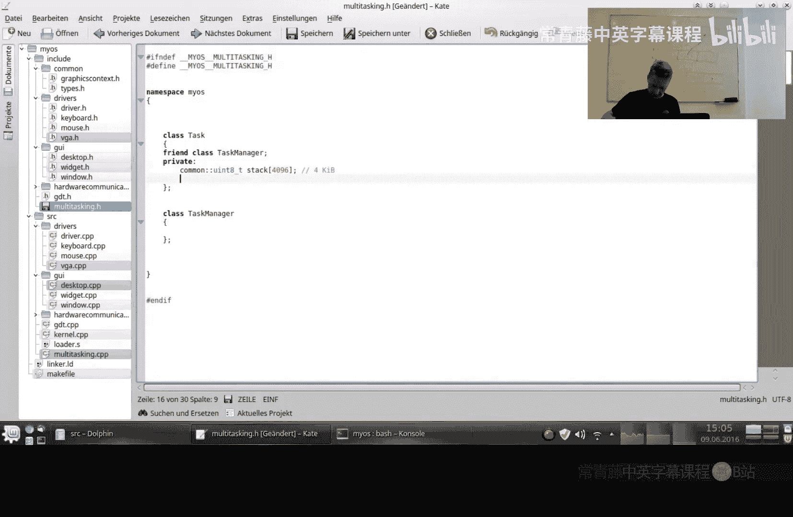

## 代码实现详解


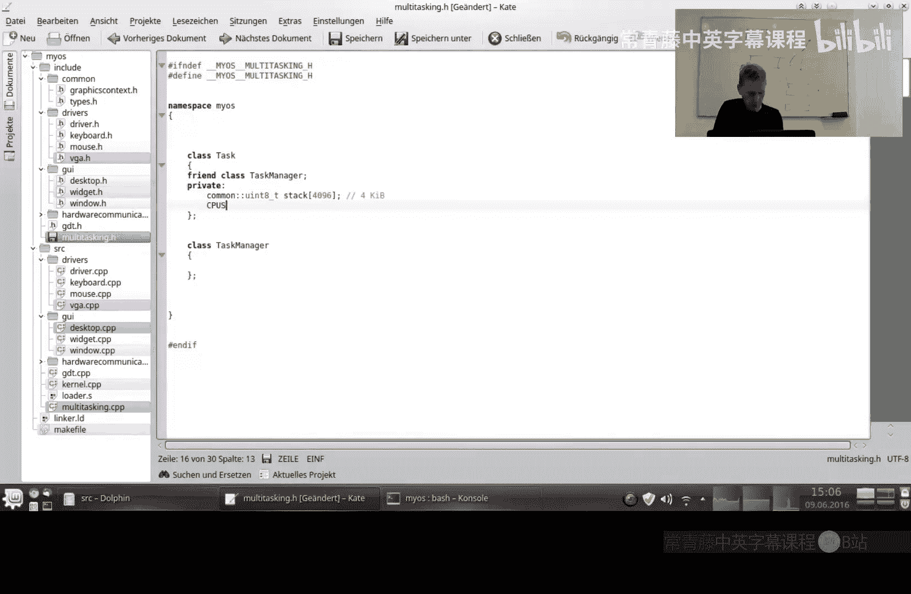


理解了原理后，我们来看看具体的代码实现。我们将创建几个核心的数据结构和类。

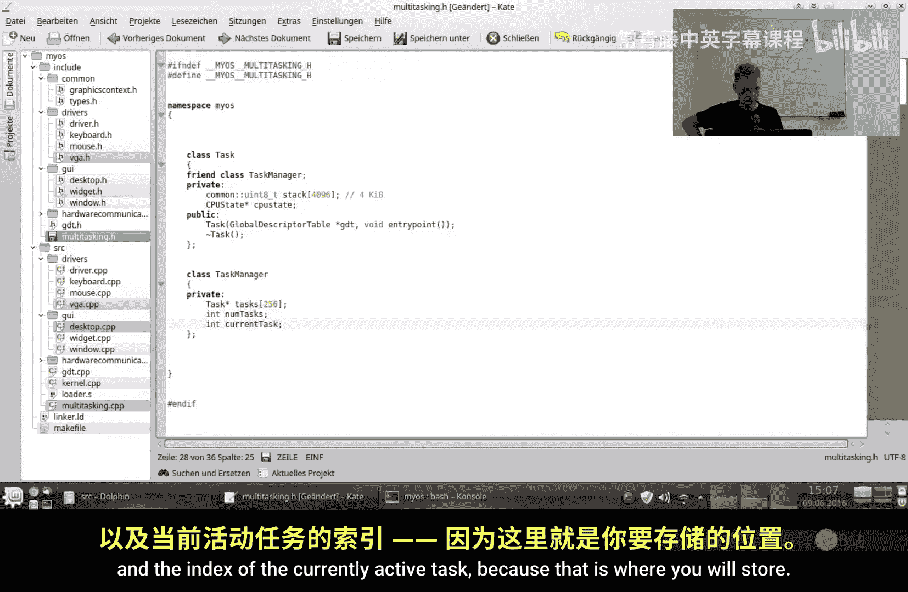


### CPU状态结构体

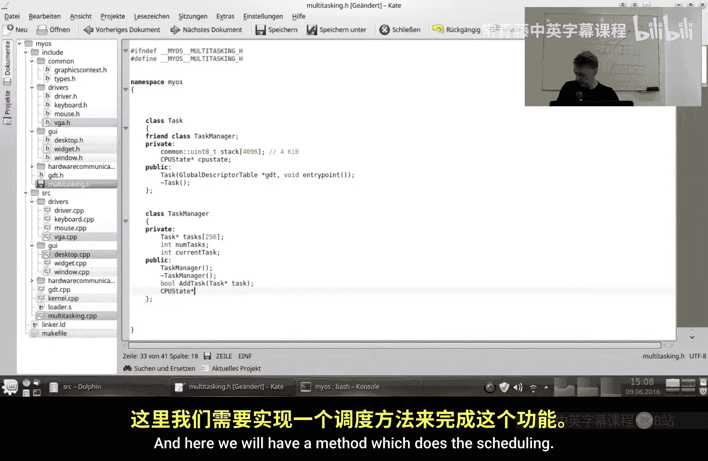


首先，我们需要定义一个结构体来保存CPU的寄存器状态。这个结构体的布局必须与中断发生时值被压入栈的顺序完全一致。

```cpp
struct CPUState
{
    // 以下寄存器由处理器在中断时自动压栈
    uint32_t eip;
    uint32_t cs;
    uint32_t eflags;
    uint32_t esp;
    uint32_t ss;

    // 以下寄存器由我们在中断处理程序中手动压栈
    uint32_t eax;
    uint32_t ebx;
    uint32_t ecx;
    uint32_t edx;
    uint32_t esi;
    uint32_t edi;
    uint32_t ebp;
    // 注意：对于硬件中断（非异常），error_code位置需要手动填充一个值（如0）
    // uint32_t error_code;
};
```

### 任务类

接下来，我们创建`Task`类，它代表一个独立的执行单元。

```cpp
class Task
{
    friend class TaskManager; // 允许TaskManager访问私有成员
private:
    uint8_t stack[4096]; // 每个任务拥有4KB的栈空间
    CPUState* cpustate;  // 指向栈顶CPU状态结构的指针

public:
    Task(GlobalDescriptorTable* gdt, void entrypoint());
    ~Task();
};
```

在`Task`的构造函数中，我们需要初始化它的栈和CPU状态：
1.  计算栈顶地址，并预留出`CPUState`结构的大小。
2.  将`cpustate`指针指向这个预留区域。
3.  将`cpustate->eip`设置为任务的入口函数地址。
4.  将`cpustate->cs`设置为全局描述符表（GDT）中代码段的选择子。
5.  将其他寄存器初始化为0或合适的默认值。

### 任务管理器类

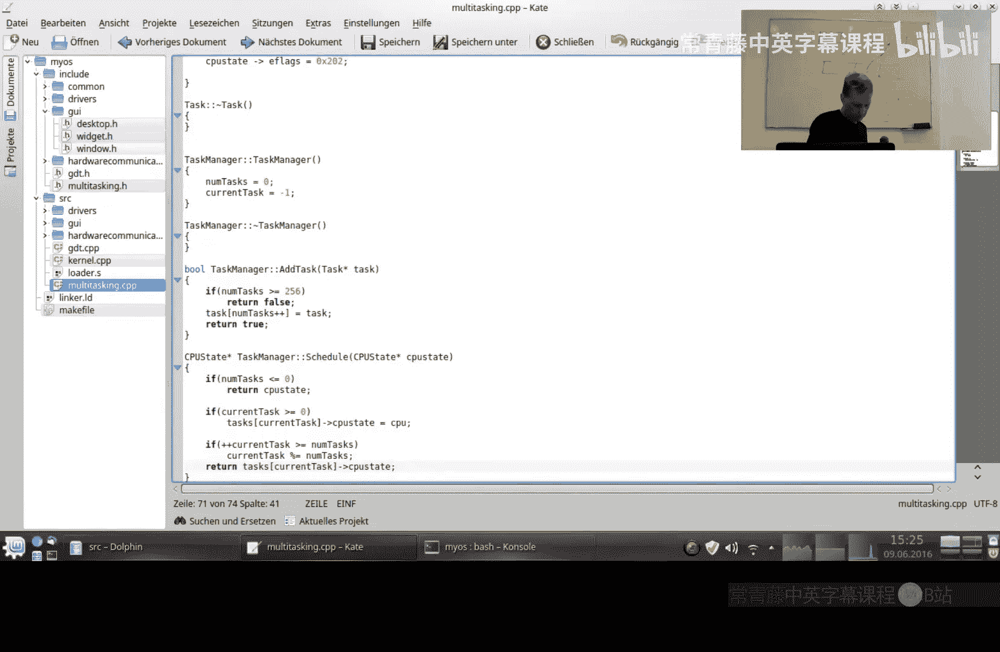

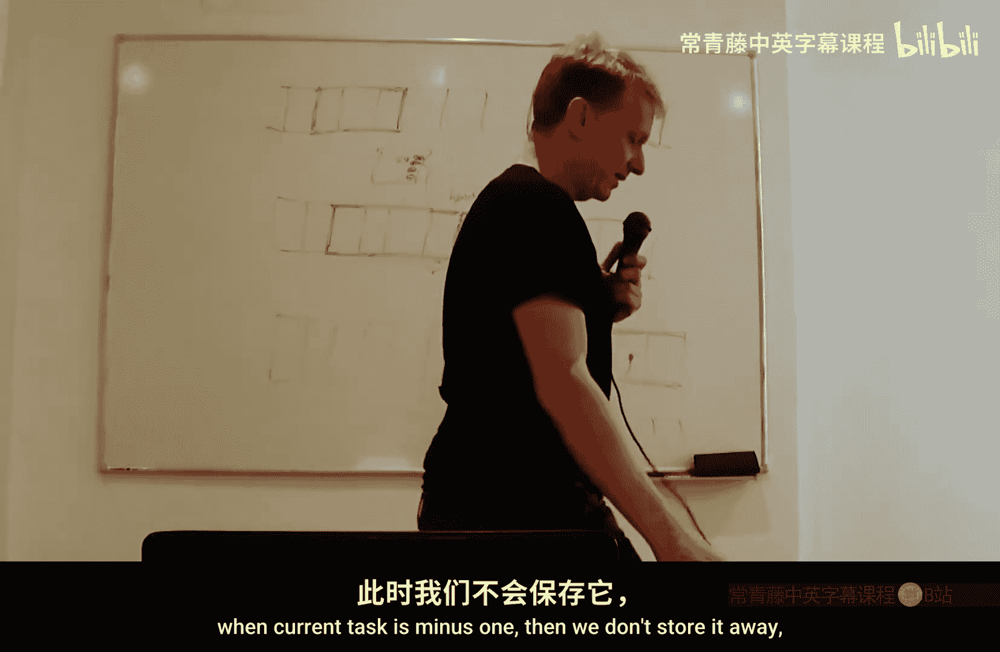

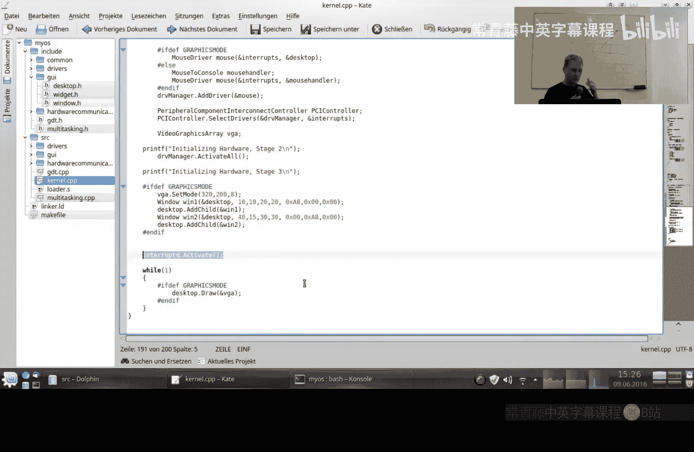

`TaskManager`类负责管理所有任务并进行调度。


```cpp
class TaskManager
{
private:
    Task* tasks[256]; // 任务指针数组
    int numTasks;     // 当前任务数量
    int currentTask;  // 当前正在运行的任务索引，初始为-1

public:
    TaskManager();
    bool AddTask(Task* task); // 添加新任务
    CPUState* Schedule(CPUState* cpustate); // 核心调度函数
};
```

以下是调度函数`Schedule`的工作流程：
1.  如果`currentTask`为-1（例如内核首次被中断），则直接返回传入的`cpustate`，不进行切换。
2.  否则，将传入的`cpustate`（即旧任务的CPU状态）保存回`tasks[currentTask]`中。
3.  使用轮转调度算法选择下一个任务：`currentTask = (currentTask + 1) % numTasks`。
4.  返回新任务的`cpustate`指针。

### 集成到中断处理流程

最后，我们需要修改中断处理程序，使其调用任务管理器。

1.  **在中断管理器中引用任务管理器**：让`InterruptManager`持有一个`TaskManager*`指针。
2.  **修改中断服务例程**：在定时器中断的处理函数中，调用`taskManager->Schedule()`，并将其返回值作为新的栈指针。
    ```cpp
    CPUState* new_cpustate = taskManager->Schedule(cpustate);
    // 这个new_cpustate会被后续汇编代码加载到ESP，从而实现任务切换
    ```
3.  **调整汇编代码**：确保中断入口和出口的汇编代码能够正确地保存和恢复`CPUState`结构体中定义的所有寄存器，并且为硬件中断预留`error_code`的位置。

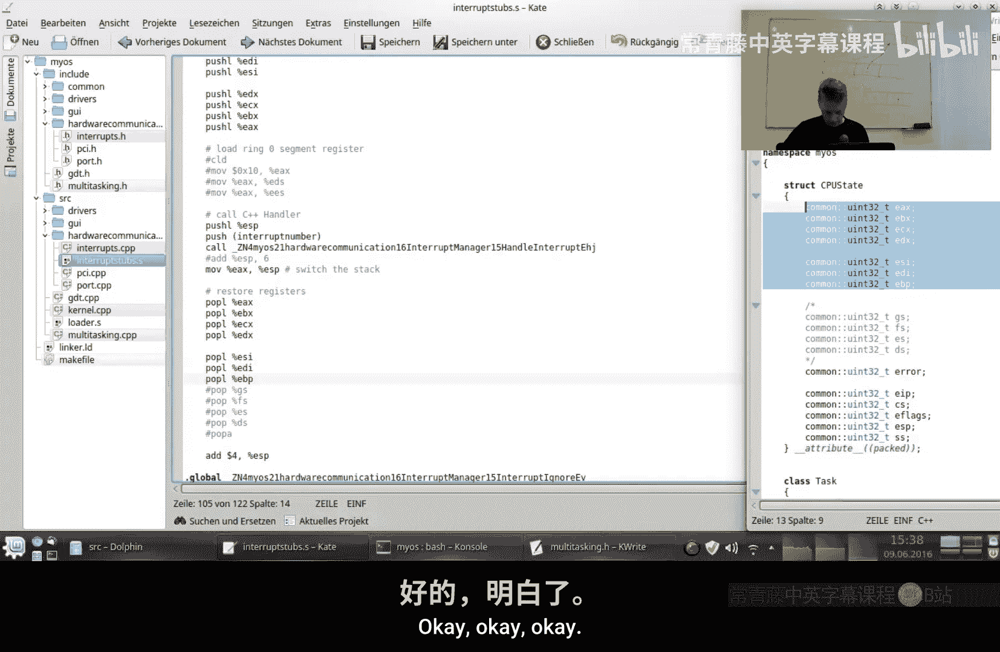

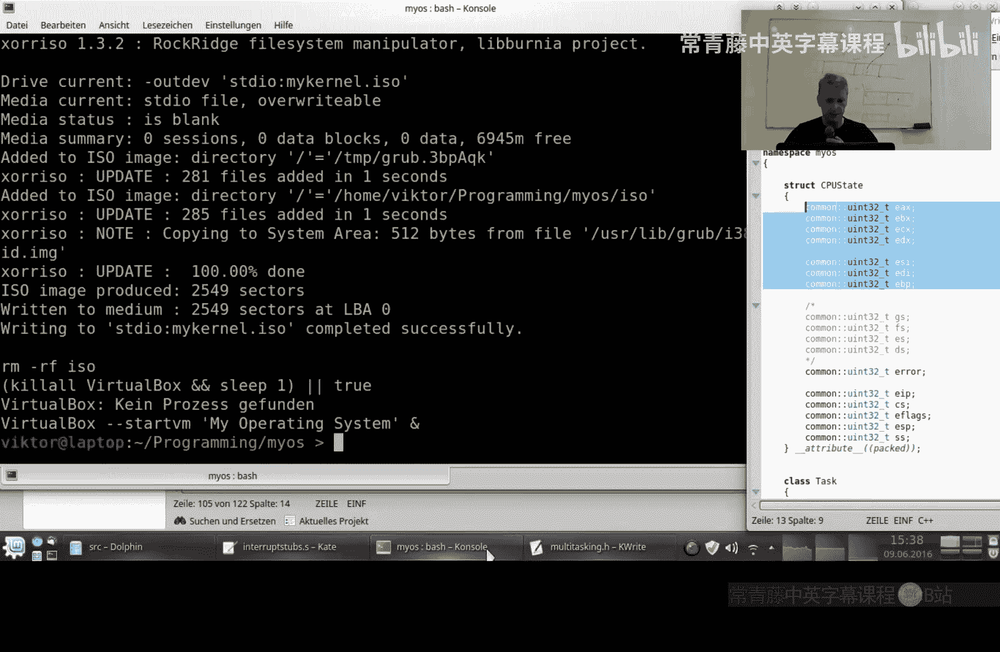

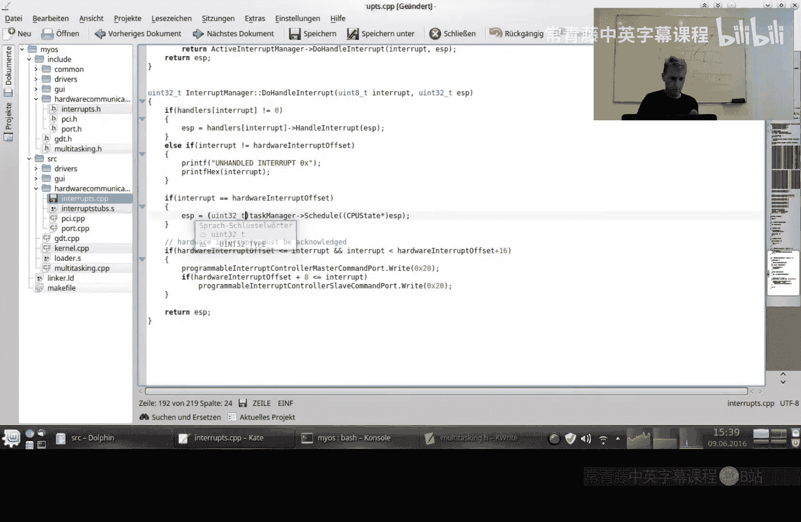

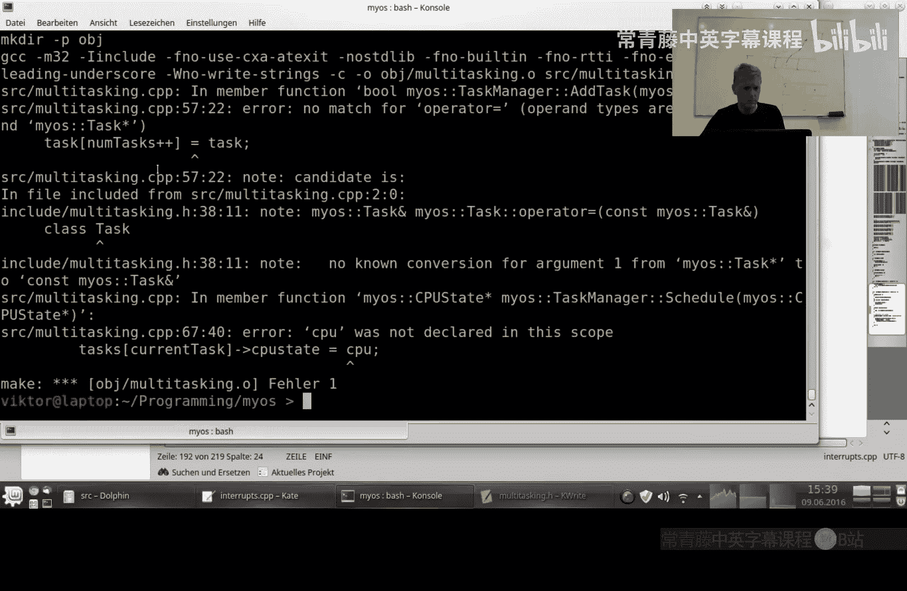

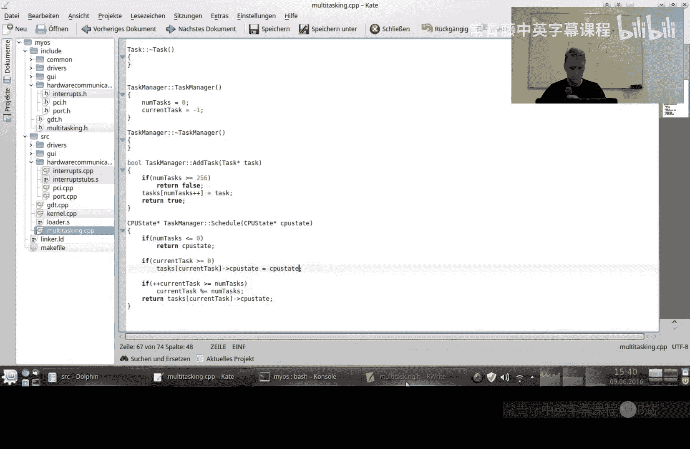

## 重要注意事项与总结

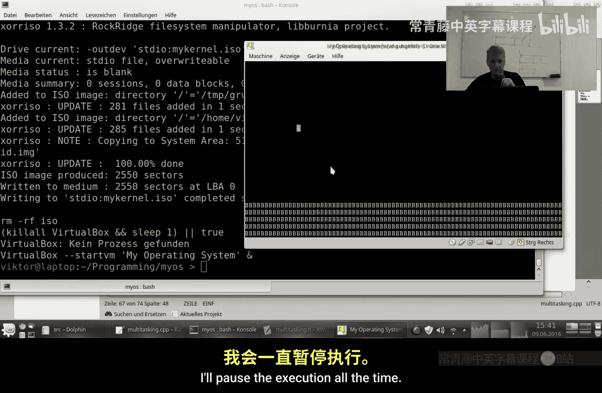


本节课中我们一起学习了多任务处理的基本原理和实现方法。


*   **内核初始化顺序**：激活中断（`interrupts.Activate()`）应该是内核`main`函数中做的**最后一件事**。因为一旦开始任务调度，处理器可能永远不会返回到内核的主线程栈。
*   **当前实现的局限**：目前所有任务都运行在**内核模式**，拥有最高权限。一个完整的操作系统还需要实现**用户模式**，通过特权级保护来限制用户任务的权限，这是系统安全性的基础。
*   **轮转调度**：我们实现的是最简单的轮转调度。更复杂的调度算法（如基于优先级）可以在此基础上进行扩展。


多任务处理是操作系统开发中的一个重要里程碑。你现在已经掌握了通过中断机制进行上下文切换的核心技术。在接下来的课程中，我们将探讨内存管理等其他核心主题，为构建更复杂的系统功能打下基础。