# 018：网络设备驱动

## 概述

在本节课中，我们将学习如何与虚拟机提供的网络设备（AMD PCnet网卡）进行通信。这是一个相对复杂的设备，我们将为其编写驱动程序，包括初始化、中断处理以及为后续的数据收发做好准备。

上一节我们介绍了PCI总线枚举，本节中我们来看看如何为具体的PCI设备（网卡）编写驱动。

## 设备与初始化概述

AMD PCnet网卡是一个虚拟化设备，其初始化过程代码量较大。驱动程序类将继承自 `Driver` 和 `InterruptHandler`，并从PCI配置空间中获取中断号和端口号。

以下是驱动类的基本框架和需要初始化的关键部分：

```cpp
class AMDPCnet : public Driver, public InterruptHandler {
private:
    Port16Bit mac0Port;
    Port16Bit mac2Port;
    Port16Bit mac4Port;
    Port16Bit registerDataPort;
    Port16Bit registerAddressPort;
    Port16Bit resetPort;

    struct InitializationBlock {
        // ... 初始化块结构体成员
    } __attribute__((packed));

    InitializationBlock initBlock;

    // 发送和接收缓冲区（需要16字节对齐）
    uint8_t sendBufferDescrMemory[2048+15];
    uint8_t recvBufferDescrMemory[2048+15];
    // ... 其他成员和方法
};
```

## 缓冲区对齐问题

该设备要求数据缓冲区的起始地址是16字节的倍数。我们采用的方法是分配比实际需要（例如2KB）多15字节的内存，然后找到一个满足对齐要求的地址。

核心对齐操作可以通过以下公式/代码实现：

```cpp
// 假设 buffer 是原始分配的数组，大小为 SIZE + 15
uint8_t buffer[SIZE + 15];
// 找到第一个16字节对齐的地址
uint8_t* alignedBuffer = (uint8_t*)(( (uint32_t)buffer + 15 ) & ~15);
```

## 详细的初始化步骤

初始化过程涉及大量寄存器操作。以下是关键步骤的分解：

首先，在构造函数中，我们设置中断处理并初始化端口：

```cpp
AMDPCnet::AMDPCnet(PCIDeviceDescriptor* dev, InterruptManager* interrupts)
    : InterruptHandler(interrupts, dev->interrupt + 0x20), // 硬件中断偏移
      mac0Port(dev->portBase),
      mac2Port(dev->portBase + 0x02),
      // ... 初始化其他端口
{
    // 1. 读取MAC地址
    // 2. 重置设备
    // 3. 配置初始化块并写入设备
}
```

以下是初始化设备的具体操作列表：

1.  **读取MAC地址**：通过三个16位端口读取48位的MAC地址。
2.  **重置设备**：向复位端口写入命令，并等待一小段时间。
3.  **设置32位模式**：向特定寄存器写入 `0x102`。
4.  **配置初始化块**：设置模式、缓冲区数量（例如8个发送和8个接收缓冲区）及其描述符的物理地址。
5.  **写入初始化块**：将构建好的初始化块数据结构告知设备。
6.  **激活设备**：在 `Activate()` 方法中，设置相关寄存器位以启用设备功能。

## 中断处理

设备通过中断来通知驱动数据到达、发送完成或发生错误。在 `HandleInterrupt` 方法中，我们需要读取中断状态寄存器并处理不同的事件。

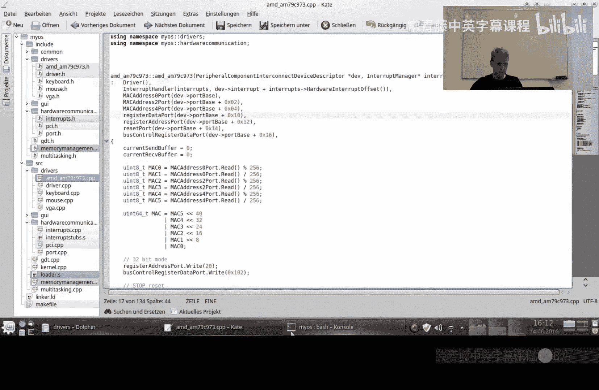

中断状态寄存器的位具有不同含义，例如：
*   `0x8000`：一般错误。
*   `0x2000`：数据冲突错误。
*   `0x1000`：帧丢失（数据过快）。
*   `0x0100`：接收到数据。
*   `0x0200`：数据发送成功。
*   `0x0004`：初始化完成。

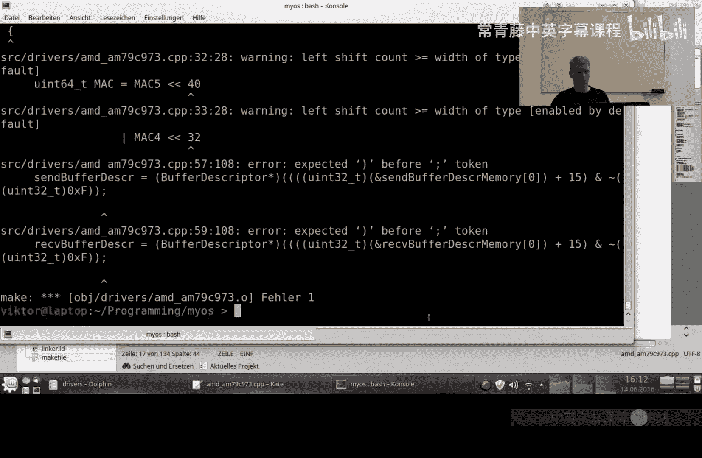

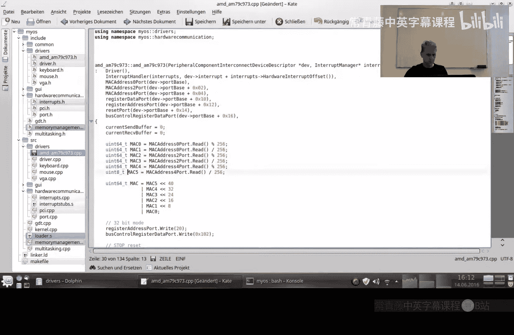

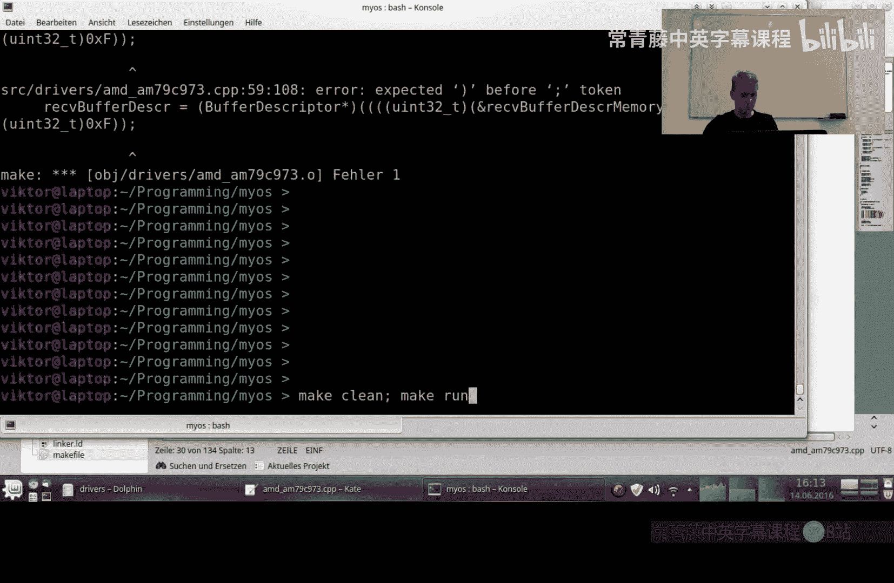

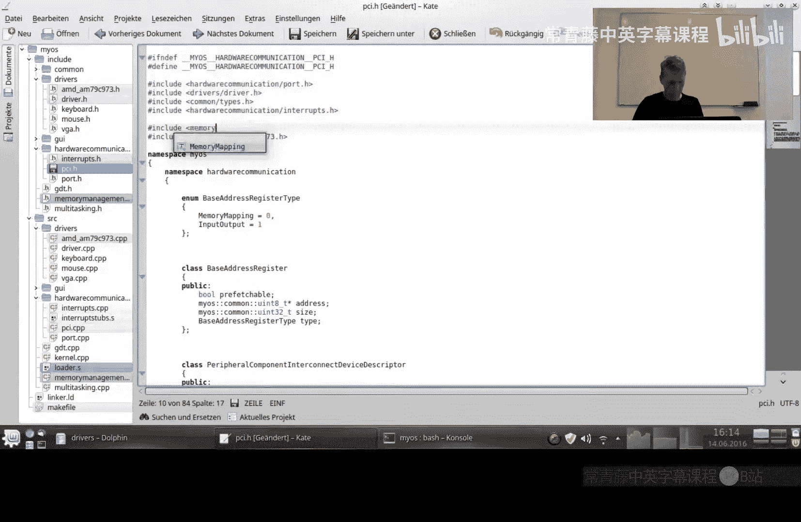


处理中断时，可能需要同时处理多个置位位。

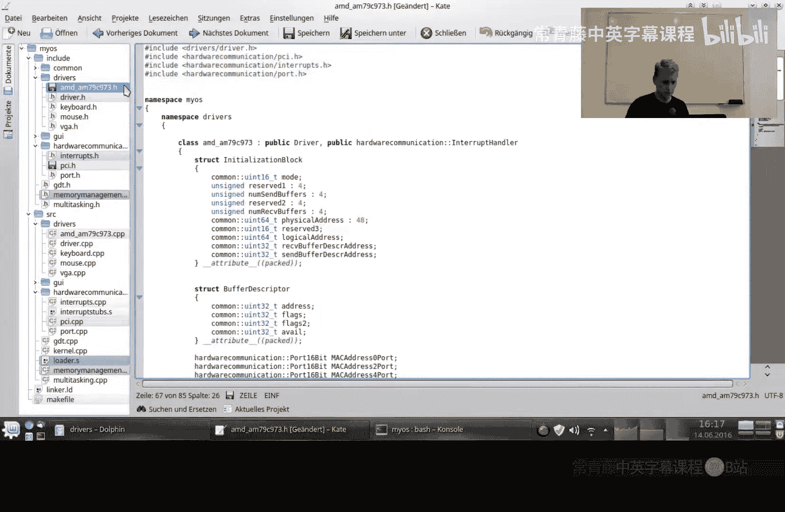

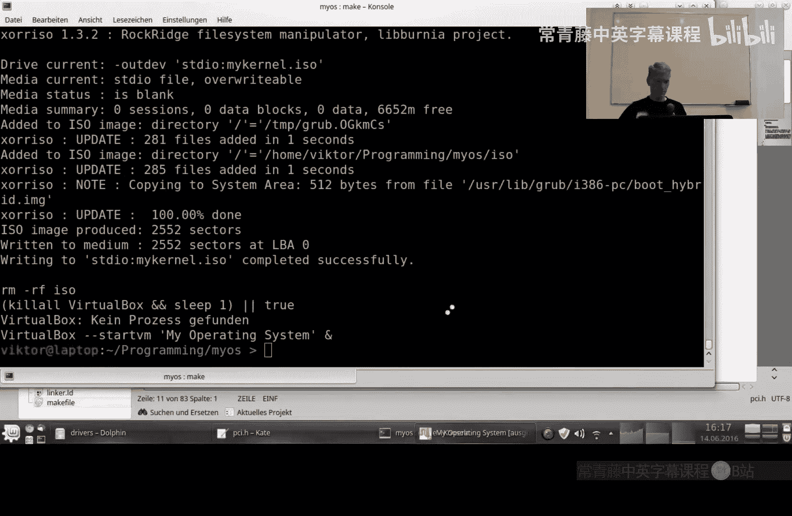

```cpp
uint32_t AMDPCnet::HandleInterrupt(uint32_t esp) {
    uint16_t status = registerDataPort.Read();
    // 检查多个可能同时发生的状态位
    if(status & 0x0004) { /* 处理初始化完成 */ }
    if(status & 0x0100) { /* 处理数据接收 */ }
    if(status & 0x0200) { /* 处理数据发送成功 */ }
    // ... 处理错误位
    return esp;
}
```

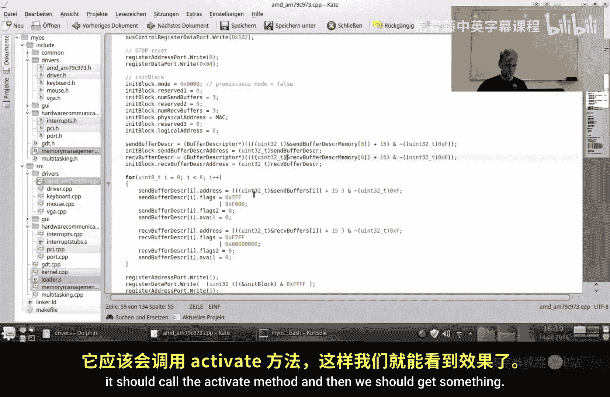

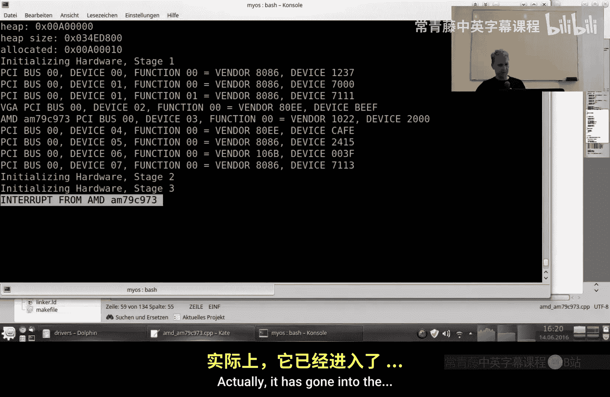

## 集成与测试

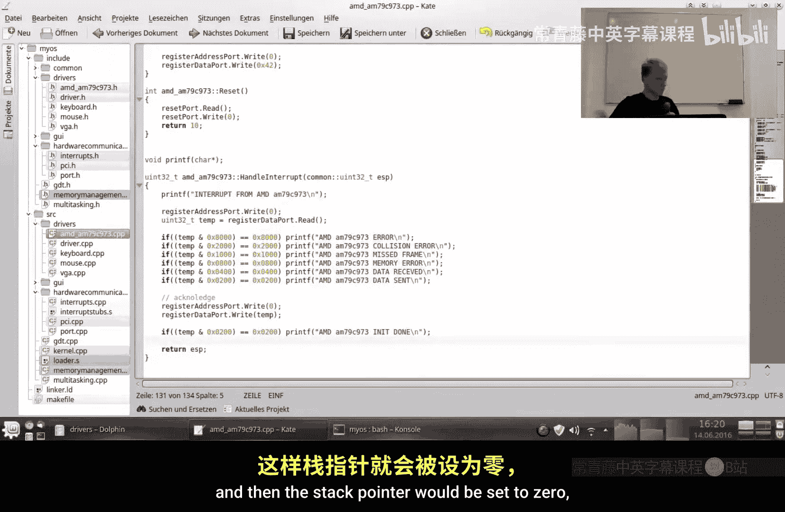

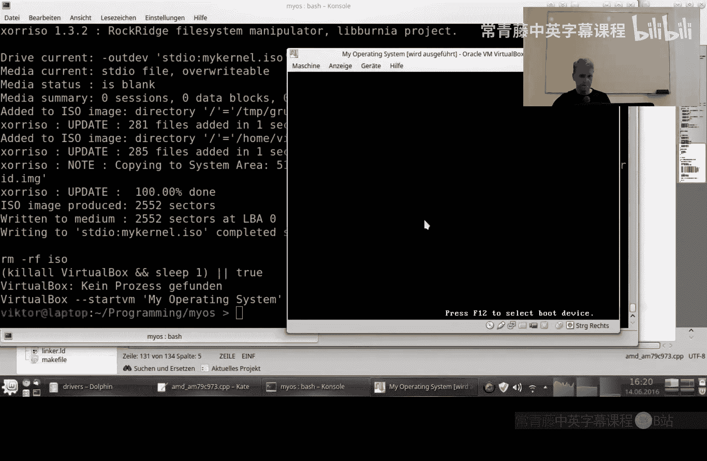

将驱动集成到PCI驱动管理器中。在PCI控制器检测到AMD PCnet设备后，实例化我们的驱动并将其加入驱动管理器。驱动管理器随后会调用所有驱动的 `Activate()` 方法。

测试时，如果系统没有崩溃并且收到了来自该设备的中断（即使未明确显示中断类型），也表明设备的初始化和激活基本成功。这为下一阶段实现数据收发奠定了基础。

## 总结


本节课中我们一起学习了为AMD PCnet网络设备编写驱动程序的核心过程。我们解决了缓冲区16字节对齐的技术问题，完成了包含端口初始化、配置初始化块、设置中断处理在内的复杂初始化流程，并成功将驱动集成到系统中，使其能够响应设备中断。虽然我们尚未实现实际的数据包发送和接收，但已经搭建好了必要的底层通信框架。下一节，我们将在此基础上实现以太网帧的收发，并逐步构建网络协议栈。