# 023：地址解析协议 (ARP) 🧩

## 概述
在本节中，我们将学习如何实现地址解析协议（ARP）。ARP是网络通信的基础协议之一，用于将IP地址解析为对应的MAC地址。我们将编写一个ARP处理器，集成到之前实现的以太网帧处理框架中，使我们的操作系统能够进行基本的网络地址查询。

---

## 背景回顾
上一节我们编写了处理以太网帧的代码，这些帧来自网络驱动程序。以太网帧处理器会检查接收到的帧，判断其目标MAC地址是否为本机地址或广播地址。如果是，则根据帧头中的“以太类型”字段，将数据块转发给对应的协议处理器。目前，我们还没有为任何以太类型注册处理器。本节我们将为ARP协议编写一个处理器，因为它是相对简单的协议。

ARP主要用于计算机之间的通信。当一台计算机想知道另一台计算机的MAC地址时，就会使用ARP。维基百科上关于此协议的描述非常详尽。

## ARP数据结构解析
一个ARP数据块的结构如下：

以下是ARP数据包各字段的详细说明：
*   **硬件类型**：占2字节，大端序编码。表示使用的硬件类型，例如以太网对应值为 `1`，实际存储为 `0x0001`。
*   **协议类型**：占2字节，大端序编码。表示要映射的协议地址类型，IPv4对应值为 `0x0800`。
*   **硬件地址长度**：占1字节。表示硬件地址的长度，对于MAC地址，此值为 `6`。
*   **协议地址长度**：占1字节。表示协议地址的长度，对于IPv4地址，此值为 `4`。
*   **操作码**：占2字节。表示此消息的目的，例如请求（`1`）或响应（`2`）。
*   **发送方MAC地址**：占6字节。
*   **发送方IP地址**：占4字节。
*   **目标MAC地址**：占6字节。
*   **目标IP地址**：占4字节。

需要注意的是，操作码之后的数据长度取决于前面定义的硬件和协议地址长度。在我们的实现中，我们将硬编码为以太网（硬件地址长度6）和IPv4（协议地址长度4）。

## ARP处理器的设计
ARP类需要知道本机的IP地址，以便能够响应关于自身IP地址的查询。我们将在网络卡驱动程序的初始化块中设置IP地址，并传递给ARP处理器。

在以太网帧处理器中，ARP将作为一个具体的帧处理器被注册。我们将定义一个结构体来表示ARP消息。

你可能会有疑问：为什么ARP数据包中已经包含了发送方和目标方的MAC地址，而外层的以太网帧头也包含了这些信息？这是因为通信路径上可能存在多个中间设备（如路由器）。外层以太网帧头的地址总是在当前直接相连的两个设备之间变化，而ARP数据包内的地址则始终表示通信的原始发起者和最终目标者。

## 代码实现步骤
现在，让我们开始具体的代码实现。

### 1. 定义ARP消息结构体
首先，我们需要定义一个结构体来映射ARP数据包。

```c
typedef struct {
    uint16_t hardware_type;
    uint16_t protocol_type;
    uint8_t hardware_addr_len;
    uint8_t protocol_addr_len;
    uint16_t opcode;
    uint8_t sender_mac[6];
    uint8_t sender_ip[4];
    uint8_t target_mac[6];
    uint8_t target_ip[4];
} arp_message_t;
```

### 2. 创建ARP处理器类
ARP处理器继承自以太网帧处理器。其构造函数需要接收后端驱动和本机IP地址。

```c
class ARPHandler : public EthernetFrameHandler {
private:
    uint32_t my_ip; // 本机IP地址，大端序
    arp_cache_entry_t cache[128]; // 简单的ARP缓存
    int cache_entries;

public:
    ARPHandler(NetworkDriverBackend* backend, uint32_t ip_addr);
    bool onEthernetFrameReceived(uint8_t* buffer, uint32_t size) override;
    void requestMAC(uint32_t ip);
    uint64_t getMACFromCache(uint32_t ip);
    uint64_t resolveMAC(uint32_t ip); // 请求并等待解析
};
```

在构造函数中，我们调用基类构造函数，以太类型设置为 `0x0806`（ARP），并初始化ARP缓存。

### 3. 实现MAC地址请求
当我们需要知道某个IP地址对应的MAC时，就发送一个ARP请求。

以下是发送ARP请求的步骤：
1.  在栈上构造一个ARP消息结构体。
2.  设置硬件类型为 `1`（以太网），协议类型为 `0x0800`（IPv4）。
3.  设置硬件地址长度为 `6`，协议地址长度为 `4`。
4.  设置操作码为 `1`（请求）。
5.  填充发送方（本机）的MAC地址和IP地址。
6.  将目标MAC地址设置为广播地址（`FF:FF:FF:FF:FF:FF`），目标IP地址设置为要查询的IP。
7.  调用继承自基类的 `send` 方法，将整个ARP消息作为数据负载发送出去。

### 4. 处理接收到的ARP消息
当接收到以太网帧时，如果以太类型是ARP，则会调用 `onEthernetFrameReceived` 方法。

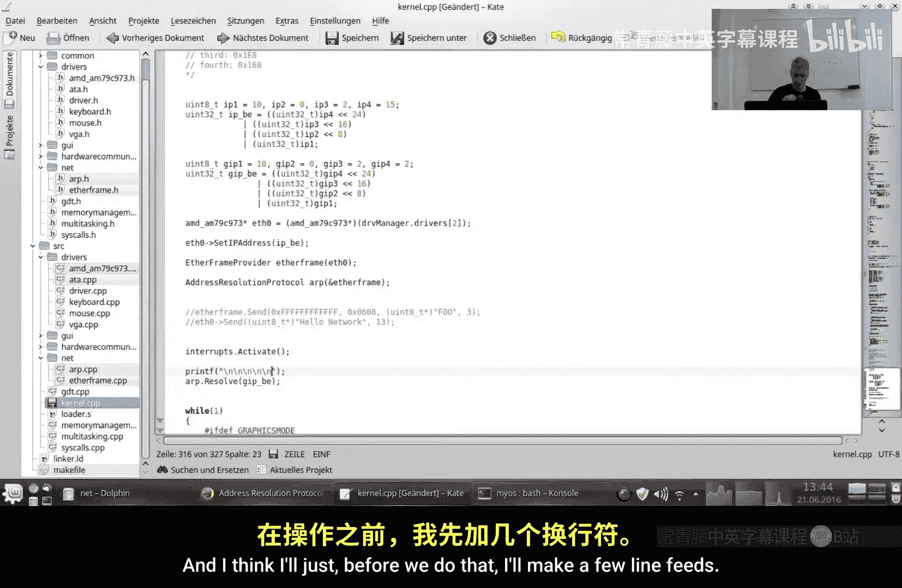

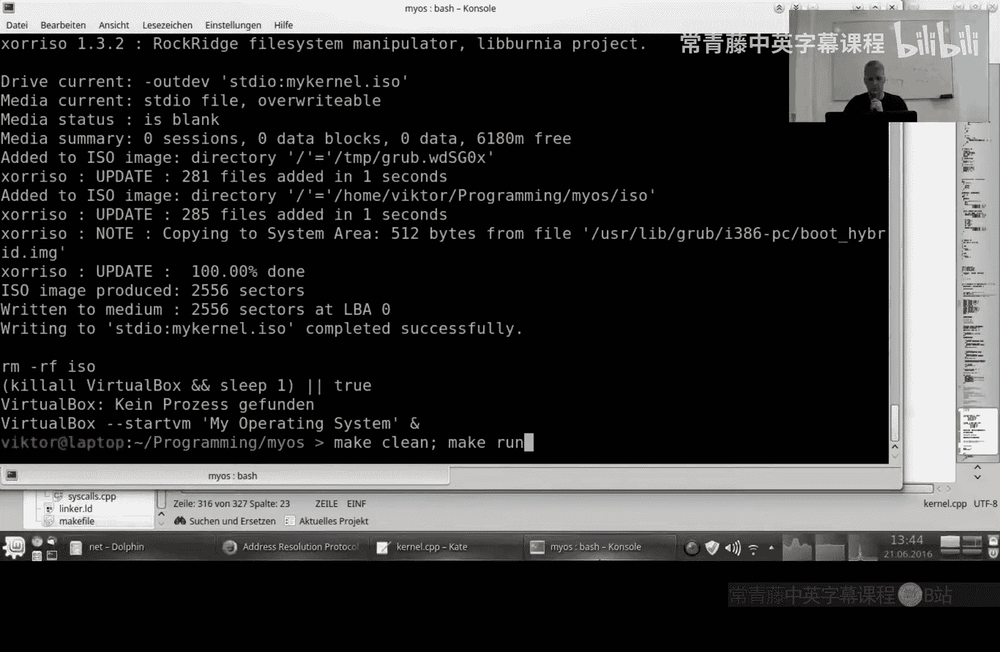

以下是处理ARP消息的逻辑：
1.  将数据缓冲区转换为 `arp_message_t` 指针（需先检查数据大小是否足够）。
2.  验证硬件类型、协议类型、地址长度等字段是否符合预期（以太网/IPv4）。
3.  检查操作码：
    *   如果是 **响应**（`0x0200`）：将发送方的IP和MAC地址对存储到本地ARP缓存中。
    *   如果是 **请求**（`0x0100`）并且目标IP是本机IP：将操作码改为响应（`0x0200`），交换发送方和目标方的地址信息（将原发送方信息作为新目标，将本机信息作为新发送方），然后返回 `true` 以指示需要发送回复。
4.  如果消息不是给本机的，目前我们不做任何处理（更复杂的实现如网关可能会代为应答或转发）。

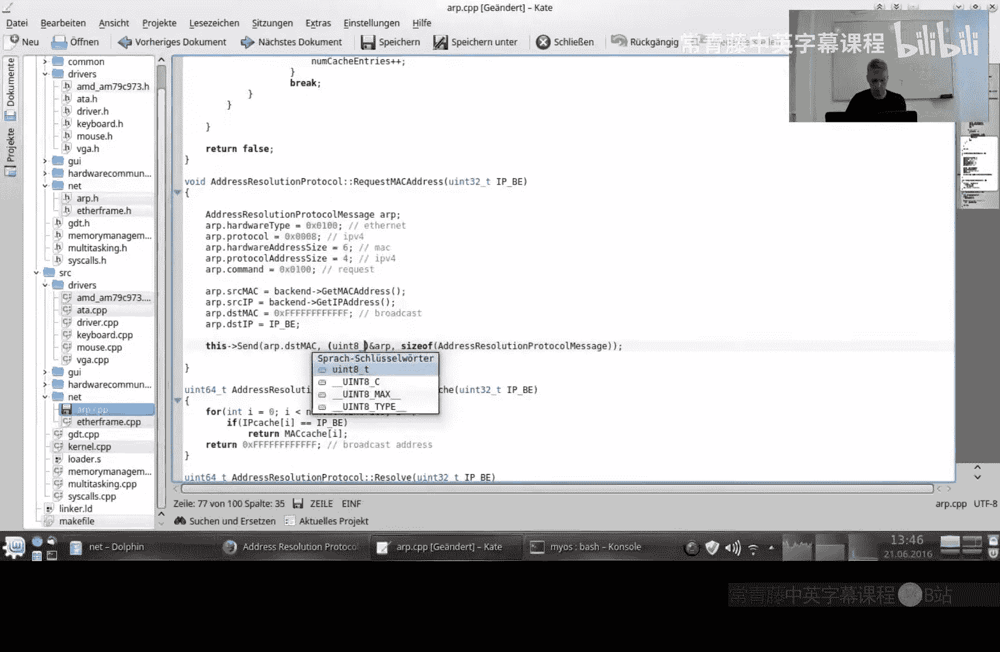

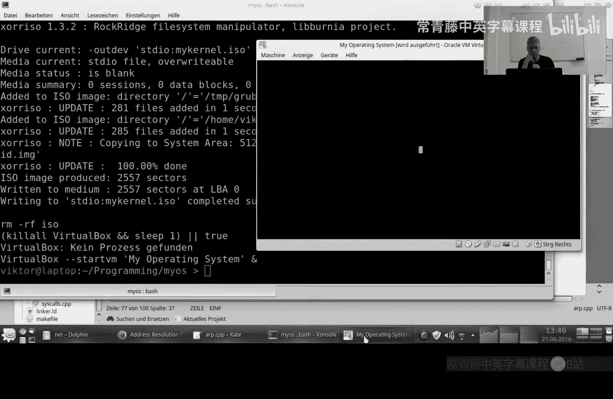

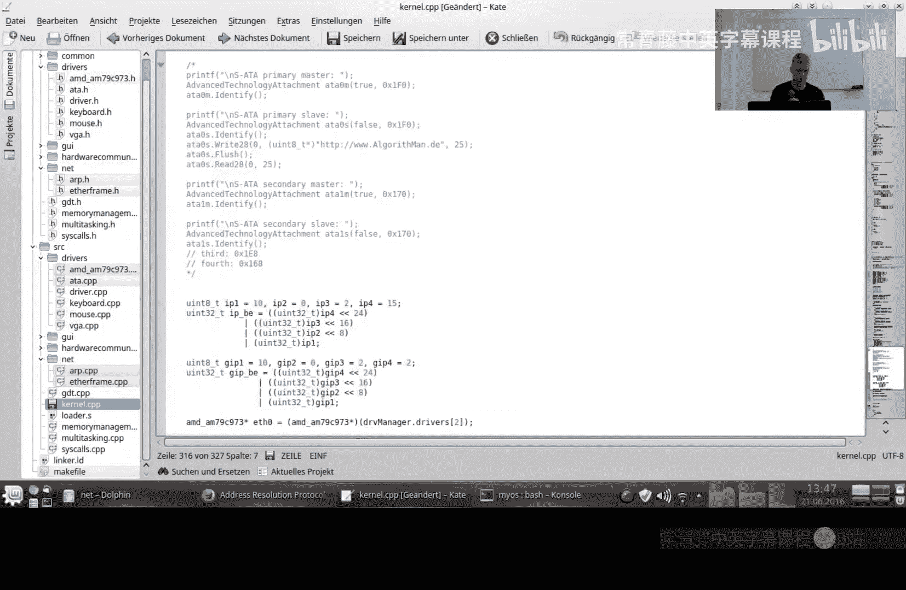

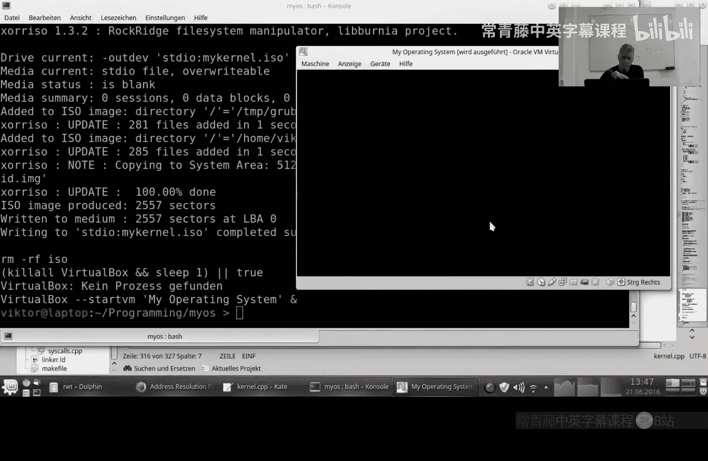

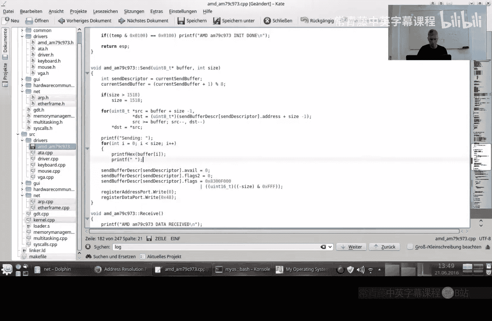

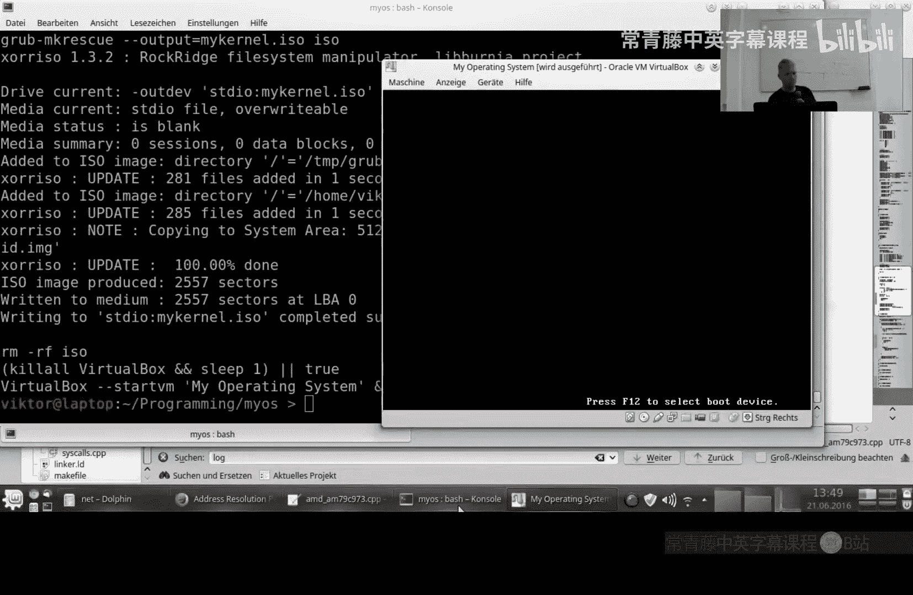

### 5. 实现地址解析方法
我们提供一个 `resolveMAC` 方法，它首先查询缓存，如果找不到，则发送请求并循环等待直到缓存中出现对应的条目。请注意，这是一个简单的实现，缺乏超时机制，如果目标主机不存在，此循环可能永远不会结束。

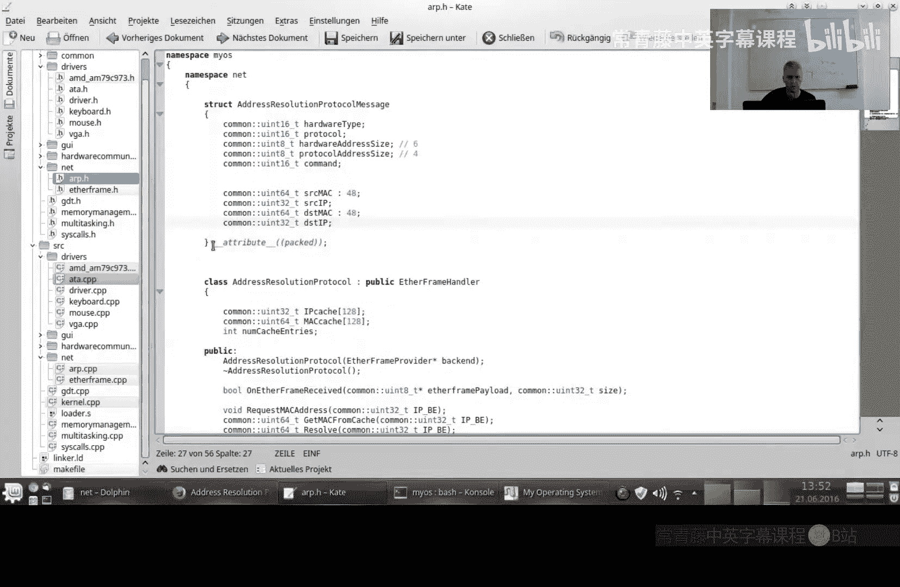

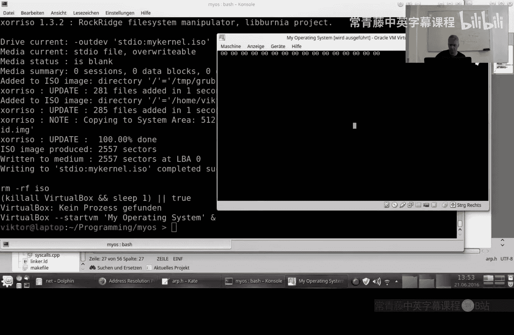

## 集成与测试
现在，我们将ARP处理器集成到系统中并进行测试。


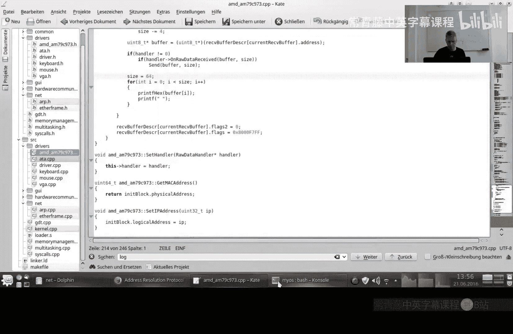

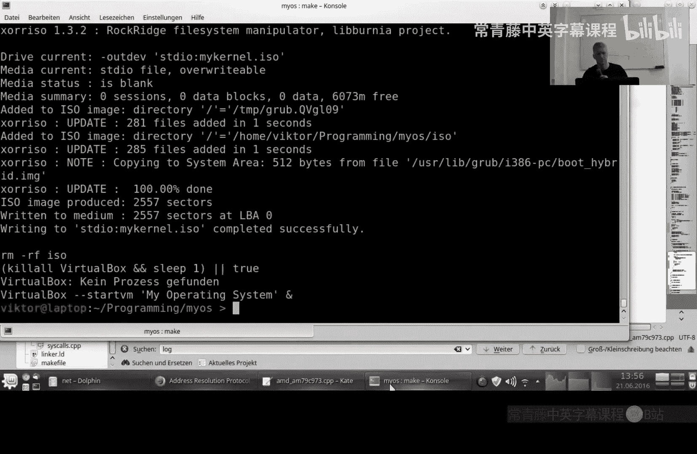

以下是集成步骤：
1.  在Makefile中添加ARP处理器的编译选项。
2.  在主程序初始化网络驱动时，手动设置本机的IP地址（例如 `10.0.2.15`）和网关IP地址（例如 `10.0.2.2`）。
3.  创建ARP处理器实例，并将其注册到以太网帧处理器中。
4.  在启用中断后，尝试解析网关的MAC地址。
5.  为了观察过程，我们可以在接收数据时打印出原始的以太网帧数据。

运行测试后，我们成功观察到以下过程：
1.  本机发送了一个ARP请求广播帧。
2.  收到了网关发回的ARP响应单播帧。
3.  响应帧中的信息正确无误：操作码为响应，包含了网关自身的MAC和IP地址，目标地址是本机的MAC和IP。

这证明我们编写的网络驱动、以太网帧处理和ARP协议代码全部协同工作正常，操作系统已经能够进行基本的网络层通信。


## 总结
本节课我们一起学习了地址解析协议（ARP）的原理与实现。我们成功将ARP处理器集成到操作系统的网络栈中，实现了IP地址到MAC地址的查询与响应功能，并通过实际测试验证了通信的成功。这是构建完整网络协议栈的关键一步，为我们后续实现更复杂的协议（如IPv4、ICMP、UDP）奠定了坚实的基础。下一节，我们将开始探索IPv4协议。