# 024：互联网协议 (IPv4) 🌐

在本节课中，我们将学习如何为IPv4协议实现一个处理器。这是构建网络功能的关键一步，它将允许我们的操作系统发送和接收IP数据包。

## 概述

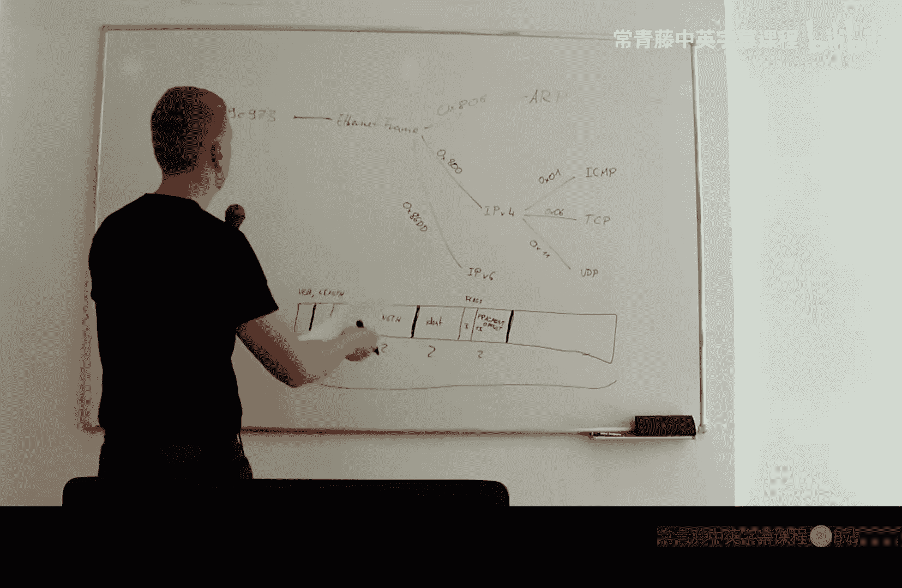

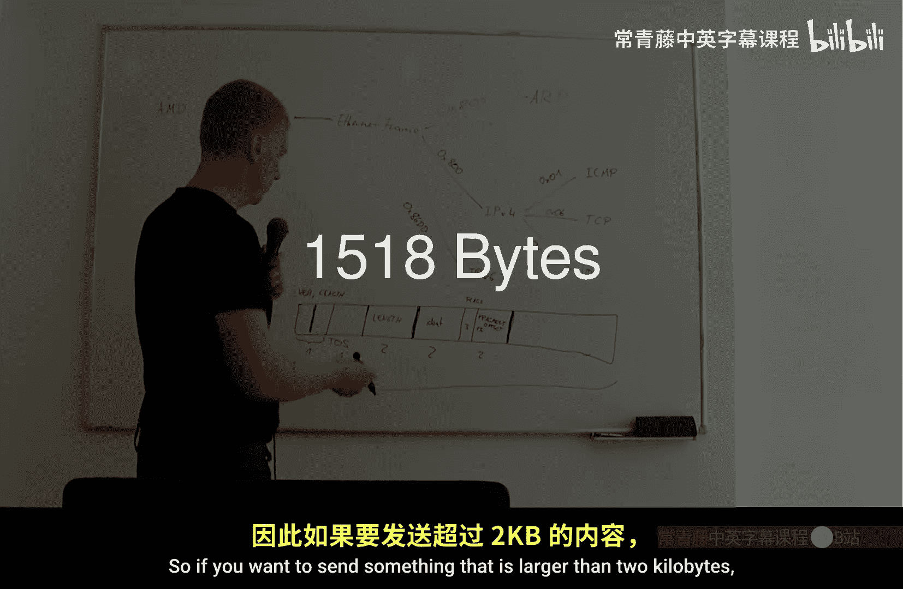

在之前的课程中，我们为网络驱动编写了处理器，并实现了地址解析协议（ARP）。现在，我们将处理以太网帧中类型为 `0x0800` 的数据，这对应着IPv4协议。IPv4是互联网通信的基础，它负责将数据包从源地址路由到目标地址。

## IPv4数据包结构

IPv4数据包由头部和有效载荷组成。头部包含多个字段，用于控制数据包的传输。以下是IPv4头部的结构：

```
struct IPv4Header {
    uint8_t version_ihl;      // 版本（4位） + 头部长度（4位）
    uint8_t tos;              // 服务类型
    uint16_t total_length;    // 总长度
    uint16_t identification;  // 标识
    uint16_t flags_fragment;  // 标志（3位） + 分片偏移（13位）
    uint8_t ttl;              // 生存时间
    uint8_t protocol;         // 协议
    uint16_t checksum;        // 头部校验和
    uint32_t src_ip;          // 源IP地址
    uint32_t dest_ip;         // 目标IP地址
};
```

*   **版本和头部长度**：版本固定为4。头部长度以4字节为单位，最小值为5（20字节）。
*   **服务类型**：通常设置为0，表示普通消息。
*   **总长度**：整个IP数据包（头部+数据）的长度，以字节为单位。
*   **标识、标志和分片偏移**：用于处理数据包分片。在我们的简单实现中，我们发送小数据包，不进行分片。
*   **生存时间**：数据包每经过一个路由器（一跳）就减1，减到0时被丢弃，防止数据包在网络中无限循环。
*   **协议**：指示有效载荷中数据的类型（例如，1=ICMP，6=TCP，17=UDP）。
*   **校验和**：仅针对IP头部进行计算，用于检测传输错误。
*   **IP地址**：32位的源地址和目标地址。

## 实现IPv4处理器

上一节我们介绍了ARP处理器，它负责将IP地址解析为MAC地址。本节中，我们来看看如何构建IPv4处理器，它将在网络协议栈中扮演承上启下的角色。

我们将创建一个 `IPv4Provider` 类，它继承自 `EtherFrameHandler`。它的核心工作是检查接收到的以太网帧，如果类型是 `0x0800`，则将其作为IPv4数据包处理。

以下是 `IPv4Provider` 的关键方法：

**构造函数**：需要后端驱动、ARP处理器指针、网关IP和子网掩码。
```cpp
IPv4Provider(EtherFrameProvider* backend,
             AddressResolutionProtocol* arp,
             uint32_t gatewayIP,
             uint32_t subnetMask);
```

**接收数据**：`OnEtherFrameReceived` 方法检查以太网帧类型，如果是IPv4，则解析头部，检查目标IP是否为本机，然后根据协议号将有效载荷传递给相应的处理器（如未来的ICMP、TCP处理器）。
```cpp
bool OnEtherFrameReceived(uint8_t* etherframePayload, uint32_t size);
```

**发送数据**：`Send` 方法负责构建一个完整的IPv4数据包并发送出去。
```cpp
void Send(uint32_t destIP, uint8_t protocol, uint32_t dataSize, uint8_t* data);
```

在发送数据时，需要确定下一跳的MAC地址：
1.  判断目标IP是否在本地子网内（使用 `(destIP & subnetMask) == (myIP & subnetMask)`）。
2.  如果在本地子网，则通过ARP解析目标IP的MAC地址。
3.  如果不在本地子网，则解析网关IP的MAC地址，将数据包发给网关。

## 关键实现细节

在实现过程中，有几个细节需要特别注意：

**数据长度处理**：从以太网帧中提取IPv4数据时，不能直接使用以太网帧的长度。必须使用IPv4头部中的 `total_length` 字段，并且要与以太网帧的剩余长度取最小值，以防止类似“心脏滴血”的攻击，即攻击者伪造一个过大的长度值来读取内存后续的数据。
```cpp
uint32_t ipDataLength = min(ntohs(ipHeader->total_length), size);
```

**校验和计算**：IPv4头部校验和的计算有些特殊。算法是将头部每16位作为一个数字相加（如果头部长度为奇数，则最后一个字节补0），然后将加法过程中产生的所有进位（即高16位）再加回到低16位上，重复此过程直到高16位为0，最后对结果取反。
```cpp
uint16_t CalculateChecksum(uint16_t* data, uint32_t lengthInBytes) {
    uint32_t sum = 0;
    for (uint32_t i = 0; i < lengthInBytes / 2; i++) {
        sum += ((data[i] & 0xFF00) >> 8) | ((data[i] & 0x00FF) << 8); // 转换为大端序相加
    }
    if (lengthInBytes % 2) {
        sum += ((uint16_t)((uint8_t*)data)[lengthInBytes - 1]) << 8;
    }
    while (sum >> 16) {
        sum = (sum & 0xFFFF) + (sum >> 16);
    }
    return (uint16_t)(~sum);
}
```

**虚函数**：确保基类中的 `OnRawDataReceived` 等方法声明为 `virtual`，这样在派生类中重写它们时，多态性才能正确工作，否则数据无法正确传递到子类处理器。

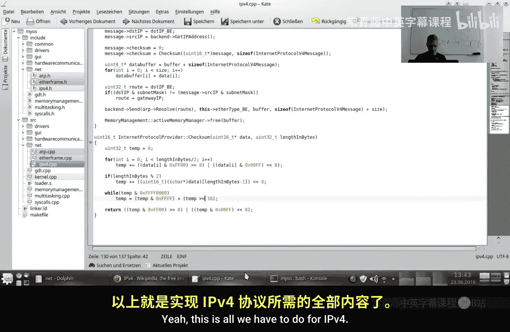

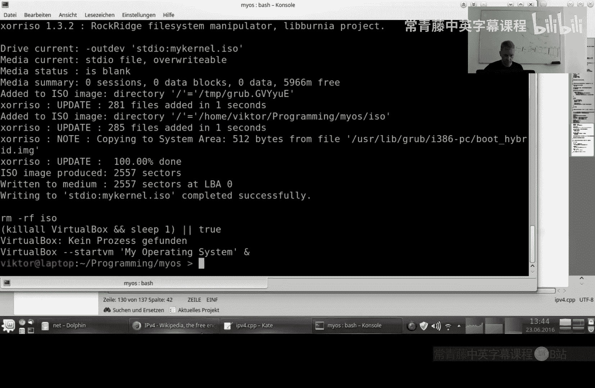

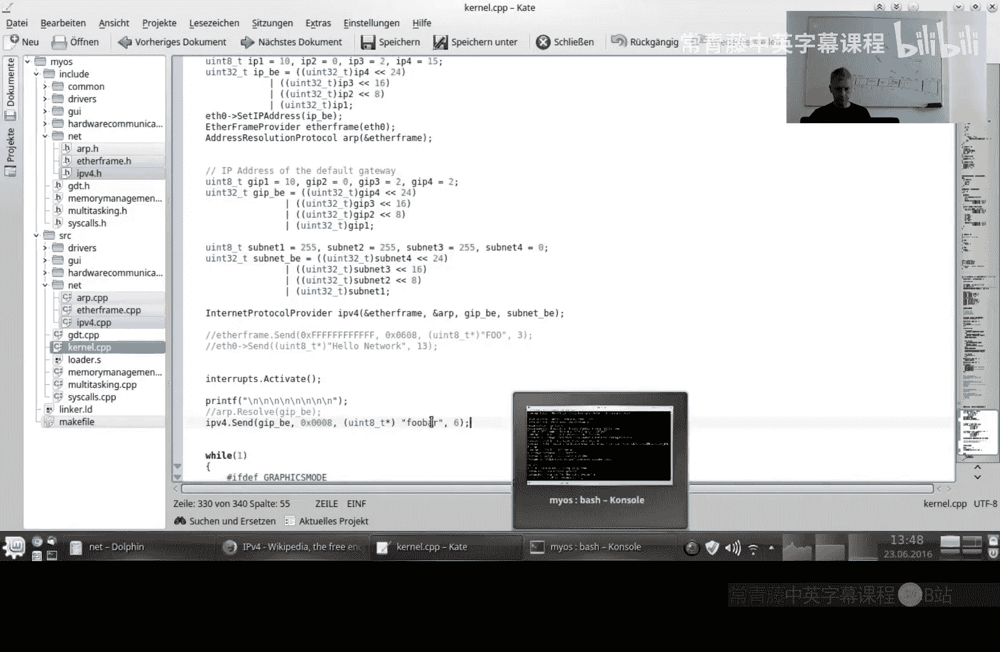

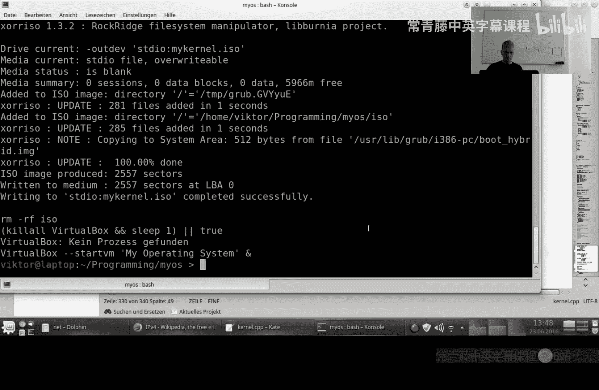

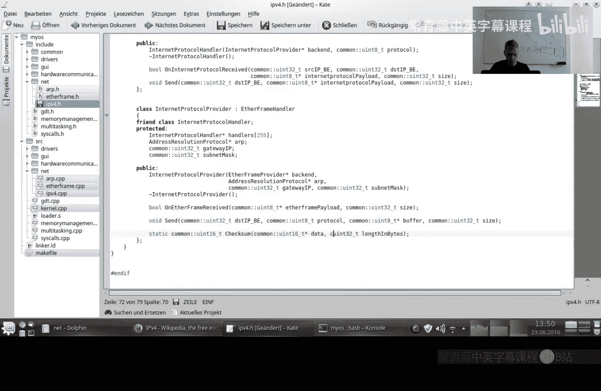

## 测试与验证

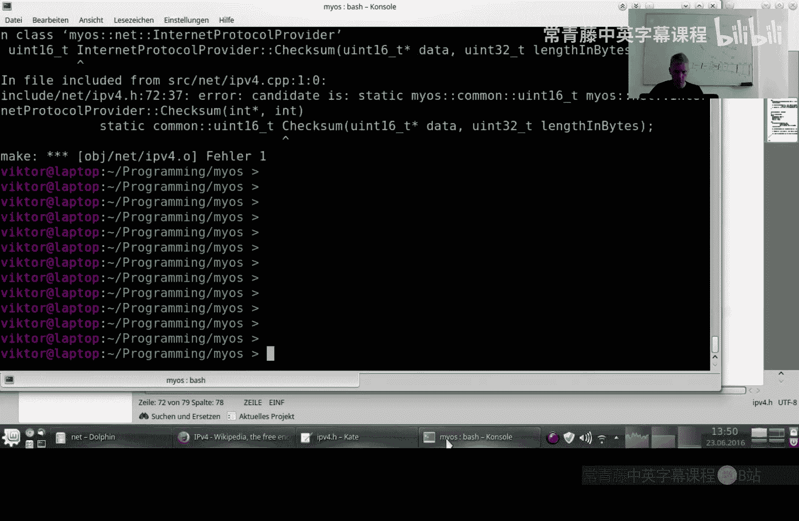

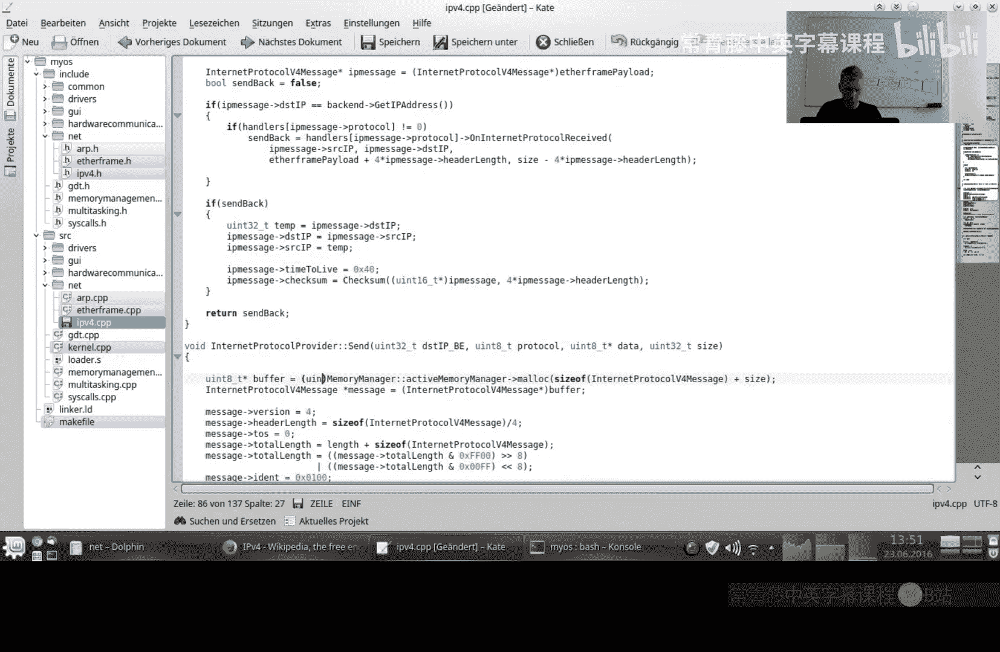

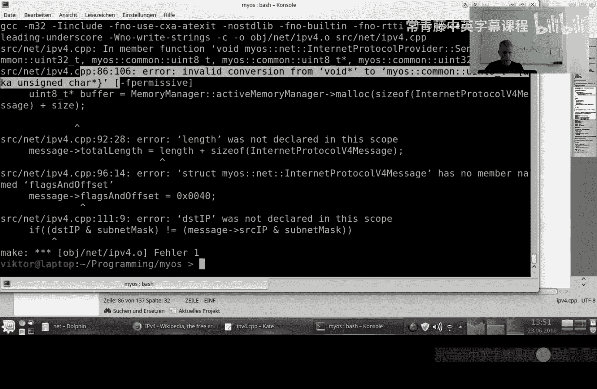

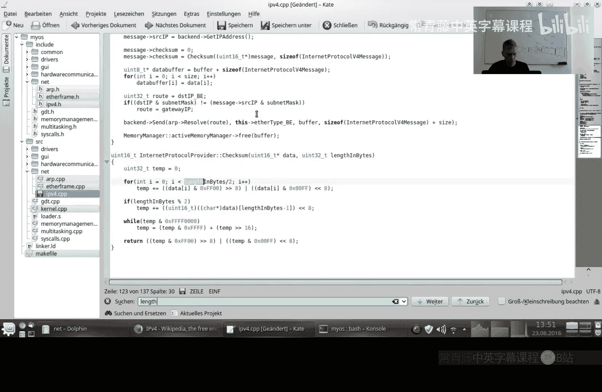

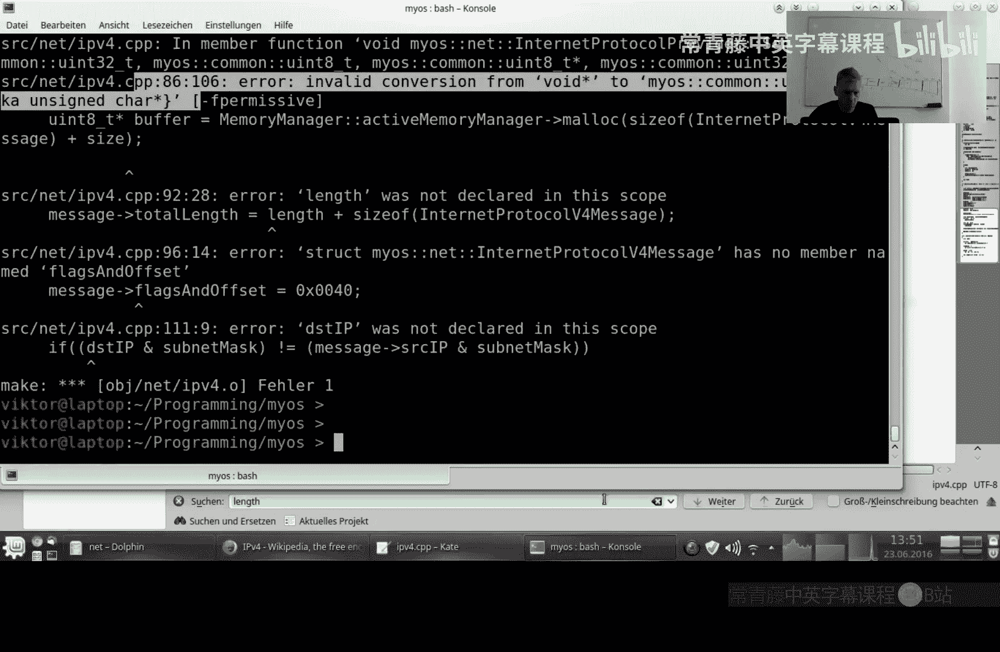

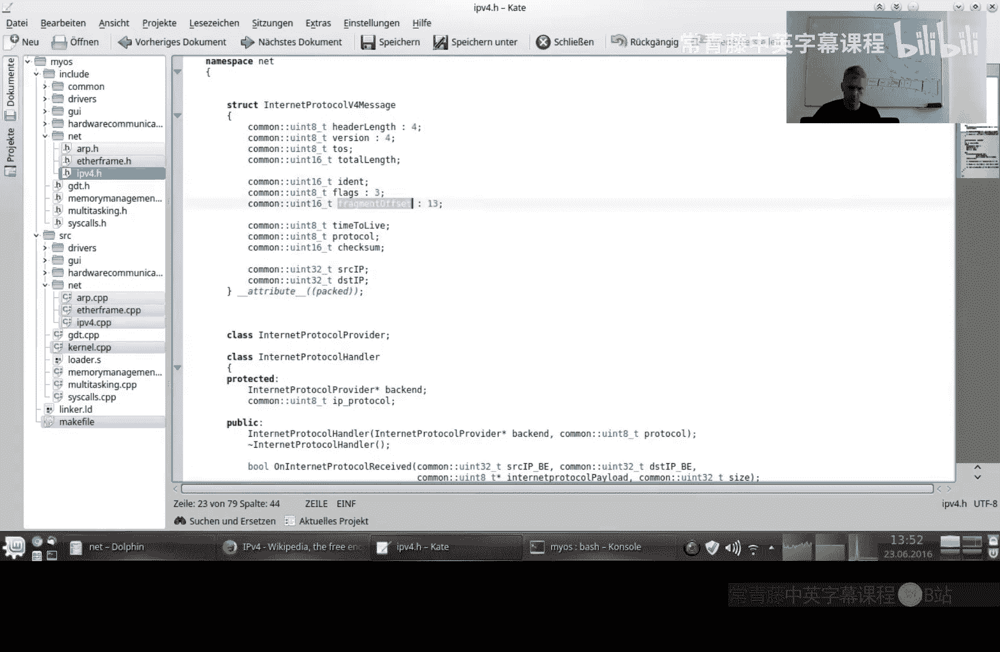

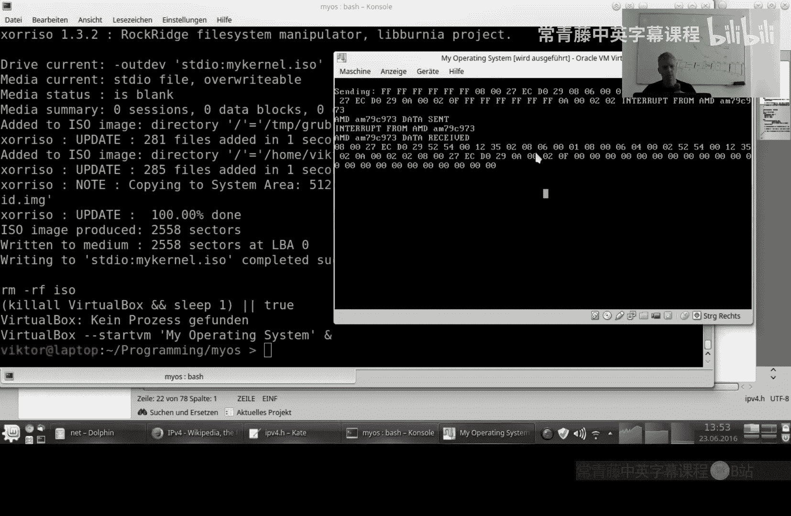

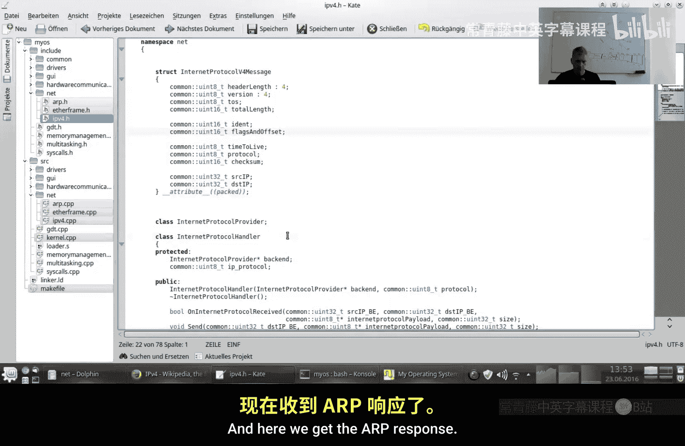


完成编码后，我们进行测试。当发送一个IPv4数据包时，使用网络调试工具可以看到：
1.  首先发出一个ARP请求（如果网关MAC地址未知）。
2.  收到ARP回复，获得网关MAC地址。
3.  成功发送一个类型为 `0x0800` 的以太网帧，其中包含了我们构建的IPv4头部和数据。

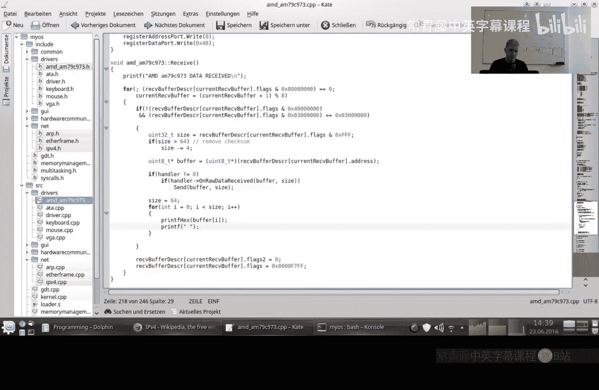

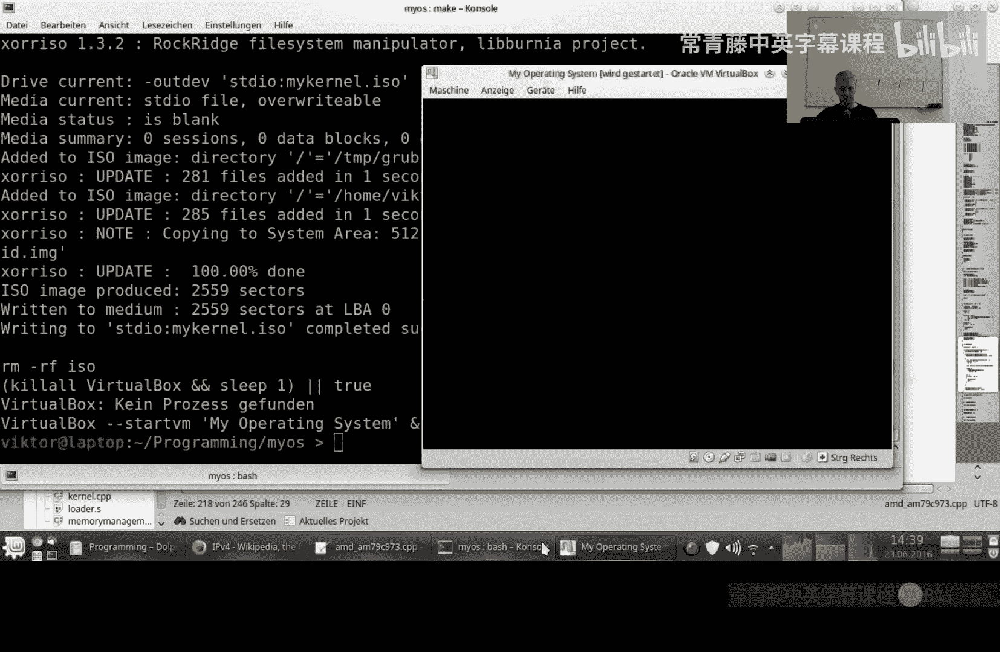

这表明我们的IPv4发送功能已经基本实现。目前我们还没有处理接收到的IPv4数据包（如下一节的ICMP Ping），但发送通道已经打通。

## 总结


本节课中我们一起学习了IPv4协议的基本结构，并成功实现了一个IPv4处理器。我们了解了IP头部各个字段的含义，实现了数据包的封装、发送、目标地址判断（本地或网关）以及头部校验和的计算。这是实现网络协议栈的重要一步，为后续实现ICMP、TCP、UDP等高级协议奠定了基础。在下一课中，我们将基于IPv4来实现ICMP协议，并让我们的操作系统能够响应Ping请求。