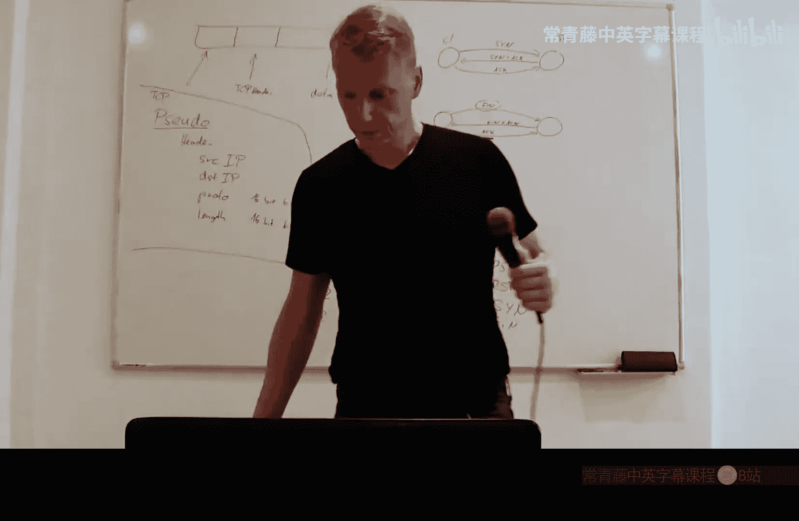
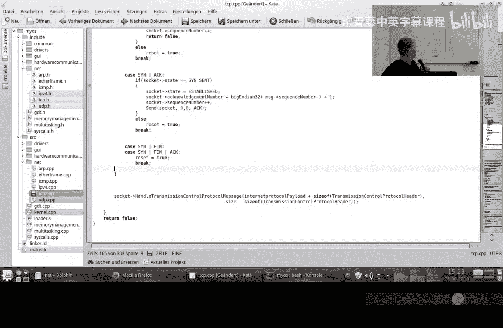
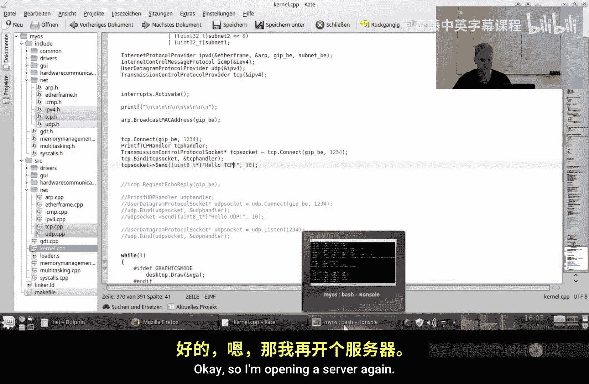
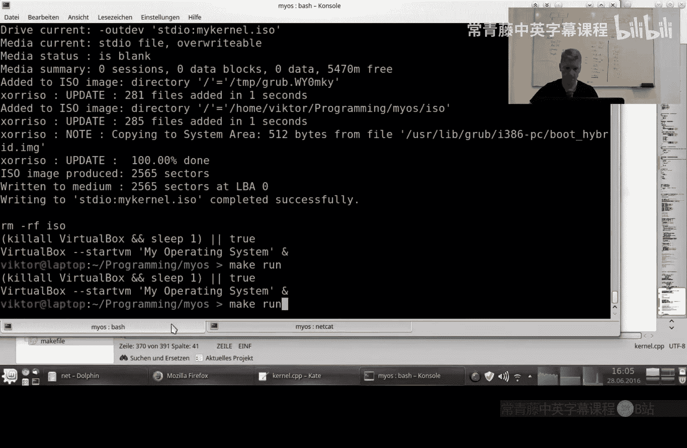
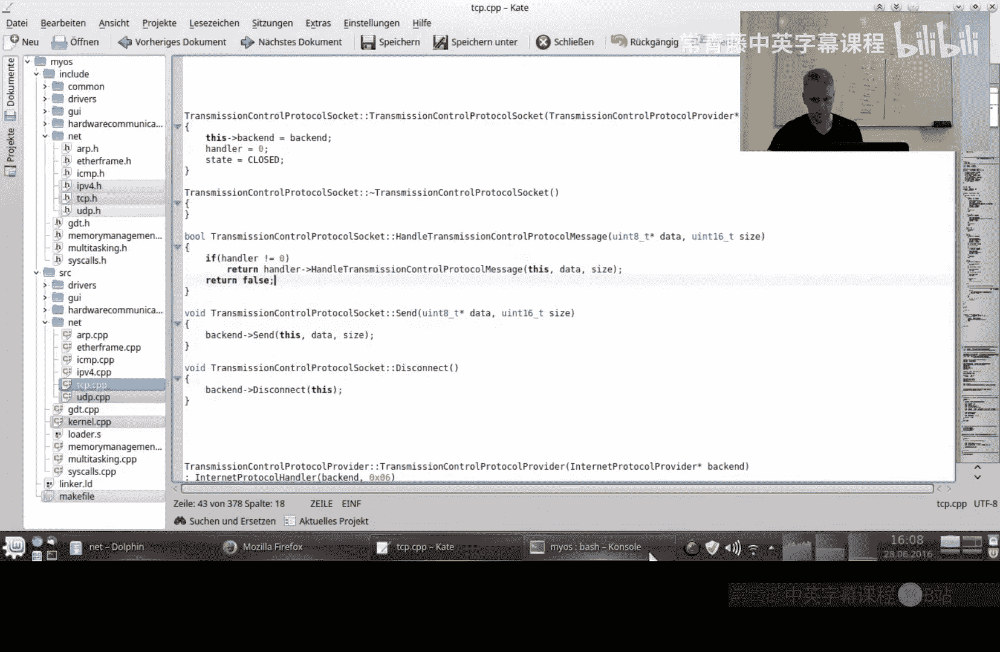
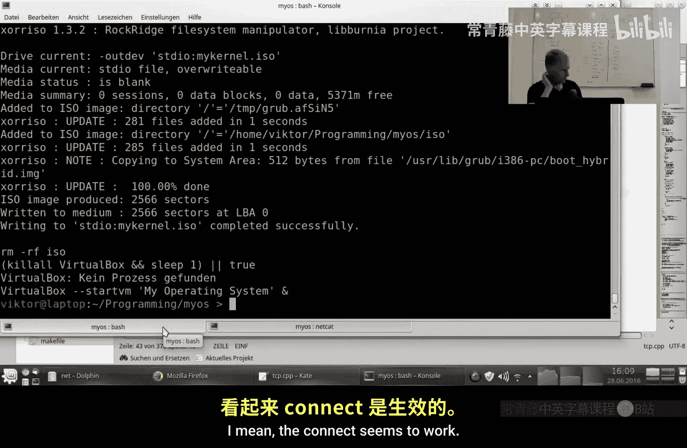
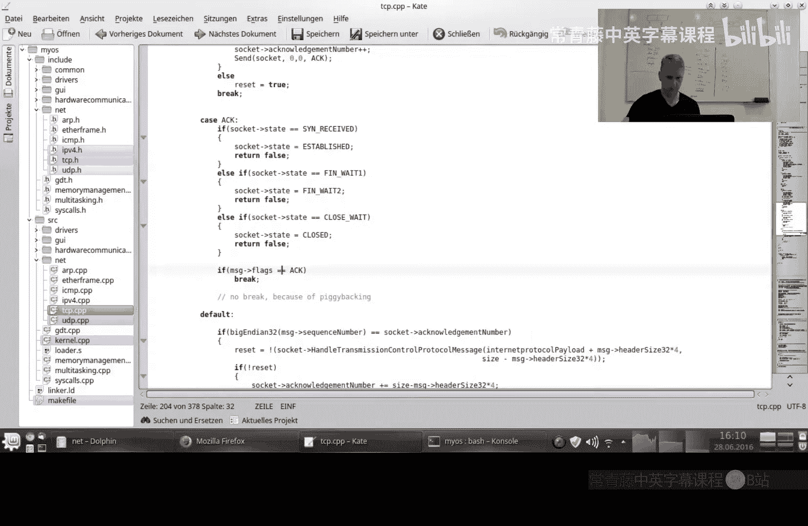
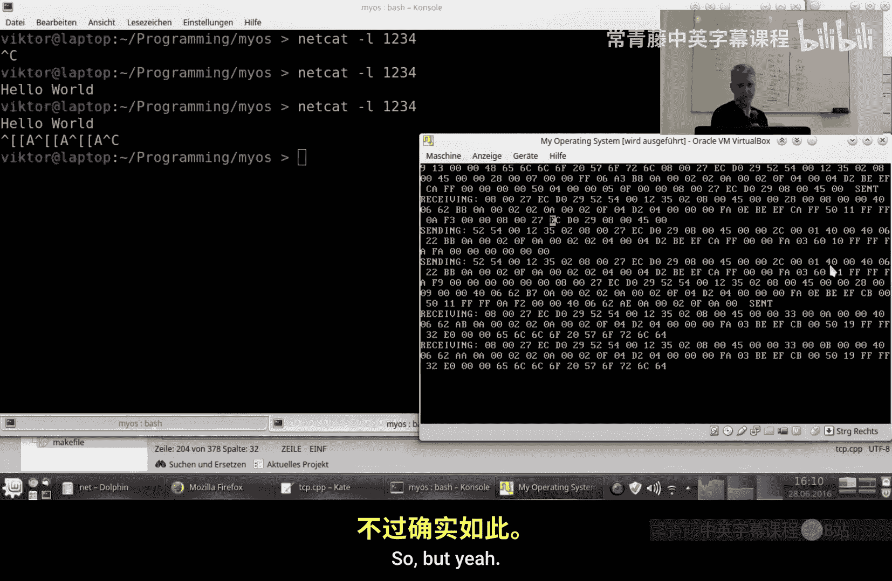
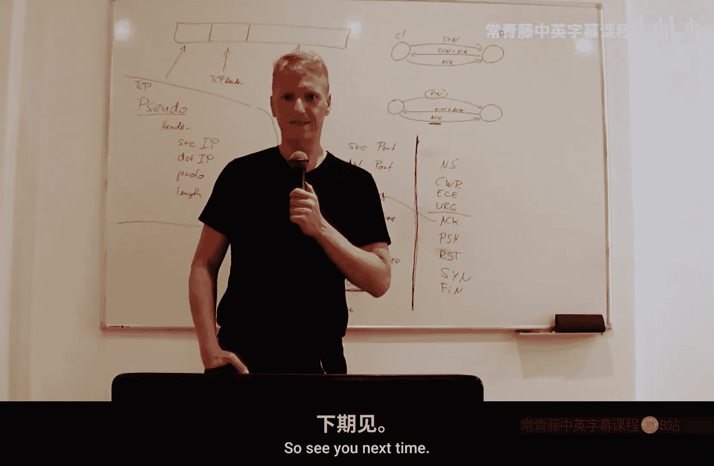

# 029：传输控制协议 (TCP) 接收处理 🧩

在本节课中，我们将学习如何为TCP协议实现接收数据和处理连接状态转换的逻辑。这是完成TCP双向通信的关键一步。

在上一节中，我们实现了TCP的发送功能，可以发送数据、发起连接请求和断开请求。然而，我们尚未实现接收方法，因此无法处理从服务器返回的数据。例如，我们发送了同步（SYN）消息并收到了确认（ACK），但未发送对应的确认，导致服务器持续询问。



本节中，我们将深入探讨如何解析接收到的TCP数据包，并根据TCP状态机处理连接建立、数据传输和连接终止。

## 处理接收到的数据

我们从IPv4层接收到数据。首先，需要确保TCP头部至少有20字节，这是其最小合法长度。处理流程与UDP类似：遍历套接字列表，寻找负责此消息的套接字。

以下是处理接收数据的基本代码结构：
```c
if (tcp_header_size >= 20) {
    // 遍历套接字并匹配
    for (socket in socket_list) {
        if (socket_matches(socket, received_packet)) {
            handle_tcp_packet(socket, received_packet);
        }
    }
}
```

接下来，我们将根据TCP头部的标志位（SYN, ACK, FIN）进行一个大分支判断。

## 处理连接建立（三次握手）

以下是处理三次握手过程中不同状态的核心逻辑。

### 1. 接收SYN（服务器端）

如果找到一个正在监听（LISTENING）的套接字，并且发送方想要同步（SYN标志置位），则说明对方希望连接到我们。

*   将套接字状态设置为`SYN_RECEIVED`。
*   将确认号（Acknowledgment Number）设置为接收到的序列号（Sequence Number）加一。**注意：** 这个“加一”操作至关重要，忘记它会导致许多问题。
*   设置我们自己的初始序列号（此处为固定值，仅用于演示）。
*   发送一个SYN-ACK回复。

### 2. 接收SYN-ACK（客户端）



如果我们之前发送了SYN，现在收到了SYN-ACK。
*   将连接状态设置为`ESTABLISHED`（已建立）。
*   同样，将确认号设置为接收到的序列号加一。
*   增加我们自己的序列号。
*   发送最终的ACK确认。

### 3. 非法组合


SYN和FIN标志不应在同一消息中设置。如果遇到，应视为非法并终止连接。

## 处理连接终止

连接终止涉及FIN和ACK标志的交换。我们的实现将FIN和FIN-ACK在某种程度上等同处理。

以下是连接终止的状态转换示意图：


### 1. 接收FIN（主动关闭）

如果连接处于`ESTABLISHED`状态并收到FIN，表示对方希望断开。
*   发送ACK进行确认。
*   随后发送我们自己的FIN。
*   状态转移到`CLOSE_WAIT`（实际上，更精确地，发送FIN后会进入`FIN_WAIT_1`）。

### 2. 接收FIN-ACK

如果我们处于`FIN_WAIT_1`状态（已发送FIN），并收到了FIN-ACK。
*   我们应进入`TIME_WAIT`状态，但为简化，我们直接发送最后的ACK并将状态设为`CLOSED`。

### 3. 最终状态

当连接状态变为`CLOSED`后，我们将从套接字列表中移除该套接字。

## 处理数据传输与确认

如果接收到的消息不包含SYN、ACK、FIN等控制位，则说明它是承载实际数据的数据包。

以下是处理数据包和确认的步骤：
1.  将数据负载传递给上层应用处理器（Handler）。
2.  比较接收到的序列号与我们期望的确认号。如果不匹配，说明数据包乱序到达，当前无法处理。
3.  应用处理器返回一个布尔值，指示是否应保持连接。
4.  如果保持连接，我们确认接收到的数据。确认号增加的长度是**负载数据的长度**，需要根据TCP头部中的偏移量字段计算得出。

公式如下：
`新确认号 = 当前确认号 + 负载数据长度`

## 处理重置（RST）标志

在开始上述主要处理之前，应先检查RST标志。

如果收到RST标志：
*   无论当前何种状态，立即将套接字状态设置为`CLOSED`。
*   不执行状态切换逻辑。
*   最终从套接字列表中移除该套接字。

## 捎带确认

TCP允许“捎带确认”，即在发送数据的同时，确认之前收到的消息。我们的代码需要处理这种ACK标志与数据同时存在的情况。

## 当前实现的问题与总结



在测试中，连接似乎可以建立，但未能成功接收预期数据。这表明当前的接收逻辑可能存在缺陷，例如状态转换条件不完整、序列号处理错误或数据传递逻辑有误。












本节课中，我们一起学习了TCP接收端的基本框架，包括：
*   如何根据SYN、ACK、FIN标志处理连接的生命周期（建立、数据传输、终止）。
*   如何处理数据包和确认。
*   如何处理连接重置（RST）。
*   当前代码存在未解决的问题，需要在后续调试中完善。



实现一个完整的TCP栈是复杂的，涉及严格的状态机和序列号管理。本节内容为构建一个可工作的TCP接收器奠定了基础，但距离一个健壮的实现还有距离。在下一节中，我们将诊断并修复当前测试中出现的问题。