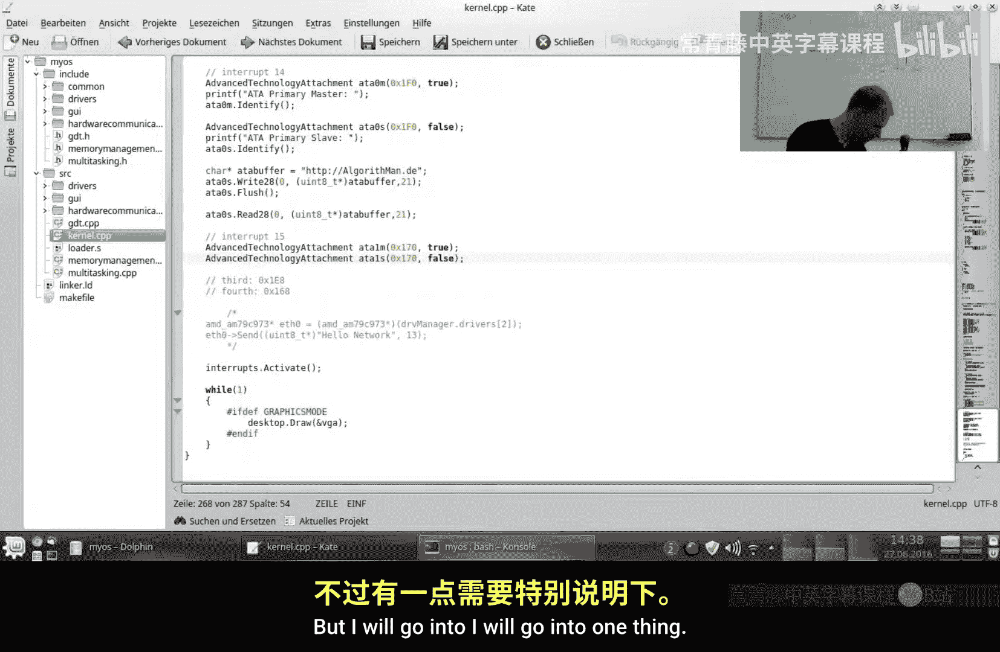
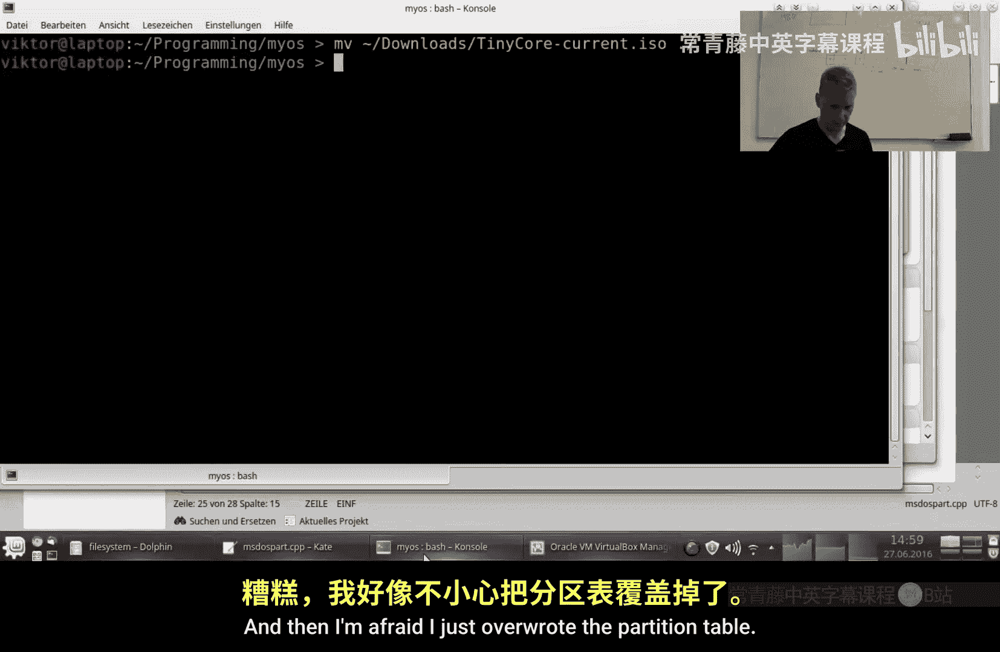
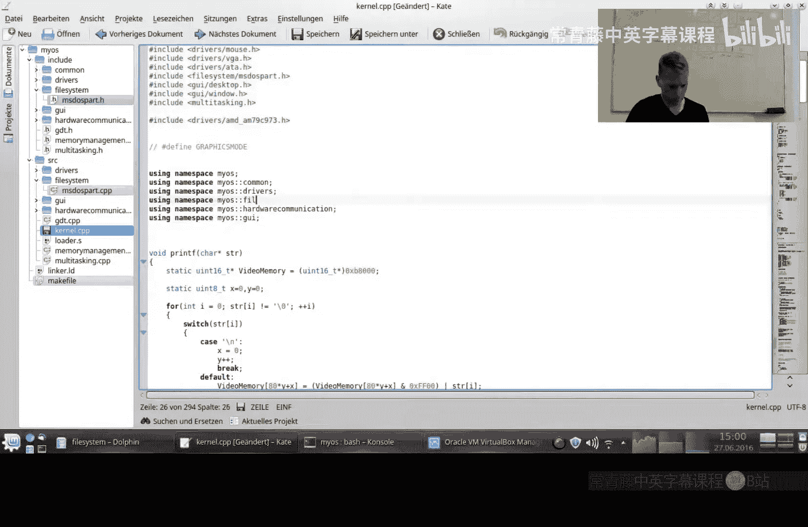
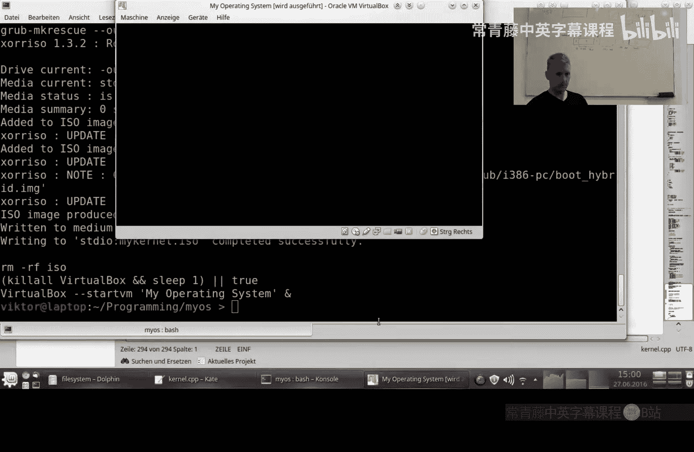
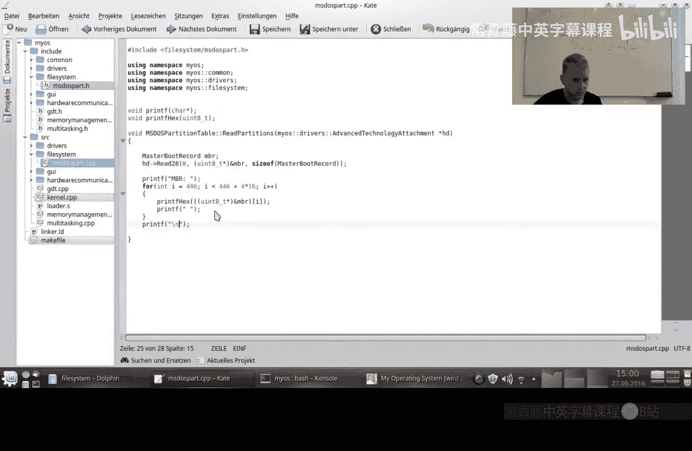
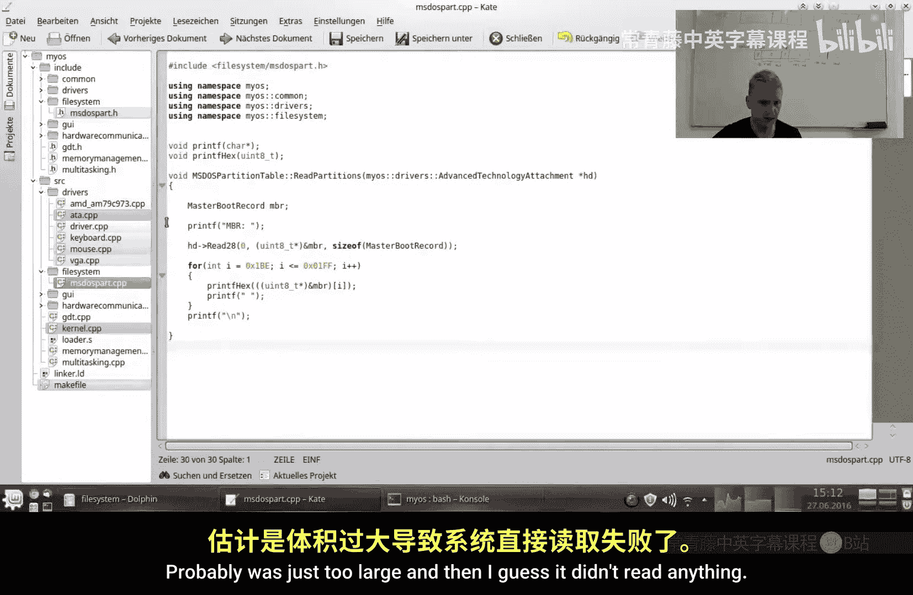
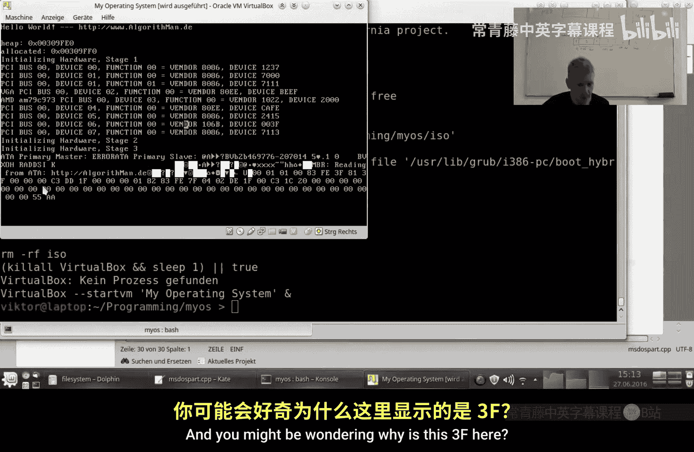
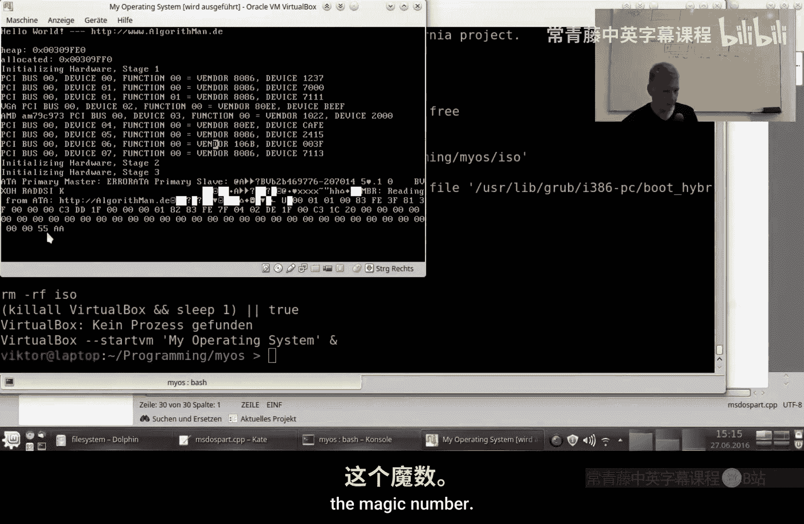
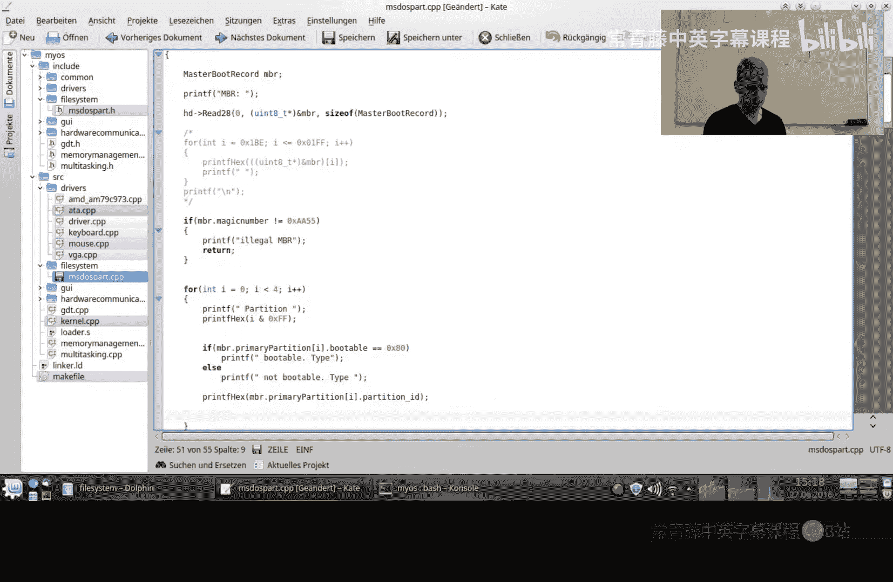
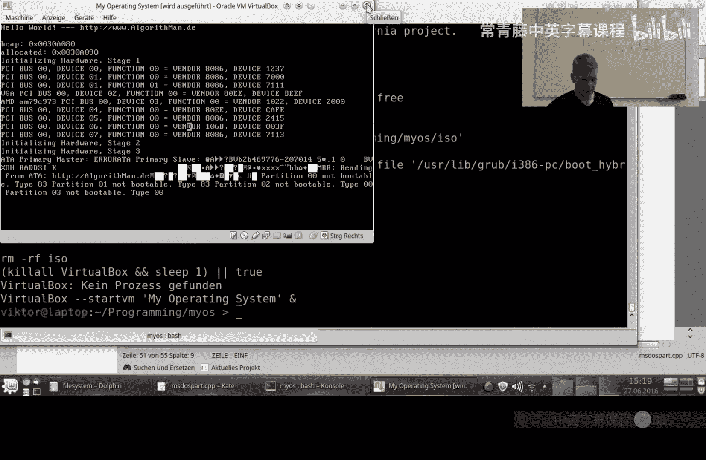

# 031：分区表 📚

在本教程中，我们将学习主引导记录（MBR）分区表的结构。这是理解硬盘如何被组织成多个独立区域（分区）的第一步，也是后续构建文件系统的必要基础。

## 概述

上一节我们介绍了如何从硬盘读取原始扇区。本节中，我们来看看如何解析硬盘的第一个扇区——主引导记录（MBR），以获取分区信息。理解分区表是创建文件系统的前提，因为文件系统通常建立在分区之上。

## 主引导记录（MBR）结构

主引导记录位于硬盘的**第0扇区**。当计算机启动时，BIOS会读取这个扇区并执行其中的代码。MBR的结构如下：

*   **440字节**： 预引导加载程序（Bootstrap Loader）代码。
*   **4字节**： 磁盘签名（Disk Signature），本教程中不涉及。
*   **2字节**： 保留未使用。
*   **64字节**： 分区表，包含4个条目，每个条目16字节。
*   **2字节**： 引导签名（Boot Signature），固定为 `0x55AA`。

以下是MBR结构的C语言定义：
```c
struct mbr {
    unsigned char bootstrap[440];
    unsigned int signature;
    unsigned short unused;
    struct partition_entry partitions[4];
    unsigned short boot_signature;
} __attribute__((packed));
```
**注意**：`__attribute__((packed))` 指令告诉编译器不要为了内存对齐而在这个结构体中插入填充字节，这对于精确读取磁盘数据至关重要。



## 分区表条目详解

分区表包含4个条目，每个条目描述一个分区。以下是每个16字节条目的结构：

*   **1字节**： 引导标志（Boot Flag）。`0x80` 表示该分区可引导，`0x00` 表示不可引导。通常只有一个分区被标记为可引导。
*   **3字节**： 分区起始的CHS（柱面-磁头-扇区）地址。这是一个旧式寻址方式，现代系统已较少使用。
*   **1字节**： 分区类型ID（Partition Type ID）。例如，`0x83` 通常代表Linux分区。
*   **3字节**： 分区结束的CHS地址。
*   **4字节**： 分区起始的LBA（逻辑块地址）扇区号。**这是我们需要的关键信息**。
*   **4字节**： 分区占用的总扇区数（长度）。

以下是分区表条目的C语言定义：
```c
struct partition_entry {
    unsigned char boot_flag;
    unsigned char start_chs[3];
    unsigned char partition_type;
    unsigned char end_chs[3];
    unsigned int start_lba;
    unsigned int size_lba;
} __attribute__((packed));
```

## 实践：读取并解析分区表

为了演示，我们使用Tiny Core Linux创建了一个包含两个FAT32分区的虚拟硬盘。现在，我们编写代码来读取并显示分区表信息。










以下是读取和打印分区表的核心代码逻辑：
```c
// 1. 定义MBR和分区条目结构（如上所示）
// 2. 从硬盘第0扇区读取数据到mbr结构体
read_sectors(0, 1, (unsigned char*)&mbr);
// 3. 遍历4个分区条目
for(i = 0; i < 4; i++) {
    pe = &mbr.partitions[i];
    if(pe->partition_type != 0) { // 类型0表示空条目
        printf("Partition %d: Type 0x%02X, Start LBA: %u, Size: %u sectors\n",
               i+1, pe->partition_type, pe->start_lba, pe->size_lba);
    }
}
```
运行此程序后，输出结果类似于：
```
Partition 1: Type 0x83, Start LBA: 63, Size: 67 sectors
Partition 2: Type 0x83, Start LBA: 130, Size: 132 sectors
```
**注意**：第一个分区通常从LBA 63开始，这是因为磁盘开头保留了一些扇区（例如，用于MBR本身）。



## 关键概念：分区起始偏移



从分区表获取的最重要信息是 `start_lba`。这个值代表了**分区相对于整个硬盘开始的扇区偏移量**。


后续在实现文件系统时，所有对该分区的读写操作都必须加上这个偏移量。例如，要读取分区的第一个扇区，实际需要读取的硬盘扇区号是 `start_lba`，而不是0。





公式表示为：
`实际硬盘扇区号 = 分区起始LBA + 分区内逻辑扇区号`



## 总结

本节课中我们一起学习了主引导记录（MBR）分区表的结构和解析方法。我们了解了MBR的各个组成部分，重点分析了16字节的分区表条目，并学会了如何从中提取关键的**分区起始LBA地址**。这个地址是连接硬盘抽象层和文件系统层的桥梁。


现在，我们已经能够识别硬盘上有哪些分区以及它们的位置。下一节，我们将利用这里获取的 `start_lba` 信息，深入一个具体的分区，开始探索FAT32文件系统的内部结构，学习如何读取目录和文件。