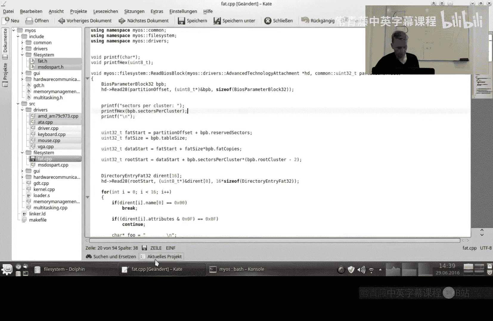
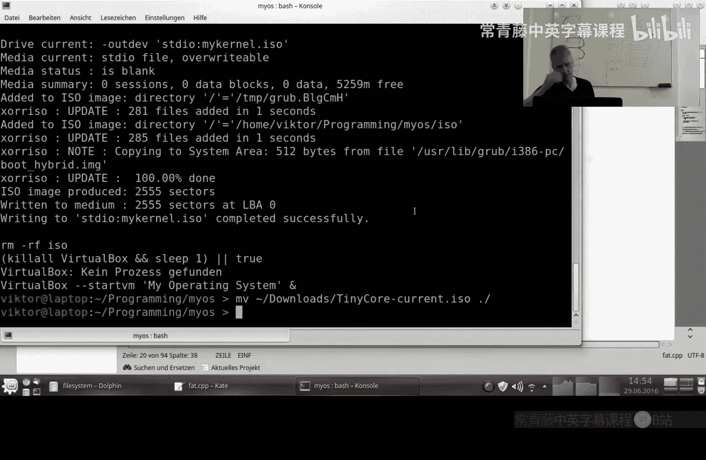
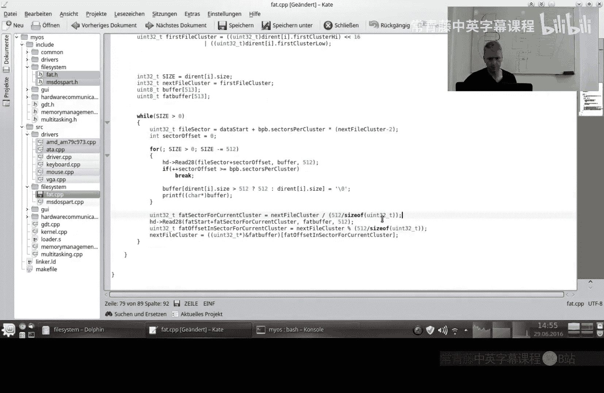
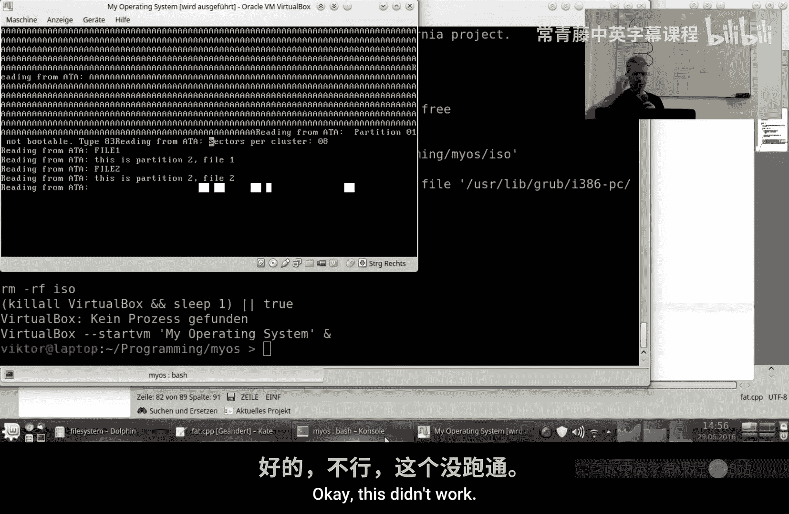
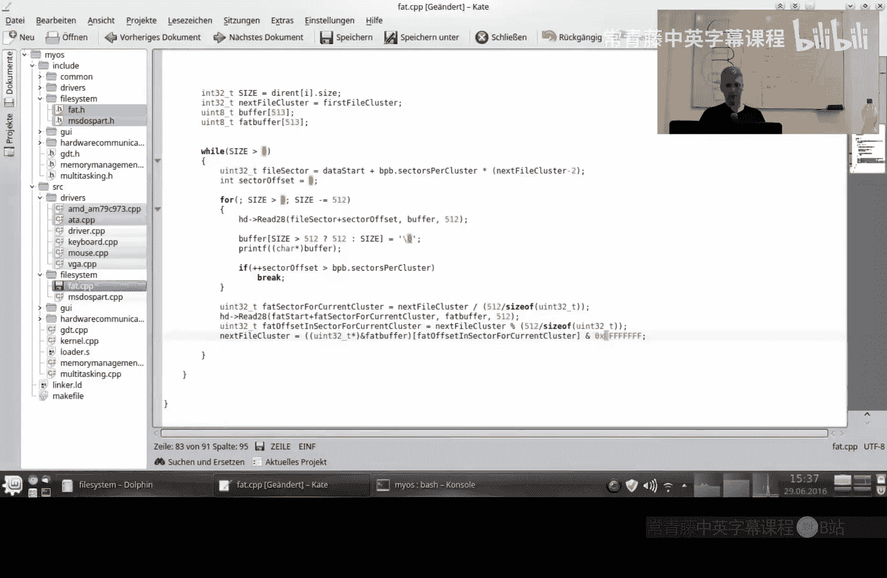
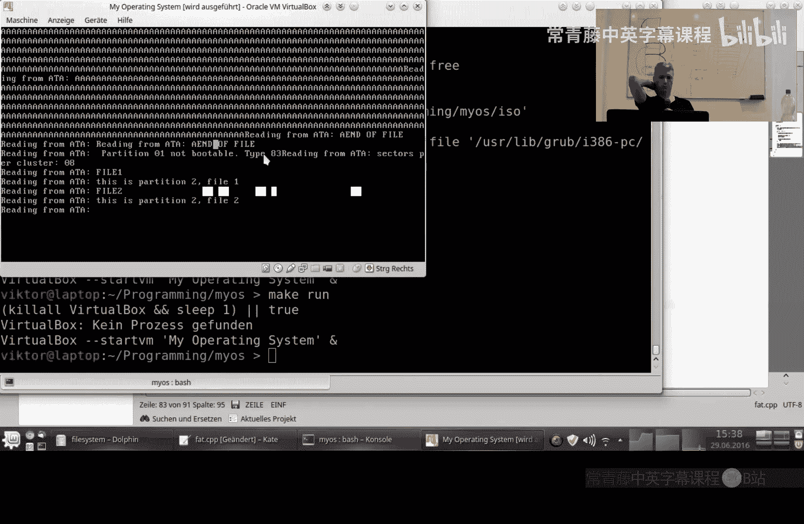

# 033：文件分配表（FAT32）进阶 🗂️

在本节课中，我们将学习如何读取跨越多个簇（Cluster）的大文件。上一节我们介绍了如何读取FAT32文件系统的根目录和单个文件的第一扇区。本节中我们来看看当文件大小超过一个簇时，如何通过文件分配表（FAT）来定位和读取文件的后续部分。

## 概述

我们已经掌握了访问硬盘扇区、解析分区表以及定位FAT32分区中根目录和文件起始簇的方法。然而，一个扇区只有512字节，一个文件通常远大于此。FAT32文件系统将文件数据存储在多个连续的扇区组（即簇）中。如果文件很大或硬盘存在碎片，文件的不同部分可能存储在不连续的簇中。文件分配表（FAT）的作用就是记录这些簇之间的链接关系。

## 从簇到扇区

首先，回顾一下如何从簇号计算对应的起始扇区号。公式如下：

```
起始扇区号 = 数据区起始扇区号 + (簇号 - 2) * 每簇扇区数
```

其中，`数据区起始扇区号`可以通过引导扇区（BPB）中的参数计算得出。`簇号 - 2`是因为FAT32中数据区的簇编号从2开始。

## 读取跨簇文件

读取一个文件的完整内容，需要遵循以下逻辑：



1.  **获取起始簇号**：从文件的目录项中读取其起始簇号。
2.  **读取当前簇**：根据上述公式，计算出该簇对应的所有扇区，并依次读取。
3.  **查找下一个簇**：当前簇读取完毕后，如果文件还有剩余数据（即文件大小 > 已读取字节数），则需要查询FAT表。
4.  **定位FAT表项**：FAT表本身也占据多个扇区。要找到对应某个簇号的表项，需要计算该表项所在的FAT扇区。
    *   `FAT表项偏移 = 簇号 * 4` （因为每个FAT32表项占4字节）
    *   `所在FAT扇区号 = FAT表起始扇区号 + (FAT表项偏移 / 512)`
    *   `扇区内偏移 = FAT表项偏移 % 512`
5.  **获取下一簇号**：从计算出的FAT扇区中读取4字节，并屏蔽高4位（FAT32实际只用28位寻址），得到下一个簇的编号。
    *   `下一簇号 = 读取的32位值 & 0x0FFFFFFF`
6.  **循环与终止**：将“当前簇号”更新为“下一簇号”，重复步骤2-5。当在FAT表中读到的下一个簇号是特定值（如`0x0FFFFFFF`）时，表示这是文件的最后一个簇。





以下是读取文件数据的核心循环结构伪代码：




```c
当前簇号 = 文件起始簇号;
已读取字节数 = 0;

while (已读取字节数 < 文件总大小) {
    // 1. 计算并读取当前簇的所有扇区
    起始扇区 = 数据区起始扇区号 + (当前簇号 - 2) * 每簇扇区数;
    for (i = 0; i < 每簇扇区数 && 已读取字节数 < 文件总大小; i++) {
        读取扇区(起始扇区 + i, 缓冲区);
        处理缓冲区中的数据（最多512字节或剩余字节数）;
        已读取字节数 += 本次读取的字节数;
    }

    // 2. 如果文件还没读完，查找下一个簇
    if (已读取字节数 < 文件总大小) {
        // 计算FAT表项位置并读取
        fat_entry_offset = 当前簇号 * 4;
        fat_sector_to_read = FAT表起始扇区号 + (fat_entry_offset / 512);
        读取扇区(fat_sector_to_read, fat_buffer);

        // 从fat_buffer的合适位置取出下一簇号
        next_cluster_raw = *(uint32_t*)(&fat_buffer[fat_entry_offset % 512]);
        下一簇号 = next_cluster_raw & 0x0FFFFFFF; // 屏蔽高4位

        // 检查是否为文件结束标志
        if (下一簇号 >= 0x0FFFFFF8) { // 通常是0x0FFFFFFF
            break; // 文件结束
        }
        // 准备读取下一个簇
        当前簇号 = 下一簇号;
    }
}
```





## 面向对象的设计思路

为了构建一个清晰、可扩展的文件系统层，可以考虑采用面向对象的设计模式。以下是一个抽象接口的设计示例：

*   **`FileSystem` (抽象基类)**：代表一个文件系统实例。
    *   `GetRootDirectoryTraverser()`: 返回一个指向根目录的遍历器对象。

*   **`FatFileSystem` (派生类)**：实现FAT32文件系统。
    *   重写`GetRootDirectoryTraverser()`，返回`FatDirectoryTraverser`。

*   **`DirectoryTraverser` (抽象基类)**：代表对一个目录的访问。
    *   `GetFileEnumerator()`: 获取该目录下的文件枚举器。
    *   `ChangeDirectory(name)`: 进入子目录。
    *   `GetParentDirectory()`: 返回父目录遍历器（利用目录中的`..`条目）。
    *   `MakeDirectory(name)`: 创建目录。

*   **`FatDirectoryTraverser` (派生类)**：实现FAT32目录遍历。
    *   内部保存当前目录的簇号。
    *   重写上述所有方法。

*   **`FileEnumerator` (抽象基类)**：用于枚举目录中的文件。
    *   `GetName()`: 获取当前文件名。
    *   `GetReader()`: 获取当前文件的读取器对象。
    *   `Next()`: 移动到目录中的下一个文件条目。

*   **`FatFileEnumerator` (派生类)**：实现FAT32目录条目枚举。


*   **`FileReader` (抽象基类)**：用于读取文件内容。
    *   `Read(buffer, size)`: 读取指定大小的数据到缓冲区。
    *   `GetSize()`: 获取文件总大小。
    *   `Seek(position)`: 移动读指针。

*   **`FatFileReader` (派生类)**：实现FAT32文件读取。
    *   内部管理当前簇号、已读字节、每簇扇区数等状态，并实现上述跨簇读取逻辑。


通过这种设计，上层的文件管理器或应用程序只需要与`FileSystem`、`DirectoryTraverser`、`FileEnumerator`、`FileReader`这些抽象接口交互，完全不需要关心底层是FAT32、NTFS还是其他文件系统。具体的文件系统实现细节被封装在各自的派生类中。

## 总结

本节课中我们一起学习了FAT32文件系统读取大文件的关键机制。我们理解了簇的概念以及文件分配表（FAT）在链接文件碎片中的作用，并掌握了通过簇号计算扇区地址、查询FAT表获取下一簇号以读取整个文件的完整流程。最后，我们探讨了一个面向对象的文件系统抽象层设计，这为构建支持多种文件系统的操作系统打下了良好的基础。虽然关于FAT32长文件名支持等更深入的话题因故未在本教程中展开，但希望本系列课程为你自行探索操作系统开发的广阔世界提供了坚实的起点。