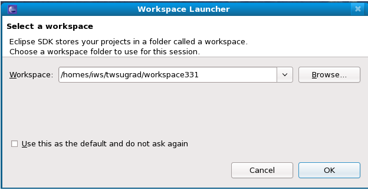
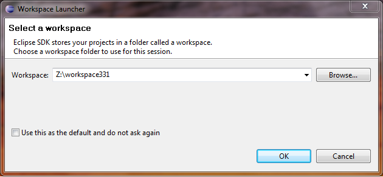
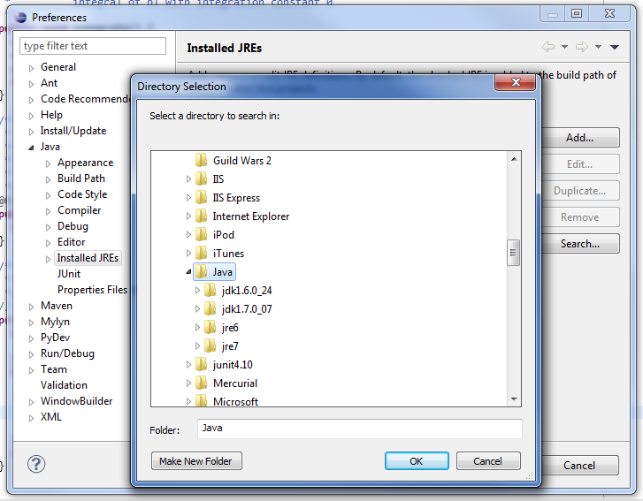
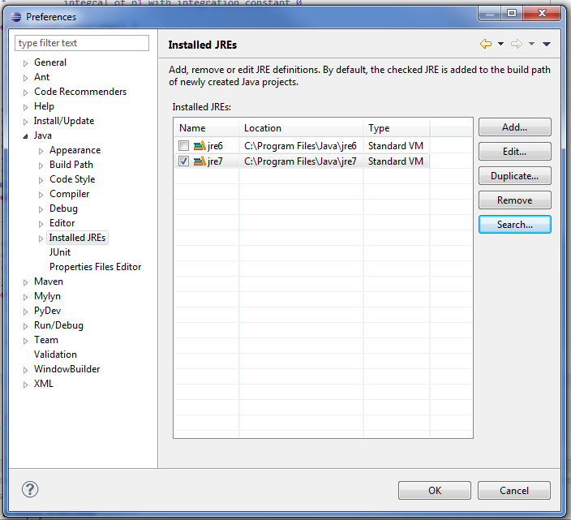
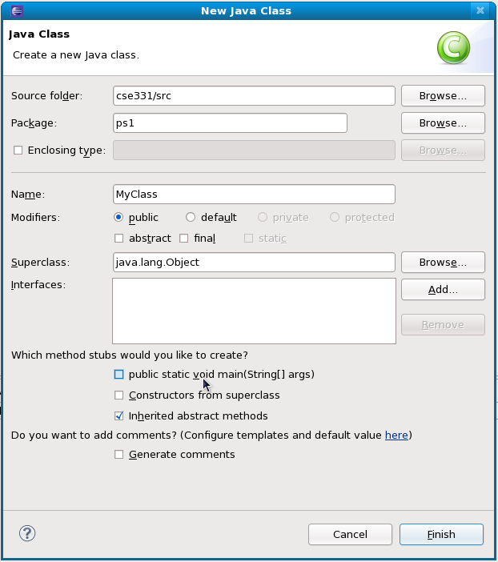

CSE 331 软件设计与实现

# 编辑、编译、运行和测试 Java 程序

本手册描述了如何在 Eclipse 和命令行中执行常见的 Java 开发任务。

目录：

+   使用 Unix 命令行

+   启动 Eclipse

    +   在 Linux 上启动 Eclipse

    +   在 Windows 上启动 Eclipse

    +   Eclipse 首选项

    +   在 Windows 上设置 Eclipse 中的 JDK

    +   Eclipse 泛型错误配置

+   打开文件；管理多个文件

+   创建新文件

    +   新建 Java 文件

    +   新建文本文件

+   编辑 Java 源文件

    +   自动补全

    +   组织导入

    +   查看文档

        +   Eclipse

+   使用 Ant 运行自动化任务

    +   命令行

    +   Eclipse

+   编译 Java 源文件

    +   命令行

    +   Eclipse

        +   在 Eclipse 中使用 Ant 编译

+   运行 Java 程序

    +   命令行

    +   Eclipse

+   使用 JUnit 测试 Java 程序

    +   运行 JUnit 测试

        +   命令行

        +   Eclipse

    +   CSE 331 JUnit 框架

+   使用 javadoc 生成规范

## 使用 Unix 命令行

一些 CSE 331 任务需要连接到 Linux 机器并从命令行运行一些命令。要理解这些说明可能需要一些基本的使用 shell 执行命令行操作的理解。这些材料在 [CSE390A](http://courses.cs.washington.edu/courses/cse390a) 中有更深入的介绍，该课程的材料已经在线发布。或者，您可以阅读学生 ACM 章节提供的 Unix [教程](http://flatline.cs.washington.edu/orgs/acm/tutorials/)。虽然这些教程有些过时，并且关于机器名称等信息有些过时，但 Unix 命令行的基础知识几十年来都没有改变。

## 启动 Eclipse

如果您在自己的计算机上工作，您应该已经安装了 Eclipse。否则，它已安装在部门机器（和虚拟机）上。

### 在 Linux 上启动 Eclipse

在 Linux 上输入以下内容以启动 Eclipse：

```
eclipse &
```

Eclipse 将启动，显示一个启动画面，然后显示一个工作区选择对话框：



Eclipse 正在询问您要为此会话使用哪个工作区文件夹。如果在部门实验室，请输入：

```
/homes/iws/*YourUserName*/workspace331

```

其中 `*YourUserName*` 是您的 UW CSE 用户名。（**注意：**在此步骤中**不要**输入 "`~/workspace331`"。Eclipse 不识别 '~' 字符。）在您自己的机器上，您可以选择放置工作区的位置。

如果 Eclipse 显示欢迎屏幕，只包含文本“欢迎使用 Java 开发人员的 Eclipse IDE”在一个漂亮的背景上，通过转到窗口 > 打开透视图 > 其他... 并选择`Java（默认）`来切换到代码编辑器。

### 在 Windows 上启动 Eclipse

从开始菜单，转到：**所有程序 ? DEV TOOLS & LANGUAGES ? Eclipse ? eclipse**。

Eclipse 将启动，显示一个启动画面，然后显示一个工作区选择对话框：



Eclipse 正在询问您要为此会话使用哪个工作区文件夹。作为回应，键入：

```
Z:\workspace331

```

这个目录将在实验室的 Windows 计算机上工作；如果您在个人计算机上工作，根据需要进行调整。

### Eclipse 首选项

转到窗口（或 OS X 中的 Eclipse）->首选项->Java->代码样式->格式化程序。然后点击编辑。在注释选项卡中，取消选中“启用块注释格式化”复选框。

### 在 Windows 上设置 Eclipse 中的 JDK

要使用 Ant 构建文件，您需要告诉 Eclipse 使用 Java JDK（开发工具包）而不是 JRE（运行时环境）。

1.  在 Eclipse 中，转到**Window ? Preferences**以打开首选项对话框。

1.  在首选项对话框的左侧窗格中，选择**Java ? Installed JREs**

1.  点击已安装的 JREs 窗格中的**搜索...**按钮

1.  在出现的目录选择窗口中，如下截图所示，选择**C:\ ? Program Files ? Java**。

    

1.  点击**OK**

1.  在已安装的 JREs 列表中，选中 jdk1.7.0_04（或以 jdk1.7 开头的任何版本）旁边的复选��，然后点击**OK**

    

1.  如果 Eclipse 显示欢迎屏幕，只包含文本“欢迎使用 Java 开发人员的 Eclipse IDE”在一个漂亮的背景上，通过转到窗口 > 打开透视图 > 其他... 并选择`Java（默认）`来切换到代码编辑器。

### Eclipse 泛型错误配置

我们期望您的代码不会有任何与泛型相关的问题。例如，以下代码是不可接受的：

```
List myList = new ArrayList();
myList.add("foo");

```

`myList`的泛型类型`List`应该被参数化，例如，通过将第一行替换为`List<String> myList = new ArrayList<String>();`。请注意，`List<String> myList = new ArrayList();`也是不正确的。

默认情况下，Eclipse 将泛型问题显示为警告（用黄色线条和标记表示）。您可以配置 Eclipse，使其对这些问题发出错误（用红色线条和标记表示）。这样做将帮助您记住编写可接受的泛型代码。

要进行此配置，请转到**Windows ? Preferences**并选择**Java ? Compiler ? Errors/Warnings**。在**Generic types**下，将**Unchecked generic type operation**的值更改为**Error**。

（请注意，还有另一个名为**使用原始类型**的设置，默认设置为**Ignore**。我们建议保持此选项禁用或简单设置为**Warn**，因为它特定于 Eclipse 编译器，并检查比 Java 语言规范要严格的要求。因此，“使用原始类型”可能会对问题提出抱怨，尽管它提供了关于您的代码的洞察，但 Oracle 的`javac`不会检查这些问题，而这是我们课程中官方的编译错误和警告的标准。）

## 打开文件；管理多个文件

切换到 Eclipse 中的“Java”视图（如果尚未在其中）（**Window ? Open Perspective ? Other... ? Java**）。

您可以通过在 Package Explorer 窗格中双击每个文件来在 Eclipse 中打开多个文件。打开多个文件后，您可以通过按住**Ctrl**并按下**F6**快速切换到下拉框以选择要带入焦点的编辑器的文件，然后使用箭头键快速在不同文件之间导航。

## 创建新文件

### 新的 Java 文件

要创建一个新的 Java 源文件（带有`.java`扩展名），请从顶部菜单中选择**File ? New ? Class**。将弹出一个窗口，询问您有关类的详细信息。将源文件夹保留为**cse331/src**，并选择一个包（例如，`hw1`）。为您的类选择一个名称（例如，`MyClass`），将此名称键入“名称”字段，然后点击**Finish**。

（如果您希望您的新类可执行，它将需要一个`main`方法。如果您在**New Java Class**屏幕中选中适当的复选框，Eclipse 可以为您自动生成。）



### 新文本文件

对于创建新的非 Java 文件（如文本文件），也有类似的步骤。选择**File ? New ? File**。在弹出的对话框中，选择您新文件的父目录并输入所需的文件名。如果要创建新目录，可以在所需文件名前附加目录名。例如，如果要在目录`hw1/answers`中创建文件`problem0.txt`，但`answers`目录尚不存在，则可以选择`hw1`作为父目录，然后在文件名中键入`answers/problem0.txt`，Eclipse 将为您创建新目录和文件。

## 编辑 Java 源文件

在编辑 Java 代码时，您可以执行一些有用的操作：

+   自动完成

+   整理导入

+   查看文档

### 自动完成

自动完成是编辑器在您仅键入单词的一部分后猜测您正在键入什么的能力。使用自动完成将减少您需要键入的量以及拼写错误的数量，从而提高您的效率。

当您编辑 Java 文件时，Eclipse 会持续解析文件，因此它了解您迄今为止声明的变量、方法等的名称。

**CTRL+Space**可用于自动完成 Eclipse Java 编辑器中的大多数内容。例如，如果您在当前类中声明了一个名为`spanishGreeting`的变量，并在后续行中输入了`spanishGree`，Eclipse 可以推断您的意思是`spanishGreeting`。要使用此功能，请在不完整名称的右侧按下**CTRL+Space**。您应该看到`spanishGree`扩展为`spanishGreeting`。

Eclipse 还可以帮助您自动完成方法名称。假设您有一个类型为`List`的变量`myList`，并且想要调用`clear`方法。开始输入"`myList.`" - 此时，一个弹出对话框将显示`List`类型的可用方法列表，您可以使用箭头键选择适当的方法。您可以使用**CTRL+Space**强制弹出对话框。

### 组织导入

您可以按下**CTRL+SHIFT+o**来***o**rganize* Java 文件中的导入。Eclipse 将删除多余的`import`语句，并尝试为您的代码中引用但尚未导入的类型推断正确的导入。 （如果需要导入的类名不明确 - 例如，有一个`java.util.List`和一个`java.awt.List` - 那么 Eclipse 将提示您选择要导入的哪一个。）

### 查看文档

尽管您可以直接浏览[Java 7 API](http://docs.oracle.com/javase/7/docs/api/)和 Oracle 网站上的其他文档，但通常可以在编辑器内部将代码的各个部分与相应的文档进行交叉引用是很有用的。

要查看代码中引用的类的文档，请将光标放在类名上，然后按下**SHIFT+F2**。将会打开一个网页浏览器窗口，显示该类的文档页面。如果该类由 Java 提供，文档页面将在 Oracle 的网站上。

对于您自己的类，您需要告诉 Eclipse 在哪里找到它们的文档。要这样做，请在包资源管理器窗格中右键单击项目名称（例如`cse331`），然后单击**"属性"**。在左侧窗格中选择**"Javadoc 位置"**。选择位置，例如**"file:/homes/iws/*YourUserName*/workspace331/cse331/doc/"**。（注意：**"file:"**部分很重要，因为位置应该能够被网页浏览器识别。）设置 Javadoc 位置路径后，点击**确定**。（如果在您自己的计算机上，请适当修改上面的路径。）

## 使用 Ant 运行自动化任务

Ant 是一个工具，可用于自动化许多常见任务，如编译、测试和运行代码。它还用于验证 CSE 331 作业提交。 Ant 的说明存储在每个作业目录中名为`build.xml`的“构建文件”中。

构建文件指定了它支持的一组**目标**，例如 build 和 test。请注意，“help”目标将输出有关我们构建文件中支持的目标的信息。**validate**目标仅在`attu`上有效。

### 命令行

要从命令行运行作业*N*的 Ant，请执行以下操作：

```
cd ~/workspace331/cse331/src/hw*N*
ant *target*

```

### Eclipse

要在 Eclipse 中运行 Ant，请在**Package Explorer**中右键单击`cse331/src/hw*N*/build.xml`，其中*N*是所需的作业编号。现在右键单击**Run As ? Ant Build...**，在结果窗口中，转到**Targets**并选择所需的目标。

在 Eclipse 工具栏左侧附近有一个按钮，看起来像，它将重新运行您上次运行的最后一个 ant 目标（或其他外部工具）。下拉按钮将让您轻松重新运行多个 ant 目标。

## 编译 Java 源文件

在运行源代码之前，您必须先编译源代码。`javac`编译器用于将 Java 程序转换为字节码形式，包含在*类文件*中。类文件通过其`.class`扩展名进行识别。类文件中的字节码可以由`java`解释器执行。

### 命令行

要编译特定作业的所有源文件，请将当前目录更改为`~/workspace331/cse331/src/hw*N*/`，其中*N*是所需的作业编号。现在在命令行上键入：

```
ant build

```

这将运行一个使用`build.xml`中指定的指令来将所有`.java`文件编译为相应的`.class`文件的 Ant 脚本。请注意，如果您的一个或多个文件无法编译，您将收到错误消息，并且对于无法正确编译的文件将不会生成`.class`文件。

如果您想手动编译文件而不使用 Ant 脚本，可以使用`javac`将一个或多个源文件编译为供 Java 解释器执行的类文件。以下命令：

> ```
> cd ~/workspace331/cse331/src
> 
> javac -Xlint -d . -g *[more options]* hw*N*/file1.java hw*N*/file2.java ...
> 
> 
> ```

将为每个指定的源文件生成类文件 hw*N*/file1.class，hw*N*/file2.class 等。在`attu`提示符处键入"`man javac`"以获取有关`javac`选项的更多信息。您几乎总是应该使用`-g`选项，它将提供改进的调试输出，还应该使用`-Xlint`选项，它提供更严格的编译器警告。

### Eclipse

Eclipse 默认设置为每次保存时自动重新编译您的代码。具有编译错误的类在**Package Explorer**中用红色交叉标记标记。编译错误以及编译警告也会显示在 Eclipse 的**Problems**视图中（通常位于 Eclipse 底部面板）。

如果您的文件已保存，但 Eclipse 表示它未编译，但您认为应该编译，请确保您的文件依赖��所有文件都已保存和编译。如果这样不起作用，请尝试刷新您的项目或使用**Project ? Rebuild Project**强制 Eclipse 识别所有内容的最新版本。

#### 在 Eclipse 中使用 Ant 进行编译

要在 Eclipse 中使用 Ant 进行编译，请在**Package Explorer**中右键单击 `cse331/hw*N*/build.xml`，其中 *N* 是所需的作业编号。现在右键单击**Run As ? Ant Build...**，在弹出的窗口中，转到**Targets**，并在目标列表中选择**build**。

## 运行 Java 程序

将源代码编译为类文件后，您可以使用 Java 解释器执行它。

### 命令行

通常，要运行程序，您只需在命令行上键入 `ant`，可能还会带有更具体的目标：`ant *target*`。但是，您也可以通过 `java` 程序直接调用 Java 虚拟机。

下面是如何从命令行运行 Java 程序：

```
cd ~/workspace331/cse331/src
java -ea hw*N*.*theClassYouWantToRun*

```

（`-ea` 标志启用断言。）

例如，如果您希望运行 hw1 中的 `PolyGraph` 类，则应运行：

```
java -ea hw1.PolyGraph

```

请注意，类名末尾不包括 `.java` 或 `.class`。

### Eclipse

要运行程序，请右键单击包含 `main()` 方法的 Java 源文件，然后选择**Run As... ? Java Application**。

Eclipse 工具栏左侧附近还有一个按钮，看起来像 ，将重新运行您上次运行的应用程序（或 JUnit 测试，见下文）。

## 使用 JUnit 测试 Java 程序

**JUnit** 是您用于编写和运行测试的测试框架。

欲了解更多信息，请访问：

+   [官方网站](http://junit.org)

+   [JUnit Cookbook](http://junit.sourceforge.net/doc/cookbook/cookbook.htm)，一个简短的教程

+   [JUnit API](http://junit.sourceforge.net/javadoc/)

### 运行 JUnit 测试

+   命令行

+   Eclipse

#### 命令行

`test` Ant 目标可用于测试 `SpecificationTests` 和 `ImplementationTests`。

要在不使用 Ant 的情况下运行 JUnit，请切换到 `~/workspace331/cse331/src` 目录，并调用 `java org.junit.runner.JUnitCore` 以获得带有测试类名称作为参数的文本界面。例如，如果我想运行 `RatTermTest`，我可以键入：

```
cd ~/workspace331/cse331/src
java org.junit.runner.JUnitCore hw1.test.RatTermTest

```

#### Eclipse

JUnit 与 Eclipse 集成，因此您可以从 IDE 中运行测试套件。

+   首先，从**Package Explorer**（通常是最左侧的窗格）中选择要运行的测试。

+   从屏幕顶部的 Eclipse 菜单中，选择**Run ? Run As ? JUnit Test**

+   JUnit GUI 应该会在 Package Explorer 的位置弹出，并运行所有测试。您可以双击失败的测试以跳转到该测试的代码。检查完 JUnit 结果后，关闭 JUnit 窗格以返回 Package Explorer。

如果你不在 UW CSE 工作，你可能需要显式添加`junit-4.11.jar`库，使用**项目？属性？Java 构建路径？库？添加外部 JAR 文件**，然后告诉 Eclipse 你的`junit-4.11.jar`的位置在哪里。

### CSE 331 JUnit 框架

因为你的 JUnit 测试可能会有不同的类和方法名称，与你的同学不同，所以需要一种标准化的方式来访问每个学生的测试。因此，每个作业都带有 JUnit 测试类`hw*N*.test.SpecificationTests`和`hw*N*.test.ImplementationTests`。你将加载所有你写的 JUnit 测试之一到这两个测试套件中的一个。

`hw*N*.test.SpecificationTests`，顾名思义，应仅包含*规范测试* — 即，仅检查规范所隐含的特性的测试。因此，你的规范测试应该是对任何其他人声称满足相同规范的代码的有效测试，即使该实现在本质上非常不同。

相反，`hw*N*.test.ImplementationTests`应该包含*实现测试* — 即，仅测试与你的实现特定细节的测试。

例如，假设你正在实现以下规范：

```
/**  Frobs the blarghnik.
  * @requires b != null
  */
public void frob(Blarghnik b);

```

*规范测试*不应该将空参数传递给此方法 — 这将违反指定的前置条件。然而，你的特定实现可能会检查空参数并抛出 NullPointerException。你的*实现测试*可以安全地通过传递空值来执行此案例。

类似地，未指定元素返回顺序的迭代器规范表明在*规范测试*中不应假定任何特定顺序。你的实现可能会将元素保留在排序列表中，因此你的*实现测试*可能希望检查迭代器返回的元素是否已排序。

在提交每个作业之前，你应该确保你的代码通过了`SpecificationTests`和`ImplementationTests`测试套件。我们在每个作业的构建文件中提供了一个方便的方法来运行这些测试，位于`~/workspace331/cse331/src/hw*N*/build.xml`中。`test`目标将运行`hw*N*.test.SpecificationTests`和`hw*N*.test.ImplementationTests`。`validate`目标在检出自你的存储库的新副本上运行这些测试，它会检查你的代码。

## 使用 javadoc 生成规范

Oracle 的 Java 开发工具包包括[javadoc](http://www.oracle.com/technetwork/java/javase/documentation/index-jsp-135444.html)，一个从用特殊注释注释的源代码中产生规范的工具。这些注释可能包含“标签”，由@符号引入。

我们有一个扩展的 javadoc 程序，可以识别 CSE 331 的其他标签，以及 Oracle 标准 Doclet 接受的所有[标签](http://docs.oracle.com/javase/7/docs/technotes/tools/windows/javadoc.html#javadoctags)。这些额外的标签为类声明规范字段，并为方法声明要求、修改和效果条款。请注意，这些标签必须出现在类和方法的所有非标签注释之后。

+   一些扩展标签属于类的概述; 它们用于正式定义给定抽象数据类型代表的内容。

    | @specfield *name* : *T* // *text* | 表示*name*是类的类型为*T*的抽象规范字段，如果存在，添加*text*作为注释 |
    | --- | --- |
    | @derivedfield *name* : *T* // *text* | 与 specfield 相同，只是这还会在输出信息中添加属性"derived" |

    派生字段可以看作是对现有状态的函数; 因此，如果一个类有一个 specfield `@specfield n : integer`，我们可以定义一个派生字段：

    ```
    @derivedfield pos : boolean // pos = true iff n > 0

    ```

    派生字段不允许保存任何无法从对象中已有的状态计算出的信息。因此，您可以使用 specfields 引入新的状态变量，使用 derived fields 引入这些状态变量的函数。

    规范中不一定需要派生字段，但它们可能会减少复杂性和冗余。

+   其他扩展标签属于方法的规范; 它们定义了方法的前置条件、后置条件和副作用。

    | @requires *X* | 声明*X*为方法的前置条件 |
    | --- | --- |
    | @modifies *Y* | 声明方法除*Y*之外不会修改任何内容（只要调用时*X*保持） |
    | @effects *Z* | 声明*Z*将在方法退出时保存（只要调用时*X*保持） |

使用 CSE 331 扩展的 javadoc 生成 API 文档的首选方法是使用 ant 的`doc`或`doc-hw`目标来完成作业。

#### eclipse 的说明（推荐）：

+   在 Package Explorer 中右键单击`build.xml`。它将位于任何 hw 文件夹下。

+   选择 **Run As**

+   选择 **Ant Build... (second option)**

+   如果您想为所有作业生成 API JavaDocs（推荐），请在出现的窗口中仅选择**doc**目标，然后点击**Apply**和**Run**

+   如果您希望仅为`build.xml`文件所在的单个作业生成 JavaDocs，请选择**doc-hw**目标，然后点击**Apply**和**Run**

+   在屏幕底部的控制台中看到**BUILD SUCCESSFUL**消息后，在 Package Explorer 中右键单击`doc`

+   选择 **Refresh**

+   打开`doc`文件夹，双击`index.html`以在 eclipse 的 web 浏览器中打开文档。或者在计算机上导航到文件夹，双击`index.html`以在默认浏览器中打开。

+   注意，当你运行这个时，eclipse 可能会自动生成一个名为**local.properties**的文件。这完全无害，如果你愿意，可以将其提交到你的仓库，或者直接忽略它。

#### 命令行的说明：

+   从任何机器上通过 SSH 登录到 attu 远程 attu。

+   如果你还没有在 attu 中检出你的仓库，则必须首先使用命令行检出你的仓库。

+   导航至 cse331/src。

+   如果你想为所有作业生成 API，请前往任何作业文件夹并运行**ant doc**。

+   如果你想为单个作业生成 API，前往该特定作业文件夹并运行**ant doc-hw**。

+   在屏幕底部的控制台中看到**BUILD SUCCESSFUL**消息后，返回到 cse331/doc，你应该在其中看到生成的 javadoc 文件。

#### 重要提示和故障排除：

+   你可能会看到一个**BUILD FAIL**消息。这可能是因为你的文件中存在严重的语法错误导致代码无法编译。如果你看到**BUILD SUCCESSFUL**消息但 doc 文件夹中的 API 不正确，也可能是这个问题。要解决这些问题，请查看错误消息并修复报告的最严重的问题。Javadoc 可以为部分实现的文件生成文档（这是它的优势之一），但它无法弥补源代码中的一些严重问题。

+   请注意，运行此 ant 任务将完全覆盖 doc 文件夹中现有的 API。

+   如果在 eclipse 中出现“系统找不到指定的文件”错误，则是因为 ant 任务未设置为使用你的 jdk。要解决此问题，请确保已安装**Java 7 JDK**，然后按照上述 eclipse 说明的前三步操作。点击 JRE 选项卡。如果 JDK 在**Seperate JRE**的下拉菜单中，请选择它。否则，点击 Installed JREs，选择 Add，选择 Standard VM，选择 Directory，然后选择你计算机上的 Java/jdk 文件夹。现在你应该能够从下拉菜单中选择 jdk，点击应用，然后无问题地运行。

运行 ant `doc` 目标后，你应该检查输出。你可能会发现需要为了可读性添加换行符(`<br>`)或段落分隔符(`<p>`)到你的 javadoc 注释中。此外，如果省略了某些标签，后续文本可能无法显示在输出中。最后，由于 javadoc 注释的大部分文本被插入到 HTML 文档中，你必须小心处理可能被解释为 HTML 标记的文本，比如小于号（<）和大于号（>）字符。例如，如果你写：

```
@effects Adds <x> and <y>

```

那么<x>和<y>将在输出中被解释为 HTML 标记（并且浏览器不会显示）。最好只写

```
@effects Adds x and y

```

如果你发现任何奇怪的行为或关于`javadoc`的投诉，请发送邮件至 cse331-staff@cs.washington.edu。

如有关于此页面的问题或疑问，请联系：cse331-staff@cs.washington.edu。
