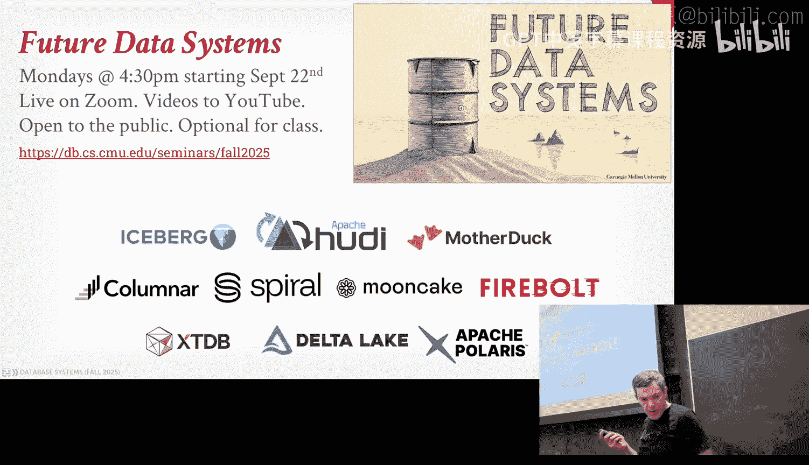
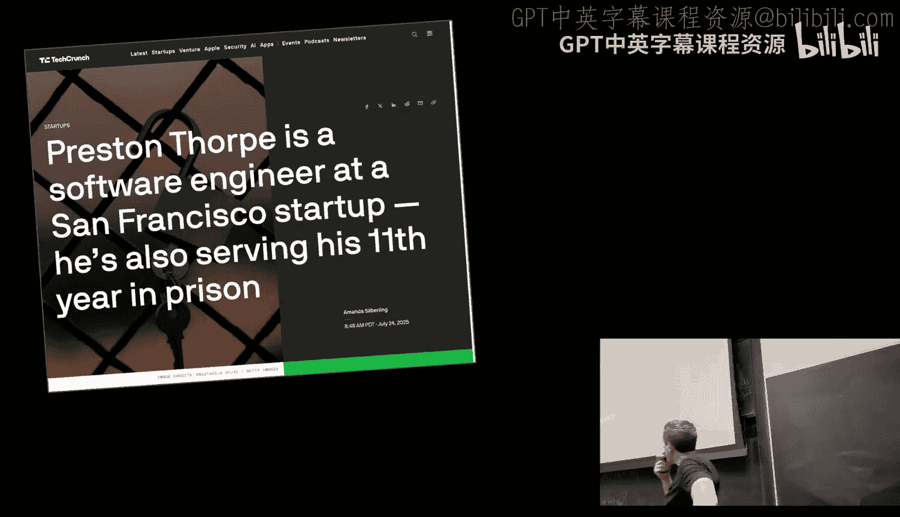
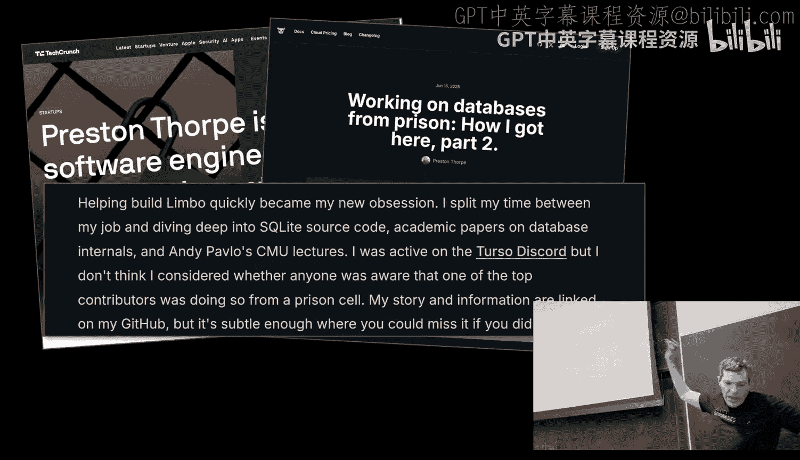
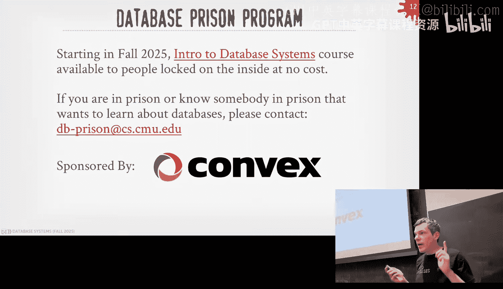
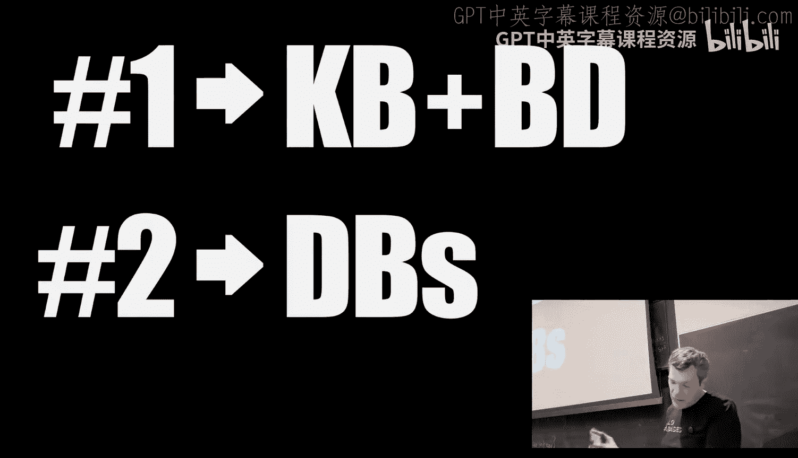
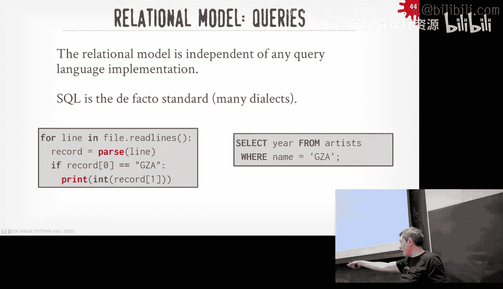
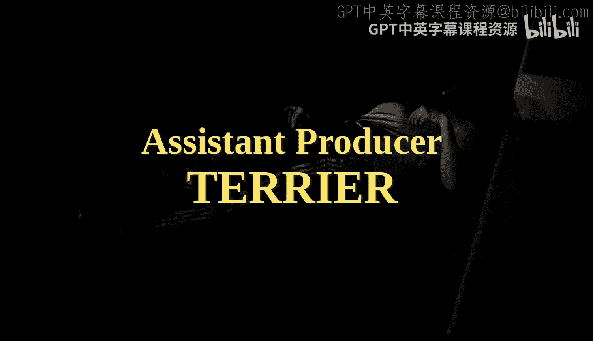

# CMU《数据库导论｜15-445 645 Intro to Database Systems (Fall 2025)》中英字幕 p01 -1-#01 - Relational Model & Algebra (CMU Intro to Database Systems).zh_en -BV1bmHGzsETM_p1-

🎼给我我。🎼check。🎼我是你我是。Think y'all forgot what rat sounded like。🎼。🎼哪怕他宝贝掉给子。This is day basis it is 154。

565 all right we get started again to apologize late late waiting for us whatever time and we haven't been set up in the last moment because I apologize so quick shout outs to people who help us get where we are today and there a Greek out in California。

 jail in Seattle， my main man EZE in Crooklin and then I wasn't want to recognize that people that are with us anymore so3 gear D gave got table wedding already to him and then DJ Bluehu is still in lockdown in Cook County you know get amount this year。

 DJ2PL is still in Pittsburgh I don't think he still date the same girl before so he's doing fine but the news news is that we have DJ again so give it up for DJ cash。

So word one of DC is not just a DJ， but' also a producer right， to show us what' on we can do。

 go for it。Yeah。Yeah。你快啦啲时。All those samples being clear where before you know we we wanted on the how you doing that doing great。

 how are you I was died last semester that's what I'm not dad I'm here。

Everything's going It would be nice if I had a lot more cash with me。

 I'm just looking for that money， man just here to get that money I a weird thing to say。

We'll take care you。 Okay， she told me。All right， so today's lecture we go quickly through some court logistics and then we'll go jump right into all the course material again so if you're not on the class。

 you're really on the wait list， I think when I check this morning， I think we're like 100。

28 or something like that， I think the total enrollment is 130 or 1 points something like that so we don't pitch all the way list anymore because in the previous years we've had too many students trying to get on and the wait list have wrongs with the advents。

NSS control this， so they will add people off the wait list as spots become available。

 and I can't promise you whether it。Whether you just go get in and this is not official。

 but it doesn't go by your positions for reasons I can't get into but there's a lot of background politics in different programs and it doesn't always go by your position so the good news is that if you can't make it this semester then it's often every semester so you can't get this year agreed in the spring if you want to make sure that when if you do fill out the waitlist that you' caught up the speed project here which I'll talk about in a second。

 make sure you do that follow on the lectures because that project don' leave the determination whether be left to you pass not as well even if you are going。

All right so this class think about the design application of the database management systems。

 how do you to build the software but what's going on on the inside。

 so it's not of course but how to use or administer database system so something would say like why I an or upding system I just want to use or use my single WordPresss。

 whatever that's not this class that's taught over in Heinz College and information systems and this is really about the computer science level。

 I understand what's going on inside the software to understand what these systems are actually trying to do for you。

Okay， if that's what you want， go go over that。え。Right。

All the post logistics students syllabus in the schedule are now posted online so please go be and make sure you understand what the perspective of you as a student in this class all the discussion and announcement of the course will be on through Piazza if you're enrolled。

 everything everyone should be added as a couple of days ago I think refreshing from the new students and the same grade go that'll sync with Can so everything be the roster will be added beroll there and then final grades and the total rates that'll be done the as well so we say this every year if you're not a CM and you really want to be taken the class because we post everything online know there's a non-t student use that code make sure put your university as Car Ma University and then you can fall along get all the things we have in the class obviously posteding piazza so you're not student in the class they don't email the students the Ts myself don't post your solution with GiHub you are on class you don't want to be in。

So it should be automatically added to the real？So for in the lectures today， our draftre Sp。

 I get very excited with for what is today。And love campusness， they're the best in the world。

Number two my life also I' one a second but when I get excited I start talking very fast and it're going to be hard for international students so if I'm going too fast and you give me to slow down just raise your hand and tell me like I don't understand that to repeat yourself or slow down okay。

And if you have any questions that goes on to the lectures， click in， please interrupt。

 raise your hand and say， I don't want what you're talking about on that slide as you' going on and I'll stop repeat repeat myself because if you have questions that it's very like somebody else didn't have questions too。

 so please go ahead and interrupt me。So what I won't do is that at the end of each class。

 I won't allow you to come up and say， hey， on slide 1，2，3。

 you said this or what does that actually mean， so immediately after lecture you can't ask any questions about that lecture because I want you to interrupt with you as a going home。

来。So you can ask me about anything else after the the class of how to get a job the this is how to do with the cops or whatever you want。

 like that you can do when I won't answer questions about the lecture because again。

 if you have questions other people do， I don't want this to be sort of a fact collaborative。

All the project in the special will be on this educational data system we've done for several years now at Carnegie Malon called busTub。

 it's in C++ 20， you can plan it by C+ 17 if you're not familiar with the Ne features of the 20。

 but the name is Kennedy in C++ there is no class at CMU that teaches you C++ so you kind of have to pick it up on your own。

And so you think if you don't know CB less and you think you're going to learn it as we go along。

That's probably going to be a bad idea especially when it comes to de bugging the system because you take money travel S Fl and travel databases it can be challenging and do this at the same time So every year every student along there's always students saying hey。

 I know I don't see I know Java I can pick up S+ and that's not always the case so we have this assignment at the beginning of semester that we out today。

 I had to pick up some things and labor decline last night that should be out a few hours called project zero basically been a simple data structure that has be multithreaded and you know getting grade for it not take a long time。

 but it's meant for you to come to realization what you actually know S+ enough get by in the class。

So you have two weeks completed， you have to finish and get a completely 100%。

In that two weeks or you'd be asked to drop the horse。Because again。

 why don' we start doing more complicated things like a new， while threat at data structures。

Steve Flsson' is going to be very challenging for you if you don't have the experience， okay？

This also course， you get sense of your dead environment all that good stuff as well。

So any questions about Project Ze， we'll post information up this on Chiazza and Nicco will go out later today。

And again， we try to get people to get through this soon as do rather later before we get pass and the add drop deadline。

So now I have to show this every time in。Be in the class， learning about plagiarism。

 so everything you do for homework and the project should be your own work。

It means we don't want you to copy from other people on the internet or other people in the class。

 but I'm going to say you are allowed to use gender AI tools。

Flaud check your favorite one to help you the projects。

Because this is the future that it' stupid to say， don't use these tools。

 be asking if not used to bug that bug your code。It's stupid just the way the world is now。

 so the lines get blur what's actually plagiarism versus not plagitive when using LLM and if you're not sure ask us use your best judgment but by all age you be using these tools help to break。

The trickyrink thing is going to be， you can have to check your video generate as much of code from you。

 but if you don't understand the fundamentals what we're trying to teach in the semester and understand systems。

 you're screwed because you don't know whether the thing's going to put out is going to be correct or not。

And we'll talk about the leaderboard in what we release Patrick1， but there's wasing extra credit。

By based on how fast should repair it actually。And to'll be honest。

 I play challenging the teams and call other ones。デエ一。

Sometimes it's correct or's definitely not be performingant versus can stuff。

Its like writing assembly versus writing the CEO code in the pipeline， sort of the thing my。

The other thing we're doing this semester is that we have on every Wednesday。

 we'll have in- class lectures that resume from all our friends in the data city。

 so we'll have these little flashman lectures thatll cover quickly some particular data system or project that in the real world you need to understand how the things we talking about during the semester relate to to real growth systems。

We're also having all these companies come give。Recruiting talks in two weeks or three weeks in September。

 everyone in class when invite to come of these things and we can talk to them about internships and in full time。

That'll be on September 15th and 60th。We kind of restricted to this just be the data classes this semester and the maybe previous semesters and then also the advanced class teaching being taught at the same time。

 so it's not like the career fair with everyone showing up， they took a shower that morning。

 they're trying to hi their resume this is specifically just great for database。

And we'll post onquiios about how to do this， and then we've also asked the companies to provide us with information about their and full time positions direct force these。

能不点到用要。If you want to go beyond things of public in the class。

 we're also having a seminar series starting in September。

 this is optional for students every semester we always try to do a different topic。

This topic or this method will be about data lake systems。 you know that is don't worry about。

 we'll cover it later on。 but this is sort of the hot trend right now where people are building cloud based systems where they do SQL and top of。

Filees and Amazon on is three area。How stars took。So icebergs probably' see this one of all these。

Anybody knew who bought iceberg recently or last year？Gt risk。Everys what gave pay for them。

I think it's 2 billion or a billion。there're probably shit of money here so like these and companies can come talk about what they're building and again this will be on Mondays at class at 430 and you'll be on Zoom on YouTube as well in this option proceed if you're like me usually on databases。

 there'll spend more time minutes there's one way to do that。

Quest's the reason on the University of the slide， we do twice。And what I said one。

 they bought iceberg， and they bought taddler， there's one more in different day。

 if I know what it is。一六零一日时。Absolutely yes， so Delta Lake was Datarick's version of iceberg。

 and then they bought the iceberg guys。 The story is they snow them which trying to buy the iceberg guys and then they offered them $600 billion。

And then Dan slipped in and offered them like two videos degree， it might been doing。

 it might be off， still a lot of money。And then simply put out Polariis。

 which is the catalog version， it's iceberg compatible， Hooty Kim out of。Uber， I think。And。

I recommend a Netflix， do recommend a。Who he came out of Uber。

 and then now they've been personalized by a company called One House。嗯。And you'll see it。

 it's better， there's a lot of new data out there because there's a lot of money in this and every year everyone's trying to build a new system try to solve some problem that existing system don't solve。

Sometimes it's a good idea， often it's a bad idea。And what this positive be had its a lot will wins the banner。

And that' just because I said so， if we understand the fundamental actually kind of good。Right now。

 this doesn't relate to the class but this is because we're going putting put this up on YouTube。

I've sort of mentioned before that DJ Muu is in jail in Illinois。

 there's actually somebody else we know who was actually in jail right now at prison。

This guy namedCustomton Thorpe says if you read Tech Hunter Hacker News might have seen this a few weeks ago。

 he's got a blog article ontorrsa's website about how he's currently in jail right now。

 he got caught dealing pink or smuggling pinkkin from。

up in New England， so if you really read this blog article， we got this little blur here。

 it says that while he was in jail， he started watching these classes and he became fell on the databases and he is currently in prison right now。

 we are trying to find a lawyer to get out。And you threw a date that's awesome right so I realize that there's other people maybe be in the same boat again everyone's here hopefully you don't end up in prison it's not going through so this semester starting if you're not if you're currently in prison or somebody that's in prison。

 you send it to me now and we'll send you a package up burden of this course。

 it'll be like know if you'ret on computer print out something but like'll get sending like that thumb drive the videos so obviously you can't sending this semester because this semester hasn't happened yet。

 it'll be like in a previous semester。

Let me thank our friends at Comx， which is the Davis company for sponsoring us。

Hi any questions about the logistic and the court let's expect from you again the court sale list tell you to break down with the grades for the projects。

 all the assignment list is when all the projects are released and how release and when they're actually going to be due and then you post other questions on behalf other。

哎，十三个です。So as I said before I love databases， but then the second most important thing in my life number one is my wife and my biological daughter number two is databases like everything else doesn't matter and you'll see this throughout your life but pretty much everything is gonna to be not just a computer a science and attack everything can be thought of it as a database problem right so I don't have to be friends inside databases。

 I don't talk my family because if you're Trump supporters like they don't like databases it's just。

Sly about the。What I'm going to hopefully impart from you in today's class in throughout the rest of the semester is how awesome datas are and why they're so important and why。

 again， you should pursue what I call a data lifestylestock。

 which is every day to wake up how can I work to do this or how can I do？So in today's class。

 we're talk about data systems background and I name6 database database systems。

important and then I'll talk about the relational models。

The best animal model you could have for a data system。

We're talking about relational algebra which is how you're going to actually end up write queries so the fundamental of building blocks of how do you write queries and manipulateulating the databases。

 and then I'll finish up talking about some alternative data models that are out there you may come across in the real world and why they are inferior or just subsets of what the relation came on。

Okay。As they said， I' look at this so so much， I get very excited to please somebody us stop and slow down here questions。

It make service easy question。これはニムてルです。瞎载了。It Postgss。1。Was that。是果。SQL server。

Sequel bite my sequel yes。知道嚟嘅就嘅同埋施工。Could yes but more。はくそた。I remember早 see summer。There that true。

It's too there's super based simple server and Microsoft server， different things。

 yes right that awesome。I advanced system， we'll cover that later。你要不 wrong？When did this solve text？

Daabase systems， I for a database。So again， this is the word about database is we can be very pedantic about what our definitions are。

 because we have to understand what we talk about what we say。

 what's a database and a database system。 you have the good system dimension。 So you're not wrong。

 if you go to a bar anywhere and respect people and say， hey， I'm using this database。

 they'll know what you mean。 But I understand what the data actually want to store it and let the system is going to build you actually manage it。

 right。So databases can be a collection of data that's interrelated in some way that's meant to model what the real world is。

So we listen to click Alice， Coastcos and my SL people be like， yeah。

 these are all data systems that we use to host and store。And query a data。

AndDa this would be like the list of students that arerolled in this class， you have a name。

 you have an email address， you have a date birth and so forth。

And what is that trying to do when trying to represent you guys that have taken this class？

In sort of digital world。Right。And as therefore， these is the most important computer application that you're seen for the rest of your life。

 even if you don't take this class and go off and actually go to data systems at all these various companies that we just mentioned。

 I guarantee you for the rest of your life you want to come across getting and data systems。

And with this class hopefully teach you like when you send a query to your data system and it's slower。

 you something weird if doesn't behave the way you want to behave。

 this class will help you understand why it's that。The they was computer science。

Sometimes's just like taking some inputs。Doing some kind of an emulation on it and it produces some output。

That What is the possible。 What is the L。Everything has to be database。系。Compilrs， I mean。

 it's kind of rules inside that thing， but it seems some input preing out。

 which you could argue compilers database。Gams game everything was data， trust me。Okay。在。

Let's look at a simple example， and we'll see one way we can actually implement in a data actually to maintain it and run it。

 and then we'll see why。Sing idea is a bad idea， and once' thinking help about why they actually desperately something more sophisticated。

 why do we discourse。So let's say we're going to go to a code of Spotify iTunes。

 and we want a database and keep track of a bunch of albums that are out there。

 using albums and then the artists that are owned。系系。

So what basically needs beginning track is like name the artists into the year that that's the album released and then what artists here in different albums when you think about what are we trying to model。

 the Dan is trying to model like a real music store。

 we actually go in and see records and see easily。ケスな。But here we're trying to do it。

Cator Davis we trying to keep track of all the a you have for the real world entities inside our Davis。

So what's one really easy way we could do this？や veryです。在号。said， put in our zombie throw。Yes。

 basically a way more than to say， let's just say they want your CSE files， comm value files。

 the text files that you have on your laptop or your computer and have one file for the artist。

 have one file for the audience。And as they said， I'll have every line is going to be a different artist。

 every line of that file， separate about a new line character is going to be an album。

And then I was out of comma， separate what they are。

 so I would have one father for artist and one fall act， right？

So now every time I want to query this database， this is a database。

Now' to create some code that driven up the file called FO。

In par of the each line by the new line split by the new line and then split it by the ta comma。

 you find the data lookingable。Right。So let's say that I want to write a query that says given me year that Gis went so long。

 right？😊，So I have an artist file and I got right from Luc Javava code or JavaScriptscript code that just opens the file read line by line。

 parss each line， and then I know that the first offset is going to be the name of the artist for GsU。

 so the first offset when I split them on the comma is GsA that I know I have the match and I just output these。

The second line record。Ocept one。你要这样才。In the CSV file， everything's treated as a string。

 but I want to produce the I integer up the year if they went solo， I cast it to an integer。

So this is a good idea there。I've got to set the benefit up being wisely benefit。Yesす。

You it's a later time you're tend to look at one answer， yes they said in order to find any line。

 you get parts the previous line get to a sort of related na。

 a linear scan or sequential scan to the。There's no time， yes。The logic can佢 hold。A said。

He the logic and the name or the offset of the fields are hard coded in the code， yes， a more acid。

Sa thes and securitys， what do mean by that？He said no acid。Give us， give us like。

Can be turned into that， even though way I say it is like there's no guarantees that the data I put in is going to be correct。

And no guarantees that when I write the data， it' to be safe。

INo guarantees that the data across the Uni files will be consistent meaning like I can plug an album that has an artist that isn't just the artist part。

That's basically asset。it's got to hit major one， right？So can sort of think of like the。

In different b， the integrity of the data you like if I put data in is it going to。

Because I'm trying to model the real world， can I manipulate and change the data in such a way that。

I can put it into an imbalance state that doesn't match what the real world looks like。Right。

So as I said before， how do we make sure that the if I add an album， I put an artist' name。

 that artist' name actually appears and it's correct in the artist file？

Or what if I have an artist had multiple albums？Wu claim myself to Adams， how to make sure that。

The artist name isn't like you know I don't sometimes use a hyp， don't use the hyphen。

 so I have two different versions of the Wutang clan。

 even though lots of data the same thing but exactly bit some story are actually can be different so I don't think they not going that。

My sort of simple example here， I was assuming that there's a one to one correspondence of using an artist in an album。

An album only't have one artist because there's only one field for it。

People get out mixake all the time。Fllaborators do have multiple artists on the album。

 but I can't represent that in that Davis。They what happens to identify3 and an artist。

 but I don't think the album that they're involved in is now obviously a gang pointer。

The implementation of Minnesota as well， how do I find a record， as we already said。

 I got to parse every single line and then jump to the offset hard code in my program to find the data that I'm looking。

That's个啥子。But then I want to write a new application that once use the same database。

 and this one's in Python， maybe we'll write the next one in S else or RoOS。

I got on read all the same logic I have before to parson files now in a new program and how to make sure that these things are in sync。

Really hard to do， there's ones and there are different languages。

And then what happens now if I have two threads try to open up the file and try to write a new record at the same time。

 well what happen？Who would win right is if the last writer wins， or should the second guy fail？

That's sort of relief to the assets that we just talk about we'll cover that later。Nonetheless one。

 it's super so important because he would get really pissed off if you lose data and think of your bank account。

 you put money in deposit money in the bank and they lost that deposit。

Maybe pets trying to because money， so the bank does a bunch of stuff in their database making sure that they don't use those records。

So an aory example， you know。It's not the in the world that we miss an album。

 but people getss off pretty quickly if the application didn't work as expected。

So what happens if you start pending the new records to the file and then they would crash。

The computer graphics and the troops of the power grid， what should happen。我要思会上 that。

What happens is you want to duplicate the data so that instead of having one machine and that one machine goes down and lose everything。

If we dont want to people running a real website a real service。

 it's got to be old available as long we start duplicating the data and how to make sure those things are insane。

And so this would be basically why you don't want to write a database system yourself in your application code。

 people do it all the time， terrible why， you want to use a database kind system because。

Highly vent software that is。Well people spending a lot of time not worrying about the high voltage things like how do I actually store。

He represent a music site， but actually how do I store data I make sure you don't lose anything。系。

So data systems are going to be important pieces however that could be sort the bed rot for pretty much every application that exists today。

Now with that said， just because you're using Gis them doesn't mean the people building that English system have done that correctly。

And you can guarantee that you' not have to lose any data or have other problems。

 this blog article actually came out two days ago， so there was a company out of the UK about surreal de。

And。We are going into details， basically they turn off safe rights by default default。

 things something like that。faster than they actually really are so they're storing data very fast for you。

 but it's not actually safely being stored so you can crash and these powers suddenly be happening。

They encrypt Davis the data。So I'm point this one out because this was two days ago。

 Monevvi had a long history for covers that this where they were kind of form the same kind of games like this is not a new trend as he'm not just pointing these guys out。

 I'm just point out the same thing。Again what this possible do is teach you why what they're doing is a bad idea and you really understand what you're doing is claiming what they're trying to claim that they can provide and see whether it's actually real or not This is something when you're hiding something into documentation that nobody realized they going to turn on be able goes to wait。

So now maybe6 between the data systems that we mentioned at the beginning versus the database。

 a data benefit system is this category of software that is meant to be fororing application data。

In such a way that it is easy to story enough。To analyze it and ask questions about that data at some later point。

So a general privacycy of this system， like the very system we all mention take， like Clickhouse。

 my SL Postb， Mongo and so forth， Ear。These are designeds such that any application you come along could start storing their data in it without having you write them into scratch。

If define the sequence we'll cover in a second， and you it is what you want your data actually look like。

According from data model， which we need the next slide。

 and then these systems register is support you。As I said。

 this is not something you want to build yourself， but was always the case you must never want to tell this yourself。

Oftentimes people say like， oh， there was no news systems that met my needs。

 I haven't start doing my own。男人来生 time的再听拿去。You can get very。

 very far starting with Postgs or something like even light light。

 and I should usually make the first choice for avoid any definition。Actually。

 gave nothing out of this course remember your first year should be Postgs。

They have amazing front end， terrible back end。啊星 white。

So a data assessment is going to provide you expose to what's called a data model。

Which is a high level abstraction that sort of specimifies things。

How you can represent data in the database。So a relational model is one example of a data model。

 the document data model and mom and， that's another example，ll that in a second。

And think of these like the rules that can define what types of things can exist and their relationships between each other in a database。

Outside of like computer science， we think of like a。And data models like the rules for architecture。

 like you're going to build a building right， a building would have things like a room and a doors。

 like each are the type of things you're allowed to have in an architectural diagram or classificationation or a building。

And then a schema is going to be a description of that particular database。For a collection of data。

 according to some data model。As I as a way of define。

 here's the things I' actually want to store in my database is according to the data model that I'm required to discuss what I think。

So going back to my dirty example， you can think of the。The sbo natural blueprint diagram。Of ability。

 say， here's what the doors are， here's the size and dimensions of the room。I can take that scheme。

 and I didn't every。Make different versions or different。

Different instances of that house and where that building is according to that blueprint。

But the data model defines what the blueprint is allowed to have， it has windows and so forth， right？

So the relational model is one example of the data model， it wasn't the first one。

 we'll call it the struggle ones and the second， but pretty much today most data systems are going to be follow the relation data model。

The all this system everyone mentions have a Redist。Mongo our relationalally。

For simple things that key value systems， think of like it's the simple data that you can to do as you can have。

 you have a key call value， check an Associative red like a hashmap。

 can drop in the turbin line just。A key diagramguard it's pretty basic。

You see this like a lot of cat。啊。He followed by signed enough law or took a in kind of cash。

I heard several things at was said this。There's a whole of a category of systems called New SQL systemss。

 Ra in America terms of SQL form。I' getting less less here this is good。I系。

Nothing I was very passionate about。I was an early critic of no single symptoms。

And it turns out they're right， because because all of them are adding an original model now。

 but let'll see some rapids， they're not dead yet and they're but docking adjacent Davis X datas。

 these the ones who will mostly think about the municipal world， yes。意き在十分が。

specions is keep having understand。I mean， there is not a academic scientific definition of no SQL。

 you could throw them in there as well， yes， this would be reds would be a dose SQL system。

 that would be a key di。But when most of people them they going see what they usually in model。

 theanro。Right， all these other data models we don't care about except documents that we'll come in a second。

Then there's a raator which is。One dimensional vectors， two dimensional tensors。At matrices。

 you typically see these machine learning workloads and scientific workloads。

 typically vector yourself stuff about the end， but this is very common now in relationition database business。

 you RA applications， do semantic search years later things， what total that looks like。

And then those these guys that come out on higher For network of semantic and English。

 these are all the ones see really old systems from like the 1970s， 1980s。

High probably the first one network is another one that's around。Like you would of no start say。

 I'm going to build my database or I'm going to build my application running up a higher school database。

I guess that's like I did MMS， they built that keep track of all the parts of the callation and existence。

That thing is still around， I even still makes a ton of money on it， every bank still runss it。

But think put relation the near on top of that。It doesn't look like in the impact of that。

So think like 1960s 197， early 1980s， we don't to worry about these。

We'll see why they're a bad idea and then why we want to do the Malitia data this of course you can be a Maia data model because again。

 I pretty much。In the same way that like one plus one equals two is the basic for arithithtic and math。

 the relation data model my。Basic building blocks of how you want to build and get your application。

The other time racial name models will make really sentences when they start doing matrices。

Because you can' model them in relation database and stop， not always the best way to do。えもかですけど。So。

Let's go back to 1960s， none of us。No was in California yet， and those none for alive。

 but people were getting。でです。So in early early or the mid 1960s， people started doing。

Some of the first things the first one we had to built by General Electric GE in 1965。

The system called it IM Ingrative Data Management， it's written in assembly， they built this。

The host。Some Seattle chambermber companies their data， they keep track all involved。啊。

But IS or IM was early one。I as an engineer， they built this for they call a Lu mission where NASA is actually called NASA。

And so in these early systems， they， a for SQL foundational model。

 it was very hands on about how you would actually write the code to query the database。

I think they were like。This before the C existed， people running assemblyly do everything。

And then couple people along。It was still a high level of language。higherer lower assembly。

 but's still pretty low level for how you actually interact activateiv this。

And so there was this paper from 1973， I think， from 32。By7 free by Charles Bughman。

He won mentor touring the work databases in 1973 received he built IBM。

I has he had the single codeville was his way of how he thought how data should look like。

 so the name is Ker is the program as a navigator， so he has this whole step sub by step process here as how someone will be interacting with。

It can write clearly against agency。I don't care about the details of it because it pointing out there's one it sexist thing key everything。

 but two， also like he can do this， he can do that。

 but paper talks about like you you as a programmer being like Copernicus sort like Sam Macs as you navigate through your database if I what data B one right？

It's a terrible idea because it's essentially you as a program have to understand exactly how the games are being stored in the system and what code against that through data。

So I's got this little blurb here talking about some BS like the sitgistic usage of the collection of。

 which gives the programmer a great expanded of power to come and go within a large database law。

 assessing only those records of interest。It something that terrible。不挂哇。Right。Well so again。

 this guy was the big opponent of something called cota cell， nobody heres having a heart coti cell。

 probably never to code all， but this is how they were defining in their early 1970s on what data this should look like and how he program them against them。

So what does it look， well， I've never written code so all the catch P。So Sam we when to write a qui。

 it says， give me all the artists that appear on DJ Ru's tribute album and we want to put out this year。

This is basically what it looks like。We're running much of nested forlifts to look at all the artists and this artists asked。

We all the albums out down the artist。Basically writing traversals in the data system of these explicit data structures to find the thing you want。

 you're essentially telling the data exactly how you want to navigate the data to find the thing you're looking for。

Meings a good idea of that idea。I got said better。W。They say。

 depends of what gets you're using an underlying system。Yeah。I mean one of e cow wasn't exposed。

 but in this case here forcotiin。It's high level enough they don't know what data structure is。

 which you need to know that the data structures or collection get diverse。So in my example before。

 I had what， I had two tables that were two files， I had partisan albums。

Is it better to do the for than one the artist first or the albums first？有道。没。Well。

 maybe you do' know because you go away somebody how many lines or how many records on each file。

 but that may be true today or about tomorrow or a year from now。

AndNow this is the code you're writingquis on， and now maybe whatever so you made to me at the beginning。

 when you write this query is not the same as it is now。

But because you hard exactly what excuse plan you want。This computer has to run this。都是白的。

A whole bunch of pieces' seen as second， but the equivalent single query would be something like this。

Like joining the artist in Al Gable by just。家系。It' get on the afternoon。There's hair there kids。

If you've never seen C before， I hope you have， I'm not telling how to actually do the answer I want。

 I'm telling what the answer I want。And the data， it' their responsibility to go figure out how to actually generate a that answer for you。

喂。It seems obvious now that back then this was like a mind willinging idea and coclls considered of the hot thing。

So I don't know too much details of this， but there was this meeting of the minds in 1974 at University of Michigan in Ann Arbor where all the coicil guys came along they were there and all the relation data modernized with there。

And they thought about it， and it's all Paul that everything's written down with what they were talking about。

And they were point out all the reasons why a。H， our navigation data model is inferior to something like alicia data。

This was considered considered a major pivotPoin in Davis since wherere now people realize O data model is the right way to go forward。

 but it the time to run any systems that actually should implement this。And then after this point。

 people started building that。So the guy that opposed the originate model his named Ted Co。

And so he was at his conference， along with the Coil guy I just mentioned， Charles Baughman。啊。

As well as Jim Gray。The guy met two things locked one of the early systems at IBM Coastyem R。

 and we'll cover next slide。As well as Mike Strberryer gu about Ingress。They made her about Postgs。

 everyone who like Post presss。Coast ingress， you go first ingress， then you go Coastgra。到了。Right。

There have been four 2 working databases。This the for right here。First of me。

 cod Bch and gray are all dead， still just still kicking it， she's like me1。系。

He's someone when was trying to find a lawyer for the guy get him out of jail。

RightSo this was a big big big deal back when I said before and so the codetiil guys were saying oh original model because the paper came out in the 01970s through 169。

 you couldn't build a system like this is quite too complicated no can reason about relations database and then the racial data guys are saying all the fact talking about codetiil like navigating your database but it's terrible idea。

 it's going to make data really p and it gave your basically hard coding exactly way looking。ありがあ。

34 years，50 years later。And racialial data model guys have won because you all listed relation database at the beginning。

 no one listed a cursome database。They still exist， still can pay money to it。Somebody's 18 for you。

 but they sort is going to exist today。All right， so what is that correlation data model？

Three basic key ideas that are really simple to understand。

The first is that the way you define your data。Through the data model。

 it's just from these high level。Collecting the data con。Is anything was sex？

And that you had then represent the。We then represent the connection between data at the logical level。

To values， say like this album is part of this， this artist this album by saying like track of like identifiers between those two equations。

 rather than low level fiscal pointers like this memory address or this dis offsetset。

 the same things are related。你 everything商 has做 higher model。

You also to be able to specify constraints now in your data to say。

 what data is allowed to store in it？To make sure that nobody's allowed to put invalid data。

Like in my file and before， it gets a file disk， I could open a text editor and start changing gear and email addresses。

AndNow play about my programs。Inre database people arrange you from doing that because say this column that is a has to be the data type and doesn't let you start violate that。

Not always true， some systems will see like single light which store a bunch of crap in that nuclear shouldn't have。

Andlation data model is sort of separate from implementation。

And then the last one is the way you would manipulate or query the data to pursue a high level API。

That you declare what answer you want defined find through relations kind thing of like set during basic sets。

And then I don't care about the actual implementation of the database system in my query。

 I can say this is the answer where I want， and now it's left up to the database system to decide the most efficient query plan。

 the most efficient way to store that data and execute that query for you。

So any assumptions you made during the time you that query。

As the data changes over time and the same query shows up if I wrote it in S or whatever title the language I want。

Then the database system would say， oh， my data actually will set this before look like that。

 so here's actually what。It fasci' query it。Well here's the best way to store the game direction story。

啊。That you want now badly than what what I look what I thought it look like before。

So we have this nice independence between the physical level and the logical level。

 which I'll show a little quick in a second， allows a bunch of freedom to the data assessment limitations to do the most efficient way to sort things。

宣传。は，そ what the time thing。Again， so this is the 1970s。

Compbuuter science was still in the early days， so like this is obvious to us now。

 but back then this was mind life。Like in IMSS that this is from IBM， they mentioned about the API。

 in IMSS， you declare I want to store this table and it's either going to be your tree data schedule or hasht or hashmap。

And then depending those two dash records I chose， I got a different API。

Because I can't do raised stand on a hashm and I can't do。Certain kind of lowouts on that。trade。

But then if I decided， oh， that was a mistake， I actually want to store my tree structure in a hash structure。

In reverse， I got to go back and re write all the code to reflect that shape of the API sheet。

But relation data model in SQL or title negative relation relation data model。

 I don't have that problem because I don't know what the data structure is and it' saying。

 I want to access this data at the logical level of。A relation retain table you。

So at the lowest level， you have this thing called a game based store。And then above that。

 we would have the system keep track of the physical schema and have a bunch of files and on the pages and extends that clarity on the storage medium。

 I'm keeping in track of where all the information is and where the bits are storage and how they're being laid out。

And then above that I would have the large moqui I would define what my tables are。

 my collections are， what address they have what the namess are， what their data types are。

And I have a nice separation between the two of them， so if I change one versus change the other。

 sorry I can change one without this instead say maybe changing the other and can change the physical layer without changing the logical layer。

I'm going crazer， I can have another level of externalmacy。

And this is a way to expose or exactly further what the electroological schema would be so they may get to that if we do certain things and have。

certain data't expose a certain way without actually change to the logical level or the physical level so saying I have a table of everyone's every student in this class and then there's a column board like。

Your password is look that， but I don't expose that password column to every single application that anyone access that table。

So I could declare our view to say this is what you're about to seeing hide。

This is another level abstract。Now above that is what the application is going to see。

access it through a high value declaredlar language。Something like。So this point here in our graph。

 that's the physical data of independence because I can declare my my Cma here's the columns that I want。

 but I'm not defining how I actually want to store them。

And the data of this trade changes the load level all once and doesn't make your application。

And then log that you up here because we won't cover this too much of this semester。

 but it's basically a way to say， yes， I have this schema， but for a certain application。

 they see certain things and certain applications。次当です。And I can change those things or now。

here you re the。All right， so。Going on the last 10 minutes about how great data models。

 what actually is。So。At its core， it represent everything's relationships。

I'Just think of relations as like a set。And on set where we keep track of the relationship。

 not between the different collections， but actually the relation between the attributes within a single collection。

So you have a student a student have the name， student have the email address。

 the Malayian representss their between those， those actually for that highlyy entity as a student。

ニスない。Work work part。啊。记得咩。别么。Questions in this slide here， what part is your business Mc handling。

 everything before the application？Everything。We'll go throughout this semester we like down here being say is like the out system。

 opposite was terrible， all it in our way， we hate it。这个辈啊。We need it to survive， not always。

 but we needed to do certain things us but we almost as Davis。

 we always want to do things without the argument。So you think that like maybe OS is kind of in here。

 but it's always going to be a de for us we try to get around it。We'll cover that as well。

 but everything I the application down is the news。え。

That sometimes you put the whole application is too。Not always a good idea。

 those are going to make broke code that way， but you could do that。

 it could be the whole thing for this method we'll say it's the application after that。还个。

So relations can be un order set of data。And then we'll save instead a two pool。南 doubles。

This is around a couple， let I' say two。The two was going to be the sub afterctors within a single entry within the。

interre and then every act you could have， there be something called domain that specifies what the range of types allowed value instance want to have。

😊，Some if I have an answer， I the32it enter， the domain was specified from like 0 to2 to 32 minus bound。

 if it's on sign。If it's a name of you like a string field and so forth， I basically define what the。

We'll have a special diet of Noll that's going to represent。

 every domain it's allowed and actually say you can't have all。

 but it's way represent that the data is unknown。I， and the。Very similar to nulls in C code。

 but it's at to the logical level where。There is a value that struggling for null。

 but we can't reason about anything about it， so we can't ask questions about what that value actually is if it's null because the answer is on them。

There's April more sense class， we'll see it， but。Naming is a using of like a relation as a tripleple or table or playing column。

And most the times people to refer them as relations， people refer them as tables and columns。

And rows， but when we talk about different storage models。

What a column in in a row is doesn't know line up exactly with this， but a final of what。

And so interal model primary keys is a way with us to uniquely identify a SM tule in a relation。

 I think it's a unique value that uniquely identifies a CML record。

 and you can define unique values in our columns， but it's not always considered like the identified。

That was。So in this case， Sarah， for our artist table we have boott cl that notorious band Ga。

 but certainly there's bands that come along to have the same name as Pri band。

Sometimes that we try to be tricky remove vows and make of they something national。

 but often of times's a distance。So in this case here。

 using the name would not be the primary because two artists have the same name。还好。

So oftentimes you see or database is introduce synthetic prims or identifying columns。

Sometimes they' they're called identity columns think of like it's a unique number we assigned to。

出 some record。Oftentimes when you see websites， look at the URLs that'll say。

We you see that number represents with an order number。

ItAlmost always going to be something like this， that''s a counter growing up for every single order。

Youな。有力去帮护。哪些人。His question is，Where if my preference should use a natural key or an identifier？

We didn't find what a natural P is， naturalpy would be like， the name would be like a natural P。

 but it would be a big example here at CMU， a natural peak would be that your email address and that's became unique。

Sometimes there's probing frameworks that go around。

 they'll automatically generate you these id column。I always use that。はいつつ。

So in this case the primary key now is the ID column because we're going to say every time you insert a record to think that there's some counter sequence。

 you add one to it every single time we add in the record。It's a guarantee answer。

We also have far keys， and this is how we're going allow to identify the relationship between different peoples within different collections and relations themselves。

So going back here for artists and。An artistan artist album it's an artan album。

 right so now I've added the ID column that uniquely identifies each record as course primary key。

 but now in your case of the album， I want to keep track what artist appears on it at。

And for certain animals， this is fine if there's only one artist。

 I could have a mapping in between I basically stores the artist ID within the album itself。

 and I know how to map that back up。said the challenge for to be is when I have out have multiple artists on them。

Like in this case， here is the same as history。So to represent and model this。

 I can introduce new sort of cross records for。Depenency tables。

That allow us to be restored the relationships between records or tus across different collections or different relations。

So in this case here， I would have。I would have a separate table now keep track with the artist ID and M and have a record in this table anytime artist appears on a given album so this allows me now the freedom to represent to have multiple。

Mozzel artists appear on Mole albums。And not assume theres a  one on one correspond basically I do many。

 many representations in genes。Now don as destroy the arts ideas and the albumwl itself。

 I just represent from that as separate。I'm going to skip constraints in the sake of time。

 I apologize basically ass a way to specify what barriers are allowed。

Additional machine beyond is the data type， so I would say things like no name can be null but I'm not null there I have other machines to say like no artist can be born or can go so after。

Before year 1900。bad example， we meant other things like no email address that seems you can not contain Android email。

 something like that。You can declare this when you find the table， you also have global assertions。

 basically any time， you insert a record， and run the SQL theory here to check the sample that' valve about。

Most digital support because it's slow， but it's a writing some model more complex extreme。

And data restrictions time the basic one。Slight blink。Quion， what is the farm side to？

So far key is going to be the。打。I'll find you in this over be over here。

 so you have a relationship' defining。Values。But you're saying that for a given column are attribute。

It really is a value that has to exist in some other relationship here。So you would say。

 I would say declaring this relation called artist album。

 I have an Almighty and artist I for any Almighty in this column here， that almighty has to exist。

In this columny or this table， and that way I avoid the problem like if I delete a record here。

 then I don't want to have a dangling pointer where I have now an album that has an artist have an artist on album of dis anymore。

 that Davidson would know， okay， you're trying to delete an artist but I know that I' have a pharm he reference to the artist I here and this has a pharm he reference to an album here。

 and that prevents me from deleting one not the other。The question is。

 what is the primary key for this table here relation here。

 so anytime I have the underlying that's the that's the primary key。

 so it's actually a combination the two columns together is the primary key。今上地を安や我 not。Questions is。

 can I can I declare primary key with multiple homess， absolutely yeah， why not？Yeah。你思间就家时。O。So。

What I've found that so far， it is the high level。Concepts like the relation models have to find a relation or a table。

 again， the term it used interchangeably against SQL， you say crate table。

You refer to things as tables， but in the research literature or in the original definition of the paper of the literature data model。

 the aren't called tables they were called relation they basically same。

So now we have to find what our relationships look like。Now we want to actually run queries on that。

So this is called the DML， data manipulation language， even though alsoitude where we're going to be。

We may have read queries like select statementss， these still far onto the category of the DMM because I'm manipulating the data data to performance somehow。

So there's basically two ways to do it。There is a procedural。

Language and a nonprocedural language are declared a language。

So what I'm going to teach you today will be relation algebra。

 which will be procedural management where I'm defining。

The exactact steps I want the something to use to execute my break。

And I'm actually defined the order in which I' going to ask。W actually knows。

Again what I said before where you don't want to be doing that when I have a thing I was。

Highlo that is inside because because we actually to have that。is it t co defined find visualism？

A model with the racial algorithm at the very beginning。

 and then the high level languages that allow you to do the how that they player to interface something that can be later on。

He declared a way of using Google's colational capitals。

A SQL basically maps with this we'll cover that as class。

 you don't really need to know relation catalysts unless you put to a query optimizer。

 which is not this class in this part， you you to teach relation catalysts in this class。

 but you go the realor， nobody uses it， you't really to know it。

But you already to build ways algorithm that be in the fundamental building blocks of power actually build implementation。

The action。来。And， should be straightforward understand。

So there output is the original definition from TedP post seven operators。Listen here。

 if you go through121。Well at the end， he has an extended of here for things we actually need。

In Duronville where like there's no notion of sorting it to these operators。

 there's no notion of doing a agents。I think of like a pretty object。あ。

And that all came later as extensions， when the original ones were reset here。

And you think of like if build more complex barrier for you adjust these seven operators by chain them together。

 when you allow the output of one operator he said is the input to the next operator。

 and you can use that to build larger world complex。はい、はい。Okay。

 we'll go through each one by one and I'll show you what the corresponding SQL looks like。

And then that'll sendgue to。the most basic offer you can have is going to select data。

And thiss just like your filter amount， the chiples you don't want faced with some predicate。

You're defining the first order predicate logic and say these are the triple that are allowed to be bit as the output for this left opera。

So say they have a signal here， are it has two attributes， AID， DID。

 so I can have a select operator and says，Give me all the records。G in R， where AID equals A2。

And then the data somehow furing out that data according to that predicate。

 producing the output output。I can do more complicated things。

 I can start combining them together through junctions and disjunctions。

have multiple prediates be evaluated， in this case here I'm saying。

 if you get all the Jubalsome R where AID equals2 and BD is greater than1 of1。

And that this is the idea。In SQL， it's making be other to the warehouse。还是。

And it's just fully analog logical define what prediatess。

 first on what to will a match according to its values or what are design exceed my expectations。

It one more time。That's pretty de， right？I can also have a lot of rejectionion。

projection allows me to manipulate with the output of those adjects of selectleommon。

In such a way that I need them the way that I wouldn' to produce it as part of my up。

So I can rearrange the ordering of the attributes。I can put one column first before another one。

 I can remove columns and I don't care about it as part of my output remember I said filter out things like the。

ThePas。On the table， I don't want somebody else to be able to see that。

 I can do that through projection。I also manipulate the values of the attributes to derive new values according to whatever it is thats that I want for my application。

So you define some Excel， this here I have my select operator where I'm turning off all the records with AID equals  two。

 and then I find my project that says， take the BID attribute， I of that matches after my select。

 that's being fed as the input and take the BID attribute， subtract 100 from it。

And then produce those。Also we need the aju AI。So again， in a selection statement。

 rejection is just sort of the front part here， after the select。

re defining the rejection risk definingfin the a you won't come at the output， yes。

The previous slide was called select the title the。Yes， we we were talking about kind and where。

Is there where to select？要去转。で。Is the select operator which operator。

 is that different than the select operator？In sequel。

Think of like a select as the select of innovation out。It's a way for YouTube。因这个。

Think of these algebra as the building blocks to build a larger language like SQL。

So you need a wear clause and to for longer。S that operator will keep you that vertical you need project outlet。

 project out will give you that。And then the front calls will be join。他是保了不在。原告。先生のせ。

Especially instead of using pi， I say Sigma for select。With the reordering of the adjumints。こち二アまで三。

Would that work on a select operator？这个个。あ、すですね。No你。啊。This question is， if Im using a projection。

 I do reflect off with the same expression， is that it's still valid or in this case。

 we know because I have a common thatative list。OrI can't evaluate whether a。

To more evaluates to true。For that expression list。If I only had BID less than minus 100。

What does it mean to evaluate that Boolean logic， the ID minus 100？It equals whatever that value is。

 but is that true technically guess， because it's not zero？po logic。

 so that would always matter to be true。But the cement are not the same thing。

 you just can't swap them out。で先ばか。Yes， yes。いこです。让一个代款人。Reral they。え生そ。给 me a。For more slides。

 and then well come to that。 The question is basically。

 I made a big deal about how you want to prepare the language like SQL， and I'm showing you like。

You know definingfining the order of the steps based relation algebra relation algebra be the building blocks for how we then build it for car language problem the other way I think about this is like when I build the execution engine for in a database the thing actually runs for queries。

It's going to look a lot legislation out because I'm going to find a project operator， yes。まて。你你你啊。

こ最最。All same。are these all these operators commutative？Not always， but sometimes yes， yes。

 I true always。If you start checking things that you haven't produced Apple yet that they're not cloudcomative。

 but in general， yes， they are commative。The point front of me is when I build the executionion engine to run a SL query。

 its going for the operators， the implementation of the executionion engine。

 it's going to milk off by additional output。ここ要冇せ的出金を下げさ。喂签超照。ItP me point out his life。

If I took the away algebra as my input and actually start executing it。

 I would execute exactly the way that's defined the my algebra I was not only one。

And you have a freedom you want and that's what SQL does not to happen SQL is not going to have that problem。

So this sequ it's on the screen is aor of questions， what is this selectionlexian here？

It a level is a selectity of in SQL that contains a projection clause。

And you can think of like an BID minus100 is related to the pi operator with the expression about that so that's not's。

啊そ question第。LikeThe output here。it correct， any output of the SQL statement is going to be a table or relation。

 any output of a relational operator in the relation output is going to be another relation。

So you can easy chain them together and produce if the alpha one do that and go for another。O。

Union of free4 and no basic secondary which you about。They meant thatmatic when pre reference class。

You are。You mean union together two relations and cans all that。

We ever removed duplicate things so for this in the union operator intersection。

In difference you have to have the same attributes in the two， because otherwise it doesn't match up。

Because the out needs to be。Having the output information for the operator is to have the exact matter。

But the same same attributes as the influence。You can do this with SQL。

 basically something like this， right？I'm going through this fast I apologize。

 intersections are basically the same thing， right。

 you have to have both im relations have to have the same attribute。Same for difference。

 again this just all say except this should not be able anything new。

 you can do the same thing as single。Reign rushings， I want to get some joints。So up until now。

 what are you done taken one relation as our input manipulated taken as the output and send along to。

The next time I。多法官。And then for union and intersection and difference。

 I'm combining together multiple relations， but I'm not really leveraging any of the。

Relation between the values within this relationship and not leveraging the foreign key。

Any veteran ever。With Jos and the hardgeian product。

 the idea is that we now combine them together and you some look up and say what tools should actually keep satisfied in my when I combine these records together。

So our teaching product literally just been naing together with two attributeuts。

The athletectors have to relationly producing comm excuse。

A larger ju that has all the attributes from one relation， all the attribute to the other relation。

You can do this SQL， you pass one the cross drawing。

 or specify by cross trying to get that by default。So this is not actually what we want。

 because you want to say these is like forgiven album， even all the artists that are on that album。

 you don't want to get all combinations and artists and albums that。

It's such a no idea that don't care about。So this is where the joint comes in。

And you can I'm going to join as like a Cartesian product where you have a filter to say， I have a。

I have a select predicate saying these are the twoles that you match according to some di of one relation。

 the dirrhea and another relation。So I can do things like this。

 I don't specify what the joint calls it called a natural join。In this case here。

 it's going to take all the attributectors that are in one relation。

 all the actions in the other relation that have the same name， same type。

 and I look for matches to lose my output。系。And I'm going to include all the。

I'm going to include all the columns that are good two lesions as it would advantage product just I remove all and do here so get the I only get the as that are unique from one column because on one leg and the other relationship。

So you can declare go through a natural join， I don't recommend doing that because it's implicitly doing a lookup between the different relations so see what board and matching attributes are。

 you said you want to use a join clause where you can specify either what attributes want to join on or I would recommend is explicitly saying what the join traffic tocate should be。

 so it knows how to do that match。IThis question Mr。 everyone，We can cover how to join us there。

All right， we're almost out of time so quickly say there's other operators。And that exists。啊。

I'll finish the last few slides then that'll segue into next class but。As they pointed out。

The relation Ive showed so far， thats specifying the order in which I want things to apply to say。

Join relation R relation S and do a lookup for filter Army。TheBID goes one2。

I've have wildly different performance of these queries。 If I do the join on RS first。

 then do the filter versus the。啊。Do the footprint and S first and then do the joint point。

alwaysway think of trees something I saved around the entire semester if I have like I think of like table with like five runners。

 even a table with a Tro run。So make do I want to do a join between RNS？

Of two tables of Detroit records and then fill throughout the ones that actually won because what have only two match。

And I did a bunch of join and a bunch of table I didn't actually need。

And then barrel all Amy doing the filter first， then you join。

So this is what the high level language of something like third language like see what's going to do for us where we can say。

 this is the answer that I want。And I love this to be that's what X actually is。

So I'll stop here with him， to see where're going to go next class。

Now we're going to say instead of writing a procedural code。If the Pythlon yourlan or out drop。

 we're going to be writing a sequence。Okay。はいで。

🎼what。🎼不知从不缺。

🎼Yeah。🎼说你会越唱走不。🎼Thank。🎼过你对对说我从不见。😊，🎼Yeah。🎼说你最最帅我不。😊，Get the fame maintain the。

