# CMU《数据库导论｜15-445 645 Intro to Database Systems (Fall 2025)》中英字幕 p02 -2-#02 - Modern SQL ✸ dbt Database Talk (CMU Intro to Database Systems).zh_en -BV1bmHGzsETM_p2-

🎼Go我 did still。🎼me。🎼我是你我只可。Think y'all what rat sounds。🎼the。🎼哪怕宝贝告背。All right， let's get started。

All right， give it up a DB cast again。AwesomeAll right， so a quick reminder。

 I'm gonna be gone next week。 I'm going to London to see your boy Rick no class next week in person I'll record while I remote on YouTube and I'll say hi to your friend whatever then project0 that one out on Monday thatll be do on September 7 will be released later today and thatll also be on the same day So again。

 project 0 is the C+ project approved that you know C++ can debug multithtic code So please go start that sooner rather than later because your dev environment and make sure everythings working。

 right so last class we a bit rush， but we talked about how the relational model was the superior data model for databases pretty much is the fundamental way you would represent any major application database or data in the system。

 and then we also talked about how relation algebra the building blocks for us to manipulate。😊。

Qury data in a relational model database in a relational database system and so today's class is really about sort of we won't go back and look at relation algebra again。

 now we'll talk about SQL which is in a higher form of a query language than what relational algebra is but then when we start actually talking about how to implement the system itself and actually execute the queries that we'll talk about today。

 that's when relational algebra will come back and sort of fitting now you see how these arebit building blocks are building the system okay？

😡，All right， so let's go back to the 70s。And the very beginning of SQL， so as I said。

 when Ted Cod wrote the original paper on thelational model in 1969， 1970。

 it was just relational model and relational algebra。

 he didn't go into anything in details about the implementation of the system that could run the relational model and he didn't say anything about what the query language should be and so the other people at IBM picked up the paper and said。

 hey， this is actually a really good idea even though IBM was making a ton of early money on a non-relational model system called IMSS。

😡，And so they decided to start building a prototype in England。

 and the guys that invented SQL first developed a query language called Square。😡。

And it it's considered what is considered be the first relational query language。

 but nobody actually uses it because the syntax is pretty esoteric and there actually wasn't a keyboard or any applications to let you write coded in it youd write things this vertical in this vertical manner this is the classic example of getting the average sales salary of employees in a department right？

😡，So again， so this was where nobody actually did this。

 they threw it away and then a bunch of the people that were working in England。

 they moved to San Jose in California at IBM research and they started building the first prototype or the second prototype IBM for building relation data system called System Rs very influential。

 a lot of seminal work came out of this we'll see many times throughout the entire semester while say like hey。

 this is a kind of cool idea and here's a much new systems in the modern era that actually implemented well it turns out IBM invented a bunch of that crap in the 1970s。

😡，Right。And so they first developed a query language called SQL， Spto SEQ UEL in 1972。

 and this was Chamberlain and Boyce， and originally stood for a structured English query language。

 but then when IBM later and released a commercial product based on relational model and SQL in the 1980s。

 then they got sued because there was some other system or some other language out there。

 started using SQL， and they changed it to be SQL。😡。

So sometimes you'll see people refer to like MySQL as My SQL。

 but a lot of the older guys back in the '70s or around the 80s referred to it as SQL because that was the original name。

So IBM released they never released system R， they didn' later released other commercial systems like System 38。

 that's not really around anymore SQL DSS is around， but it's kind of in a maintenance mode。

 but DB2 in 1983 was the big one that IBM put out and that's still out today I guarantee if you run any transactional line some website。

 some bank you're running on chance are very likely some bank be using DB2。😡。

There was other commercial systems in the 1970s， the first one was probably Oracle。

 which was foundunded by Larry Ellison， if you don't know him。

 he's the third richest person in the world， he owns a Hawaiian island， all paid for by databases。

 and again this is why this class is important。All right so SQL was originally again this proposal from IBM。

 but again IBM was the juggernaut of computing back in the 1960， 70s and '80s so whatever IBM did。

 that's what they said everyone said， okay that's the standard the Oracle guys luck out because they basically copied what IBM was doing the Berkeley guys that built Ingress。

 they had their own query language called Quall but then when IBM put out DB2 SQL was became the facto standard。

 they became a antite standard in 1986 within the United States and then an international standard in 1987 and then they' changed it to be the structured query language for SQL。

😡，So even though SQL is old， I just told you SQL was invented in 1972 73， it's not a dead language。

It's actually being used everywhere I keep telling you you know throughout the entire semester No SQL and ReadySQL is super important and they put out new versions it all the time the latest one came out in March 2023 we added a bunch of new features like property G queries and multimenional arrays youve ever heard systems like Neo4j DGra that's much other these graph databases now you can do all that SQL。

😡，So the great thing about SQL is it evolves over time and as applications change and what people want to do with data changes。

😡，SQL gets added， they add new features of SQL to adopt to the times。

And the challenge is going to be and we'll see throughout this lecture here is that the SQL standard is going to say one thing。

 but nobody's actually going to implement it exactly every SQL data system that's going to have their own quirks。

 their own little extra stop there sprinkle in， sometimes they're ahead of the standard and they try to get whatever their version of a feature is into the standard and sometimes the standard comes out and then they added later on。

 but they still take their own liberties， if you will with it。😡。

And we'll see what some of the biggest offenders are today in our demos。

So if you have a data system today and you say you're going to support SQL。

 the bare minimum you need to have say I have a SQL database is what was defined in the SQL 92 standard。

 so this is your select insert update deletes， your create tables， create indexes， the transactions。

 the very basic you need to say you SQL that I have SQL is that you follow the SQL 92 standard。😡。

But today's class， we'll go a little bit， talk about the newer stuff。

And so people come along every 10 years and say SQL is a terrible language。 It's not great。

 certainly has its rough spots， but every attempt to try to replace it in the last 50。

60 years has failed So right now we're in the phase where all the AI guys are saying oh yeah。

 SQ is gonna to die you can use LMs for everything yada yada yada So this is the guy working on a system called Vepa。

 he's basically saying natural language and replace SQL this guy is like a crypto bro and trying to sell some some video demo or some video like code Academymy thing where you can use chat do you replace everything with SQL So I'm not here to say that SQL is not going be replaced in my lifetime it may be but it's very unlikely like it was here before you're born if you here after we die So it's not going go away but would you be when you sit down you're gonna to immediately write SQL in many cases oftentimes no。

Right， yes， the question is， what is， what would replace SQL。I don't know。

 so we actually we did a seminar series last semester。

 we had all people that are trying to replace SQL talking about how they would replace SQL。

 the closest one that I think could not replace SQL but extended is actually Google's PSQL syntax。😡。

And I can give a little demo about that in a second。What's that you were at Google， yeah。

 so bad things that。Oh， you wrote。 Okay， yes， so there you go。 So that's probably the closest thing。

 but it's still fundamentally， it's， it's an enhancement to SQL。All right。What's that question。

 what keeps it going And going back to this， it evolves right， like。

 here's all the different versions like， say 15 years ago， what was the hot database。

 Mongo to be because of Web 2。0， whenever the buzzword to words at the time。

 you were starting everything is Json。 Well， the SQL standard now add support for Json。😡。

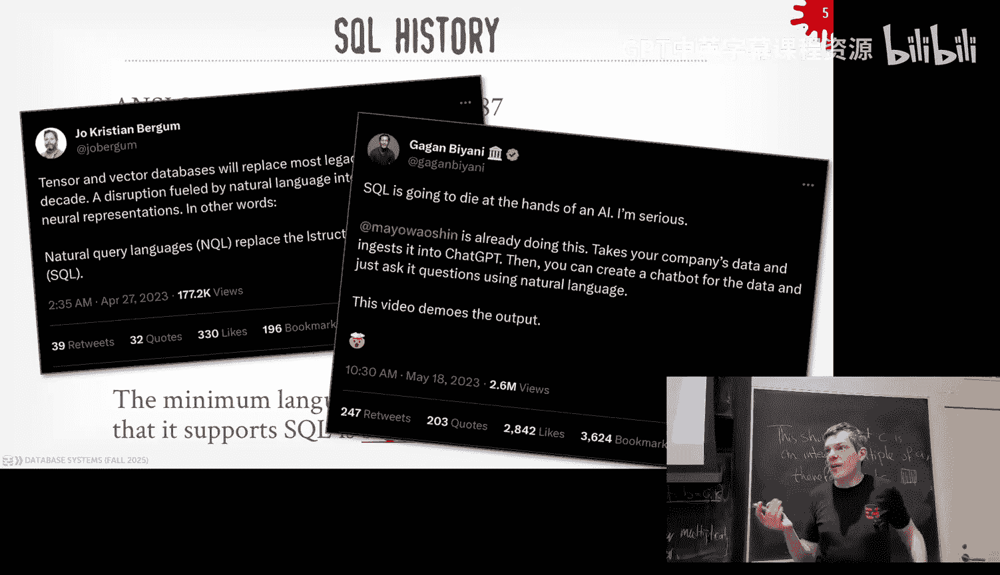

30 years ago，20 years ago， XM L was the hot thing。 Well， SQL for XM L。

 The statement is the flexibility of the SQL。SQL will provide you a basic building block that you can then add more advanced features and do additional things right Now again。

 I mentioned like are they doing things is it perfect， No。

 one of the biggest complaints is that the select clause becomes comes before the from clause。😡。

RightWell， in the original proposal from IBM in the 1970s， the from clause came first。

 then the select， but then they did a user study at the University Arizona State University and all the students。

 whatever they testeded said， oh， we like we like the select before the from and that's why that's the way it's been for 50。

60 years because of those people。😡，Right。Well， we'll see some data system we can play up。

 We can play around with。And see how you， you can change things。

 And sometimes you don't always have to have them that order。 But in general， you do。All， so again。

 I've said many， many public statements before that like SQL is the most important programmingbing language you need to learn as a student because again。

 no matter whether you're actually building baby system or just using one， the rest of your life。

 you're going to come across SQL。And maybe the LL lens can provide you a first draft of a query language。

 maybe it'll end up being like assembly where there's the high level things you can write and then that gets transpoed down to SQL。

 which is what a lot of replacements to SQL are trying to do， but everybody has to learn SQL。

 it's very， very important and so to give you how an example of how serious I am about learning SQL the audio here。

😡，There's no audio， that sucks。Well， this is my five year old biological daughter。Every morning。

 we wake up at 7 AM。 and she has to write Sequel before she can have breakfast。嗯。

Is that considered child abuse？Yeah。あみ。I tell her her mom loves her more when she writes SQL and it works。

 okay。so what is the relational language give it， what is SQL going to give us there'd be sort of three basic opponent。

 the DL DDL and DCL DL is the data of manipulation language when you write a select statement or update insert up the deletes。

 those are all gonna be DLs the DDL will be the definition of like a table an index or view and the DCL will be like as like controlling who's allowed to see what data or what counts and so forth There other things we'll cover late in the semester like transactions like how to call begin transaction and roll back and things like that but we'll worry about that later。

😡，One important thing we， we got to understand also， too is that。

Although the relational model is based on sets， we looked at unions and intersections that was basic set theory。

 SQL is going to be based on bags。😡，So sets are unordered collections of data where you don't have duplicates。

😡，Bags are on order collections of data。 You do have duplicates right Ls or list would be a order collection that has has a defined order。

 bagss and sets do not。So that means that if if。The in SQL。

 they're going to make this choice to allow duplicates because。

It required extra work to remove the duplicates。 And so if you really want to remove them。

 you have to add extra maybe， you know， keywords like distinct and other things to remove the things that you don't want。

 So by default， we'll have duplicates。And most of the times it's not a problem。

 but if you do care about get removed duplicates， there's SQL allow you to do this。

So we're going to be a quick crash course on the basics of SQL。

 but I want to cover the things that are more modern in the spec and we'll look at some examples of how rail systemss actually run these things and then for today we actually one of our first flash talks for the semester。

 so the guys from DBT are want to come give a talk about their system。😡。

Who here has ever heard of DBT or used DBT before？One， okay。

 it is one of the most widely used database tools in the world today。

 It's basically if you're data scientists or doing any major data analysis。

 chances are they're running on DBT。It's pretty significant and guess what， it's just based on SQL。

 SQL with templates。All， so they'll show you he'll talk about what they're doing over there。

And then they'll come again， come give a pitch for recruiting later in the semester。

 like one of my best students from 445 last year， she's there right now。

All right so today's class the example data we're going to use will be just a really simple representation of a university right there's a student table。

 there's a course table and then students take those courses and they get grades right so what is use this as the running example throughout today's class。

So the very thing we wanted them to do is aggregations right I'm assuming everyone in here a scene in SQL before so you' not do basic selects insert update deletes we don't need to cover those things。

 but now we want to start extrapolating new data or new information from the data we've already collected and put it into our database so aggregations are the basic form of how to do this。

😡，The idea is that you're going to take multiple tuples or multiple values across multiple tuples。

 and we can coalesce them into a single scalar value that computes some aggregate function。

 like an average min Max the count other systems support things like standard deviations or geometric means。

 the basic idea is you're classing down multiple values and producing a single output。😡，Right。

So the aggregation function can be pretty much be used only in the output list or projection list of our SQL query。

 not always the case because in ESSA queries but for now we can ignore that and so you can do really basic things like you can say count the number of students that have an@ CS login and then in our projection output list here we see we have account function that's computing just for every student that matches that predicate。

 I think of the filter from last class， my projection output is going to maintain a running tally of the number two students that accounts。

But notice that I have count with the login field in there。 Does that make any sense。

 Does that sound right？what does it mean to be counting logins？

What turns out for some functions like count doesn't actually matter what you put in there。

 I knew count star produced the same answer。 I knew count 1 produce the same answer。

 You can put count1 plus plus one， like whatever。 because the end of the day。

 all it's really doing is just counting the number two bullets to get matched here。Right。

That's a basic aggregation。If we try to do things like。

Have multiple attributes in our projection list in addition to an aggregation。

 we can have some problems。So in this query here， we're trying to get the average GPA of students enrolled in each course。

 and obviously now we want to include the course ID because we want to know what course the average is being computed for。

Right。But is this correct？Sgan his said， no， why？Well， he says his group by that。

 That'll be the answer。 how to fix it。 But like， what does it mean to compute the average GP of all the tus。

 but then spit out some kind of course I D。Right。What's that statement is there isn't a canonical one should be part of the outputlet。

 correct， right？So this is invalid， most database systems will throw an error and say you can't do this SQL light will let you do this。

 My SQL used to let you do it doesn't let you do it anymore。😡。

And so the way to get around this would be you just put， you can put any value in there。

 this is something new that SQL added。 and it produces some output。 Is this correct， I don't know。

 But like from the database systems perspective， you told it what you wanted and a computer that for you。

Right。啊。So he brought up the way to solve this is to do group lies。😡。

So groupI is a way to partition or cluster the data as we're scanning along so that when we computer aggregation。

 the aggregation will be derived from each group， each cluster。😡，So again。

 the query is I want to get the average GPA for each course。😡。

So I add my group I clause with the course ID and then say this is my original table now when I scan through。

 I can look at the course ID and basically keep track of what the boundaries of these are。😡。

And then when I compute my aggregation， I know to compute the average per group。

I didn't say it had an im emble into this， right The data system was doing this for us。

You could either be able a hash table， you can actually sort things first， then do to group by。

 we'll cover how to do that later in the semester， but at this point in the class just trying to say like hey。

 look， I can group things up and the Jason we'll figure out how to make sure I produce the right calculation。

😡，Right。You can get even more sophisticated with group buys with what are called grouping sets。

 There's also a thing called roll ups and cubes。 we don't to worry about that。

 but say you want to do something like I want to compute multiple aggregations。On my data。

 but I want to be able to do this in a single query Now I can do the union operator that we saw last class。

 I can add that to SQL and do a bunch of separate queries and mash things all together。

But if I can tell the data system that this is exactly what I want and kind of put everything together in a single package or a single query。

 then although we said it's just be declaredlarative and we don't have to tell the data system actually how to actually execute the query。

 we can be nice to it and actually produce queries for it that it has a better time reasoning about and crunching one。

😡，So you have group I and then you specify， they you have a grouping set and then now within my grouping set clause。

 I can specify the separate group buys that I want and each of these will be executed as if they were a separate query。

 but really what's happening is it's scanning through the data once and computing this answer for you and sort of mashing everything together at the end。

😡，So the first group buys a group everything by the course in the grade。

 then group everything by just the course name， and then give me the overall number for the total。

 so this is trying to count the number of students in each course by each course and by each grade by each course and then by total across all students。

What about whats are？IOkay， yeah， okay， right， So again。

 distinct of like and these are like groups or clusters。 So here's the red one， right。

 there's the blue one， here at the bottom。 And then the the overall total is at the top。

 And then for the cases where the output doesn't have the column that's being grouped on they'll put a null there。

It's kind of funky， but again the one reoccurrenring thing we'll see with queries is that we want to reduce the matter of back and forth of team we have the database server and the application so we can give as much information all in one single query。

 give it to the database system it can ideally。😡，Do a better job at running this more efficiently than it would from multiple round trips。

I it clear。Let's say I want to do some additional filtering after I've done my aggregation with a group I。

Well， SQL supports that with the having Cla。Right， and the basic idea is that I want to be able to filter things out based on whatever is's being computed as as as part of the aggregation。

Right， so in this case here， on my wearlas， I want to get filter out all the the the the students are filter out all the courses where the average GP is greater than or less than 3。

9。 I want to get the ones that are 3。9。But what am I trying to do here。

 I'm trying to reference average GP， but that's being produces the output in my projection list for my select statement。

So at this point， again think of like the data is actually executing this。

 you're scanning through the data， you're trying to apply some filter。

 you don't have this average computer yet， so how do you know whether to throw away a record or not？

😡，So you can't do this and said you want to do this so we were having clause。

But now I can put what my filter should be at the bottom。Now。

 in some database systems they're really strict about what's down here and in the clause。

 right again， I have an alias for the average GPA， I'm calling average underscored GPA AVG underscored GPA in cell systems。

 you can't do that either。😡，Because it doesn't know about what the A is up above is at its point as it's scanning。

And I sort of said SQL not supposed to be about thinking about how things are actually going to be executed in like what order of the operations。

But in some cases， it actually is that case， or in some cases， it is that way。

So some systems won't let you do this， and instead you have to repeat the actual the aggregation you want at the bottom here。

😡，I postcast requires this， yes。So， the。Proroblemware of clauses that。厕说。

The statement is the from where clause is effectively ajo， oh sorry， yeah， sorry。Yeah。

 so right here I have from enrolled as E comma student as S。Yes， so。The first product。No。

 let's sounds teacher product。 So in this in this syntax here， because I didn't explicitly say join。

啊。This is like the old way of writing it without explicit join。Don't do what I did here。

 you should always include join， but the data since will be smart to recognize that I have my EI E dot S equals S do S。

 So it would no， okay， well this is from this table here， this is from that table there。

 I gotta join。😡，And it's an innerjo， it'll'll it'll do that before the Cartesian product ideally。

 yes。having like dinosaur。那我。his question is， I have the average aggregation in both the having and the select output。

 is that if isn't going to be stupid enough to run both of them， hopefully no。Uh。

 but there's no guarantee， but ideally， yes， like most of will be smart enough to know not to do that。

Just for whatever reason， some systems don't let you reference the alias things up above。

Other questions。Okay， right， and it produces the output like this。All right。

 so that's the basic for aggregations。And again， with some slight nuances about what the having closed looks like and what the grouping sets may look like in general。

 most database assessment will support all the things I just showed you here today， right？

Next we'll talk about different things you can do start different data types。

 we'll start with strings that should be mostly the same across different data systems。

 then we'll come into dates and times， and that's when it all falls apart。😡。

Right and although the first homework for you guys will be based on DDB。

 that's really because it's a great system and it runs on every single laptop or every single machine you have。

 it still runs on the Andrew machines， even though they're running on old version of Uontu here right there is other than the SQL light。

 there isn' another system we could give you that could run everywhere。

But I'm not trying to say like okay， you're learning Dy B SQL syntax。

 It's really I care about you understand that what you can possibly do with SQL at a high level because when you go out in the real world or use different data systems。

 again all these nuances that we'll talk about here。

 they're going to be every system gonna have their own little quirks and be slightly different。

 So if you understand the fundamentals of SQL then you can take that and go understand how to apply that knowledge to different data systems。

 I would say it is easier to take a SQL dialect。😡，From one system and apply it to another now it's not going be a one to one it's not going be I'm not trying to say you can take SQL and just like do search from a place and magically runs on the next system。

 there's a lot of people who spend a lot of money trying to convert from one system to another。

 I'm just trying to say that it would not take you a lot of time to get up to speed pretty quickly with a new system。

😡，Like going from Python to rust， that's a major lift going from My SQL to Postgress。Again。

 mentally less up。好K。All right， so there's string data types， of course。

 the SQL standard says that any string you store in a database will be k sensitive and you can represent them or the constants of them as single quoted strings。

😡，Most systems follow that， My SQL is going to be the dark course here。

 where they're going to be case insensitive for whatever reason。

 and they're going to support both single and double。😡，So let's see what happens when you do this。

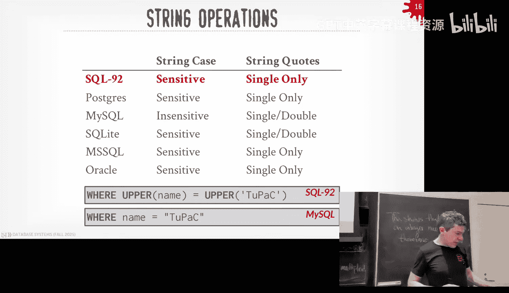

Can mean over read there， or I make the screen。Is that better。把段。All right。

 let me log in with my laptop here。Because it's the pain to type on the surface here。All right。

 so I said that strings were upper sorry in the SQL standard。

 strings are k sensitive and you represent them with single quotes。 So this is Postgres。

So I can do select star。I couldn't do my lost connection Tson， there we go。

So we'll look up the student table。Where name equals。Rizor。Right， nothing shows up。I'm sure I have。

Capital so that doesn't work because it has to be a capital A， right？And whyhy is this going so slow。

 sorry。You know what it is I think I'm uploading your videos from less time。Let me give rid of that。

 sorry。Much better。 Al right， So if we now try this in My SQL。That works， but I can also do this。

Right， that， that seems kind of weird。I can also use double quotes。

And that works if I go try this the exact same query on other systems， it should not work。

So this is Postgress， sorry。Doesn't work because I do that。In Postgres。

 the double quotes is meant to represent an escape like name of a comm or table。

 but if I have a table with enough space in it， I can use double quotes to take care of that。

Over on myq or I SQL light now。Doesn't like it is case sensitive。But lets me do the double quotes。

InductDB。嗯。It's k sensitive here's complaining' because it's looking for the name of the column。

 so I have to escape it with single quotes。And then。It is K sensitive。

We'll come back to clickhouse and Firebo and SQL server in a second。

 but againre going trying to show you that like a basic thing like， hey， strings。

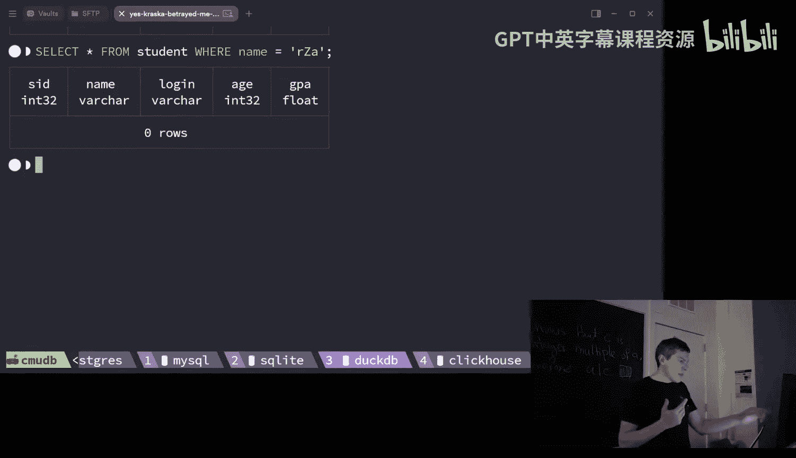

They're going to be different。So there's basic string operations there's like if you want to do wild card matches on the string SQL standard testfiifies the like clause and then it doesn't follow maybe the general more common regular expression syntax might seem forward like stars and dots and so forth the percent sign is meant to represent any substring include empty strings and then if you want to put a match of single character you do underscore so this is trying to get all of the students that are enrolled in 15 followed by a w card。

 all the 15 courses and you would use the like clause for that this is case sensitive if you want to be case insensitive you would use I like yes。

さ这个。这个。His statement is， are the field names and table names always case sensitive in SQL？

Depends on implementation。Pogs will automatically lowercase any table name you give it。😡。

Other systems don't do that。I have no idea what the SEL standard sets。Right。嗯。With that。

我 going be double words for name我都。David is if you use in Postcardds。

 if you use double quotes to name a column， does that。

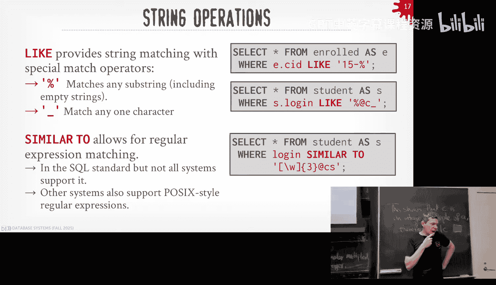

Well that can you escaped， I don't know，'s find out。Create。斜播。Sorry。佢铁步。You want to use X， X X。About。

Were in theon。嗯。😊，Yeah， all right， so Postgres took it。And maintain it。 So what if I can I do this。

 can I do select star。From。wifi。Sorry。Select star from Xxx。Yeah， I didn't know about that。Yeah。

 so his point， by default， unless you quote it。In Postgres， you will not get。まさ。

You would not get the case sensitivity。All right。

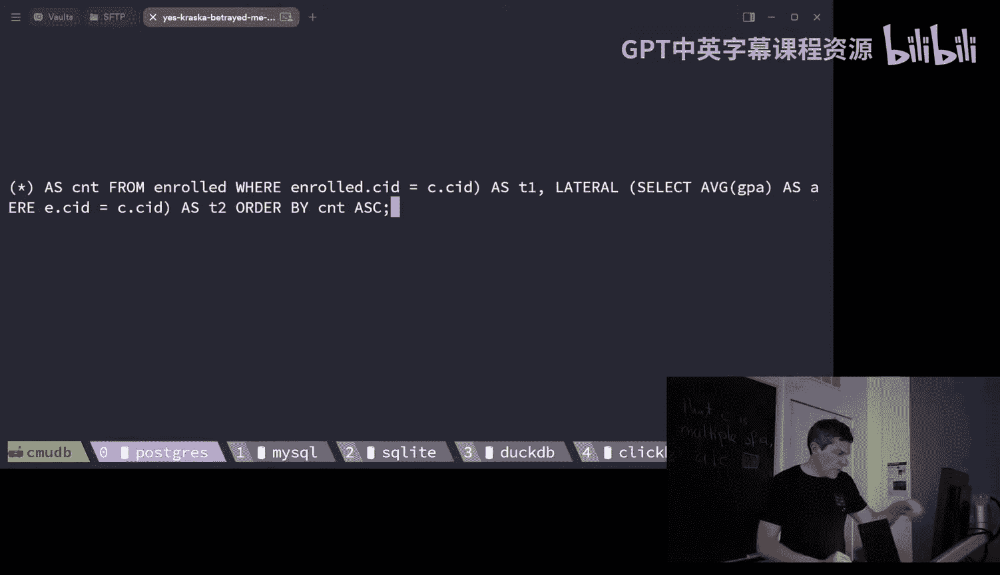

So again， if you want regular expressions， the SQL standards specifyifies some this clause operator clause similar to。

 Pesco supports this，ductDB supports this， many other systems do not instead they have their own regular expression syntax again。

 a good example where SQL standards says one thing， systems implement other things。

There's a bunch of built in string functions that you can do to manipulate strings as one of expect。

 like substring， lowercase， uppercase， and so forth。

 right and most systems have the same implementation of these functions roughly provide the same semantics。

嗯。To something really basically like concatenating string， this is where things go wrong as well。

 right the SQL standard specifies that you have a double bar to say I want to concatenate two things in SQL Ser。

 it's the plus operator and then in my SQL I should test this more recently in the newer versions but they don't have either either one you have to run a explicit concate function。

😡，Right。Again， this is。This is painful， it's annoying， but it's not the end of the world。

You can easily navigate this from going to one system to the next。

But let's talk about dates and times， right， obviously in our database， yes question。

So can you say most systems on board。营业执照。Yes， so the question is when I say most systems't don't do support it or don't support it。

 do not。呃。So the SQel 92 would give you like the basic select select insert of these deletes。

 The things we're talking about today and like there。I so far。

 everything' talking about today is back in the SQL 92 standard。

 and so they they're off slightly on this one thing。

 There's no system in the world that been aware of that implements exactly the SQL 92 standard as as as written。

 They're always going to be slightly off。My SguL used to be the worst offender。

 they've gotten better in the last 10 years。What are these myl equalites supporting that standard。

在37。Hey， David is。When I say the SequL 23 standard came out， who actually supports that， again。

 nobody。So property graph queries， the only system I noticed support that is Oracle because Oracle was pushing to get that in there I'm pretty sure Postgres doesn't support it DDB doesn't support it right the other commercial vendors the same thing it's not to say they won't just they haven't got to it yet。

 but it's like will they implement it exactly as written probably not because for whatever reason right？

Again， my SQ had all sorts of weird stuff， and then we had the guy that met of MySQel gave a talk with us。

U。W he it was last semester， and I asked him at the beginning of the talk， It's not recorded like。

 hey， what's up， Why do you do others right？ And he's like， God because he just did it。

Most was the 90s， I don't know， this is what he said。

It' it's oftentimes it's's many times it's like some guy sitting there。's like， oh。

 I'll do it this way。 And then everyone's like， all right， good。

we'll see this when we talk about lateral joins， lateral joins was in the standard the minusin。

 the Microsoft guys didn't know it existed and they made their own called cross supply。😡。

It has basically the same semantics as lateral joints， but they don't call it lateral joints。

 they call it cross the fly。哎。Again， there's so many implementation out there and nobody actually follows it。

All right， dayss times， this is work it gets rough。

So the SQL standard specifies a basic date and time type。😡。

I think it also has times with time zones by default you get whatever the time zoneone is on the data system where it's running when you insert a record。

 if you're lucky maybe UTC is a time zone always， not always not always the case。

 if you explicitly want to know what the time zone is。

 you want to store that in the type with it again。Not every system will support that。

This is my favorite demo to game every year， we do something which seems like it be really simple to do。

We're going to compute the number of days from today， August 27th， 2025。To the beginning of the year。

 January 1，2025。It seems pretty simple， but as we'll see。

 every system is going to do something slightly different。

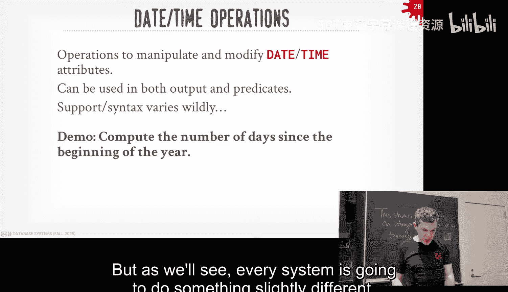

How to get that answer？All right， so in。You all right， so we need get dates。 All right。

 so how do we get the current date， Well， in the CL standard， there's a now function。

 and then I'll give you out the the current current year as a timestamp right or the the full timetamp。

So we go along now to our different system， this is My SQL， My SQL has it， that's great。

 go to SQL light。😊，Sal light doesn't have it， okay。Let's go to DDB。

 DDB follows the grammar from Postgres。 like they literally have the like a copy of the Post grammar and they're using that。

 So a lot of times what what Postgres has， DDB will have。Let's go over to Clickhouse。

Clickhouse has it， that's good。😊，Let's go to firebo。Firebols got that so that's good。

 And then last one is sequel silver。For reasons of the 1980s， I don't fully understand。

 you have to write go。After every query because once they do like a batch right this is for this one client。

 other clients， there's other clients that they don't have to do this for the the one that Microsoft gives you。

 you always have the right go All right， so they complain they don't have now。😡，All right， well。

 there's another way to do this in this SQL standard。 I think you can also get a。

You can get something called current timestamp。Right。So this is Postgress。

So Postgres doesn't have it。They don't have the function。But they have the keyword。

Let's go to my SQel。Sorry。They have the function。They have the keyword。Let's go to SQL light。

Secelite doesn't have the function。But has the keyword。

DcDB is going to have the doesn't have the function。But it has the keyword， just like Postgres。

 Clickhouse。Has the function。Does not have the keyword。反包。Has the function。嗯。

Has the function does not have the key word。And then SQL server。

Here let go does not have the function。But it has the keyword。All right， well。

 that kind of sucks because like， again， nobody has the same thing。嗯。So。

This turned out to be really easy to in Postgres in a bunch of systems。😡，So what I can do is。

Take the date as a string， so 2025。On the 27th and then cast the beginning of the year。

 cast these dates and just subtract them。And they get 238。WWhich is actually correct。

So what am I doing here， this CAS function is taking the string and I'm telling you I want to cast data this constant string I'm giving you。

 cast it as a date， for whatever reason you got to put as okay you can't even see that sorry。😡。

Please say something next time because that's good。All right， there we go。And probably's gonna to be。

Let shrink it over here。Okay， there you go。 Allright。 So again， I take the string。

 I call this cast function。 And I say I want as a date。 right， So that's fine。😊，U。

 what I like about in one example of an idiom in Postgres that I like a lot is that。

Instead of calling that cast function， I can put two colons at the end of any， any piece of data。

 and that tells the data type I want to cast into it。So that's nice I can cast my strings to a date。

 so that works great。So let's pop over now to try to do the same thing in My SQL。I get this。726。

Again， as a refresher brain， it there's no， there's not 726 days in a year。

 It's it's 23038 days since the beginning。So what is this number？I didn't know either。

 some rando and YouTube and the YouTube comment of all places posted what it was。 and Im like， oh。

 he was right。 So what this is， this is the first number 7 is the current month of August 8。

 subtracting the January 1。 you get7。Then you get the same thing for the number of days。

 So what's happening here is that my sL is casting the date as an unsign integer like this。

 we're just mashing together the year， the month， the day。And so it's really computing。This。哎。

That sucks， There's your 726。So。Turns out there's actually a date di function in My SQL where I can easily get back to3238 days。

 Okay， well let's go back to SQL server， or sorry， to Postg。😊，And of course。

 they don't have it either， right？All right， so let's see how to do this in。嗯。In SQL server。

 we'll come back to the other ones。SQL server， you can cast things as a date。

 you got to write go right， and I get a date like that， and then they actually have the date diff。方心。

Here I go， I to get 2308， but notice now I have this new thing here， I had this get date。

Right where that's that' that's different didn't see that before。

 so let's see whether anybody has that。I think it doesn't have it。Po doesn't happen it。

 right so you see where I'm getting at， right？So let's try this now in。In Clickhouse。

actually to prove that this works in prove it works inductDB。And Firebolt， so let's go aductDb。

I can do it the Postgresss way， boom， I get the right answer， I can do this in Firebolt。

I do the Postgre way。 You get the right answer。 Allright， So fireballs。

 do T B and Postgre are doing the same thing。 So that's good。 If we go back to our boy Clickhouse。😊。

So we try this。The four that produced the right answer， that worked out pretty well。ChatBT。

Gae me this。But it's complaining that it doesn't know about this today function。Okay， well。

 I've never seen that before。 I said it was now。 What is today。They don't have it。It's my SQL habit。

No。All right， well， the documentation of Clickout says they have it。But。It's actually case sensitive。

 it's lower case today。 then you get that。Right。Right， exactly。 So before， I think we did now， right。

That's uppercase， Okay， can I go now？Yeah。So now can do uppercase lowercase， but today cannot。

Awesome。All right， last one， SQL light。So they don't have date di if I try to do it the。

I tried to do it the Postmass way。I get zero， but that's not good。

So I actually came up with the same answer that ChaTT came up with。Where you convert the。

The timestamps。Into the Julian calendar。Whi is the number of days since 452 BC or whatever like when Juliaus Caes are converted everyone to Julia encounter in like 45 BC of what the dating goes back even farther right so you do something like this and you get 238。

 but it's a decimal。Um， so if you cast it as a。You cast it as an integer。嗯。You get 238。

Another way to do this would be。To convert this to the Uni epoch。If you know what that is， right。

 the number of seconds since the dawn of Euchx is like January 1st， 1970。

So you can convert a bit to that， convert the current timestamp to that number of seconds to the beginning of the year or to the timestamps。

 divided by 60 days or 60 seconds by 60 minutes times 24 hours。Why is an integer？

Because it's doing some' kind of casting。对二。Which I don't。

I don't want to get a type cover version because this is a CMU and people get really uptight about it。

 but yeah that's another problem here。All right， so。

The main takeaway from all this is like a really simple thing， like I was calculate dates。

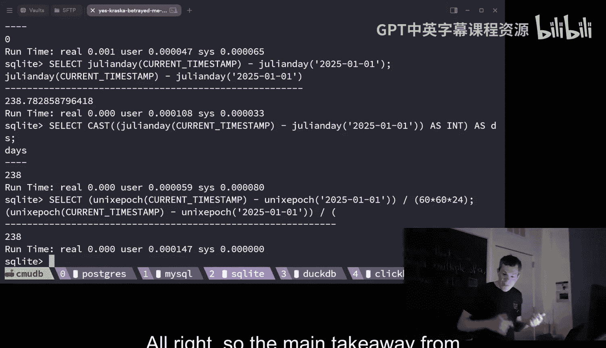

And think things go wrong。All right， so let me skip through output control or get through this real quickly。

 you can do order buys if you can again SQL or racial models un ordereddered。

 if you care about order， you can add order by clause。😡，Since relational model is or SQL is also。

 it's unordered and。If you care about the order you add orderbi。

 but sometimes you maybe don't want all the results。

 you can add a limit clause or fetch offset clause where you basically say I only want the first five rows of first 10 rows and you can even offset it and then you can specify what to deal with when you have ties if two tus should be part of the same output what do you do the shorthand ways to use a limit clause that's not in the SQL standard。

 but many systems support that at least theductDB and Prescos do my SQL。

And then SQL Ser has their own syntax of saying top 10。In the front。Right， so general long so the。

As I said， many times what you want to be able to do is put have a single SQL query。

 produce all the answer have to go back for the application so。😡，You can。

 you can take the output of a SQL query and put it into an actual a table or a temp table and then do additional queries on that。

 So in the SQL standard， you say select with the into clauses and then。Or it says course I。

 that's the name of the table I， I'm gonna insert into。In post guys。

 you can actually specify that it's a temporary table so that when you close the client。

 the table gets blown away， but that's not in standard in all systems。All right。

 so let's jump into the more challenging things in the last half an hour。 So N Aquaries。

 CTEs and window functions。So。Many times you're going to find yourself not be able to express what you want to compute within a single select statement。

😡，And you actually maybe use multiple select statements， and as I said。

 you could write with your inmate result out to a temp table。

 but oftentimes you may be able just do a select inside of an existing select。😡。

And so these are called inner queries or nest queries。

 and they can appear pretty much anywhere in a SQL statement。😡。

So I can do something really simple like this where I have a select statement。

 what we'll call the outer query， the top part here， and then inside my wear clause。

 now I have another select statement called the In query where I'm computing some answer that can then be used or leveraged in the outer query。

😡，Right。So this is an example of putting in the wear clauses。

 you can put it in the projection output， you can put it in the from clauses。

 I think some systems lets you put it in like the group by clauseaws， the had clauses。

 which is not a good idea， but you could do that。And so we're not going to talk about how to actually implement this or execute this efficiently just yet。

But it's obviously the dumbest thing to do would be treat this as like two nest of four loops where say in the top one here。

 I'm for every single student， I'm gonna then run that inner query in its entirety for， you know。

 to try to find a match。My SQel used to do that， most systems when they first start doing S queries。

 they do that。😡，And obviously that's very ineffient because the answer is not going to change from one tuple on the outer query to the next。

😡，So we'll talk about this later after the midterm。

 but ideally what you want to be able do is rewrite that query into a join。😡。

Because the data doesn't know how to actually joins very efficiently。

And so you can take if you have a nest query like that。

 you can convert it to a join it' run much faster。😡，But not every system can do that。

 Pro is actually very bad at it。The question the statement is there might be some cases where the subquery is actually faster。

嗯。所以说跟。So this is getting to the we， but like you can imagine something like a competing aggregation。

 like a max ID。 if I could run that once cash the result and use that， then yeah。

 that do has but almost never want to run I don't think you ever want to run the inner query over and over again。

 it's like stupid。TheWhat system is good like。The question is what system was actually good at converting these things？

There's a system called out of Germany called Umra。

's written by one of the best database system researchers in the world。

 and he has a newspaper paper that came out this year where he can handle basically any NISA query he can rewrite。

😡，This explain to。Stavid is well making into more mainstream systems。

 so DuckDB does an earlier version of what he did because they just copied what he did because it was in the papers right but one of my Ph students here。

Came up with an anestic query that actually broke brake DDb and broke this other system。

It won't work correctly， it runs out of memory because it blows up。啊。

Because it's just thinking of like you you're just generating much intimate results and the balloons obviously being around of memory。

So the newer version of this German system called Ura， which is now commercialize as Cd or DB。

 that system actually supports it。😡。

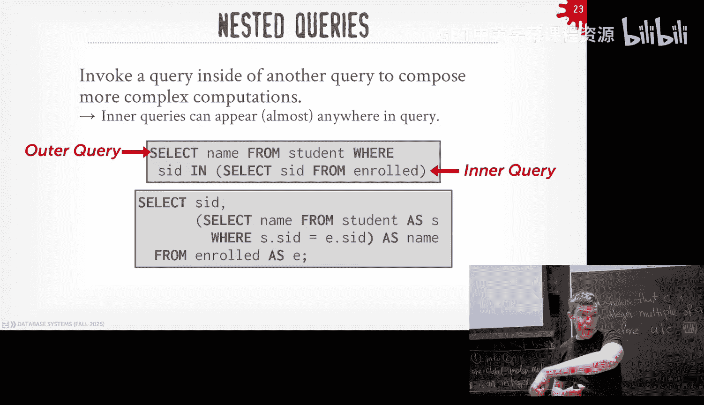

This all I have to cut on the video， I can't see this Yeah we bury the bodies and the cops never said anything that the way it is。

 right。

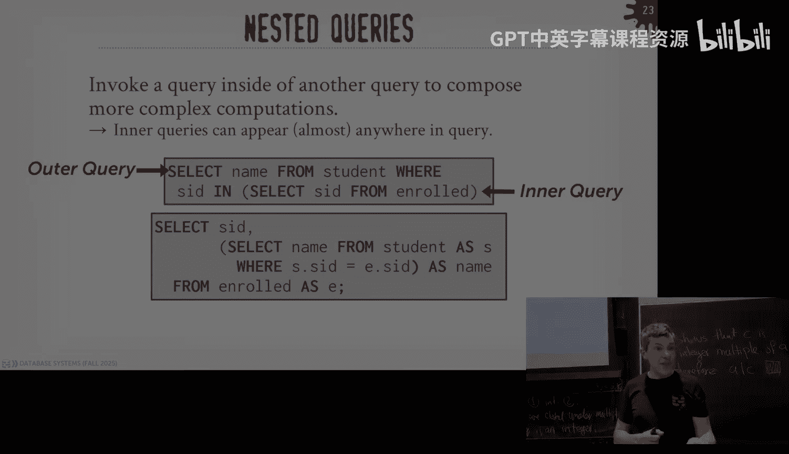

All right， so nest a query， so let's see we want to get the student the names of the students that are in 445 and so when you start doing homework one。

 you got to think about how you' going to construct these things with nested queries。

 you want to sort of maybe start with the outer query first and figure out what you want the final output to be and then oftentimes I'll just write maybe in like natural language。

 what the innerque should be and I figure out how to sort of how to reread that innerative fit into what I want on the outer query。

😡，So if I want to get all the names of the students that are in 445。

 I don't want to do select name from student with some kind of where clause and my where clauseuse is going to say something like get get the list of the people。

 the set of people that are taking 445。 So my in query would look something like this。

 but now I need to mash the two together。😡，And so this is where I can add things like an in clause or other operators and my expressions to specify how I want to link together the inner query with the adder query。

😡，So in this case here I'm saying where SID is in and then some mess query here。

 so this is just doing set membership， I'll match on myer my outer tables query or the outer query any record that has an SID that is in my set that is produced by the inner query。

😡，And so his point， he was saying before， sometimes it's more efficient to run the， the NA query。

without doing a join， and obviously in this one， it's pretty obvious that you want to run that query once the inner query and be able to use the result over and over again。

😡，And a join would basically do that for you。So notice I here too that like I'm now referencing the student ID in the inner query。

 that's going to get bound to the enroll table inside the inner query。

 and then the student ID is getting bound to the one on the outside。😡。

There are things like correlated subqueries where you you can match things on the inside or the outside。

 but we don't thought worry about that just yet。All right so you can do a bunch of different operators to specify what the matching should be。

 my example I did before was in equivalent to equals any。

 but you can say like all have to match at least one has to match or none has to match right you can do a bunch of these kind of operations。

😡，All right， those's some more complicated things， let's find the student record that has the highest ID that is enrolled in at least one course。

😡，So the outer que， I know I'm going to want to say I' want with the student ID and their name。

 and then the inner queries me something like is the highest enrolled student ID？

So my inner query could be like this， right I want to get the Mac student ID from enrolled。

 and I want to match that with the student on the out query。

And instead of writing in equals n or equals all， I'll just put in the n calls like this。

This is one way to do this right you could do this with sorting the table and then fetching the first row that would be the max。

 I can put the max query， the aggregation inside the join clauses right there's a bunch of different ways that you can write write queries to produce the correct answer。

I'm not saying one way is better than another， it's going to depend highly on what the system can actually support and run。

😡，In theory， SQL it shouldn't matter， but oftentimes it does。for homework one。

 you're running on DDb on your local machine， it won't be a huge difference performance writing different things。

 at least there shouldn't be。All right looks one more example。

 find all the courses that have at least have no students enrolled in it。

 my outer query should be select all the courses and where I want to match where there isn't a tuple for that course in the enroll table。

😡，So I can do something really simple like this， I can say select star from enrolled where course ID where the course ID and when the old table matches the course ID from the course table on the outside here and then notice how this inner one here is being bound to the one on the outside。

Right。So this's kind a correlated some query where the result being computed on the inside depends on whatever tu you're looking at on the outside。

And many systems can't do that， can't convert that into joins。

But now Segel Sducttibe and this German system， Cedar B and Ura camp。All right。

 so when you do homework one， sometimes it'll be obvious that you want to use a CTE。

 which will'll cover in a second。 Sometimes you want to do a nest query， but in general。In general。

 it's up to preference。We'll see CTs in a second。Laterral joints are a special kind of join where it allows a。

Query that's technically at the same level of nesting within one query to reference data in another query at the same level。

So what do I mean by that， so think about it like it's two four loops where the I can now have a previously executed query。

Within my sameer query， be reference by queries that came after it。

 So I said before that in SQL that ideally in a decative language you don't want to specify what the order of the operations should be。

 but it's something that a lateral join， you do have to specify because you have to know like this thing has get computer for this other one gets computerd。

😡，So this' is a really toy example， select R from a derived table where I have select1 as x。

 so this is making a synthetic virtual table that has one tuple with one value of one。

 and then now I'm a lateral operator and in the second query here I'm now allowed to reference up the nestA query that came before it。

😡，And it's roughly equivalent to producing the output of this Python code like this。对。

I'm seeing a lot of confused faces， let's look at another example。

So I want to calculate the number of students that enrolled in each course and get their average GPA。

 and I want to sort them based on the enrollment count。In descendending order。

So the autoer query again， is going to be select star from course when all the tuupples that are all the attributes for anybody within a course or any course tuupple。

😡，The first later query is going to be for each course， compute the number of enrolled students。

 and then the second later query be for each course now compute the average GPA of the enrolled students。

So it looked roughly like this。So in some cases some。In some versions of SQL。

 you have to specify that it's a lateral join explicitly with a join operator in this case here in Postgres。

 you need to say I have a lateral and then you have a nested query and then that can do whatever wants beside that。

😡，So the first one here again， we're computing the。The count。

 the number of students that are enrolled in each given course。So in this case here。

 the course ID I'm referencing is going to come from the outer query。

The second one down here we're computing the average GPA for every student that areroll in the course again。

 same thing here now， this course ID can come from this outer one here or it can come from the one in the middle。

 it doesn't matter they're actually both semantically correct。😡。

It would both produce the same result。You would get something like this and I would sort in by the count in a sendingending order。

All right， let me give a quick， I show you quickly what this looks like。 Soducty B， My SQL， Postgres。

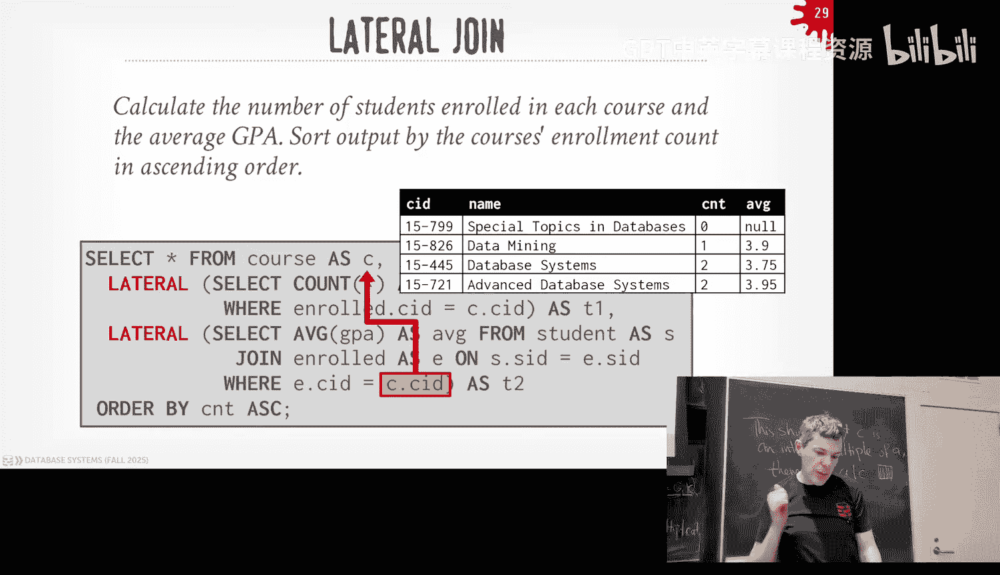

And fireball are all going produce the the same result for lateral joints， which is nice。

Sos it again。For that statement， could you， could do that with the normal join for that example， Yes。

 actually， in the sake of time， let me， let me get through C TEs。

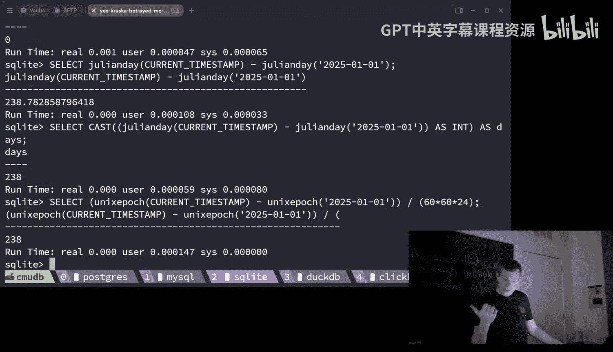

And because we had the caller the speaker today， and I can always show what this looks like afterwards。

Right， C， T E is a comic expressions。 This is a newer construct in in SQL。 Think of this as like。

Instead of having separate， two separate select statements，1。

 want to create a a temp table and then another to query that temp table。

 I can create a temp table within my query that then gets populated materialized。

 and then it gets thrown away when the query is over。Right so the way this is specified。

 I have my with claws at the top， I gave a name of my CTE or sort of the name of the table。

Whatever the comms are going to be is the output， notice I I don't have to put the types because it's going to drive the types based on whatevers inside of the asz falls here。

And then now， down below， after the the the closing parentheses。

 I can then reference that C TE as if it was a like a real table。And we think it's like a macro。

Or I'm like like， I could take whatever is in that with call and inject that as as a nest query here。

Sa you same his question is can you parameterize it， What do you mean by that？Yes。Oh，Yeah。

 statement is statement is。Can you， can you pass in a value that causes the， the。

I don don't think you can。We can take this offline。

 There is research where you can take a arbitrary procedural code like Python or whatever， you know。

Pascal people write these store procedure functions in like language called P L SQL。

 There's ways to convert automatically convert procedural code into， into CT T Es， which they do。

 It does look like this。 But now you're actually maintaining a state table what the input is to basically mimic the same thing。

That， that is not。 you don't need to know that for this。Okay。

So quick example now I'm going to find the student record the highest ID enrolled and at least one course。

 you saw this before， instead of doing an ESA query。

 I now have my CTE where I can do a join against it。

 and so the data it could be smart enough to note， compute the CTE once and then fill in the value and use that later on。

It's nicer syntax than using kinetic queries because you sort of declare them up front。

 and then you can reference them down below。Whereas nest queries。

 kind they're embedded and mix the SQL quite large。This the statement is， yes。

 nest queries cannot reference in line things， correct， yes。But sometimes it' is okay。Allright。

 the last thing I want to cover is window functions。So， the。

In all the aggressations and things things youre talking about before， you can't easily。

Keep track of like how things are being processed the order you're looking at them so you can't compute things that that require a notion of bordering because again。

 SQL is unordered。 But sometimes you want to do things like a moving average。

I think of like a time series data data set where I'm having different timestamps different times at the day。

 I'm recording the temperature。So I want to say， what was the moving average of the temperature at this given time。

 or stock price would be another good example of this。But with window functions， you can now do this。

And now generate multiple aggregation outputs as you scan along logically scan along the data in your SQL query。

So it's sort of like an aggregation， but you're not grouping them into produce a single output。

 You could have multiple outputs for， for every single tool。

So the way this works you specify in your projection list you have a function name or have basic aggregation functions and additional functions that are specific for window functions。

 and then you have this over clause to specify how you want to split things up or slice things up as you go along。

So the aggregation could be anything we talked about before， like again。

 if on a computer moving average， the min Max account of some some window as as I scam。

And then the special functions are row number and rank。

 So row number would be like what offset you are in the in a group as you slice it up。

 And the rank is would be the position according to some sword order。Right。

 so my query is select star from from the enroll table。

 and I'm gonna compute the row number without doing any， without doing any slicing or any group bias。

 And so now you would see that。I'm introducing this new column here called a row number that keeps track of where that tu position is within that group of the window。

If I want to again do something like group buy， they have a partition by keyword。

 So now I'm gonna compute the get the course I D and the student ID for everyone enrolled in the course。

 And I want to know what the row number is as I partition them by the course Id。RightAnd so again。

 just like the group I clause， grow things up in the groups when I proves my output， same thing here。

 and now you can see the row number gets reset back to one every time I enter a new part enter a new group。

I can sort things within my group as well。 right， So I in the over clauses。

 I can specify an autobi and then。The second time I'll pass over this。

 but you can do more complicated things in there。All right， so fish up。Again， SQL is very important。

 It's not going away。 There's this survey that I the IE does every year about what。

 what students say are the most important languages they need to learn。 SQL is always now number one。

 Pythonons number two。 number three is Java。系。So again， as I said， for the rest of your life。

 you're gonna to come across SQL， and it's really important to at least know the basics of it。

 So homework  one in this class right here today will be provided you the foundation you can then expand upon in your further careers。

All right， so homework1 is going out today again， doing basic data analysis using DyB， you submit。

 you can run everything locally in test， and then you submit to gradecope。

 and your output has to match whatever the expected output is on gradescope，Should you use an LLM？

Yes。😊，Try it。see how far you get。But you need to understand what what the things are just spitting out。

 because there might be an exam。 might ask you some basic simple questions， okay。Alright， so， again。

 next class， I won't be here。 It'll be in London。 So itll be。 there's no， Monday's a holiday。

 So do there's no class for anybody。 And then Wednesday we'll post on。We post on YouTube。

New classroom。 So this is Dr。 He's at DBT。 And as I said before， this is the。

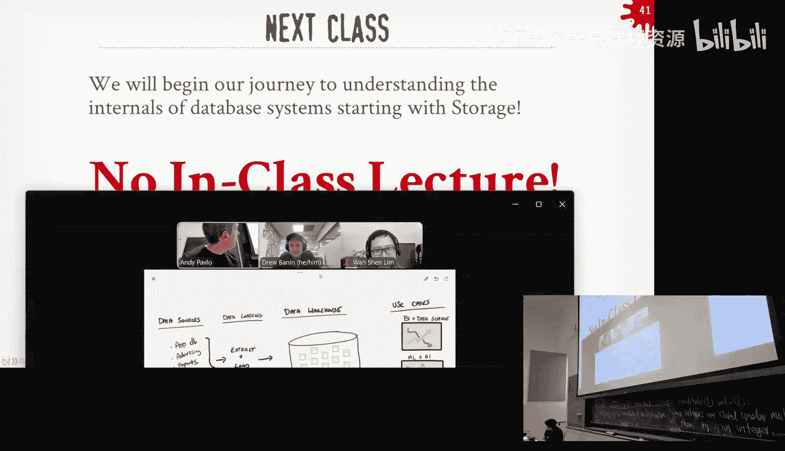

Arguably， one of the most important applications in the data space right now。

 it's widely used everywhere and it' it's super important。 All right， so Dr， sorry for being late。

 for the techno up， the floor is yours， go for it。Great Andy thanks for having me on I appreciate the Co words it's my band and of the co founds at EBQ Labs。

 we do make a product called DBT EBT is definitely not a database。

 definitely not a data warehouse but we help companies use their data warehouse and make sense of the data in the database。

Today think I've got about 10 minutes with you today。

 so this is a sort of modified version of an onboarding session that I you for employees just talking about what DUT is and why it matters and how fit into a broader ecosystem so I got an out the pencil let's sketch it out。

So this is a setup that you'll see in a lot of modern data orientd companies。

 they've got data coming from data sources， these are transactional databases like Postgres bySQL。

 they've got advertising data and payments data， finance， teletry sales。

Customer support you name that what they want to do is extractable all this data into a centralized place data warehouse in data lake and so practically what happens is they've got these extracted load processes that are creating you know hundreds or thousands of tables loaded by different teams of different departments。

 sometimes duplicated， sometimes stale， but you should get have a bunch of tables in a data warehouse。

On the other side of the data warehouse， we have the consumers。

 so it's BI and data science dashboards or notebooks or scripts that are querying these tables。

 you've got your ML and AI use cases。Polling from maybe the raw data directly。

 I mean it've got operational stuff like wanting to send emails to people who left you know items in the shopping cart on a newcom website so that'sque more table too and so the net result is that there's a giant mess here。

There's no semblance of data lineage meaning that you can't actually see where the data is coming from that's powering this BI report right you have to trust to get works and usually it's wrong in some way there's a documentation so it's hard to find things like data assets that already exist。

 start to reuse someone else's work you frequently have to rebuild things from scratch。

There's the simplest of a deployment process here， you just edit stuff in prompt。

 you edit the dashboard and prompt， you change the tables in prompt and hope you don't break anything for anyone。

This's just sense of QA， which means things are broken up the of quality insurance。And fundamentally。

 you get duplicated business logic for each of your different use cases or dashboards。

 and so here we're kind of you know imagine reccapculating what it needs to be a customer100 times over that leads to inconsistencies and。

So the alternative approach here is the one that we take with EBT。 And the big idea is， you know。

 as before， we want to load， extract and load data into a data warehouse but this time。

 we'll draw thisaginagin line down the middle of the database。 Let'll say the lets for raw data。

And that's where vehicles extract and load， you know， are raw tables。Looted from our data sources。

And then we have these blue pipelines here that I drew。 So this is actually what DBT does。

 It takes your broad data sets and helps you create derived data sets that are， you know。

 enriched or apply your business logic to the raw data。

 The net result is that you get these higher levels of abstraction and these sta sequence query。And。

Basically， the data set you' exposed to the business represents sort of the terminology that folks of business use and not the raw data coming out of Salesforce or not out of you Postgre。

 so it's a sort of translation or transformation layerer。

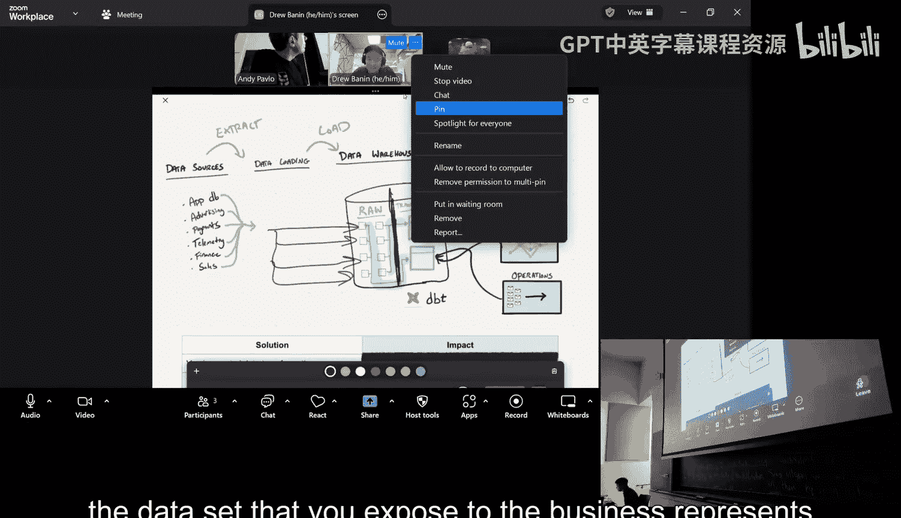

The benefit of doing it with DBT is that you can source control your business logic as SQL code。

You can visualize your data lineage so you can see how data flows from broad table through data models into dashboards。

You can use an actual CI process so you can develop code in depth and not in fraud。

And you can find out that your data is broken before your CEO hears about it。

 which is always the better time to find out that your day is struggling but finally you know you can reuse assets。

 we've built this transform table， other colleagues press the business can build on top of it。

 we can amplify to' impact。So I'll show you what this looks like a lot bit in DBT。

The big idea here is that you know we're looking at a DBT model called stage GitHub stars in in this case GitHub。

 we first controlled in GitHub and so stage GitHub stars is the name of our table here STG it's like a staging model。

 this is like going from your raw data to kind of one layer of preparation that you bring in some column clarity filter out in that deleted records since our that soft delete records。

And then fundamentally， our model code is just SQL， so it's select star for all some source。

 and then we've got a little window function action here to de duplicateuplicate records by you know the first first start update the only difference between this and pure SQL is the DBT has been built in temp language called Ginja and this allows us to do pretty cool things and specifically it allows us to represent edges between different nodes and a dependency graph So here we're saying stage GiHub stars state GitHub stars depends on the raw source GiHub star users than our piece loaded by P framem。

So all， we could also do things like write four leaves and iterate over tables and union a bunch of tables together with dient schemas。

 there's really a lot a lot you can do with this temporary language。

 but fundamentally what we're doing here is the fine of this project in hole I guess first Mitll。

The net of it is that you get a sort of dependency graph that looks like this in DBT。

 So here's just a sample of an overall much bigger DBT dependency graph。And every single。

 one of these nodes is either a data source， you know， in this case。

 these are sources or it a sort of intermediate transformation like we see here。

 So this is us bringinging a lot of business logic into smaller pieces kind like you with with functions。

 you know and another programming of language but each of these nodes in the graph is itself a table。

 And so there's really cool stuff you can do a DBT like testing your data documenting your data sets so we can create assertions that say。

 you know the invoice ID in this table should always be unique to not know there's something like that。

 And now we can find out if our assumptions about the data don't hold you know again before this video of those。

Finally， we all put a sort of dimensional model here。 This is dim strike customers。

 And that's what we want to actually expose to the B tools or data analysts in the company who are querying these data sets and trying to answer questions to about business。

And I can guarantee you it is a much nicer experience for that person to query this table that has all the information that they need flooded from 40 different source tables than it would be to go query those source tables directly because we did all this hard work and along the way to。

Translate from the raw data sets into sort of what I can put this。That was the。

Six or seven minute answer to what exactly is DBT， if you take anything away。

 it's transformed data into data warehousehouse and do it like a software engineer with great code。

Okay， awesome， and eight question before drill Dr。Yes， yes。Yeah。

 so you mentioned that you write your data pipelines in CO。

 do you have like an efficient execution engine that can run this efficiently over like big amounts of data The question is true。

You mentioned that you were to find these tags your SQL。

 do you guys have an execution engine that can efficiently execute？

The question we do and it's called snowflake or Data birth or BigQu or Redshift or so on and so on so DBT again is not a data warehouse itself what we do is wheat ro query is on the customer's data warehouse which for us I think the biggest for or snowflake Redshift the query Data births。

啊。And so our customers really like that because they did all this work to get their data into their data warehouse。

 it's in their like single source of truth， they want the data to stay there。

 so they like the DBT will connect to an narrow notes like a counter their Big  query project and from queries on the data in C wheres。

A large percentage of all queries that run on like snowflake BigQuery and sort comes from DT。

It's massive。That你也。Mar sales。Stavid， it's like a data lineage marketplace tool。主要你仲几出线。Well。

 what I would say is so we do two things and maybe this diagram is music。 but actually。

 DPT's job is to create these。Ts they can be to these notess as a table or view could few So DBT actually creates these based on the version control definition in your DBT project but we also have to visualize it for you so that you can trace you know where does the data come from that ultimately like to demonstrate customers table where you can trace it all the way back to these data sources and some other stuff over here in the sunsh but DBT's primary job is to actually build those data sets In dependency order。

 we just so happen to also visualize it for you as like the deep plug or data catalog。Thanks。

All right， awesome。 let's thank you go。Yeah， if you were to look at a typical DBT model， basically。

 I took this look earlier， what we'll do is wrap your select statement and create table as。Blah。

 blah， blah and so this is how we like push down the execution to the logic the user's job is to define the business logic in SQL select statement DBT's job is to materialize that logic as tables or or incrementally update tables sync with that so how that's how this all fit together。

All right， so you may not all realize the significance of what DBT is because you don't have any data。

 right？😡，At some point in your life， you're going to have a bunch of Python scripts。

 try to mash this。And then you realize this is terrible how you're ever going to maintain this。

 this is the problem that DBT solves。😡，Right that's why I keep saying it's a big deal。

 It's widely used because it is way to declare here's my pipeline for my for my data projects whereas before it's just like a bunch of random stuff people would have in GiHub。

 Okay， all right， let's thank Drew。

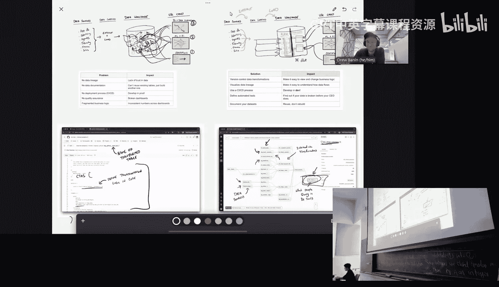

All right， thanks manam I appreciate it。 All right again， Monday is a holiday。

 no classes and then Wednesday I'm in London that'll be on YouTube and then please get started on Project zero and the Homer。

 Okay， thank you。

Hit it。😡，🎼我 that从不见。

🎼Yeah。🎼管你不会个。🎼Yeah。🎼你会再说你鬼。🎼我然从不见。🎼Yeah。🎼说你对对错我足见。😊，Get the fuck the maintain。🎼Yeah。

